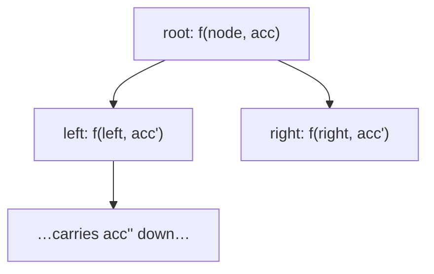

# Pattern: Preorder Traversal (Stateless)

## Why It Exists

Many tree questions are **top-down**: a node's answer depends on its *ancestors* — its depth, the running sum along the root-to-here path, the max value seen on the way down, the accumulated path string. Preorder (visit the node *before* its children) is the natural shape, because you compute a node's context first, then hand it to the children.

The **stateless** hallmark is *how* that context travels: you pass it **down as a function argument**, not through a shared mutable variable. Each call is self-contained — `f(node, accumulated)` — so there's nothing to reset between branches, no cross-contamination between the left and right subtrees, and the logic reads as "given what my parent told me, what do I tell my children?" That discipline makes top-down tree code simple and bug-resistant.

## See It Work

Does a root-to-leaf path sum to `target`? Carry the **remaining target** down the tree as an argument. Pick a case and **Run** it.

```python run viz=binary-tree viz-root=root
import json
from collections import deque

class TreeNode:
    def __init__(self, val, left=None, right=None):
        self.val = val
        self.left = left
        self.right = right

def has_path_sum(node, target):
    if node is None:
        return False
    if node.left is None and node.right is None:   # leaf: does it finish the target?
        return node.val == target
    rem = target - node.val                        # push the REMAINING target DOWN
    return has_path_sum(node.left, rem) or has_path_sum(node.right, rem)

def build_tree(values):              # [1, 2, 3, null, 4] level-order → root
    if not values:
        return None
    root = TreeNode(values[0])
    queue = deque([root])
    i = 1
    while queue and i < len(values):
        node = queue.popleft()
        if i < len(values):
            v = values[i]; i += 1
            if v is not None:
                node.left = TreeNode(v); queue.append(node.left)
        if i < len(values):
            v = values[i]; i += 1
            if v is not None:
                node.right = TreeNode(v); queue.append(node.right)
    return root

root = build_tree(json.loads(input()))   # the test case's level-order values
target = int(input())                    # the path sum to test
print("true" if has_path_sum(root, target) else "false")
```

```java run viz=binary-tree viz-root=root
import java.util.*;

public class Main {
  static class TreeNode {
    int val; TreeNode left, right;
    TreeNode(int val) { this.val = val; }
  }

  static boolean hasPathSum(TreeNode node, int target) {
    if (node == null) return false;
    if (node.left == null && node.right == null) return node.val == target;   // leaf finishes target?
    int rem = target - node.val;                         // push the REMAINING target down
    return hasPathSum(node.left, rem) || hasPathSum(node.right, rem);
  }

  public static void main(String[] args) {
    Scanner sc = new Scanner(System.in);
    TreeNode root = buildTree(parseIntegerArray(sc.nextLine()));
    int target = Integer.parseInt(sc.nextLine().trim());
    System.out.println(hasPathSum(root, target));
  }

  static TreeNode buildTree(Integer[] values) {   // [1, 2, 3, null, 4] level-order → root
    if (values.length == 0 || values[0] == null) return null;
    TreeNode root = new TreeNode(values[0]);
    Deque<TreeNode> queue = new ArrayDeque<>();
    queue.add(root);
    int i = 1;
    while (!queue.isEmpty() && i < values.length) {
      TreeNode node = queue.poll();
      if (i < values.length) {
        Integer v = values[i++];
        if (v != null) { node.left = new TreeNode(v); queue.add(node.left); }
      }
      if (i < values.length) {
        Integer v = values[i++];
        if (v != null) { node.right = new TreeNode(v); queue.add(node.right); }
      }
    }
    return root;
  }

  // "[1, 2, null, 4]" → {1, 2, null, 4} — reads the test case's level-order values
  static Integer[] parseIntegerArray(String line) {
    String inner = line.replaceAll("[\\[\\]\\s]", "");
    if (inner.isEmpty()) return new Integer[0];
    String[] parts = inner.split(",");
    Integer[] out = new Integer[parts.length];
    for (int i = 0; i < parts.length; i++)
      out[i] = parts[i].equals("null") ? null : Integer.parseInt(parts[i]);
    return out;
  }
}
```

```testcases
{
  "args": [
    { "id": "root", "label": "root", "type": "tree", "placeholder": "[1, 2, 3, 4, 5, null, 6]" },
    { "id": "target", "label": "target", "type": "int", "placeholder": "7" }
  ],
  "cases": [
    { "args": { "root": "[1, 2, 3, 4, 5, null, 6]", "target": "7" }, "expected": "true" },
    { "args": { "root": "[1, 2, 3, 4, 5, null, 6]", "target": "8" }, "expected": "true" },
    { "args": { "root": "[1, 2, 3, 4, 5, null, 6]", "target": "10" }, "expected": "true" },
    { "args": { "root": "[1, 2, 3, 4, 5, null, 6]", "target": "100" }, "expected": "false" },
    { "args": { "root": "[5]", "target": "5" }, "expected": "true" },
    { "args": { "root": "[]", "target": "0" }, "expected": "false" }
  ]
}
```

## How It Works

The function signature carries the accumulated context; the recursion threads it down:

1. **Receive** the context from the parent (here, the remaining target; elsewhere depth, path sum, running max).
2. **Combine** it with the current node (`rem = target - node.val`).
3. **Pass** the updated context to both children; **base case** (leaf or `None`) decides using it.



<p align="center"><strong>context flows strictly parent → child as a call argument; each subtree is independent, no shared state.</strong></p>

The defining property: information flows **only downward**, via the argument. There's no accumulator shared across calls, so the left subtree's traversal can't corrupt the right's — which is why it's "stateless" (each call's behavior is fully determined by its arguments). It also means the same template solves depth (`f(node, depth+1)`), path strings (`f(node, path + str(node.val))`), "good nodes" (`f(node, max(maxSoFar, node.val))`), and more — only the *combine* step changes. Cost is `O(n)` (each node once), `O(h)` stack.

### Key Takeaway

Preorder-stateless threads accumulated context **down** as a function argument: receive from parent, combine with the node, pass to children. No shared accumulator → each subtree is independent. It's the template for any "my answer depends on my ancestors" problem (depth, path sum, running max); only the combine step varies.

## Trace It

`has_path_sum(root, 7)` — the remaining target flows down:

| node | incoming `target` | leaf? | action |
|---|---|---|---|
| `1` | `7` | no | `rem = 6`, recurse |
| `2` | `6` | no | `rem = 4`, recurse |
| `4` | `4` | yes | `4 == 4` → **True** |

The `or` short-circuits, so once `1 → 2 → 4` succeeds, the rest isn't explored.

Before you read on: this passes the remaining target *down* as an argument. An alternative is to keep one shared `running_sum` variable, add `node.val` on the way in, and *subtract* it on the way out (backtrack). Both compute the same thing — so why does the "pass it down as an argument" (stateless) version avoid an entire class of bugs the shared-variable version is prone to?

Because with a shared mutable accumulator you must **manually undo** your change when you leave a node — `running_sum += node.val` on entry, `running_sum -= node.val` on exit — and forgetting (or misplacing) that subtraction silently leaks one branch's state into its sibling, giving wrong answers that are maddening to debug. The stateless version has *nothing to undo*: each call gets its own `rem` as a parameter, and when the call returns, that value simply goes out of scope — the parent's `target` was never touched. The language's call stack does the "restore on exit" for free. So "push state down as an argument" trades a tiny bit of redundant copying for *immunity to the backtracking-cleanup bug* — every call is a pure function of its arguments. (The shared-variable form is sometimes necessary for efficiency or when you must collect results across branches — that's the *stateful* pattern, next — but when a plain argument suffices, prefer it.)

## Your Turn

Write the top-down template yourself — `has_path_sum(node, target)` threads the remaining target down and returns whether any root-to-leaf path finishes it. (Depth follows the same shape: `f(node, depth + 1)`; only the combine step changes.)

```python run viz=binary-tree viz-root=root
import json
from collections import deque

class TreeNode:
    def __init__(self, val, left=None, right=None):
        self.val = val
        self.left = left
        self.right = right

def has_path_sum(node, target):
    # Your code goes here — base case None → False; at a leaf, does node.val
    # finish the target? Otherwise push `target - node.val` down to both children.
    pass

def build_tree(values):              # [1, 2, 3, null, 4] level-order → root
    if not values:
        return None
    root = TreeNode(values[0])
    queue = deque([root])
    i = 1
    while queue and i < len(values):
        node = queue.popleft()
        if i < len(values):
            v = values[i]; i += 1
            if v is not None:
                node.left = TreeNode(v); queue.append(node.left)
        if i < len(values):
            v = values[i]; i += 1
            if v is not None:
                node.right = TreeNode(v); queue.append(node.right)
    return root

root = build_tree(json.loads(input()))   # the test case's level-order values
target = int(input())                    # the path sum to test
print("true" if has_path_sum(root, target) else "false")
```

```java run viz=binary-tree viz-root=root
import java.util.*;

public class Main {
  static class TreeNode {
    int val; TreeNode left, right;
    TreeNode(int val) { this.val = val; }
  }

  static boolean hasPathSum(TreeNode node, int target) {
    // Your code goes here — base case null → false; at a leaf, does node.val
    // finish the target? Otherwise push (target - node.val) down to both children.
    return false;
  }

  public static void main(String[] args) {
    Scanner sc = new Scanner(System.in);
    TreeNode root = buildTree(parseIntegerArray(sc.nextLine()));
    int target = Integer.parseInt(sc.nextLine().trim());
    System.out.println(hasPathSum(root, target));
  }

  static TreeNode buildTree(Integer[] values) {   // [1, 2, 3, null, 4] level-order → root
    if (values.length == 0 || values[0] == null) return null;
    TreeNode root = new TreeNode(values[0]);
    Deque<TreeNode> queue = new ArrayDeque<>();
    queue.add(root);
    int i = 1;
    while (!queue.isEmpty() && i < values.length) {
      TreeNode node = queue.poll();
      if (i < values.length) {
        Integer v = values[i++];
        if (v != null) { node.left = new TreeNode(v); queue.add(node.left); }
      }
      if (i < values.length) {
        Integer v = values[i++];
        if (v != null) { node.right = new TreeNode(v); queue.add(node.right); }
      }
    }
    return root;
  }

  // "[1, 2, null, 4]" → {1, 2, null, 4} — reads the test case's level-order values
  static Integer[] parseIntegerArray(String line) {
    String inner = line.replaceAll("[\\[\\]\\s]", "");
    if (inner.isEmpty()) return new Integer[0];
    String[] parts = inner.split(",");
    Integer[] out = new Integer[parts.length];
    for (int i = 0; i < parts.length; i++)
      out[i] = parts[i].equals("null") ? null : Integer.parseInt(parts[i]);
    return out;
  }
}
```

```testcases
{
  "args": [
    { "id": "root", "label": "root", "type": "tree", "placeholder": "[1, 2, 3, 4, 5, null, 6]" },
    { "id": "target", "label": "target", "type": "int", "placeholder": "8" }
  ],
  "cases": [
    { "args": { "root": "[1, 2, 3, 4, 5, null, 6]", "target": "8" }, "expected": "true" },
    { "args": { "root": "[1, 2, 3, 4, 5, null, 6]", "target": "10" }, "expected": "true" },
    { "args": { "root": "[1, 2, 3, 4, 5, null, 6]", "target": "100" }, "expected": "false" },
    { "args": { "root": "[5]", "target": "5" }, "expected": "true" },
    { "args": { "root": "[5]", "target": "1" }, "expected": "false" },
    { "args": { "root": "[]", "target": "0" }, "expected": "false" }
  ]
}
```

<details>
<summary>Editorial</summary>

The template is exactly the See-It-Work walk, packaged to return a result. The base case `None → False` handles both an empty tree and the "fell off a missing child" case. At a leaf (no children) the path is complete, so the only question is whether this node's value equals the remaining target. At an internal node, *spend* this node's value — pass `target - node.val` down — and the `or` succeeds if **either** subtree can finish what's left. The remaining target travels purely as the argument; nothing is shared across the two recursive calls, so the left subtree can't corrupt the right.

```python solution time=O(n) space=O(h)
import json
from collections import deque

class TreeNode:
    def __init__(self, val, left=None, right=None):
        self.val = val
        self.left = left
        self.right = right

def has_path_sum(node, target):
    if node is None:
        return False
    if node.left is None and node.right is None:   # leaf: does it finish the target?
        return node.val == target
    rem = target - node.val                        # push the REMAINING target DOWN
    return has_path_sum(node.left, rem) or has_path_sum(node.right, rem)

def build_tree(values):              # [1, 2, 3, null, 4] level-order → root
    if not values:
        return None
    root = TreeNode(values[0])
    queue = deque([root])
    i = 1
    while queue and i < len(values):
        node = queue.popleft()
        if i < len(values):
            v = values[i]; i += 1
            if v is not None:
                node.left = TreeNode(v); queue.append(node.left)
        if i < len(values):
            v = values[i]; i += 1
            if v is not None:
                node.right = TreeNode(v); queue.append(node.right)
    return root

root = build_tree(json.loads(input()))   # the test case's level-order values
target = int(input())                    # the path sum to test
print("true" if has_path_sum(root, target) else "false")
```

```java solution
import java.util.*;

public class Main {
  static class TreeNode {
    int val; TreeNode left, right;
    TreeNode(int val) { this.val = val; }
  }

  static boolean hasPathSum(TreeNode node, int target) {
    if (node == null) return false;
    if (node.left == null && node.right == null) return node.val == target;   // leaf finishes target?
    int rem = target - node.val;                         // push the REMAINING target down
    return hasPathSum(node.left, rem) || hasPathSum(node.right, rem);
  }

  public static void main(String[] args) {
    Scanner sc = new Scanner(System.in);
    TreeNode root = buildTree(parseIntegerArray(sc.nextLine()));
    int target = Integer.parseInt(sc.nextLine().trim());
    System.out.println(hasPathSum(root, target));
  }

  static TreeNode buildTree(Integer[] values) {   // [1, 2, 3, null, 4] level-order → root
    if (values.length == 0 || values[0] == null) return null;
    TreeNode root = new TreeNode(values[0]);
    Deque<TreeNode> queue = new ArrayDeque<>();
    queue.add(root);
    int i = 1;
    while (!queue.isEmpty() && i < values.length) {
      TreeNode node = queue.poll();
      if (i < values.length) {
        Integer v = values[i++];
        if (v != null) { node.left = new TreeNode(v); queue.add(node.left); }
      }
      if (i < values.length) {
        Integer v = values[i++];
        if (v != null) { node.right = new TreeNode(v); queue.add(node.right); }
      }
    }
    return root;
  }

  // "[1, 2, null, 4]" → {1, 2, null, 4} — reads the test case's level-order values
  static Integer[] parseIntegerArray(String line) {
    String inner = line.replaceAll("[\\[\\]\\s]", "");
    if (inner.isEmpty()) return new Integer[0];
    String[] parts = inner.split(",");
    Integer[] out = new Integer[parts.length];
    for (int i = 0; i < parts.length; i++)
      out[i] = parts[i].equals("null") ? null : Integer.parseInt(parts[i]);
    return out;
  }
}
```

</details>

## Reflect & Connect

Drill the family in **Practice** — [Sum of Path](/cortex/data-structures-and-algorithms/trees/binary-tree/pattern-preorder-traversal-stateless/problems/sum-of-path), [Depth Assignment](/cortex/data-structures-and-algorithms/trees/binary-tree/pattern-preorder-traversal-stateless/problems/depth-assignment), [Concatenated Path](/cortex/data-structures-and-algorithms/trees/binary-tree/pattern-preorder-traversal-stateless/problems/concatenated-path), and [Increasing Path](/cortex/data-structures-and-algorithms/trees/binary-tree/pattern-preorder-traversal-stateless/problems/increasing-path).

Preorder-stateless is the "what do my ancestors tell me?" template:

- **The family** — root-to-leaf path sum, depth/level assignment, accumulated path string, running max on the path ("count good nodes ≥ all ancestors"), and "is the root-to-leaf path strictly increasing?" All thread one accumulated value down; only the combine step differs.
- **Argument-passing = statelessness** — context lives in the call argument, so each call is a pure function of its inputs and the call stack restores the parent's state automatically. No backtracking cleanup, no cross-branch leakage.
- **It's half of the traversal duo** — preorder pushes context *down* (top-down); [postorder](/cortex/data-structures-and-algorithms/trees/binary-tree/pattern-postorder-traversal-stateless/pattern) combines results *up* (bottom-up). When a node needs ancestor info, go preorder; when it needs child results, go postorder. The [stateful preorder](/cortex/data-structures-and-algorithms/trees/binary-tree/pattern-preorder-traversal-stateful/pattern) variant uses a shared accumulator when you must collect across branches.

**Prerequisites:** [Recursive Traversals in Binary Trees](/cortex/data-structures-and-algorithms/trees/binary-tree/recursive-traversals-in-binary-trees).
**What's next:** the same descent, but carrying a *mutable* accumulator across branches — [Preorder Traversal (Stateful)](/cortex/data-structures-and-algorithms/trees/binary-tree/pattern-preorder-traversal-stateful/pattern).

## Recall

> **Mnemonic:** *Top-down: `f(node, acc)`. Receive context from parent → combine with node → pass to children. No shared accumulator (argument-passing), so each subtree is independent. `O(n)`/`O(h)`.*

| | |
|---|---|
| Shape | preorder (node before children); context as a parameter |
| Flow | parent → child only (top-down) |
| Combine | `acc' = combine(acc, node.val)`; pass `acc'` down |
| Why stateless | context in the argument → call stack restores parent state, no cleanup |
| Family | path sum, depth, path string, running max ("good nodes") |

<details>
<summary><strong>Q:</strong> What does "stateless" mean here, and how is context carried?</summary>

**A:** No shared mutable accumulator — context flows down as a function argument, so each call is determined by its inputs.

</details>
<details>
<summary><strong>Q:</strong> When do you reach for top-down preorder?</summary>

**A:** When a node's answer depends on its ancestors (depth, path sum, running max along the path).

</details>
<details>
<summary><strong>Q:</strong> Why does argument-passing avoid the backtracking-cleanup bug?</summary>

**A:** Each call gets its own copy; on return it goes out of scope automatically — there's no manual "undo on exit" to forget.

</details>
<details>
<summary><strong>Q:</strong> Preorder vs postorder?</summary>

**A:** Preorder pushes context *down* (ancestor info); postorder combines results *up* (child info).

</details>

## Sources & Verify

- **CLRS**, *Introduction to Algorithms*, 4th ed., §10.4 / §12.1 — tree traversals; preorder.
- **Sedgewick & Wayne**, *Algorithms*, 4th ed., §3.2 — recursive tree processing.
- Top-down argument-threading (path-sum, depth) is the standard preorder template; both runnable blocks are verified by running (`has_path_sum 7 ⇒ True, 100 ⇒ False`; `8/10/100 ⇒ True/True/False`; `max_depth ⇒ 3`).
