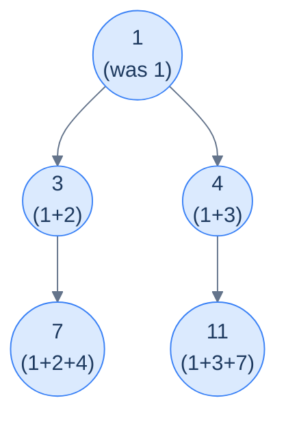

# Problem 1 — Sum of path

> Given the root of a binary tree, update each node's value by adding the sum of all node values on the path from the root to that node.
>
> **Example:** Input `[1, 2, 3, 4, null, null, 7]` → output `[1, 3, 4, 7, null, null, 11]`.



<p align="center"><strong>Sum-of-path output — each node holds the sum of all values from the root down to itself, including itself.</strong></p>

The accumulator here is the **path sum so far** (excluding the current node). At each node: write `acc + node.val` into the node, then descend with `acc + node.val` (the same value) as the new accumulator for both children.

<details>
<summary><h2>Solution</h2></summary>


```python run viz=binary-tree viz-root=root
from typing import Optional, List
from collections import deque

class TreeNode:
    def __init__(self, val=0, left=None, right=None):
        self.val = val
        self.left = left
        self.right = right


def from_level_order(values):
    """Build tree from list like [1, 2, 3, None, 4]. None means missing child."""
    if not values:
        return None
    root = TreeNode(values[0])
    queue = [root]
    i = 1
    while queue and i < len(values):
        node = queue.pop(0)
        if i < len(values) and values[i] is not None:
            node.left = TreeNode(values[i])
            queue.append(node.left)
        i += 1
        if i < len(values) and values[i] is not None:
            node.right = TreeNode(values[i])
            queue.append(node.right)
        i += 1
    return root


def to_level_order(root):
    if not root:
        return []
    result, queue = [], deque([root])
    while queue:
        node = queue.popleft()
        if node:
            result.append(node.val)
            queue.append(node.left)
            queue.append(node.right)
        else:
            result.append(None)
    while result and result[-1] is None:
        result.pop()
    return result


class Solution:
    def sum_of_path_helper(
        self, root: Optional[TreeNode], path_sum: int
    ) -> None:

        # Base case: if the current node is null, do nothing
        if root is None:
            return

        # Calculate the new path sum by adding the current node's value
        new_path_sum = path_sum + root.val

        # Update the current node's value to the new path sum
        root.val = new_path_sum

        # Recursively process the left and right children,
        # passing the updated path sum
        self.sum_of_path_helper(root.left, new_path_sum)
        self.sum_of_path_helper(root.right, new_path_sum)

    def sum_of_path(self, root: Optional[TreeNode]) -> None:
        self.sum_of_path_helper(root, 0)


# Examples from the problem statement
t1 = from_level_order([1, 2, 3, 4, None, None, 7])
Solution().sum_of_path(t1); print(to_level_order(t1))   # [1, 3, 4, 7, 11]

t2 = from_level_order([1, 8, 4, None, None, 2, 7])
Solution().sum_of_path(t2); print(to_level_order(t2))   # [1, 9, 5, 7, 12]

# Edge cases
t3 = from_level_order([])
Solution().sum_of_path(t3); print(to_level_order(t3))   # []

t4 = from_level_order([5])
Solution().sum_of_path(t4); print(to_level_order(t4))   # [5]

t5 = from_level_order([1, 2, None, 3])                  # left-skew
Solution().sum_of_path(t5); print(to_level_order(t5))   # [1, 3, 6]

t6 = from_level_order([1, None, 2, None, 3])            # right-skew
Solution().sum_of_path(t6); print(to_level_order(t6))   # [1, 3, 6]

t7 = from_level_order([3, 1, 4, 1, 5, 9, 2])
Solution().sum_of_path(t7); print(to_level_order(t7))   # [3, 4, 7, 5, 9, 16, 9]
```

```java run viz=binary-tree viz-root=root
import java.util.*;

public class Main {
    static class TreeNode {
        int val;
        TreeNode left;
        TreeNode right;
        TreeNode() {}
        TreeNode(int val) { this.val = val; }
    }

    static TreeNode fromLevelOrder(Integer... values) {
        if (values.length == 0 || values[0] == null) return null;
        TreeNode root = new TreeNode(values[0]);
        java.util.Deque<TreeNode> queue = new java.util.ArrayDeque<>();
        queue.add(root);
        int i = 1;
        while (!queue.isEmpty() && i < values.length) {
            TreeNode node = queue.poll();
            if (i < values.length && values[i] != null) {
                node.left = new TreeNode(values[i]);
                queue.add(node.left);
            }
            i++;
            if (i < values.length && values[i] != null) {
                node.right = new TreeNode(values[i]);
                queue.add(node.right);
            }
            i++;
        }
        return root;
    }

    static List<Integer> toLevelOrder(TreeNode root) {
        if (root == null) return new ArrayList<>();
        List<Integer> result = new ArrayList<>();
        java.util.Deque<TreeNode> queue = new java.util.ArrayDeque<>();
        queue.add(root);
        while (!queue.isEmpty()) {
            TreeNode node = queue.poll();
            if (node != null) {
                result.add(node.val);
                queue.add(node.left);
                queue.add(node.right);
            } else {
                result.add(null);
            }
        }
        while (!result.isEmpty() && result.get(result.size() - 1) == null)
            result.remove(result.size() - 1);
        return result;
    }

    static class Solution {
        private void sumOfPathHelper(TreeNode root, int pathSum) {

            // Base case: if the current node is null, do nothing
            if (root == null) {
                return;
            }

            // Calculate the new path sum by adding the current node's value
            int newPathSum = pathSum + root.val;

            // Update the current node's value to the new path sum
            root.val = newPathSum;

            // Recursively process the left and right children,
            // passing the updated path sum
            sumOfPathHelper(root.left, newPathSum);
            sumOfPathHelper(root.right, newPathSum);
        }

        public void sumOfPath(TreeNode root) {
            sumOfPathHelper(root, 0);
        }
    }

    public static void main(String[] args) {
        // Examples from the problem statement
        TreeNode t1 = fromLevelOrder(1, 2, 3, 4, null, null, 7);
        new Solution().sumOfPath(t1);
        System.out.println(toLevelOrder(t1));   // [1, 3, 4, 7, 11]

        TreeNode t2 = fromLevelOrder(1, 8, 4, null, null, 2, 7);
        new Solution().sumOfPath(t2);
        System.out.println(toLevelOrder(t2));   // [1, 9, 5, 7, 12]

        // Edge cases
        TreeNode t3 = fromLevelOrder();
        new Solution().sumOfPath(t3);
        System.out.println(toLevelOrder(t3));   // []

        TreeNode t4 = fromLevelOrder(5);
        new Solution().sumOfPath(t4);
        System.out.println(toLevelOrder(t4));   // [5]

        TreeNode t5 = fromLevelOrder(1, 2, null, 3);   // left-skew
        new Solution().sumOfPath(t5);
        System.out.println(toLevelOrder(t5));   // [1, 3, 6]

        TreeNode t6 = fromLevelOrder(1, null, 2, null, 3);  // right-skew
        new Solution().sumOfPath(t6);
        System.out.println(toLevelOrder(t6));   // [1, 3, 6]

        TreeNode t7 = fromLevelOrder(3, 1, 4, 1, 5, 9, 2);
        new Solution().sumOfPath(t7);
        System.out.println(toLevelOrder(t7));   // [3, 4, 7, 5, 9, 16, 9]
    }
}
```

</details>
