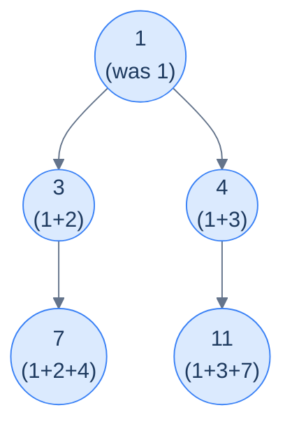

# Sum of path

## Problem Statement

Given the **root** of a binary tree, update each node's value by adding the sum of all node values on the path from the root to that node (including the node itself). Return the modified tree.

The accumulator here is the **path sum so far** (excluding the current node). At each node: write `acc + node.val` into the node, then descend with that same value as the new accumulator for both children. This is the top-down, stateless shape — the context travels down as a function argument.

## Examples

**Example 1:**
```
Input:  root = [1, 2, 3, 4, null, null, 7]
Output: [1, 3, 4, 7, null, null, 11]
```



<p align="center"><strong>Sum-of-path output — each node holds the sum of all values from the root down to itself, including itself.</strong></p>

**Example 2:**
```
Input:  root = [1, 8, 4, null, null, 2, 7]
Output: [1, 9, 5, null, null, 7, 12]
```

```quiz
{
  "prompt": "Now your turn!",
  "input": "root = [2, 1, 3]",
  "options": ["[2, 1, 3]", "[2, 3, 5]", "[2, 3, 4]", "[5, 3, 2]"],
  "answer": "[2, 3, 5]"
}
```

## Constraints

- `0 ≤ number of nodes ≤ 10⁴`
- `-10⁴ ≤ node.val ≤ 10⁴`
- Update values in place via a single top-down pass — `O(n)` time, `O(h)` recursion stack

```python run viz=binary-tree viz-root=root
import json
from collections import deque

class TreeNode:
    def __init__(self, val, left=None, right=None):
        self.val = val
        self.left = left
        self.right = right

class Solution:
    def sum_of_path(self, root):
        # Your code goes here — carry the running path sum DOWN as an argument:
        # write acc + node.val into the node, then recurse into both children
        # with that updated sum. Return the (mutated) root.
        return root

def build_tree(values):              # [1, 2, 3, null, 4] level-order → root
    if not values:
        return None
    root = TreeNode(values[0])
    queue = deque([root])
    i = 1
    while queue and i < len(values):
        node = queue.popleft()
        if i < len(values):
            v = values[i]; i += 1
            if v is not None:
                node.left = TreeNode(v); queue.append(node.left)
        if i < len(values):
            v = values[i]; i += 1
            if v is not None:
                node.right = TreeNode(v); queue.append(node.right)
    return root

def print_tree(root):                # root → [1, 2, 3, null, 4], trailing nulls trimmed
    out, queue = [], deque([root])
    while queue:
        node = queue.popleft()
        if node is None:
            out.append(None)
        else:
            out.append(node.val)
            queue.append(node.left)
            queue.append(node.right)
    while out and out[-1] is None:
        out.pop()
    print(json.dumps(out))

root = build_tree(json.loads(input()))   # the test case's level-order values
print_tree(Solution().sum_of_path(root))
```

```java run viz=binary-tree viz-root=root
import java.util.*;

public class Main {
    static class TreeNode {
        int val; TreeNode left, right;
        TreeNode(int val) { this.val = val; }
    }

    static class Solution {
        TreeNode sumOfPath(TreeNode root) {
            // Your code goes here — carry the running path sum DOWN as an argument:
            // write acc + node.val into the node, then recurse into both children
            // with that updated sum. Return the (mutated) root.
            return root;
        }
    }

    public static void main(String[] args) {
        TreeNode root = buildTree(parseIntegerArray(new Scanner(System.in).nextLine()));
        printTree(new Solution().sumOfPath(root));
    }

    static TreeNode buildTree(Integer[] values) {   // [1, 2, 3, null, 4] level-order → root
        if (values.length == 0 || values[0] == null) return null;
        TreeNode root = new TreeNode(values[0]);
        Deque<TreeNode> queue = new ArrayDeque<>();
        queue.add(root);
        int i = 1;
        while (!queue.isEmpty() && i < values.length) {
            TreeNode node = queue.poll();
            if (i < values.length) {
                Integer v = values[i++];
                if (v != null) { node.left = new TreeNode(v); queue.add(node.left); }
            }
            if (i < values.length) {
                Integer v = values[i++];
                if (v != null) { node.right = new TreeNode(v); queue.add(node.right); }
            }
        }
        return root;
    }

    static void printTree(TreeNode root) {          // root → [1, 2, 3, null, 4], trailing nulls trimmed
        List<String> out = new ArrayList<>();
        Deque<TreeNode> queue = new LinkedList<>();
        queue.add(root);
        while (!queue.isEmpty()) {
            TreeNode node = queue.poll();
            if (node == null) {
                out.add("null");
            } else {
                out.add(String.valueOf(node.val));
                queue.add(node.left);
                queue.add(node.right);
            }
        }
        while (!out.isEmpty() && out.get(out.size() - 1).equals("null"))
            out.remove(out.size() - 1);
        System.out.println("[" + String.join(", ", out) + "]");
    }

    // "[1, 2, null, 4]" → {1, 2, null, 4} — reads the test case's level-order values
    static Integer[] parseIntegerArray(String line) {
        String inner = line.replaceAll("[\\[\\]\\s]", "");
        if (inner.isEmpty()) return new Integer[0];
        String[] parts = inner.split(",");
        Integer[] out = new Integer[parts.length];
        for (int i = 0; i < parts.length; i++)
            out[i] = parts[i].equals("null") ? null : Integer.parseInt(parts[i]);
        return out;
    }
}
```

```testcases
{
  "args": [
    { "id": "root", "label": "root", "type": "tree", "placeholder": "[1, 2, 3, 4, null, null, 7]" }
  ],
  "cases": [
    { "args": { "root": "[1, 2, 3, 4, null, null, 7]" }, "expected": "[1, 3, 4, 7, null, null, 11]" },
    { "args": { "root": "[1, 8, 4, null, null, 2, 7]" }, "expected": "[1, 9, 5, null, null, 7, 12]" },
    { "args": { "root": "[]" }, "expected": "[]" },
    { "args": { "root": "[5]" }, "expected": "[5]" },
    { "args": { "root": "[1, 2, null, 3]" }, "expected": "[1, 3, null, 6]" },
    { "args": { "root": "[1, null, 2, null, 3]" }, "expected": "[1, null, 3, null, 6]" },
    { "args": { "root": "[3, 1, 4, 1, 5, 9, 2]" }, "expected": "[3, 4, 7, 5, 9, 16, 9]" }
  ]
}
```

<details>
<summary><h2>Solution</h2></summary>

A single top-down recursion carries the path sum so far (excluding the current node) down as an argument. At each node: compute `new_sum = acc + node.val`, write it into the node, then recurse into both children with `new_sum`. The base case (`None`) does nothing. Because the accumulator travels purely as a function argument, the left subtree's descent can't corrupt the right's — no shared mutable state to reset.

```python solution time=O(n) space=O(h)
import json
from collections import deque

class TreeNode:
    def __init__(self, val, left=None, right=None):
        self.val = val
        self.left = left
        self.right = right

class Solution:
    def sum_of_path_helper(self, root, path_sum):
        # Base case: if the current node is null, do nothing
        if root is None:
            return

        # Calculate the new path sum by adding the current node's value
        new_path_sum = path_sum + root.val

        # Update the current node's value to the new path sum
        root.val = new_path_sum

        # Recurse into both children, passing the updated path sum down
        self.sum_of_path_helper(root.left, new_path_sum)
        self.sum_of_path_helper(root.right, new_path_sum)

    def sum_of_path(self, root):
        self.sum_of_path_helper(root, 0)
        return root

def build_tree(values):              # [1, 2, 3, null, 4] level-order → root
    if not values:
        return None
    root = TreeNode(values[0])
    queue = deque([root])
    i = 1
    while queue and i < len(values):
        node = queue.popleft()
        if i < len(values):
            v = values[i]; i += 1
            if v is not None:
                node.left = TreeNode(v); queue.append(node.left)
        if i < len(values):
            v = values[i]; i += 1
            if v is not None:
                node.right = TreeNode(v); queue.append(node.right)
    return root

def print_tree(root):                # root → [1, 2, 3, null, 4], trailing nulls trimmed
    out, queue = [], deque([root])
    while queue:
        node = queue.popleft()
        if node is None:
            out.append(None)
        else:
            out.append(node.val)
            queue.append(node.left)
            queue.append(node.right)
    while out and out[-1] is None:
        out.pop()
    print(json.dumps(out))

root = build_tree(json.loads(input()))   # the test case's level-order values
print_tree(Solution().sum_of_path(root))
```

```java solution
import java.util.*;

public class Main {
    static class TreeNode {
        int val; TreeNode left, right;
        TreeNode(int val) { this.val = val; }
    }

    static class Solution {
        private void sumOfPathHelper(TreeNode root, int pathSum) {
            // Base case: if the current node is null, do nothing
            if (root == null) return;

            // Calculate the new path sum by adding the current node's value
            int newPathSum = pathSum + root.val;

            // Update the current node's value to the new path sum
            root.val = newPathSum;

            // Recurse into both children, passing the updated path sum down
            sumOfPathHelper(root.left, newPathSum);
            sumOfPathHelper(root.right, newPathSum);
        }

        TreeNode sumOfPath(TreeNode root) {
            sumOfPathHelper(root, 0);
            return root;
        }
    }

    public static void main(String[] args) {
        TreeNode root = buildTree(parseIntegerArray(new Scanner(System.in).nextLine()));
        printTree(new Solution().sumOfPath(root));
    }

    static TreeNode buildTree(Integer[] values) {   // [1, 2, 3, null, 4] level-order → root
        if (values.length == 0 || values[0] == null) return null;
        TreeNode root = new TreeNode(values[0]);
        Deque<TreeNode> queue = new ArrayDeque<>();
        queue.add(root);
        int i = 1;
        while (!queue.isEmpty() && i < values.length) {
            TreeNode node = queue.poll();
            if (i < values.length) {
                Integer v = values[i++];
                if (v != null) { node.left = new TreeNode(v); queue.add(node.left); }
            }
            if (i < values.length) {
                Integer v = values[i++];
                if (v != null) { node.right = new TreeNode(v); queue.add(node.right); }
            }
        }
        return root;
    }

    static void printTree(TreeNode root) {          // root → [1, 2, 3, null, 4], trailing nulls trimmed
        List<String> out = new ArrayList<>();
        Deque<TreeNode> queue = new LinkedList<>();
        queue.add(root);
        while (!queue.isEmpty()) {
            TreeNode node = queue.poll();
            if (node == null) {
                out.add("null");
            } else {
                out.add(String.valueOf(node.val));
                queue.add(node.left);
                queue.add(node.right);
            }
        }
        while (!out.isEmpty() && out.get(out.size() - 1).equals("null"))
            out.remove(out.size() - 1);
        System.out.println("[" + String.join(", ", out) + "]");
    }

    // "[1, 2, null, 4]" → {1, 2, null, 4} — reads the test case's level-order values
    static Integer[] parseIntegerArray(String line) {
        String inner = line.replaceAll("[\\[\\]\\s]", "");
        if (inner.isEmpty()) return new Integer[0];
        String[] parts = inner.split(",");
        Integer[] out = new Integer[parts.length];
        for (int i = 0; i < parts.length; i++)
            out[i] = parts[i].equals("null") ? null : Integer.parseInt(parts[i]);
        return out;
    }
}
```

</details>
