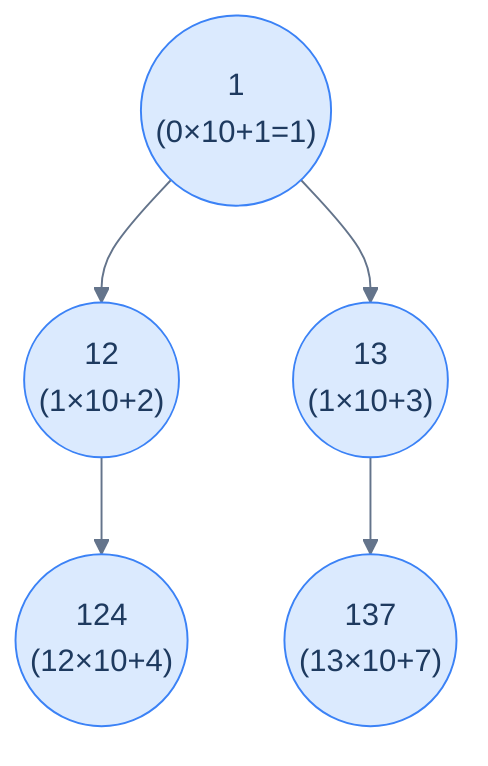

# Problem 3 — Concatenated path

> Given the root of a binary tree, update each node's value to the integer represented by concatenating all the digits from the root down to that node, in order.
>
> **Example:** Input `[1, 2, 3, 4, null, null, 7]` → output `[1, 12, 13, 124, null, null, 137]`.

The accumulator here is the **path-so-far number**. To "append digit `d`" to a number `n`, we multiply by `10^(digits in d)` and add `d`. So the per-node update is:

```text
newAcc = acc * 10^digits(node.val) + node.val
```



<p align="center"><strong>Concatenated path — each node's value is the integer formed by gluing the digits along the root-to-node path. The accumulator is the path-so-far number.</strong></p>

<details>
<summary><h2>Solution</h2></summary>


```python run viz=binary-tree viz-root=root
from typing import Optional
from collections import deque

class TreeNode:
    def __init__(self, val=0, left=None, right=None):
        self.val = val
        self.left = left
        self.right = right


def from_level_order(values):
    """Build tree from list like [1, 2, 3, None, 4]. None means missing child."""
    if not values:
        return None
    root = TreeNode(values[0])
    queue = [root]
    i = 1
    while queue and i < len(values):
        node = queue.pop(0)
        if i < len(values) and values[i] is not None:
            node.left = TreeNode(values[i])
            queue.append(node.left)
        i += 1
        if i < len(values) and values[i] is not None:
            node.right = TreeNode(values[i])
            queue.append(node.right)
        i += 1
    return root


def to_level_order(root):
    if not root:
        return []
    result, queue = [], deque([root])
    while queue:
        node = queue.popleft()
        if node:
            result.append(node.val)
            queue.append(node.left)
            queue.append(node.right)
        else:
            result.append(None)
    while result and result[-1] is None:
        result.pop()
    return result


class Solution:
    def count_digits(self, num: int) -> int:

        # Handle the case when num is 0
        if num == 0:
            return 1

        # Count the number of digits in num
        digits: int = 0
        while num > 0:
            num //= 10
            digits += 1

        # Return the total count of digits
        return digits

    def concatenated_path_helper(
        self, root: Optional[TreeNode], path_val: int
    ) -> None:

        # Base case: if the current node is null, do nothing
        if not root:
            return

        # Shift pathVal by digitCount digits to the left, then
        # add current node value
        digit_count: int = self.count_digits(root.val)

        # Update current node's value
        root.val = path_val * (10**digit_count) + root.val

        # Recursively process the left and right children,
        # passing updated path value
        self.concatenated_path_helper(root.left, root.val)
        self.concatenated_path_helper(root.right, root.val)

    def concatenated_path(self, root: Optional[TreeNode]) -> None:
        self.concatenated_path_helper(root, 0)


# Examples from the problem statement
t1 = from_level_order([1, 2, 3, 4, None, None, 7])
Solution().concatenated_path(t1); print(to_level_order(t1))   # [1, 12, 13, 124, 137]

t2 = from_level_order([1, 10, 20, None, None, 211, 7])
Solution().concatenated_path(t2); print(to_level_order(t2))   # [1, 110, 120, 120211, 1207]

# Edge cases
t3 = from_level_order([])
Solution().concatenated_path(t3); print(to_level_order(t3))   # []

t4 = from_level_order([5])
Solution().concatenated_path(t4); print(to_level_order(t4))   # [5]

t5 = from_level_order([1, 2, None, 3])                        # left-skew
Solution().concatenated_path(t5); print(to_level_order(t5))   # [1, 12, 123]

t6 = from_level_order([1, None, 2, None, 3])                  # right-skew
Solution().concatenated_path(t6); print(to_level_order(t6))   # [1, 12, 123]

t7 = from_level_order([9, 8, 7])
Solution().concatenated_path(t7); print(to_level_order(t7))   # [9, 98, 97]
```

```java run viz=binary-tree viz-root=root
import java.util.*;

public class Main {
    static class TreeNode {
        int val;
        TreeNode left;
        TreeNode right;
        TreeNode() {}
        TreeNode(int val) { this.val = val; }
    }

    static TreeNode fromLevelOrder(Integer... values) {
        if (values.length == 0 || values[0] == null) return null;
        TreeNode root = new TreeNode(values[0]);
        java.util.Deque<TreeNode> queue = new java.util.ArrayDeque<>();
        queue.add(root);
        int i = 1;
        while (!queue.isEmpty() && i < values.length) {
            TreeNode node = queue.poll();
            if (i < values.length && values[i] != null) {
                node.left = new TreeNode(values[i]);
                queue.add(node.left);
            }
            i++;
            if (i < values.length && values[i] != null) {
                node.right = new TreeNode(values[i]);
                queue.add(node.right);
            }
            i++;
        }
        return root;
    }

    static List<Integer> toLevelOrder(TreeNode root) {
        if (root == null) return new ArrayList<>();
        List<Integer> result = new ArrayList<>();
        java.util.Deque<TreeNode> queue = new java.util.ArrayDeque<>();
        queue.add(root);
        while (!queue.isEmpty()) {
            TreeNode node = queue.poll();
            if (node != null) {
                result.add(node.val);
                queue.add(node.left);
                queue.add(node.right);
            } else {
                result.add(null);
            }
        }
        while (!result.isEmpty() && result.get(result.size() - 1) == null)
            result.remove(result.size() - 1);
        return result;
    }

    static class Solution {
        private int countDigits(int num) {

            // Handle the case when num is 0
            if (num == 0) {
                return 1;
            }

            // Count the number of digits in num
            int digits = 0;
            while (num > 0) {
                num /= 10;
                digits++;
            }

            // Return the total count of digits
            return digits;
        }

        void concatenatedPathHelper(TreeNode root, int pathVal) {

            // Base case: if the current node is null, do nothing
            if (root == null) {
                return;
            }

            // Shift pathVal by digitCount digits to the left, then
            // add current node value
            int digitCount = countDigits(root.val);

            // Update current node's value
            root.val = (int) (pathVal * Math.pow(10, digitCount)) + root.val;

            // Recursively process the left and right children,
            // passing updated path value
            concatenatedPathHelper(root.left, root.val);
            concatenatedPathHelper(root.right, root.val);
        }

        public void concatenatedPath(TreeNode root) {
            concatenatedPathHelper(root, 0);
        }
    }

    public static void main(String[] args) {
        // Examples from the problem statement
        TreeNode t1 = fromLevelOrder(1, 2, 3, 4, null, null, 7);
        new Solution().concatenatedPath(t1);
        System.out.println(toLevelOrder(t1));   // [1, 12, 13, 124, 137]

        TreeNode t2 = fromLevelOrder(1, 10, 20, null, null, 211, 7);
        new Solution().concatenatedPath(t2);
        System.out.println(toLevelOrder(t2));   // [1, 110, 120, 120211, 1207]

        // Edge cases
        TreeNode t3 = fromLevelOrder();
        new Solution().concatenatedPath(t3);
        System.out.println(toLevelOrder(t3));   // []

        TreeNode t4 = fromLevelOrder(5);
        new Solution().concatenatedPath(t4);
        System.out.println(toLevelOrder(t4));   // [5]

        TreeNode t5 = fromLevelOrder(1, 2, null, 3);   // left-skew
        new Solution().concatenatedPath(t5);
        System.out.println(toLevelOrder(t5));   // [1, 12, 123]

        TreeNode t6 = fromLevelOrder(1, null, 2, null, 3);   // right-skew
        new Solution().concatenatedPath(t6);
        System.out.println(toLevelOrder(t6));   // [1, 12, 123]

        TreeNode t7 = fromLevelOrder(9, 8, 7);
        new Solution().concatenatedPath(t7);
        System.out.println(toLevelOrder(t7));   // [9, 98, 97]
    }
}
```

</details>
