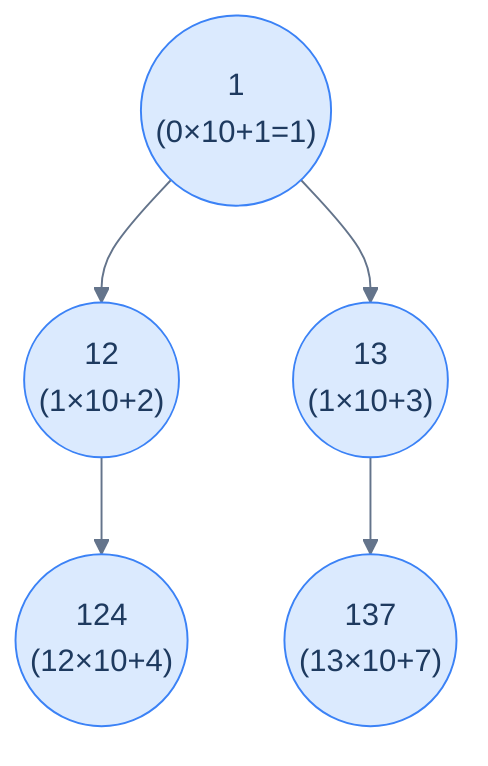

# Concatenated path

## Problem Statement

Given the **root** of a binary tree, update each node's value to the integer represented by concatenating all the digits from the root down to that node, in order. Return the modified tree.

The accumulator here is the **path-so-far number**. To "append digit `d`" to a number `n`, multiply by `10^(digits in d)` and add `d`. So the per-node update is:

```text
newAcc = acc × 10^digits(node.val) + node.val
```

## Examples

**Example 1:**
```
Input:  root = [1, 2, 3, 4, null, null, 7]
Output: [1, 12, 13, 124, null, null, 137]
```



<p align="center"><strong>Concatenated path — each node's value is the integer formed by gluing the digits along the root-to-node path. The accumulator is the path-so-far number.</strong></p>

**Example 2:**
```
Input:  root = [1, 10, 20, null, null, 211, 7]
Output: [1, 110, 120, null, null, 120211, 1207]
```

## Constraints

- `0 ≤ number of nodes ≤ 10⁴`
- `0 ≤ node.val ≤ 999` (single or multi-digit, non-negative)
- Update values in place via a single top-down pass — `O(n)` time, `O(h)` recursion stack

```python run viz=binary-tree viz-root=root
import json
from collections import deque

class TreeNode:
    def __init__(self, val, left=None, right=None):
        self.val = val
        self.left = left
        self.right = right

class Solution:
    def concatenated_path(self, root):
        # Your code goes here — carry the path-so-far number DOWN as an argument:
        # compute new_val = acc * 10^digits(node.val) + node.val, write it into
        # the node, then recurse into both children with new_val as the new acc.
        # Return the (mutated) root.
        return root

def build_tree(values):              # [1, 2, 3, null, 4] level-order → root
    if not values:
        return None
    root = TreeNode(values[0])
    queue = deque([root])
    i = 1
    while queue and i < len(values):
        node = queue.popleft()
        if i < len(values):
            v = values[i]; i += 1
            if v is not None:
                node.left = TreeNode(v); queue.append(node.left)
        if i < len(values):
            v = values[i]; i += 1
            if v is not None:
                node.right = TreeNode(v); queue.append(node.right)
    return root

def print_tree(root):                # root → [1, 2, 3, null, 4], trailing nulls trimmed
    out, queue = [], deque([root])
    while queue:
        node = queue.popleft()
        if node is None:
            out.append(None)
        else:
            out.append(node.val)
            queue.append(node.left)
            queue.append(node.right)
    while out and out[-1] is None:
        out.pop()
    print(json.dumps(out))

root = build_tree(json.loads(input()))   # the test case's level-order values
print_tree(Solution().concatenated_path(root))
```

```java run viz=binary-tree viz-root=root
import java.util.*;

public class Main {
    static class TreeNode {
        int val; TreeNode left, right;
        TreeNode(int val) { this.val = val; }
    }

    static class Solution {
        TreeNode concatenatedPath(TreeNode root) {
            // Your code goes here — carry the path-so-far number DOWN as an argument:
            // compute new_val = acc * 10^digits(node.val) + node.val, write it into
            // the node, then recurse into both children with new_val as the new acc.
            // Return the (mutated) root.
            return root;
        }
    }

    public static void main(String[] args) {
        TreeNode root = buildTree(parseIntegerArray(new Scanner(System.in).nextLine()));
        printTree(new Solution().concatenatedPath(root));
    }

    static TreeNode buildTree(Integer[] values) {   // [1, 2, 3, null, 4] level-order → root
        if (values.length == 0 || values[0] == null) return null;
        TreeNode root = new TreeNode(values[0]);
        Deque<TreeNode> queue = new ArrayDeque<>();
        queue.add(root);
        int i = 1;
        while (!queue.isEmpty() && i < values.length) {
            TreeNode node = queue.poll();
            if (i < values.length) {
                Integer v = values[i++];
                if (v != null) { node.left = new TreeNode(v); queue.add(node.left); }
            }
            if (i < values.length) {
                Integer v = values[i++];
                if (v != null) { node.right = new TreeNode(v); queue.add(node.right); }
            }
        }
        return root;
    }

    static void printTree(TreeNode root) {          // root → [1, 2, 3, null, 4], trailing nulls trimmed
        List<String> out = new ArrayList<>();
        Deque<TreeNode> queue = new LinkedList<>();
        queue.add(root);
        while (!queue.isEmpty()) {
            TreeNode node = queue.poll();
            if (node == null) {
                out.add("null");
            } else {
                out.add(String.valueOf(node.val));
                queue.add(node.left);
                queue.add(node.right);
            }
        }
        while (!out.isEmpty() && out.get(out.size() - 1).equals("null"))
            out.remove(out.size() - 1);
        System.out.println("[" + String.join(", ", out) + "]");
    }

    // "[1, 2, null, 4]" → {1, 2, null, 4} — reads the test case's level-order values
    static Integer[] parseIntegerArray(String line) {
        String inner = line.replaceAll("[\\[\\]\\s]", "");
        if (inner.isEmpty()) return new Integer[0];
        String[] parts = inner.split(",");
        Integer[] out = new Integer[parts.length];
        for (int i = 0; i < parts.length; i++)
            out[i] = parts[i].equals("null") ? null : Integer.parseInt(parts[i]);
        return out;
    }
}
```

```testcases
{
  "args": [
    { "id": "root", "label": "root", "type": "tree", "placeholder": "[1, 2, 3, 4, null, null, 7]" }
  ],
  "cases": [
    { "args": { "root": "[1, 2, 3, 4, null, null, 7]" }, "expected": "[1, 12, 13, 124, null, null, 137]" },
    { "args": { "root": "[1, 10, 20, null, null, 211, 7]" }, "expected": "[1, 110, 120, null, null, 120211, 1207]" },
    { "args": { "root": "[]" }, "expected": "[]" },
    { "args": { "root": "[5]" }, "expected": "[5]" },
    { "args": { "root": "[1, 2, null, 3]" }, "expected": "[1, 12, null, 123]" },
    { "args": { "root": "[1, null, 2, null, 3]" }, "expected": "[1, null, 12, null, 123]" },
    { "args": { "root": "[9, 8, 7]" }, "expected": "[9, 98, 97]" }
  ]
}
```

<details>
<summary><h2>Solution</h2></summary>

A single top-down recursion carries the path-so-far number down as an argument. At each node: compute `new_val = acc × 10^digits(node.val) + node.val`, write it into the node, then recurse into both children with `new_val` as the new accumulator. Because the accumulator travels purely as a function argument, the left subtree's descent cannot corrupt the right's.

```python solution time=O(n) space=O(h)
import json
from collections import deque

class TreeNode:
    def __init__(self, val, left=None, right=None):
        self.val = val
        self.left = left
        self.right = right

class Solution:
    def count_digits(self, num):
        if num == 0:
            return 1
        digits = 0
        while num > 0:
            num //= 10
            digits += 1
        return digits

    def concatenated_path_helper(self, root, path_val):
        # Base case: if the current node is null, do nothing
        if not root:
            return

        # Shift pathVal by digitCount digits to the left, then
        # add current node value
        digit_count = self.count_digits(root.val)

        # Update current node's value
        root.val = path_val * (10 ** digit_count) + root.val

        # Recursively process the left and right children,
        # passing updated path value
        self.concatenated_path_helper(root.left, root.val)
        self.concatenated_path_helper(root.right, root.val)

    def concatenated_path(self, root):
        self.concatenated_path_helper(root, 0)
        return root

def build_tree(values):              # [1, 2, 3, null, 4] level-order → root
    if not values:
        return None
    root = TreeNode(values[0])
    queue = deque([root])
    i = 1
    while queue and i < len(values):
        node = queue.popleft()
        if i < len(values):
            v = values[i]; i += 1
            if v is not None:
                node.left = TreeNode(v); queue.append(node.left)
        if i < len(values):
            v = values[i]; i += 1
            if v is not None:
                node.right = TreeNode(v); queue.append(node.right)
    return root

def print_tree(root):                # root → [1, 2, 3, null, 4], trailing nulls trimmed
    out, queue = [], deque([root])
    while queue:
        node = queue.popleft()
        if node is None:
            out.append(None)
        else:
            out.append(node.val)
            queue.append(node.left)
            queue.append(node.right)
    while out and out[-1] is None:
        out.pop()
    print(json.dumps(out))

root = build_tree(json.loads(input()))   # the test case's level-order values
print_tree(Solution().concatenated_path(root))
```

```java solution
import java.util.*;

public class Main {
    static class TreeNode {
        int val; TreeNode left, right;
        TreeNode(int val) { this.val = val; }
    }

    static class Solution {
        private int countDigits(int num) {
            if (num == 0) return 1;
            int digits = 0;
            while (num > 0) { num /= 10; digits++; }
            return digits;
        }

        void concatenatedPathHelper(TreeNode root, int pathVal) {
            // Base case: if the current node is null, do nothing
            if (root == null) return;

            // Shift pathVal by digitCount digits to the left, then
            // add current node value
            int digitCount = countDigits(root.val);

            // Update current node's value
            root.val = (int) (pathVal * Math.pow(10, digitCount)) + root.val;

            // Recursively process the left and right children,
            // passing updated path value
            concatenatedPathHelper(root.left, root.val);
            concatenatedPathHelper(root.right, root.val);
        }

        TreeNode concatenatedPath(TreeNode root) {
            concatenatedPathHelper(root, 0);
            return root;
        }
    }

    public static void main(String[] args) {
        TreeNode root = buildTree(parseIntegerArray(new Scanner(System.in).nextLine()));
        printTree(new Solution().concatenatedPath(root));
    }

    static TreeNode buildTree(Integer[] values) {   // [1, 2, 3, null, 4] level-order → root
        if (values.length == 0 || values[0] == null) return null;
        TreeNode root = new TreeNode(values[0]);
        Deque<TreeNode> queue = new ArrayDeque<>();
        queue.add(root);
        int i = 1;
        while (!queue.isEmpty() && i < values.length) {
            TreeNode node = queue.poll();
            if (i < values.length) {
                Integer v = values[i++];
                if (v != null) { node.left = new TreeNode(v); queue.add(node.left); }
            }
            if (i < values.length) {
                Integer v = values[i++];
                if (v != null) { node.right = new TreeNode(v); queue.add(node.right); }
            }
        }
        return root;
    }

    static void printTree(TreeNode root) {          // root → [1, 2, 3, null, 4], trailing nulls trimmed
        List<String> out = new ArrayList<>();
        Deque<TreeNode> queue = new LinkedList<>();
        queue.add(root);
        while (!queue.isEmpty()) {
            TreeNode node = queue.poll();
            if (node == null) {
                out.add("null");
            } else {
                out.add(String.valueOf(node.val));
                queue.add(node.left);
                queue.add(node.right);
            }
        }
        while (!out.isEmpty() && out.get(out.size() - 1).equals("null"))
            out.remove(out.size() - 1);
        System.out.println("[" + String.join(", ", out) + "]");
    }

    // "[1, 2, null, 4]" → {1, 2, null, 4} — reads the test case's level-order values
    static Integer[] parseIntegerArray(String line) {
        String inner = line.replaceAll("[\\[\\]\\s]", "");
        if (inner.isEmpty()) return new Integer[0];
        String[] parts = inner.split(",");
        Integer[] out = new Integer[parts.length];
        for (int i = 0; i < parts.length; i++)
            out[i] = parts[i].equals("null") ? null : Integer.parseInt(parts[i]);
        return out;
    }
}
```

</details>
