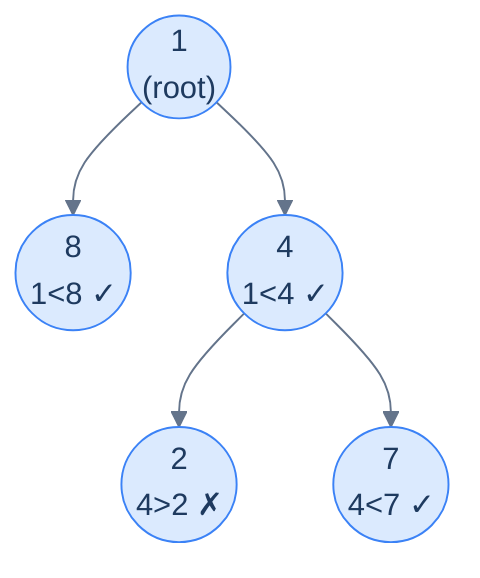

# Problem 4 — Increasing path

> Given the root of a binary tree, update each node's value to `1` if all values from the root to that node are strictly increasing, and `0` otherwise.
>
> **Example:** Input `[1, 8, 4, null, null, 2, 7]` → output `[1, 1, 1, null, null, 0, 1]`.

This needs **two pieces** of accumulator: (a) whether the path so far is still strictly increasing (a boolean), and (b) the previous node's *original* value so we can compare against the current. Note: we have to compare against the *original* value, not the value we're about to overwrite — which is why the implementation reads the current value *before* writing the result.



<p align="center"><strong>Increasing path — node 2 breaks the strictly-increasing chain (its parent 4 is bigger), so it gets <code>0</code>; node 7's parent is 4 and 4&lt;7, so the chain continues with <code>1</code>. The decision at each node depends only on the previous value and the current value.</strong></p>

<details>
<summary><h2>Solution</h2></summary>


```python run viz=binary-tree viz-root=root
from typing import Optional
from collections import deque

class TreeNode:
    def __init__(self, val=0, left=None, right=None):
        self.val = val
        self.left = left
        self.right = right


def from_level_order(values):
    """Build tree from list like [1, 2, 3, None, 4]. None means missing child."""
    if not values:
        return None
    root = TreeNode(values[0])
    queue = [root]
    i = 1
    while queue and i < len(values):
        node = queue.pop(0)
        if i < len(values) and values[i] is not None:
            node.left = TreeNode(values[i])
            queue.append(node.left)
        i += 1
        if i < len(values) and values[i] is not None:
            node.right = TreeNode(values[i])
            queue.append(node.right)
        i += 1
    return root


def to_level_order(root):
    if not root:
        return []
    result, queue = [], deque([root])
    while queue:
        node = queue.popleft()
        if node:
            result.append(node.val)
            queue.append(node.left)
            queue.append(node.right)
        else:
            result.append(None)
    while result and result[-1] is None:
        result.pop()
    return result


class Solution:
    def increasing_path_helper(
        self,
        root: Optional[TreeNode],
        parent_val: int,
        parent_status: int,
    ) -> None:

        # Base case: if the current node is null, do nothing
        if root is None:
            return

        # Store the node's original value before we overwrite it
        # We need the original value to pass down to children for
        # comparison
        original_val = root.val

        # Check if the path from root to this node is strictly increasing
        if parent_status == 1 and parent_val < original_val:
            root.val = 1

        # Path is not strictly increasing, mark as 0
        else:
            root.val = 0

        # Recursively call for the left and right child with the parent
        # value and status
        self.increasing_path_helper(root.left, original_val, root.val)
        self.increasing_path_helper(root.right, original_val, root.val)

    def increasing_path(self, root: Optional[TreeNode]) -> None:
        if root is None:
            return

        # Store the original value of the root
        original_val = root.val

        # Root is always 1 (path of length 1 is increasing)
        root.val = 1

        # Recurse for the left subtree
        self.increasing_path_helper(root.left, original_val, 1)

        # Recurse for the right subtree
        self.increasing_path_helper(root.right, original_val, 1)


# Examples from the problem statement
t1 = from_level_order([1, 2, 3, 4, None, None, 7])
Solution().increasing_path(t1); print(to_level_order(t1))   # [1, 1, 1, 1, 1]

t2 = from_level_order([1, 8, 4, None, None, 2, 7])
Solution().increasing_path(t2); print(to_level_order(t2))   # [1, 1, 1, 0, 1]

# Edge cases
t3 = from_level_order([])
Solution().increasing_path(t3); print(to_level_order(t3))   # []

t4 = from_level_order([5])
Solution().increasing_path(t4); print(to_level_order(t4))   # [1]

t5 = from_level_order([5, 3, 8])                             # left child less, right greater
Solution().increasing_path(t5); print(to_level_order(t5))   # [1, 0, 1]

t6 = from_level_order([1, 2, None, 3])                       # left-skew strictly increasing
Solution().increasing_path(t6); print(to_level_order(t6))   # [1, 1, 1]

t7 = from_level_order([3, 3, 3])                              # equal values — not strictly increasing
Solution().increasing_path(t7); print(to_level_order(t7))   # [1, 0, 0]
```

```java run viz=binary-tree viz-root=root
import java.util.*;

public class Main {
    static class TreeNode {
        int val;
        TreeNode left;
        TreeNode right;
        TreeNode() {}
        TreeNode(int val) { this.val = val; }
    }

    static TreeNode fromLevelOrder(Integer... values) {
        if (values.length == 0 || values[0] == null) return null;
        TreeNode root = new TreeNode(values[0]);
        java.util.Deque<TreeNode> queue = new java.util.ArrayDeque<>();
        queue.add(root);
        int i = 1;
        while (!queue.isEmpty() && i < values.length) {
            TreeNode node = queue.poll();
            if (i < values.length && values[i] != null) {
                node.left = new TreeNode(values[i]);
                queue.add(node.left);
            }
            i++;
            if (i < values.length && values[i] != null) {
                node.right = new TreeNode(values[i]);
                queue.add(node.right);
            }
            i++;
        }
        return root;
    }

    static List<Integer> toLevelOrder(TreeNode root) {
        if (root == null) return new ArrayList<>();
        List<Integer> result = new ArrayList<>();
        java.util.Deque<TreeNode> queue = new java.util.ArrayDeque<>();
        queue.add(root);
        while (!queue.isEmpty()) {
            TreeNode node = queue.poll();
            if (node != null) {
                result.add(node.val);
                queue.add(node.left);
                queue.add(node.right);
            } else {
                result.add(null);
            }
        }
        while (!result.isEmpty() && result.get(result.size() - 1) == null)
            result.remove(result.size() - 1);
        return result;
    }

    static class Solution {
        public void increasingPathHelper(
            TreeNode root,
            int parentVal,
            int parentStatus
        ) {

            // Base case: if the current node is null, do nothing
            if (root == null) {
                return;
            }

            // Store the node's original value before we overwrite it
            // We need the original value to pass down to children for
            // comparison
            int originalVal = root.val;

            // Check if the path from root to this node is strictly increasing
            if (parentStatus == 1 && parentVal < originalVal) {
                root.val = 1;
            }

            // Path is not strictly increasing, mark as 0
            else {
                root.val = 0;
            }

            // Recursively call for the left and right child with the parent
            // value and status
            increasingPathHelper(root.left, originalVal, root.val);
            increasingPathHelper(root.right, originalVal, root.val);
        }

        public void increasingPath(TreeNode root) {
            if (root == null) {
                return;
            }

            // Store the original value of the root
            int originalVal = root.val;

            // Root is always 1 (path of length 1 is increasing)
            root.val = 1;

            // Recurse for the left subtree
            increasingPathHelper(root.left, originalVal, 1);

            // Recurse for the right subtree
            increasingPathHelper(root.right, originalVal, 1);
        }
    }

    public static void main(String[] args) {
        // Examples from the problem statement
        TreeNode t1 = fromLevelOrder(1, 2, 3, 4, null, null, 7);
        new Solution().increasingPath(t1);
        System.out.println(toLevelOrder(t1));   // [1, 1, 1, 1, 1]

        TreeNode t2 = fromLevelOrder(1, 8, 4, null, null, 2, 7);
        new Solution().increasingPath(t2);
        System.out.println(toLevelOrder(t2));   // [1, 1, 1, 0, 1]

        // Edge cases
        TreeNode t3 = fromLevelOrder();
        new Solution().increasingPath(t3);
        System.out.println(toLevelOrder(t3));   // []

        TreeNode t4 = fromLevelOrder(5);
        new Solution().increasingPath(t4);
        System.out.println(toLevelOrder(t4));   // [1]

        TreeNode t5 = fromLevelOrder(5, 3, 8);   // left child less, right greater
        new Solution().increasingPath(t5);
        System.out.println(toLevelOrder(t5));   // [1, 0, 1]

        TreeNode t6 = fromLevelOrder(1, 2, null, 3);   // left-skew strictly increasing
        new Solution().increasingPath(t6);
        System.out.println(toLevelOrder(t6));   // [1, 1, 1]

        TreeNode t7 = fromLevelOrder(3, 3, 3);   // equal values — not strictly increasing
        new Solution().increasingPath(t7);
        System.out.println(toLevelOrder(t7));   // [1, 0, 0]
    }
}
```

</details>
<details>
<summary><h2>Key Takeaway</h2></summary>


The stateless preorder pattern is the *first* pattern most binary-tree problems will fit into. Three things to walk away with:

1. **The accumulator flows down, never up.** Each node uses what its parent passed in, updates it, and hands the new value to its children. There's no "fix it on the way back" because there's nothing to fix — the parent's value is preserved on its own stack frame.
2. **Pass by value, not by reference.** When the accumulator is an integer, this is automatic. When it's a string or list, *clone before recursing* (or use immutable collections) so sibling subtrees don't trample each other. The next lesson covers the *stateful* variant for cases where mutation is genuinely needed.
3. **The shape is the recipe.** `if null return; process; update; recurse(L, new_acc); recurse(R, new_acc)`. Whenever you read a problem and it says "for each node, given the path from the root to it, compute…" — write that skeleton first, then fill in the `update` and `process`.

> *Coming up — the <strong>stateful</strong> variant of the same pattern. When the accumulator needs to be a mutable shared collection (a path you push and pop nodes onto, a hash set of seen values, a counter), passing copies down becomes too expensive. The stateful version mutates a single shared accumulator and uses an explicit "undo" step on the way back up — the canonical backtracking template.*

</details>
