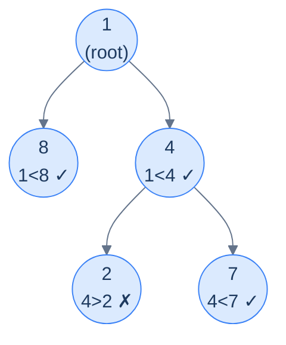

# Increasing path

## Problem Statement

Given the **root** of a binary tree, update each node's value to `1` if all values from the root to that node are **strictly increasing**, and `0` otherwise. The root always gets `1`. Return the modified tree.

This needs **two pieces** of accumulator: (a) whether the path so far is still strictly increasing, and (b) the previous node's *original* value so we can compare against the current. The implementation reads the current value *before* overwriting it — because the children need the original for comparison.

## Examples

**Example 1:**
```
Input:  root = [1, 2, 3, 4, null, null, 7]
Output: [1, 1, 1, 1, null, null, 1]
```

**Example 2:**
```
Input:  root = [1, 8, 4, null, null, 2, 7]
Output: [1, 1, 1, null, null, 0, 1]
```



<p align="center"><strong>Increasing path — node 2 breaks the strictly-increasing chain (its parent 4 is bigger), so it gets <code>0</code>; node 7's parent is 4 and 4&lt;7, so the chain continues with <code>1</code>. The decision at each node depends only on the previous value and the current value.</strong></p>

## Constraints

- `0 ≤ number of nodes ≤ 10⁴`
- `-10⁴ ≤ node.val ≤ 10⁴`
- Update values in place via a single top-down pass — `O(n)` time, `O(h)` recursion stack

```python run viz=binary-tree viz-root=root
import json
from collections import deque

class TreeNode:
    def __init__(self, val, left=None, right=None):
        self.val = val
        self.left = left
        self.right = right

class Solution:
    def increasing_path(self, root):
        # Your code goes here — carry (parent_val, parent_status) DOWN as arguments.
        # Read the node's original value BEFORE overwriting it (children need it).
        # Root is always 1. Return the (mutated) root.
        return root

def build_tree(values):              # [1, 2, 3, null, 4] level-order → root
    if not values:
        return None
    root = TreeNode(values[0])
    queue = deque([root])
    i = 1
    while queue and i < len(values):
        node = queue.popleft()
        if i < len(values):
            v = values[i]; i += 1
            if v is not None:
                node.left = TreeNode(v); queue.append(node.left)
        if i < len(values):
            v = values[i]; i += 1
            if v is not None:
                node.right = TreeNode(v); queue.append(node.right)
    return root

def print_tree(root):                # root → [1, 2, 3, null, 4], trailing nulls trimmed
    out, queue = [], deque([root])
    while queue:
        node = queue.popleft()
        if node is None:
            out.append(None)
        else:
            out.append(node.val)
            queue.append(node.left)
            queue.append(node.right)
    while out and out[-1] is None:
        out.pop()
    print(json.dumps(out))

root = build_tree(json.loads(input()))   # the test case's level-order values
print_tree(Solution().increasing_path(root))
```

```java run viz=binary-tree viz-root=root
import java.util.*;

public class Main {
    static class TreeNode {
        int val; TreeNode left, right;
        TreeNode(int val) { this.val = val; }
    }

    static class Solution {
        TreeNode increasingPath(TreeNode root) {
            // Your code goes here — carry (parentVal, parentStatus) DOWN as arguments.
            // Read the node's original value BEFORE overwriting it (children need it).
            // Root is always 1. Return the (mutated) root.
            return root;
        }
    }

    public static void main(String[] args) {
        TreeNode root = buildTree(parseIntegerArray(new Scanner(System.in).nextLine()));
        printTree(new Solution().increasingPath(root));
    }

    static TreeNode buildTree(Integer[] values) {   // [1, 2, 3, null, 4] level-order → root
        if (values.length == 0 || values[0] == null) return null;
        TreeNode root = new TreeNode(values[0]);
        Deque<TreeNode> queue = new ArrayDeque<>();
        queue.add(root);
        int i = 1;
        while (!queue.isEmpty() && i < values.length) {
            TreeNode node = queue.poll();
            if (i < values.length) {
                Integer v = values[i++];
                if (v != null) { node.left = new TreeNode(v); queue.add(node.left); }
            }
            if (i < values.length) {
                Integer v = values[i++];
                if (v != null) { node.right = new TreeNode(v); queue.add(node.right); }
            }
        }
        return root;
    }

    static void printTree(TreeNode root) {          // root → [1, 2, 3, null, 4], trailing nulls trimmed
        List<String> out = new ArrayList<>();
        Deque<TreeNode> queue = new LinkedList<>();
        queue.add(root);
        while (!queue.isEmpty()) {
            TreeNode node = queue.poll();
            if (node == null) {
                out.add("null");
            } else {
                out.add(String.valueOf(node.val));
                queue.add(node.left);
                queue.add(node.right);
            }
        }
        while (!out.isEmpty() && out.get(out.size() - 1).equals("null"))
            out.remove(out.size() - 1);
        System.out.println("[" + String.join(", ", out) + "]");
    }

    // "[1, 2, null, 4]" → {1, 2, null, 4} — reads the test case's level-order values
    static Integer[] parseIntegerArray(String line) {
        String inner = line.replaceAll("[\\[\\]\\s]", "");
        if (inner.isEmpty()) return new Integer[0];
        String[] parts = inner.split(",");
        Integer[] out = new Integer[parts.length];
        for (int i = 0; i < parts.length; i++)
            out[i] = parts[i].equals("null") ? null : Integer.parseInt(parts[i]);
        return out;
    }
}
```

```testcases
{
  "args": [
    { "id": "root", "label": "root", "type": "tree", "placeholder": "[1, 8, 4, null, null, 2, 7]" }
  ],
  "cases": [
    { "args": { "root": "[1, 2, 3, 4, null, null, 7]" }, "expected": "[1, 1, 1, 1, null, null, 1]" },
    { "args": { "root": "[1, 8, 4, null, null, 2, 7]" }, "expected": "[1, 1, 1, null, null, 0, 1]" },
    { "args": { "root": "[]" }, "expected": "[]" },
    { "args": { "root": "[5]" }, "expected": "[1]" },
    { "args": { "root": "[5, 3, 8]" }, "expected": "[1, 0, 1]" },
    { "args": { "root": "[1, 2, null, 3]" }, "expected": "[1, 1, null, 1]" },
    { "args": { "root": "[3, 3, 3]" }, "expected": "[1, 0, 0]" }
  ]
}
```

<details>
<summary><h2>Solution</h2></summary>

A single top-down recursion carries two accumulators down: the previous node's original value and whether the path so far was strictly increasing. At each node: read `original_val` before overwriting (children need it for comparison), then set `node.val = 1` if `parent_status == 1 and parent_val < original_val`, else `0`. The root is always `1`. Because both values travel purely as function arguments, neither subtree can corrupt the other's state.

```python solution time=O(n) space=O(h)
import json
from collections import deque

class TreeNode:
    def __init__(self, val, left=None, right=None):
        self.val = val
        self.left = left
        self.right = right

class Solution:
    def increasing_path_helper(self, root, parent_val, parent_status):
        # Base case: if the current node is null, do nothing
        if root is None:
            return

        # Store the node's original value before we overwrite it
        # We need the original value to pass down to children for comparison
        original_val = root.val

        # Check if the path from root to this node is strictly increasing
        if parent_status == 1 and parent_val < original_val:
            root.val = 1
        else:
            root.val = 0

        # Recursively call for the left and right child with the parent
        # value and status
        self.increasing_path_helper(root.left, original_val, root.val)
        self.increasing_path_helper(root.right, original_val, root.val)

    def increasing_path(self, root):
        if root is None:
            return root

        # Store the original value of the root
        original_val = root.val

        # Root is always 1 (path of length 1 is increasing)
        root.val = 1

        # Recurse for the left subtree
        self.increasing_path_helper(root.left, original_val, 1)

        # Recurse for the right subtree
        self.increasing_path_helper(root.right, original_val, 1)

        return root

def build_tree(values):              # [1, 2, 3, null, 4] level-order → root
    if not values:
        return None
    root = TreeNode(values[0])
    queue = deque([root])
    i = 1
    while queue and i < len(values):
        node = queue.popleft()
        if i < len(values):
            v = values[i]; i += 1
            if v is not None:
                node.left = TreeNode(v); queue.append(node.left)
        if i < len(values):
            v = values[i]; i += 1
            if v is not None:
                node.right = TreeNode(v); queue.append(node.right)
    return root

def print_tree(root):                # root → [1, 2, 3, null, 4], trailing nulls trimmed
    out, queue = [], deque([root])
    while queue:
        node = queue.popleft()
        if node is None:
            out.append(None)
        else:
            out.append(node.val)
            queue.append(node.left)
            queue.append(node.right)
    while out and out[-1] is None:
        out.pop()
    print(json.dumps(out))

root = build_tree(json.loads(input()))   # the test case's level-order values
print_tree(Solution().increasing_path(root))
```

```java solution
import java.util.*;

public class Main {
    static class TreeNode {
        int val; TreeNode left, right;
        TreeNode(int val) { this.val = val; }
    }

    static class Solution {
        public void increasingPathHelper(TreeNode root, int parentVal, int parentStatus) {
            // Base case: if the current node is null, do nothing
            if (root == null) return;

            // Store the node's original value before we overwrite it
            // We need the original value to pass down to children for comparison
            int originalVal = root.val;

            // Check if the path from root to this node is strictly increasing
            if (parentStatus == 1 && parentVal < originalVal) {
                root.val = 1;
            } else {
                root.val = 0;
            }

            // Recursively call for the left and right child with the parent
            // value and status
            increasingPathHelper(root.left, originalVal, root.val);
            increasingPathHelper(root.right, originalVal, root.val);
        }

        TreeNode increasingPath(TreeNode root) {
            if (root == null) return root;

            // Store the original value of the root
            int originalVal = root.val;

            // Root is always 1 (path of length 1 is increasing)
            root.val = 1;

            // Recurse for the left subtree
            increasingPathHelper(root.left, originalVal, 1);

            // Recurse for the right subtree
            increasingPathHelper(root.right, originalVal, 1);

            return root;
        }
    }

    public static void main(String[] args) {
        TreeNode root = buildTree(parseIntegerArray(new Scanner(System.in).nextLine()));
        printTree(new Solution().increasingPath(root));
    }

    static TreeNode buildTree(Integer[] values) {   // [1, 2, 3, null, 4] level-order → root
        if (values.length == 0 || values[0] == null) return null;
        TreeNode root = new TreeNode(values[0]);
        Deque<TreeNode> queue = new ArrayDeque<>();
        queue.add(root);
        int i = 1;
        while (!queue.isEmpty() && i < values.length) {
            TreeNode node = queue.poll();
            if (i < values.length) {
                Integer v = values[i++];
                if (v != null) { node.left = new TreeNode(v); queue.add(node.left); }
            }
            if (i < values.length) {
                Integer v = values[i++];
                if (v != null) { node.right = new TreeNode(v); queue.add(node.right); }
            }
        }
        return root;
    }

    static void printTree(TreeNode root) {          // root → [1, 2, 3, null, 4], trailing nulls trimmed
        List<String> out = new ArrayList<>();
        Deque<TreeNode> queue = new LinkedList<>();
        queue.add(root);
        while (!queue.isEmpty()) {
            TreeNode node = queue.poll();
            if (node == null) {
                out.add("null");
            } else {
                out.add(String.valueOf(node.val));
                queue.add(node.left);
                queue.add(node.right);
            }
        }
        while (!out.isEmpty() && out.get(out.size() - 1).equals("null"))
            out.remove(out.size() - 1);
        System.out.println("[" + String.join(", ", out) + "]");
    }

    // "[1, 2, null, 4]" → {1, 2, null, 4} — reads the test case's level-order values
    static Integer[] parseIntegerArray(String line) {
        String inner = line.replaceAll("[\\[\\]\\s]", "");
        if (inner.isEmpty()) return new Integer[0];
        String[] parts = inner.split(",");
        Integer[] out = new Integer[parts.length];
        for (int i = 0; i < parts.length; i++)
            out[i] = parts[i].equals("null") ? null : Integer.parseInt(parts[i]);
        return out;
    }
}
```

</details>
<details>
<summary><h2>Key Takeaway</h2></summary>


The stateless preorder pattern is the *first* pattern most binary-tree problems will fit into. Three things to walk away with:

1. **The accumulator flows down, never up.** Each node uses what its parent passed in, updates it, and hands the new value to its children. There's no "fix it on the way back" because there's nothing to fix — the parent's value is preserved on its own stack frame.
2. **Pass by value, not by reference.** When the accumulator is an integer, this is automatic. When it's a string or list, *clone before recursing* (or use immutable collections) so sibling subtrees don't trample each other. The next lesson covers the *stateful* variant for cases where mutation is genuinely needed.
3. **The shape is the recipe.** `if null return; process; update; recurse(L, new_acc); recurse(R, new_acc)`. Whenever you read a problem and it says "for each node, given the path from the root to it, compute…" — write that skeleton first, then fill in the `update` and `process`.

> *Coming up — the <strong>stateful</strong> variant of the same pattern. When the accumulator needs to be a mutable shared collection (a path you push and pop nodes onto, a hash set of seen values, a counter), passing copies down becomes too expensive. The stateful version mutates a single shared accumulator and uses an explicit "undo" step on the way back up — the canonical backtracking template.*

</details>
