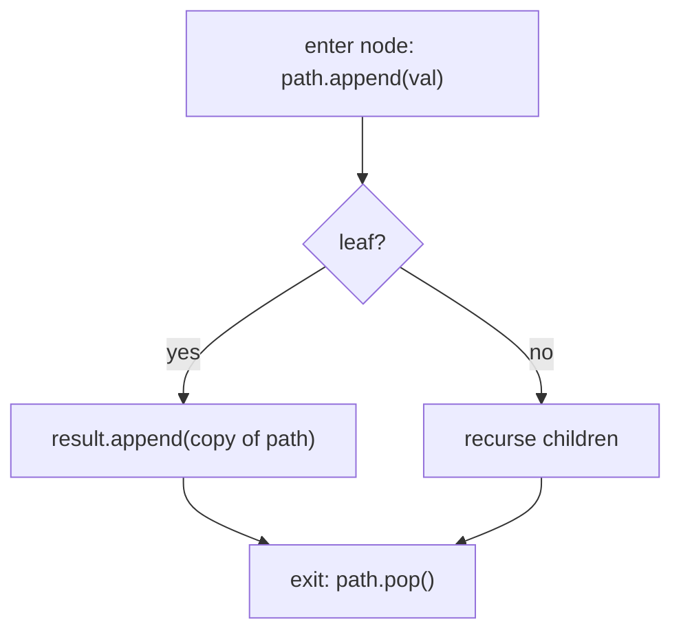

# Pattern: Preorder Traversal (Stateful)

## Why It Exists

[Stateless preorder](/cortex/data-structures-and-algorithms/trees/binary-tree/pattern-preorder-traversal-stateless/pattern) threaded *one value* down as an argument — perfect when each node's answer is self-contained. But some problems must **collect across branches**: "list *all* root-to-leaf paths," "the left/right view of the tree," "are there duplicates on the current path?" A single return value or argument can't accumulate that.

So you keep a **shared mutable accumulator** — typically a `path` list you're building and a `result` collection you're appending to — and maintain the path by **backtracking**: append the node when you enter it, and **undo that append when you leave**. The append/undo discipline keeps the shared `path` showing exactly the current root-to-node prefix, so each branch sees the right context, while `result` accumulates findings across the whole traversal.

## See It Work

Collect every root-to-leaf path. The shared `path` grows on entry and shrinks on exit; each leaf snapshots it into `result`. Run it.

```python run viz=binary-tree viz-root=root
import json
from collections import deque

class TreeNode:
    def __init__(self, val, left=None, right=None):
        self.val = val
        self.left = left
        self.right = right

def all_paths(root):
    result, path = [], []                          # shared accumulators
    def dfs(node):
        if node is None:
            return
        path.append(node.val)                      # ENTER: extend the current path
        if node.left is None and node.right is None:
            result.append(list(path))              # leaf: snapshot a COPY of the path
        else:
            dfs(node.left)
            dfs(node.right)
        path.pop()                                 # EXIT: backtrack (undo the append)
    dfs(root)
    return result

def build_tree(values):              # [1, 2, 3, null, 4] level-order → root
    if not values:
        return None
    root = TreeNode(values[0])
    queue = deque([root])
    i = 1
    while queue and i < len(values):
        node = queue.popleft()
        if i < len(values):
            v = values[i]; i += 1
            if v is not None:
                node.left = TreeNode(v); queue.append(node.left)
        if i < len(values):
            v = values[i]; i += 1
            if v is not None:
                node.right = TreeNode(v); queue.append(node.right)
    return root

root = build_tree(json.loads(input()))   # the test case's level-order values
print(all_paths(root))
```

```java run viz=binary-tree viz-root=root
import java.util.*;

public class Main {
  static class TreeNode {
    int val; TreeNode left, right;
    TreeNode(int val) { this.val = val; }
  }

  static List<List<Integer>> allPaths(TreeNode root) {
    List<List<Integer>> result = new ArrayList<>();
    List<Integer> path = new ArrayList<>();
    dfs(root, path, result);
    return result;
  }

  static void dfs(TreeNode node, List<Integer> path, List<List<Integer>> result) {
    if (node == null) return;
    path.add(node.val);                              // ENTER: extend the current path
    if (node.left == null && node.right == null)
      result.add(new ArrayList<>(path));             // leaf: snapshot a COPY
    else { dfs(node.left, path, result); dfs(node.right, path, result); }
    path.remove(path.size() - 1);                    // EXIT: backtrack (undo the append)
  }

  public static void main(String[] args) {
    Scanner sc = new Scanner(System.in);
    TreeNode root = buildTree(parseIntegerArray(sc.nextLine()));
    System.out.println(allPaths(root));
  }

  static TreeNode buildTree(Integer[] values) {   // [1, 2, 3, null, 4] level-order → root
    if (values.length == 0 || values[0] == null) return null;
    TreeNode root = new TreeNode(values[0]);
    Deque<TreeNode> queue = new ArrayDeque<>();
    queue.add(root);
    int i = 1;
    while (!queue.isEmpty() && i < values.length) {
      TreeNode node = queue.poll();
      if (i < values.length) {
        Integer v = values[i++];
        if (v != null) { node.left = new TreeNode(v); queue.add(node.left); }
      }
      if (i < values.length) {
        Integer v = values[i++];
        if (v != null) { node.right = new TreeNode(v); queue.add(node.right); }
      }
    }
    return root;
  }

  // "[1, 2, null, 4]" → {1, 2, null, 4} — reads the test case's level-order values
  static Integer[] parseIntegerArray(String line) {
    String inner = line.replaceAll("[\\[\\]\\s]", "");
    if (inner.isEmpty()) return new Integer[0];
    String[] parts = inner.split(",");
    Integer[] out = new Integer[parts.length];
    for (int i = 0; i < parts.length; i++)
      out[i] = parts[i].equals("null") ? null : Integer.parseInt(parts[i]);
    return out;
  }
}
```

```testcases
{
  "args": [
    { "id": "root", "label": "root", "type": "tree", "placeholder": "[1, 2, 3, 4, 5, null, 6]" }
  ],
  "cases": [
    { "args": { "root": "[1, 2, 3, 4, 5, null, 6]" }, "expected": "[[1, 2, 4], [1, 2, 5], [1, 3, 6]]" },
    { "args": { "root": "[1, 2, 3]" }, "expected": "[[1, 2], [1, 3]]" },
    { "args": { "root": "[5]" }, "expected": "[[5]]" },
    { "args": { "root": "[]" }, "expected": "[]" }
  ]
}
```

## How It Works

Two shared structures and a strict enter/exit protocol:

1. **Enter** a node → `path.append(node.val)`. Now `path` is the root-to-here prefix.
2. **At a leaf** → record a *copy* (`list(path)`) into `result`. (Copy, not the live list — it's about to change.)
3. **Recurse** into children.
4. **Exit** → `path.pop()`. This *undoes* step 1 so the parent's path is restored before the sibling runs.



<p align="center"><strong>append on enter, snapshot at leaves, pop on exit; the shared <code>path</code> always reflects the current root-to-node prefix, <code>result</code> collects across branches.</strong></p>

The crux is the **matching pop**. Without it, after finishing the left subtree the `path` would still contain the left branch's nodes when the right subtree runs, corrupting every path. The `append`/`pop` pair brackets each node's visit so the shared state is always correct — this is exactly the **backtracking** discipline. The other subtlety: **snapshot a copy** at the leaf; appending the live `path` would store a reference that later `pop`s mutate to `[]`. Cost is `O(n)` to walk plus `O(total path length)` to copy.

### Key Takeaway

Stateful preorder keeps a shared `path` + `result` and brackets each visit with `append` (enter) / `pop` (exit) — the backtracking discipline — while `result` collects across branches. Snapshot a *copy* at leaves. Use it when a problem must gather information from multiple branches, not just compute one value per node.

## Trace It

`all_paths` walking the tree — watch `path` grow and shrink:

| step | node | `path` after | result |
|---|---|---|---|
| enter | `1` | `[1]` | |
| enter | `2` | `[1,2]` | |
| enter | `4` (leaf) | `[1,2,4]` | record `[1,2,4]` |
| exit | `4` | `[1,2]` | |
| enter | `5` (leaf) | `[1,2,5]` | record `[1,2,5]` |
| exit | `5`, then `2` | `[1]` | |
| enter | `3`, `6` (leaf) | `[1,3,6]` | record `[1,3,6]` |

Before you read on: the `path.pop()` on exit is easy to forget. Suppose you *omit* it — you `append` on entry but never pop. The first path `[1,2,4]` would still be recorded correctly. So what exactly goes wrong, and on which path does the bug first appear?

It breaks the moment the traversal **moves to a sibling**. After recording `[1,2,4]` and returning from node `4`, without the pop the shared `path` is still `[1,2,4]`; then visiting `5` appends to give `[1,2,4,5]`, and you'd record that as a "root-to-leaf path" — but `4` isn't an ancestor of `5`. Every path after the first leftmost one would carry stale nodes from previously-finished branches, so the *first* path prints right and the bug hides until you check the second. The `pop` is what severs node `4` from the shared state when you leave it, restoring `[1,2]` so `5` builds the correct `[1,2,5]`. This "every append needs its matching undo on exit" is the heart of backtracking; the stateless pattern sidesteps it entirely by passing a fresh value per call (nothing to undo), which is why you prefer stateless when a single passed-down value suffices and reach for stateful only when you must accumulate across branches.

## Your Turn

Write the reusable all-paths collector — `all_paths(root)` collects every root-to-leaf path into a list of lists. (Follow the `path.append` / `path.pop` discipline; only snapshot a copy at the leaf.)

```python run viz=binary-tree viz-root=root
import json
from collections import deque

class TreeNode:
    def __init__(self, val, left=None, right=None):
        self.val = val
        self.left = left
        self.right = right

def all_paths(root):
    result, path = [], []
    def dfs(node):
        # Your code goes here
        pass
    dfs(root)
    return result

def build_tree(values):              # [1, 2, 3, null, 4] level-order → root
    if not values:
        return None
    root = TreeNode(values[0])
    queue = deque([root])
    i = 1
    while queue and i < len(values):
        node = queue.popleft()
        if i < len(values):
            v = values[i]; i += 1
            if v is not None:
                node.left = TreeNode(v); queue.append(node.left)
        if i < len(values):
            v = values[i]; i += 1
            if v is not None:
                node.right = TreeNode(v); queue.append(node.right)
    return root

root = build_tree(json.loads(input()))   # the test case's level-order values
print(all_paths(root))
```

```java run viz=binary-tree viz-root=root
import java.util.*;

public class Main {
  static class TreeNode {
    int val; TreeNode left, right;
    TreeNode(int val) { this.val = val; }
  }

  static List<List<Integer>> allPaths(TreeNode root) {
    List<List<Integer>> result = new ArrayList<>();
    List<Integer> path = new ArrayList<>();
    dfs(root, path, result);
    return result;
  }

  static void dfs(TreeNode node, List<Integer> path, List<List<Integer>> result) {
    // Your code goes here
  }

  public static void main(String[] args) {
    Scanner sc = new Scanner(System.in);
    TreeNode root = buildTree(parseIntegerArray(sc.nextLine()));
    System.out.println(allPaths(root));
  }

  static TreeNode buildTree(Integer[] values) {   // [1, 2, 3, null, 4] level-order → root
    if (values.length == 0 || values[0] == null) return null;
    TreeNode root = new TreeNode(values[0]);
    Deque<TreeNode> queue = new ArrayDeque<>();
    queue.add(root);
    int i = 1;
    while (!queue.isEmpty() && i < values.length) {
      TreeNode node = queue.poll();
      if (i < values.length) {
        Integer v = values[i++];
        if (v != null) { node.left = new TreeNode(v); queue.add(node.left); }
      }
      if (i < values.length) {
        Integer v = values[i++];
        if (v != null) { node.right = new TreeNode(v); queue.add(node.right); }
      }
    }
    return root;
  }

  // "[1, 2, null, 4]" → {1, 2, null, 4} — reads the test case's level-order values
  static Integer[] parseIntegerArray(String line) {
    String inner = line.replaceAll("[\\[\\]\\s]", "");
    if (inner.isEmpty()) return new Integer[0];
    String[] parts = inner.split(",");
    Integer[] out = new Integer[parts.length];
    for (int i = 0; i < parts.length; i++)
      out[i] = parts[i].equals("null") ? null : Integer.parseInt(parts[i]);
    return out;
  }
}
```

```testcases
{
  "args": [
    { "id": "root", "label": "root", "type": "tree", "placeholder": "[1, 2, 3, 4, 5, null, 6]" }
  ],
  "cases": [
    { "args": { "root": "[1, 2, 3, 4, 5, null, 6]" }, "expected": "[[1, 2, 4], [1, 2, 5], [1, 3, 6]]" },
    { "args": { "root": "[1, 2, 3]" }, "expected": "[[1, 2], [1, 3]]" },
    { "args": { "root": "[5]" }, "expected": "[[5]]" },
    { "args": { "root": "[]" }, "expected": "[]" }
  ]
}
```

<details>
<summary>Editorial</summary>

On entry, append the node's value. At a leaf (no children), snapshot a copy into result — if you store the live `path` reference, later pops empty it. Recurse left then right. On exit, pop unconditionally — this is the backtracking step that restores the parent's prefix before the sibling runs.

```python solution time=O(n) space=O(h)
import json
from collections import deque

class TreeNode:
    def __init__(self, val, left=None, right=None):
        self.val = val
        self.left = left
        self.right = right

def all_paths(root):
    result, path = [], []                          # shared accumulators
    def dfs(node):
        if node is None:
            return
        path.append(node.val)                      # ENTER: extend the current path
        if node.left is None and node.right is None:
            result.append(list(path))              # leaf: snapshot a COPY of the path
        else:
            dfs(node.left)
            dfs(node.right)
        path.pop()                                 # EXIT: backtrack (undo the append)
    dfs(root)
    return result

def build_tree(values):              # [1, 2, 3, null, 4] level-order → root
    if not values:
        return None
    root = TreeNode(values[0])
    queue = deque([root])
    i = 1
    while queue and i < len(values):
        node = queue.popleft()
        if i < len(values):
            v = values[i]; i += 1
            if v is not None:
                node.left = TreeNode(v); queue.append(node.left)
        if i < len(values):
            v = values[i]; i += 1
            if v is not None:
                node.right = TreeNode(v); queue.append(node.right)
    return root

root = build_tree(json.loads(input()))   # the test case's level-order values
print(all_paths(root))
```

```java solution
import java.util.*;

public class Main {
  static class TreeNode {
    int val; TreeNode left, right;
    TreeNode(int val) { this.val = val; }
  }

  static List<List<Integer>> allPaths(TreeNode root) {
    List<List<Integer>> result = new ArrayList<>();
    List<Integer> path = new ArrayList<>();
    dfs(root, path, result);
    return result;
  }

  static void dfs(TreeNode node, List<Integer> path, List<List<Integer>> result) {
    if (node == null) return;
    path.add(node.val);                              // ENTER: extend the current path
    if (node.left == null && node.right == null)
      result.add(new ArrayList<>(path));             // leaf: snapshot a COPY
    else { dfs(node.left, path, result); dfs(node.right, path, result); }
    path.remove(path.size() - 1);                    // EXIT: backtrack (undo the append)
  }

  public static void main(String[] args) {
    Scanner sc = new Scanner(System.in);
    TreeNode root = buildTree(parseIntegerArray(sc.nextLine()));
    System.out.println(allPaths(root));
  }

  static TreeNode buildTree(Integer[] values) {   // [1, 2, 3, null, 4] level-order → root
    if (values.length == 0 || values[0] == null) return null;
    TreeNode root = new TreeNode(values[0]);
    Deque<TreeNode> queue = new ArrayDeque<>();
    queue.add(root);
    int i = 1;
    while (!queue.isEmpty() && i < values.length) {
      TreeNode node = queue.poll();
      if (i < values.length) {
        Integer v = values[i++];
        if (v != null) { node.left = new TreeNode(v); queue.add(node.left); }
      }
      if (i < values.length) {
        Integer v = values[i++];
        if (v != null) { node.right = new TreeNode(v); queue.add(node.right); }
      }
    }
    return root;
  }

  // "[1, 2, null, 4]" → {1, 2, null, 4} — reads the test case's level-order values
  static Integer[] parseIntegerArray(String line) {
    String inner = line.replaceAll("[\\[\\]\\s]", "");
    if (inner.isEmpty()) return new Integer[0];
    String[] parts = inner.split(",");
    Integer[] out = new Integer[parts.length];
    for (int i = 0; i < parts.length; i++)
      out[i] = parts[i].equals("null") ? null : Integer.parseInt(parts[i]);
    return out;
  }
}
```

</details>

## Reflect & Connect

Drill the family in **Practice** — [Duplicates in Path](/cortex/data-structures-and-algorithms/trees/binary-tree/pattern-preorder-traversal-stateful/problems/duplicates-in-path), [Second Minimum](/cortex/data-structures-and-algorithms/trees/binary-tree/pattern-preorder-traversal-stateful/problems/second-minimum), [Left View](/cortex/data-structures-and-algorithms/trees/binary-tree/pattern-preorder-traversal-stateful/problems/left-view), and [Right View](/cortex/data-structures-and-algorithms/trees/binary-tree/pattern-preorder-traversal-stateful/problems/right-view).

Stateful preorder is for *gathering across branches*:

- **The family** — all root-to-leaf paths, on-path duplicates (a shared `set` you add/remove with the same enter/exit discipline), left/right view (record the first node seen at each depth into a shared per-level result), path-with-property collection.
- **Stateful vs stateless** — stateless passes one immutable value down (no cleanup, branch-independent); stateful shares a mutable accumulator and *must* backtrack. Prefer stateless when a single passed-down value answers the question; reach for stateful only to *collect* across branches.
- **Backtracking is the transferable idea** — "append on enter, undo on exit, snapshot at the goal" is the exact skeleton of subset/permutation/combination generation and constraint search. A tree's root-to-leaf paths are the simplest backtracking instance; the same `append`/`pop` discipline scales to those harder problems.

**Prerequisites:** [Preorder Traversal (Stateless)](/cortex/data-structures-and-algorithms/trees/binary-tree/pattern-preorder-traversal-stateless/pattern).
**What's next:** flip direction — combine *children's* results on the way up — [Postorder Traversal (Stateless)](/cortex/data-structures-and-algorithms/trees/binary-tree/pattern-postorder-traversal-stateless/pattern).

## Recall

> **Mnemonic:** *Shared `path` + `result`. ENTER: append. Leaf: snapshot a COPY. EXIT: pop (backtrack). Forget the pop → siblings inherit stale nodes. Copy at the leaf → the live list mutates.*

| | |
|---|---|
| State | shared mutable `path` (current prefix) + `result` (collected) |
| Enter / exit | `path.append(node)` / `path.pop()` — backtracking bracket |
| At a leaf | record a **copy** of `path` into `result` |
| Forget the pop | siblings inherit a finished branch's nodes → wrong paths |
| Family | all paths · tree views · on-path duplicates · path search |

<details>
<summary><strong>Q:</strong> When do you need stateful (not stateless) preorder?</summary>

**A:** When you must collect information across multiple branches (all paths, views), not just compute one value per node.

</details>
<details>
<summary><strong>Q:</strong> What does the `path.pop()` on exit accomplish?</summary>

**A:** It backtracks — undoing the entry append so siblings see the correct root-to-node prefix instead of a finished branch's nodes.

</details>
<details>
<summary><strong>Q:</strong> Why snapshot `list(path)` at a leaf instead of `path`?</summary>

**A:** `path` is shared and mutated by later pops; storing it directly would leave a reference that ends up empty.

</details>
<details>
<summary><strong>Q:</strong> How does this relate to backtracking algorithms?</summary>

**A:** "Append on enter, undo on exit, record at the goal" is the backtracking skeleton — tree paths are its simplest case; subsets/permutations use the same discipline.

</details>

## Sources & Verify

- **CLRS**, *Introduction to Algorithms*, 4th ed., §10.4 — tree traversal; §backtracking-style search.
- **Sedgewick & Wayne**, *Algorithms*, 4th ed., §3.2 — recursive tree processing with accumulation.
- The shared-path backtracking for all-paths/tree-views is the standard stateful-traversal template; both runnable blocks are verified by running (`all_paths ⇒ [[1,2,4],[1,2,5],[1,3,6]]`).
