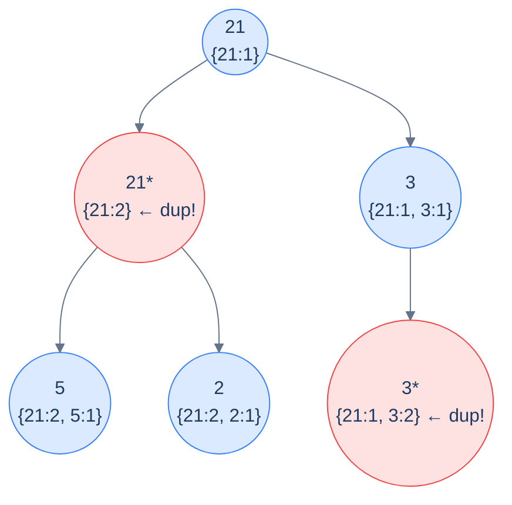

# Problem 1 — Duplicates in path

## Problem Statement

Given the root of a binary tree, return the number of nodes whose root-to-node path contains *another* node with the same value.

This is the canonical push-pop problem. The shared state is a **frequency map**: as we enter a node, increment its value's count; as we leave, decrement (and remove if it hits zero). At each entry, if the value's count was *already non-zero* before the increment, we've found a node whose path contained a duplicate.

## Examples

**Example 1:**
```
Input:  root = [21, 21, 3, 5, 2, null, 3]
Output: 2
```



<p align="center"><strong>Duplicates in path — at every node, check the frequency map: if the current value already has count ≥ 1, we've found a duplicate. Push on entry, pop on exit, count anything that was already there.</strong></p>

**Example 2:**
```
Input:  root = [5, 7, 3, 1, 2, null, 8]
Output: 0
```

## Constraints

- `0 ≤ number of nodes ≤ 10⁴`
- `-10⁴ ≤ node.val ≤ 10⁴`
- Push on entry, pop on exit — `O(n)` time, `O(h)` space

```python run viz=binary-tree viz-root=root
import json
from collections import deque

class TreeNode:
    def __init__(self, val, left=None, right=None):
        self.val = val
        self.left = left
        self.right = right

class Solution:
    def duplicates_in_path(self, root):
        # Your code goes here — use a shared frequency map; before incrementing a
        # node's count, check if it's already ≥ 1 (that's a duplicate). Increment
        # on entry, decrement (and remove if zero) on exit.
        return 0

def build_tree(values):              # [1, 2, 3, null, 4] level-order → root
    if not values:
        return None
    root = TreeNode(values[0])
    queue = deque([root])
    i = 1
    while queue and i < len(values):
        node = queue.popleft()
        if i < len(values):
            v = values[i]; i += 1
            if v is not None:
                node.left = TreeNode(v); queue.append(node.left)
        if i < len(values):
            v = values[i]; i += 1
            if v is not None:
                node.right = TreeNode(v); queue.append(node.right)
    return root

root = build_tree(json.loads(input()))
print(Solution().duplicates_in_path(root))
```

```java run viz=binary-tree viz-root=root
import java.util.*;

public class Main {
    static class TreeNode {
        int val; TreeNode left, right;
        TreeNode(int val) { this.val = val; }
    }

    static class Solution {
        int duplicatesInPath(TreeNode root) {
            // Your code goes here — use a shared frequency map; before incrementing a
            // node's count, check if it's already ≥ 1 (that's a duplicate). Increment
            // on entry, decrement (and remove if zero) on exit.
            return 0;
        }
    }

    public static void main(String[] args) {
        Scanner sc = new Scanner(System.in);
        TreeNode root = buildTree(parseIntegerArray(sc.nextLine()));
        System.out.println(new Solution().duplicatesInPath(root));
    }

    static TreeNode buildTree(Integer[] values) {   // [1, 2, 3, null, 4] level-order → root
        if (values.length == 0 || values[0] == null) return null;
        TreeNode root = new TreeNode(values[0]);
        Deque<TreeNode> queue = new ArrayDeque<>();
        queue.add(root);
        int i = 1;
        while (!queue.isEmpty() && i < values.length) {
            TreeNode node = queue.poll();
            if (i < values.length) {
                Integer v = values[i++];
                if (v != null) { node.left = new TreeNode(v); queue.add(node.left); }
            }
            if (i < values.length) {
                Integer v = values[i++];
                if (v != null) { node.right = new TreeNode(v); queue.add(node.right); }
            }
        }
        return root;
    }

    // "[1, 2, null, 4]" → {1, 2, null, 4} — reads the test case's level-order values
    static Integer[] parseIntegerArray(String line) {
        String inner = line.replaceAll("[\\[\\]\\s]", "");
        if (inner.isEmpty()) return new Integer[0];
        String[] parts = inner.split(",");
        Integer[] out = new Integer[parts.length];
        for (int i = 0; i < parts.length; i++)
            out[i] = parts[i].equals("null") ? null : Integer.parseInt(parts[i]);
        return out;
    }
}
```

```testcases
{
  "args": [
    { "id": "root", "label": "root", "type": "tree", "placeholder": "[21, 21, 3, 5, 2, null, 3]" }
  ],
  "cases": [
    { "args": { "root": "[21, 21, 3, 5, 2, null, 3]" }, "expected": "2" },
    { "args": { "root": "[5, 7, 3, 1, 2, null, 8]" }, "expected": "0" },
    { "args": { "root": "[]" }, "expected": "0" },
    { "args": { "root": "[7]" }, "expected": "0" },
    { "args": { "root": "[1, 1, 1]" }, "expected": "2" },
    { "args": { "root": "[1, 2, 3, 4, 5, 6, 7]" }, "expected": "0" },
    { "args": { "root": "[5, 5, null, 5]" }, "expected": "2" }
  ]
}
```

<details>
<summary><h2>Solution</h2></summary>

Keep a shared `frequency` map and a running `duplicates` counter. On entry to each node: if its value is already in the map (count ≥ 1), increment `duplicates`; then increment the map count. Recurse into both children. On exit: decrement the count; if it reaches zero, remove the key (backtrack). This is the push-pop discipline applied to a count-map instead of a list.

```python solution time=O(n) space=O(h)
import json
from collections import deque

class TreeNode:
    def __init__(self, val, left=None, right=None):
        self.val = val
        self.left = left
        self.right = right

class Solution:
    def __init__(self):
        # Map to track frequency of values in the current root-to-node path
        self.frequency = {}
        # Counter to track how many nodes have duplicates in their path
        self.duplicates = 0

    def helper(self, root):
        # If the root is null, return
        if root is None:
            return
        # Check if the current node's value already exists in the path
        if root.val in self.frequency:
            # If it does, it's a duplicate
            self.duplicates += 1
        # Add the current node's value to the frequency map
        self.frequency[root.val] = self.frequency.get(root.val, 0) + 1
        # Recursively traverse the left and right subtrees
        self.helper(root.left)
        self.helper(root.right)
        # Backtrack: remove the current node's value from the path
        self.frequency[root.val] -= 1
        # If frequency becomes zero, erase the value from the map
        if self.frequency[root.val] == 0:
            del self.frequency[root.val]

    def duplicates_in_path(self, root):
        # If the tree is empty, return 0 as there are no paths
        if root is None:
            return 0
        # Start the helper function from the root
        self.helper(root)
        # Return the total duplicates found
        return self.duplicates

def build_tree(values):              # [1, 2, 3, null, 4] level-order → root
    if not values:
        return None
    root = TreeNode(values[0])
    queue = deque([root])
    i = 1
    while queue and i < len(values):
        node = queue.popleft()
        if i < len(values):
            v = values[i]; i += 1
            if v is not None:
                node.left = TreeNode(v); queue.append(node.left)
        if i < len(values):
            v = values[i]; i += 1
            if v is not None:
                node.right = TreeNode(v); queue.append(node.right)
    return root

root = build_tree(json.loads(input()))
print(Solution().duplicates_in_path(root))
```

```java solution
import java.util.*;

public class Main {
    static class TreeNode {
        int val; TreeNode left, right;
        TreeNode(int val) { this.val = val; }
    }

    static class Solution {
        // Map to track frequency of values in the current root-to-node path
        private Map<Integer, Integer> frequency = new HashMap<>();
        // Counter to track how many nodes have duplicates in their path
        private int duplicates = 0;

        private void helper(TreeNode root) {
            // If the root is null, return
            if (root == null) return;
            // Check if the current node's value already exists in the path
            if (frequency.containsKey(root.val)) {
                // If it does, it's a duplicate
                duplicates++;
            }
            // Add the current node's value to the frequency map
            frequency.put(root.val, frequency.getOrDefault(root.val, 0) + 1);
            // Recursively traverse the left and right subtrees
            helper(root.left);
            helper(root.right);
            // Backtrack: remove the current node's value from the path
            frequency.put(root.val, frequency.get(root.val) - 1);
            // If frequency becomes zero, erase the value from the map
            if (frequency.get(root.val) == 0) {
                frequency.remove(root.val);
            }
        }

        int duplicatesInPath(TreeNode root) {
            // If the tree is empty, return 0 as there are no paths
            if (root == null) return 0;
            // Start the helper function from the root
            helper(root);
            // Return the total duplicates found
            return duplicates;
        }
    }

    public static void main(String[] args) {
        Scanner sc = new Scanner(System.in);
        TreeNode root = buildTree(parseIntegerArray(sc.nextLine()));
        System.out.println(new Solution().duplicatesInPath(root));
    }

    static TreeNode buildTree(Integer[] values) {   // [1, 2, 3, null, 4] level-order → root
        if (values.length == 0 || values[0] == null) return null;
        TreeNode root = new TreeNode(values[0]);
        Deque<TreeNode> queue = new ArrayDeque<>();
        queue.add(root);
        int i = 1;
        while (!queue.isEmpty() && i < values.length) {
            TreeNode node = queue.poll();
            if (i < values.length) {
                Integer v = values[i++];
                if (v != null) { node.left = new TreeNode(v); queue.add(node.left); }
            }
            if (i < values.length) {
                Integer v = values[i++];
                if (v != null) { node.right = new TreeNode(v); queue.add(node.right); }
            }
        }
        return root;
    }

    // "[1, 2, null, 4]" → {1, 2, null, 4} — reads the test case's level-order values
    static Integer[] parseIntegerArray(String line) {
        String inner = line.replaceAll("[\\[\\]\\s]", "");
        if (inner.isEmpty()) return new Integer[0];
        String[] parts = inner.split(",");
        Integer[] out = new Integer[parts.length];
        for (int i = 0; i < parts.length; i++)
            out[i] = parts[i].equals("null") ? null : Integer.parseInt(parts[i]);
        return out;
    }
}
```

</details>
