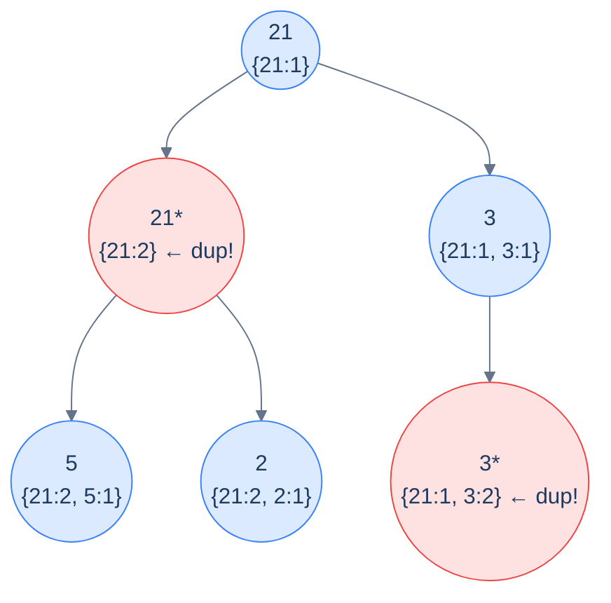

# Problem 1 — Duplicates in path

> Given the root of a binary tree, return the number of nodes whose root-to-node path contains *another* node with the same value.

This is the canonical push-pop problem. The shared state is a **frequency map**: as we enter a node, increment its value's count; as we leave, decrement (and remove if it hits zero). At each entry, if the value's count was *already non-zero* before the increment, we've found a node whose path contained a duplicate.



<p align="center"><strong>Duplicates in path — at every node, check the frequency map: if the current value already has count ≥ 1, we've found a duplicate. Push on entry, pop on exit, count anything that was already there.</strong></p>

<details>
<summary><h2>Solution</h2></summary>


```python run viz=binary-tree viz-root=root
from typing import Optional, Dict
from collections import deque

class TreeNode:
    def __init__(self, val=0, left=None, right=None):
        self.val = val
        self.left = left
        self.right = right


def from_level_order(values):
    """Build tree from list like [1, 2, 3, None, 4]. None means missing child."""
    if not values:
        return None
    root = TreeNode(values[0])
    queue = [root]
    i = 1
    while queue and i < len(values):
        node = queue.pop(0)
        if i < len(values) and values[i] is not None:
            node.left = TreeNode(values[i])
            queue.append(node.left)
        i += 1
        if i < len(values) and values[i] is not None:
            node.right = TreeNode(values[i])
            queue.append(node.right)
        i += 1
    return root


class Solution:
    def __init__(self):

        # Map to track frequency of values in the current root-to-node
        # path
        self.frequency: Dict[int, int] = {}

        # Counter to track how many nodes have duplicates in their path
        self.duplicates: int = 0

    def duplicates_in_path_helper(
        self, root: Optional[TreeNode]
    ) -> None:

        # If the root is null, return
        if root is None:
            return

        # Check if the current node's value already exists in the path
        if root.val in self.frequency:

            # If it does, it's a duplicate
            self.duplicates += 1

        # Add the current node's value to the frequency map
        self.frequency[root.val] = self.frequency.get(root.val, 0) + 1

        # Recursively traverse the left and right subtrees
        self.duplicates_in_path_helper(root.left)
        self.duplicates_in_path_helper(root.right)

        # Backtrack: remove the current node's value from the path
        self.frequency[root.val] -= 1

        # If frequency becomes zero, erase the value from the map
        if self.frequency[root.val] == 0:
            del self.frequency[root.val]

    def duplicates_in_path(self, root: Optional[TreeNode]) -> int:

        # If the tree is empty, return 0 as there are no paths
        if root is None:
            return 0

        # Start the helper function from the root
        self.duplicates_in_path_helper(root)

        # Return the total duplicates found
        return self.duplicates


# Examples from the problem statement
print(Solution().duplicates_in_path(from_level_order([21, 21, 3, 5, 2, None, 3])))  # 2
print(Solution().duplicates_in_path(from_level_order([5, 7, 3, 1, 2, None, 8])))    # 0

# Edge cases
print(Solution().duplicates_in_path(None))                                           # 0
print(Solution().duplicates_in_path(from_level_order([7])))                          # 0
print(Solution().duplicates_in_path(from_level_order([1, 1, 1])))                    # 2
print(Solution().duplicates_in_path(from_level_order([1, 2, 3, 4, 5, 6, 7])))       # 0
print(Solution().duplicates_in_path(from_level_order([5, 5, None, 5])))              # 2
```

```java run viz=binary-tree viz-root=root
import java.util.*;

public class Main {
    static class TreeNode {
        int val;
        TreeNode left;
        TreeNode right;
        TreeNode() {}
        TreeNode(int val) { this.val = val; }
    }

    static TreeNode fromLevelOrder(Integer... values) {
        if (values.length == 0 || values[0] == null) return null;
        TreeNode root = new TreeNode(values[0]);
        java.util.Deque<TreeNode> queue = new java.util.ArrayDeque<>();
        queue.add(root);
        int i = 1;
        while (!queue.isEmpty() && i < values.length) {
            TreeNode node = queue.poll();
            if (i < values.length && values[i] != null) {
                node.left = new TreeNode(values[i]);
                queue.add(node.left);
            }
            i++;
            if (i < values.length && values[i] != null) {
                node.right = new TreeNode(values[i]);
                queue.add(node.right);
            }
            i++;
        }
        return root;
    }

    static class Solution {

        // Map to track frequency of values in the current root-to-node path
        private Map<Integer, Integer> frequency = new HashMap<>();

        // Counter to track how many nodes have duplicates in their path
        private int duplicates = 0;

        private void duplicatesInPathHelper(TreeNode root) {

            // If the root is null, return
            if (root == null) {
                return;
            }

            // Check if the current node's value already exists in the path
            if (frequency.containsKey(root.val)) {

                // If it does, it's a duplicate
                duplicates++;
            }

            // Add the current node's value to the frequency map
            frequency.put(root.val, frequency.getOrDefault(root.val, 0) + 1);

            // Recursively traverse the left and right subtrees
            duplicatesInPathHelper(root.left);
            duplicatesInPathHelper(root.right);

            // Backtrack: remove the current node's value from the path
            frequency.put(root.val, frequency.get(root.val) - 1);

            // If frequency becomes zero, erase the value from the map
            if (frequency.get(root.val) == 0) {
                frequency.remove(root.val);
            }
        }

        public int duplicatesInPath(TreeNode root) {

            // If the tree is empty, return 0 as there are no paths
            if (root == null) {
                return 0;
            }

            // Start the helper function from the root
            duplicatesInPathHelper(root);

            // Return the total duplicates found
            return duplicates;
        }
    }

    public static void main(String[] args) {
        // Examples from the problem statement
        System.out.println(new Solution().duplicatesInPath(fromLevelOrder(21, 21, 3, 5, 2, null, 3)));  // 2
        System.out.println(new Solution().duplicatesInPath(fromLevelOrder(5, 7, 3, 1, 2, null, 8)));    // 0

        // Edge cases
        System.out.println(new Solution().duplicatesInPath(null));                                       // 0
        System.out.println(new Solution().duplicatesInPath(fromLevelOrder(7)));                          // 0
        System.out.println(new Solution().duplicatesInPath(fromLevelOrder(1, 1, 1)));                    // 2
        System.out.println(new Solution().duplicatesInPath(fromLevelOrder(1, 2, 3, 4, 5, 6, 7)));       // 0
        System.out.println(new Solution().duplicatesInPath(fromLevelOrder(5, 5, null, 5)));              // 2
    }
}
```

</details>
