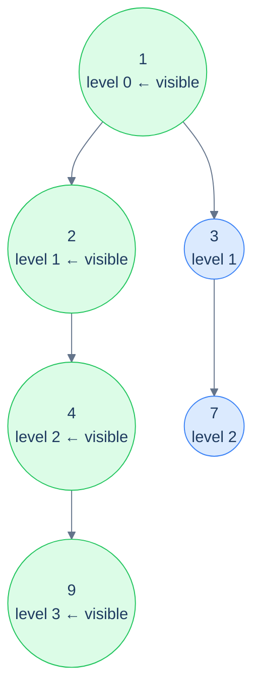

# Problem 3 — Left view

## Problem Statement

Given the root of a binary tree, return the values of the leftmost node *at each level* of the tree, top to bottom.

This is the **visit-order witnesses** flavour. The state is just one integer: `maxLevelReached` — the deepest level we've already added a node from. Recurse into the *left* subtree before the right; whenever the current call's level *equals* `maxLevelReached`, we know we're seeing a *new* level for the first time, so the current node is the leftmost at that level.

## Examples

**Example 1:**
```
Input:  root = [1, 2, 3, 4, null, null, 7, 9]
Output: [1, 2, 4, 9]
```



<p align="center"><strong>Left view — recurse left-first; the first node visited at each new level is the leftmost. The state is a single counter that ratchets forward each time we see a deeper level.</strong></p>

**Example 2:**
```
Input:  root = [1, 8, 4, null, null, 2, 7]
Output: [1, 8, 2]
```

## Constraints

- `0 ≤ number of nodes ≤ 10⁴`
- `-10⁴ ≤ node.val ≤ 10⁴`
- Recurse left before right — the first visit to each level is the leftmost node

```python run viz=binary-tree viz-root=root
import json
from collections import deque

class TreeNode:
    def __init__(self, val, left=None, right=None):
        self.val = val
        self.left = left
        self.right = right

class Solution:
    def left_view(self, root):
        # Your code goes here — track maxLevelReached (shared int). Recurse left
        # before right; when level == maxLevelReached, append root.val and increment.
        return []

def build_tree(values):              # [1, 2, 3, null, 4] level-order → root
    if not values:
        return None
    root = TreeNode(values[0])
    queue = deque([root])
    i = 1
    while queue and i < len(values):
        node = queue.popleft()
        if i < len(values):
            v = values[i]; i += 1
            if v is not None:
                node.left = TreeNode(v); queue.append(node.left)
        if i < len(values):
            v = values[i]; i += 1
            if v is not None:
                node.right = TreeNode(v); queue.append(node.right)
    return root

root = build_tree(json.loads(input()))
print(Solution().left_view(root))
```

```java run viz=binary-tree viz-root=root
import java.util.*;

public class Main {
    static class TreeNode {
        int val; TreeNode left, right;
        TreeNode(int val) { this.val = val; }
    }

    static class Solution {
        List<Integer> leftView(TreeNode root) {
            // Your code goes here — track maxLevelReached (shared int). Recurse left
            // before right; when level == maxLevelReached, add root.val and increment.
            return new ArrayList<>();
        }
    }

    public static void main(String[] args) {
        Scanner sc = new Scanner(System.in);
        TreeNode root = buildTree(parseIntegerArray(sc.nextLine()));
        System.out.println(new Solution().leftView(root));
    }

    static TreeNode buildTree(Integer[] values) {   // [1, 2, 3, null, 4] level-order → root
        if (values.length == 0 || values[0] == null) return null;
        TreeNode root = new TreeNode(values[0]);
        Deque<TreeNode> queue = new ArrayDeque<>();
        queue.add(root);
        int i = 1;
        while (!queue.isEmpty() && i < values.length) {
            TreeNode node = queue.poll();
            if (i < values.length) {
                Integer v = values[i++];
                if (v != null) { node.left = new TreeNode(v); queue.add(node.left); }
            }
            if (i < values.length) {
                Integer v = values[i++];
                if (v != null) { node.right = new TreeNode(v); queue.add(node.right); }
            }
        }
        return root;
    }

    // "[1, 2, null, 4]" → {1, 2, null, 4} — reads the test case's level-order values
    static Integer[] parseIntegerArray(String line) {
        String inner = line.replaceAll("[\\[\\]\\s]", "");
        if (inner.isEmpty()) return new Integer[0];
        String[] parts = inner.split(",");
        Integer[] out = new Integer[parts.length];
        for (int i = 0; i < parts.length; i++)
            out[i] = parts[i].equals("null") ? null : Integer.parseInt(parts[i]);
        return out;
    }
}
```

```testcases
{
  "args": [
    { "id": "root", "label": "root", "type": "tree", "placeholder": "[1, 2, 3, 4, null, null, 7, 9]" }
  ],
  "cases": [
    { "args": { "root": "[1, 2, 3, 4, null, null, 7, 9]" }, "expected": "[1, 2, 4, 9]" },
    { "args": { "root": "[1, 8, 4, null, null, 2, 7]" }, "expected": "[1, 8, 2]" },
    { "args": { "root": "[]" }, "expected": "[]" },
    { "args": { "root": "[5]" }, "expected": "[5]" },
    { "args": { "root": "[1, 2, null, 3]" }, "expected": "[1, 2, 3]" },
    { "args": { "root": "[1, null, 2, null, 3]" }, "expected": "[1, 2, 3]" },
    { "args": { "root": "[1, 2, 3, 4, 5, 6, 7]" }, "expected": "[1, 2, 4]" }
  ]
}
```

<details>
<summary><h2>Solution</h2></summary>

Track a shared `max_level_reached` counter (starts at 0). Recurse left before right. At each node: if `level == max_level_reached`, this is the first (leftmost) node seen at this depth — append its value and increment the counter. The counter ratchets forward so subsequent visits to the same level are skipped. No push/pop needed — `max_level_reached` is a monotone global witness, not a path-local state.

```python solution time=O(n) space=O(h)
import json
from collections import deque

class TreeNode:
    def __init__(self, val, left=None, right=None):
        self.val = val
        self.left = left
        self.right = right

class Solution:
    def __init__(self):
        # Global variable to keep track of the current level during recursion
        self.max_level_reached = 0

    def helper(self, root, level, result):
        if not root:
            return
        # If this is the first node of the current level, add it to result
        if level == self.max_level_reached:
            result.append(root.val)
            # Increment the level after adding the node to result
            self.max_level_reached += 1
        # Recur for left, then right (ensures leftmost nodes are visited first)
        self.helper(root.left, level + 1, result)
        self.helper(root.right, level + 1, result)

    def left_view(self, root):
        # Stores the left view of the binary tree
        result = []
        # Find the left view of the binary tree
        self.helper(root, 0, result)
        # Return the left view of the binary tree
        return result

def build_tree(values):              # [1, 2, 3, null, 4] level-order → root
    if not values:
        return None
    root = TreeNode(values[0])
    queue = deque([root])
    i = 1
    while queue and i < len(values):
        node = queue.popleft()
        if i < len(values):
            v = values[i]; i += 1
            if v is not None:
                node.left = TreeNode(v); queue.append(node.left)
        if i < len(values):
            v = values[i]; i += 1
            if v is not None:
                node.right = TreeNode(v); queue.append(node.right)
    return root

root = build_tree(json.loads(input()))
print(Solution().left_view(root))
```

```java solution
import java.util.*;

public class Main {
    static class TreeNode {
        int val; TreeNode left, right;
        TreeNode(int val) { this.val = val; }
    }

    static class Solution {
        // Global variable to keep track of the current level during recursion
        private int maxLevelReached = 0;

        private void helper(TreeNode root, int level, List<Integer> result) {
            if (root == null) return;
            // If this is the first node of the current level, add it to result
            if (level == maxLevelReached) {
                result.add(root.val);
                // Increment the level after adding the node to result
                maxLevelReached++;
            }
            // Recur for left, then right (ensures leftmost nodes are visited first)
            helper(root.left, level + 1, result);
            helper(root.right, level + 1, result);
        }

        List<Integer> leftView(TreeNode root) {
            // Stores the left view of the binary tree
            List<Integer> result = new ArrayList<>();
            // Find the left view of the binary tree
            helper(root, 0, result);
            // Return the left view of the binary tree
            return result;
        }
    }

    public static void main(String[] args) {
        Scanner sc = new Scanner(System.in);
        TreeNode root = buildTree(parseIntegerArray(sc.nextLine()));
        System.out.println(new Solution().leftView(root));
    }

    static TreeNode buildTree(Integer[] values) {   // [1, 2, 3, null, 4] level-order → root
        if (values.length == 0 || values[0] == null) return null;
        TreeNode root = new TreeNode(values[0]);
        Deque<TreeNode> queue = new ArrayDeque<>();
        queue.add(root);
        int i = 1;
        while (!queue.isEmpty() && i < values.length) {
            TreeNode node = queue.poll();
            if (i < values.length) {
                Integer v = values[i++];
                if (v != null) { node.left = new TreeNode(v); queue.add(node.left); }
            }
            if (i < values.length) {
                Integer v = values[i++];
                if (v != null) { node.right = new TreeNode(v); queue.add(node.right); }
            }
        }
        return root;
    }

    // "[1, 2, null, 4]" → {1, 2, null, 4} — reads the test case's level-order values
    static Integer[] parseIntegerArray(String line) {
        String inner = line.replaceAll("[\\[\\]\\s]", "");
        if (inner.isEmpty()) return new Integer[0];
        String[] parts = inner.split(",");
        Integer[] out = new Integer[parts.length];
        for (int i = 0; i < parts.length; i++)
            out[i] = parts[i].equals("null") ? null : Integer.parseInt(parts[i]);
        return out;
    }
}
```

</details>
