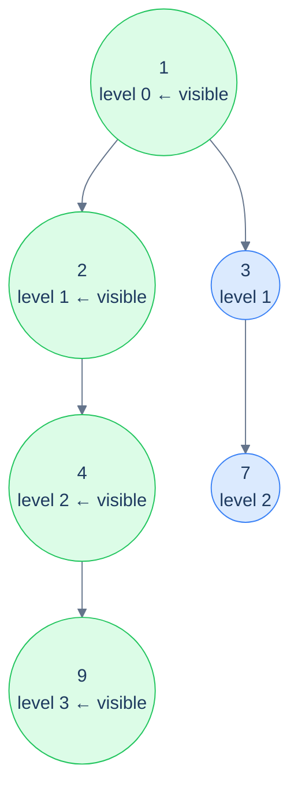

# Problem 3 — Left view

> Given the root of a binary tree, return the values of the leftmost node *at each level* of the tree, top to bottom.
>
> **Example:** tree `[1, 2, 3, 4, null, null, 7, 9]` → `[1, 2, 4, 9]`.

This is the **visit-order witnesses** flavour. The state is just one integer: `maxLevelReached` — the deepest level we've already added a node from. Recurse into the *left* subtree before the right; whenever the current call's level *equals* `maxLevelReached`, we know we're seeing a *new* level for the first time, so the current node is the leftmost at that level.



<p align="center"><strong>Left view — recurse left-first; the first node visited at each new level is the leftmost. The state is a single counter that ratchets forward each time we see a deeper level.</strong></p>

<details>
<summary><h2>Solution</h2></summary>


```python run viz=binary-tree viz-root=root
from typing import List, Optional

class TreeNode:
    def __init__(self, val=0, left=None, right=None):
        self.val = val
        self.left = left
        self.right = right


def from_level_order(values):
    """Build tree from list like [1, 2, 3, None, 4]. None means missing child."""
    if not values:
        return None
    root = TreeNode(values[0])
    queue = [root]
    i = 1
    while queue and i < len(values):
        node = queue.pop(0)
        if i < len(values) and values[i] is not None:
            node.left = TreeNode(values[i])
            queue.append(node.left)
        i += 1
        if i < len(values) and values[i] is not None:
            node.right = TreeNode(values[i])
            queue.append(node.right)
        i += 1
    return root


class Solution:
    def __init__(self):

        # Global variable to keep track of the current level during
        # recursion
        self.max_level_reached = 0

    def left_view_helper(
        self, root: Optional[TreeNode], level: int, result: List[int]
    ) -> None:
        if not root:
            return

        # If this is the first node of the current level, add it to
        # result
        if level == self.max_level_reached:
            result.append(root.val)

            # Increment the level after adding the node to result
            self.max_level_reached += 1

        # Recur for left, then right (ensures leftmost nodes are visited
        # first)
        self.left_view_helper(root.left, level + 1, result)
        self.left_view_helper(root.right, level + 1, result)

    def left_view(self, root: Optional[TreeNode]) -> List[int]:

        # Stores the left view of the binary tree
        result = []

        # Find the left view of the binary tree
        self.left_view_helper(root, 0, result)

        # Return the left view of the binary tree
        return result


# Examples from the problem statement
print(Solution().left_view(from_level_order([1, 2, 3, 4, None, None, 7, 9])))  # [1, 2, 4, 9]
print(Solution().left_view(from_level_order([1, 8, 4, None, None, 2, 7])))     # [1, 8, 2]

# Edge cases
print(Solution().left_view(None))                                                # []
print(Solution().left_view(from_level_order([5])))                               # [5]
print(Solution().left_view(from_level_order([1, 2, None, 3])))                   # [1, 2, 3] (left-skew)
print(Solution().left_view(from_level_order([1, None, 2, None, 3])))             # [1, 2, 3] (right-skew)
print(Solution().left_view(from_level_order([1, 2, 3, 4, 5, 6, 7])))            # [1, 2, 4]
```

```java run viz=binary-tree viz-root=root
import java.util.*;

public class Main {
    static class TreeNode {
        int val;
        TreeNode left;
        TreeNode right;
        TreeNode() {}
        TreeNode(int val) { this.val = val; }
    }

    static TreeNode fromLevelOrder(Integer... values) {
        if (values.length == 0 || values[0] == null) return null;
        TreeNode root = new TreeNode(values[0]);
        java.util.Deque<TreeNode> queue = new java.util.ArrayDeque<>();
        queue.add(root);
        int i = 1;
        while (!queue.isEmpty() && i < values.length) {
            TreeNode node = queue.poll();
            if (i < values.length && values[i] != null) {
                node.left = new TreeNode(values[i]);
                queue.add(node.left);
            }
            i++;
            if (i < values.length && values[i] != null) {
                node.right = new TreeNode(values[i]);
                queue.add(node.right);
            }
            i++;
        }
        return root;
    }

    static class Solution {

        // Global variable to keep track of the current level during
        // recursion
        private int maxLevelReached = 0;

        private void lefViewHelper(
            TreeNode root,
            int level,
            List<Integer> result
        ) {
            if (root == null) {
                return;
            }

            // If this is the first node of the current level, add it to
            // result
            if (level == maxLevelReached) {
                result.add(root.val);

                // Increment the level after adding the node to result
                maxLevelReached++;
            }

            // Recur for left, then right (ensures leftmost nodes are visited
            // first)
            lefViewHelper(root.left, level + 1, result);
            lefViewHelper(root.right, level + 1, result);
        }

        public List<Integer> leftView(TreeNode root) {

            // Stores the left view of the binary tree
            List<Integer> result = new ArrayList<>();

            // Find the left view of the binary tree
            lefViewHelper(root, 0, result);

            // Return the left view of the binary tree
            return result;
        }
    }

    public static void main(String[] args) {
        // Examples from the problem statement
        System.out.println(new Solution().leftView(fromLevelOrder(1, 2, 3, 4, null, null, 7, 9)));  // [1, 2, 4, 9]
        System.out.println(new Solution().leftView(fromLevelOrder(1, 8, 4, null, null, 2, 7)));     // [1, 8, 2]

        // Edge cases
        System.out.println(new Solution().leftView(null));                                           // []
        System.out.println(new Solution().leftView(fromLevelOrder(5)));                              // [5]
        System.out.println(new Solution().leftView(fromLevelOrder(1, 2, null, 3)));                  // [1, 2, 3] (left-skew)
        System.out.println(new Solution().leftView(fromLevelOrder(1, null, 2, null, 3)));            // [1, 2, 3] (right-skew)
        System.out.println(new Solution().leftView(fromLevelOrder(1, 2, 3, 4, 5, 6, 7)));           // [1, 2, 4]
    }
}
```

</details>
