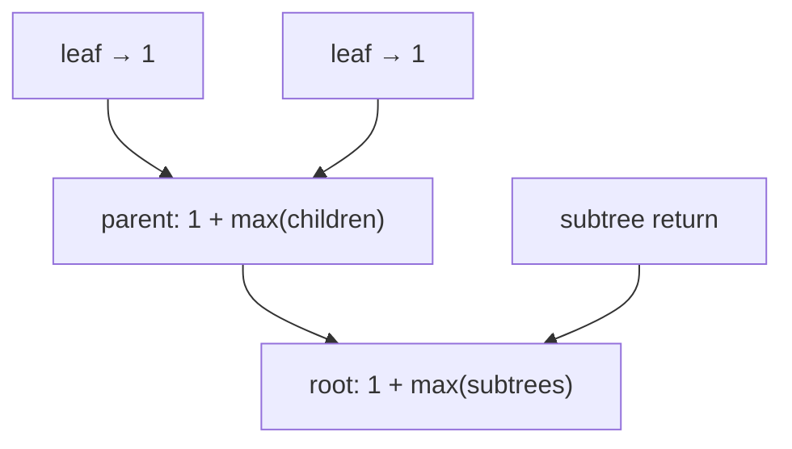

# Pattern: Postorder Traversal (Stateless)

## Why It Exists

[Preorder](/cortex/data-structures-and-algorithms/trees-binary-tree-pattern-preorder-traversal-stateless-pattern) pushed context *down* — for problems where a node depends on its **ancestors**. The mirror question is just as common: a node's answer depends on its **children**. A node's height is `1 + max(child heights)`; its subtree sum is `node + left sum + right sum`; "is my subtree balanced/full/perfect?" depends entirely on what the subtrees report.

**Postorder** (left, right, *then* node) is the shape: solve both children *first*, then synthesize the node's answer from their returned values. Each call **returns a value up** the tree — bottom-up, with no shared accumulator (so it's "stateless": a node's result is a pure function of its children's results). It's the workhorse for any aggregate or structural property of a subtree.

## See It Work

Compute a tree's **height** bottom-up: a leaf is height 1, and every node is `1 + max(child heights)`. Run it.

```python run viz=binary-tree viz-root=root
class TreeNode:
    def __init__(self, val, left=None, right=None):
        self.val = val
        self.left = left
        self.right = right

def height(node):
    if node is None:
        return 0                                   # empty subtree contributes height 0
    left = height(node.left)                        # solve children FIRST
    right = height(node.right)
    return 1 + max(left, right)                     # then synthesize this node's answer

root = TreeNode(1, TreeNode(2, TreeNode(4), TreeNode(5)), TreeNode(3, None, TreeNode(6)))
print(height(root))     # 3
```

## How It Works

Three steps, children before parent:

1. **Base case** — an empty subtree returns the identity for the aggregate (height `0`, sum `0`, count `0`).
2. **Recurse both children** — get their returned results *first*.
3. **Combine** into this node's result and **return it up** (`1 + max(l, r)` for height; `node.val + l + r` for sum; a boolean-and for structural checks).



<p align="center"><strong>results bubble up: leaves return first, each parent synthesizes from its children's returns, the root's return is the answer.</strong></p>

The defining property: information flows **only upward**, via the return value — the opposite of preorder's downward argument. There's no shared state, so each subtree's computation is independent and the node just folds its children's answers. When a node needs **more than one fact** from each child, **return a tuple**: e.g. `is_balanced` returns the height *and* whether the subtree is balanced (often encoded as "height, or `-1` if unbalanced") so the parent can check `|left − right| ≤ 1` and propagate. Cost is `O(n)` (each node folded once), `O(h)` stack.

### Key Takeaway

Postorder-stateless solves children first, then returns a value synthesized from them — bottom-up, no shared state. It's the template for subtree aggregates (height, sum, count) and structural checks (balanced/full/perfect); return a *tuple* when the parent needs several facts from each child.

## Trace It

`height(root)` folds from the leaves up:

| node | left height | right height | returns |
|---|---|---|---|
| `4`, `5`, `6` (leaves) | 0 | 0 | `1` |
| `2` | `1` | `1` | `2` |
| `3` | `0` (no left) | `1` | `2` |
| `1` (root) | `2` | `2` | `3` |

Before you read on: checking if a tree is **balanced** (every node's subtree heights differ by ≤ 1) can be written two ways. The naive way calls `height()` *inside* a separate `is_balanced()` check at every node. The good way has *one* postorder pass return "the height, or `−1` if already unbalanced." Why is the naive version `O(n²)` while the single-tuple postorder is `O(n)`?

Because the naive version **recomputes heights redundantly**. `is_balanced(node)` calls `height(node.left)` and `height(node.right)` — each an `O(n)` walk of that subtree — and then recurses `is_balanced` into those same subtrees, which call `height` again on *their* children, and so on. The top node's subtrees get their heights computed once for the top check, then again (in pieces) for every descendant's check — the classic "compute-an-aggregate-inside-a-recursion" trap that sums to `O(n²)` (it's the same recurrence as a naive tree-height-per-node). The single-pass version returns *both* facts at once — "here is my height, and `−1` signals I'm already unbalanced" — so each node is visited exactly once and its height is computed exactly once, folding up in `O(n)`. The lesson: **when a node needs multiple things from each child, compute them in one bottom-up pass and return a tuple**, rather than calling a helper that re-walks the subtree. Spotting the redundant re-traversal is what turns the obvious `O(n²)` into `O(n)` — and it's why postorder + a tuple return is the idiomatic shape for balanced/diameter/longest-path problems.

## Your Turn

Height plus the single-pass balanced check (tuple/sentinel return):

```python run viz=binary-tree viz-root=root
class TreeNode:
    def __init__(self, val, left=None, right=None):
        self.val = val; self.left = left; self.right = right

def height(node):
    if node is None: return 0
    return 1 + max(height(node.left), height(node.right))

def is_balanced(root):
    def h(n):                              # returns height, or -1 if any subtree unbalanced
        if n is None: return 0
        lh = h(n.left)
        if lh == -1: return -1
        rh = h(n.right)
        if rh == -1 or abs(lh - rh) > 1: return -1
        return 1 + max(lh, rh)
    return h(root) != -1

root = TreeNode(1, TreeNode(2, TreeNode(4), TreeNode(5)), TreeNode(3, None, TreeNode(6)))
skew = TreeNode(1, TreeNode(2, TreeNode(3)))
print(height(root), is_balanced(root), is_balanced(skew))   # 3 True False
```

```java run viz=binary-tree viz-root=root
public class Main {
  static class TreeNode { int val; TreeNode left, right; TreeNode(int v){ val = v; } TreeNode(int v, TreeNode l, TreeNode r){ val=v; left=l; right=r; } }

  static int height(TreeNode n) {
    if (n == null) return 0;
    return 1 + Math.max(height(n.left), height(n.right));
  }
  static int balancedHeight(TreeNode n) {       // height, or -1 if unbalanced
    if (n == null) return 0;
    int lh = balancedHeight(n.left);
    if (lh == -1) return -1;
    int rh = balancedHeight(n.right);
    if (rh == -1 || Math.abs(lh - rh) > 1) return -1;
    return 1 + Math.max(lh, rh);
  }
  public static void main(String[] args) {
    TreeNode root = new TreeNode(1, new TreeNode(2, new TreeNode(4), new TreeNode(5)),
                                    new TreeNode(3, null, new TreeNode(6)));
    System.out.println(height(root) + " " + (balancedHeight(root) != -1));   // 3 true
  }
}
```

Drill the family in **Practice** — [Sum of Leaves](/cortex/data-structures-and-algorithms/trees-binary-tree-pattern-postorder-traversal-stateless-problems-sum-of-leaves), [Height of a Binary Tree](/cortex/data-structures-and-algorithms/trees-binary-tree-pattern-postorder-traversal-stateless-problems-height-of-a-binary-tree), [Maximum Root-to-Leaf Path Sum](/cortex/data-structures-and-algorithms/trees-binary-tree-pattern-postorder-traversal-stateless-problems-maximum-root-to-leaf-path-sum), and [Is It a Full Binary Tree](/cortex/data-structures-and-algorithms/trees-binary-tree-pattern-postorder-traversal-stateless-problems-is-it-a-full-binary-tree).

## Reflect & Connect

Postorder-stateless is the "my answer depends on my children" template:

- **The family** — height, subtree sum, node count, is-balanced, is-full/perfect, and **diameter** (return height, track the best left-height + right-height seen). Each folds children's returns into the node's.
- **Return a tuple for multi-fact** — when a node needs several things from each child (balanced needs height *and* a balance flag; diameter needs height *and* the running best), return them together in one pass instead of re-walking subtrees — the `O(n)` vs `O(n²)` difference.
- **It's the mirror of [preorder](/cortex/data-structures-and-algorithms/trees-binary-tree-pattern-preorder-traversal-stateless-pattern)** — preorder pushes context *down* (ancestors → node), postorder folds results *up* (children → node). Many problems combine both: pass context down *and* aggregate up — the general recursive-tree DP. When a node needs child results, reach for postorder.

**Prerequisites:** [Recursive Traversals in Binary Trees](/cortex/data-structures-and-algorithms/trees-binary-tree-recursive-traversals-in-binary-trees).
**What's next:** bottom-up with a shared accumulator that survives across subtrees — [Postorder Traversal (Stateful)](/cortex/data-structures-and-algorithms/trees-binary-tree-pattern-postorder-traversal-stateful-pattern).

## Recall

> **Mnemonic:** *Children first, then the node. Each call returns a value folded from its children (`1 + max` for height, `l + r + val` for sum). Bottom-up, no shared state. Multi-fact → return a tuple (one pass, not O(n²)).*

| | |
|---|---|
| Shape | postorder (left, right, then node); return a value up |
| Flow | child → parent only (bottom-up) |
| Combine | `result = fold(left_result, right_result, node)` |
| Multi-fact | return a tuple/sentinel (e.g. height-or-`-1` for balanced) — one pass |
| Family | height, sum, count, balanced, full/perfect, diameter |

<details>
<summary><strong>Q:</strong> When do you use bottom-up postorder?</summary>

**A:** When a node's answer depends on its children's results (height, subtree sum, balanced/full checks, diameter).

</details>
<details>
<summary><strong>Q:</strong> How does information flow, versus preorder?</summary>

**A:** Upward via the return value (children → node), the opposite of preorder's downward argument.

</details>
<details>
<summary><strong>Q:</strong> Why return a tuple?</summary>

**A:** When a node needs several facts from each child, computing them in one pass and returning them together avoids re-walking subtrees (`O(n)` vs `O(n²)`).

</details>
<details>
<summary><strong>Q:</strong> Why is the naive `is_balanced` `O(n²)`?</summary>

**A:** It calls `height()` (an `O(n)` walk) at every node; the single-pass version returns height-and-balance together, visiting each node once.

</details>

## Sources & Verify

- **CLRS**, *Introduction to Algorithms*, 4th ed., §10.4 — postorder traversal; recursive subtree computations.
- **Sedgewick & Wayne**, *Algorithms*, 4th ed., §3.2 — recursive tree aggregates (size, height).
- Bottom-up height/balance (and the single-pass tuple-return optimization) is the standard postorder template; both runnable blocks are verified by running (`height ⇒ 3`, `is_balanced ⇒ True`, skewed `⇒ False`).
