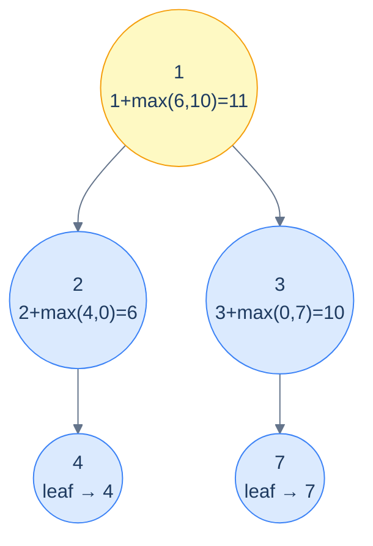

# Maximum Root-to-Leaf Path Sum

## Problem Statement

Compute the **largest sum** among all root-to-leaf paths.

Base case: empty tree contributes 0 (so the recursion at a single-child node still works). Leaf returns its own value. Internal node returns `node.val + max(maxPathSum(left), maxPathSum(right))`.

## Examples

**Example 1:**
```
Input:  root = [1, 2, 3, 4, null, null, 7]
Output: 11
```

**Example 2:**
```
Input:  root = [1, 8, 4, null, null, 2, 7]
Output: 12
```



<p align="center"><strong>Max path sum — each node returns <em>its own value plus the better of the two subtree answers</em>. Empty subtrees contribute 0; the recursion bubbles the maximum up to the root.</strong></p>

## Constraints

- `0 ≤ number of nodes ≤ 10⁴`
- `-10⁴ ≤ node.val ≤ 10⁴`
- `O(n)` time, `O(h)` recursion stack

```python run viz=binary-tree viz-root=root
import json
from collections import deque

class TreeNode:
    def __init__(self, val, left=None, right=None):
        self.val = val
        self.left = left
        self.right = right

class Solution:
    def maximum_path_sum(self, root):
        # Your code goes here — base case None → 0;
        # otherwise root.val + max(maximum_path_sum(left), maximum_path_sum(right))
        return 0

def build_tree(values):              # [1, 2, 3, null, 4] level-order → root
    if not values:
        return None
    root = TreeNode(values[0])
    queue = deque([root])
    i = 1
    while queue and i < len(values):
        node = queue.popleft()
        if i < len(values):
            v = values[i]; i += 1
            if v is not None:
                node.left = TreeNode(v); queue.append(node.left)
        if i < len(values):
            v = values[i]; i += 1
            if v is not None:
                node.right = TreeNode(v); queue.append(node.right)
    return root

root = build_tree(json.loads(input()))   # the test case's level-order values
print(Solution().maximum_path_sum(root))
```

```java run viz=binary-tree viz-root=root
import java.util.*;

public class Main {
    static class TreeNode {
        int val; TreeNode left, right;
        TreeNode(int val) { this.val = val; }
    }

    static class Solution {
        int maximumPathSum(TreeNode root) {
            // Your code goes here — base case null → 0;
            // otherwise root.val + Math.max(maximumPathSum(left), maximumPathSum(right))
            return 0;
        }
    }

    public static void main(String[] args) {
        Scanner sc = new Scanner(System.in);
        TreeNode root = buildTree(parseIntegerArray(sc.nextLine()));
        System.out.println(new Solution().maximumPathSum(root));
    }

    static TreeNode buildTree(Integer[] values) {   // [1, 2, 3, null, 4] level-order → root
        if (values.length == 0 || values[0] == null) return null;
        TreeNode root = new TreeNode(values[0]);
        Deque<TreeNode> queue = new ArrayDeque<>();
        queue.add(root);
        int i = 1;
        while (!queue.isEmpty() && i < values.length) {
            TreeNode node = queue.poll();
            if (i < values.length) {
                Integer v = values[i++];
                if (v != null) { node.left = new TreeNode(v); queue.add(node.left); }
            }
            if (i < values.length) {
                Integer v = values[i++];
                if (v != null) { node.right = new TreeNode(v); queue.add(node.right); }
            }
        }
        return root;
    }

    // "[1, 2, null, 4]" → {1, 2, null, 4} — reads the test case's level-order values
    static Integer[] parseIntegerArray(String line) {
        String inner = line.replaceAll("[\\[\\]\\s]", "");
        if (inner.isEmpty()) return new Integer[0];
        String[] parts = inner.split(",");
        Integer[] out = new Integer[parts.length];
        for (int i = 0; i < parts.length; i++)
            out[i] = parts[i].equals("null") ? null : Integer.parseInt(parts[i]);
        return out;
    }
}
```

```testcases
{
  "args": [
    { "id": "root", "label": "root", "type": "tree", "placeholder": "[1, 2, 3, 4, null, null, 7]" }
  ],
  "cases": [
    { "args": { "root": "[1, 2, 3, 4, null, null, 7]" }, "expected": "11" },
    { "args": { "root": "[1, 8, 4, null, null, 2, 7]" }, "expected": "12" },
    { "args": { "root": "[]" }, "expected": "0" },
    { "args": { "root": "[5]" }, "expected": "5" },
    { "args": { "root": "[1, 2, null, 3]" }, "expected": "6" },
    { "args": { "root": "[1, null, 2, null, 3]" }, "expected": "6" },
    { "args": { "root": "[1, 2, 3]" }, "expected": "4" },
    { "args": { "root": "[10, 5, 20, 3, 7]" }, "expected": "30" }
  ]
}
```

<details>
<summary><h2>Solution</h2></summary>

A single bottom-up recursion: an empty subtree contributes 0; each node returns `node.val + max(left result, right result)`. The "empty → 0" base case handles single-child nodes cleanly — the missing child contributes 0, so `max(child, 0)` just picks the real child.

```python solution time=O(n) space=O(h)
import json
from collections import deque

class TreeNode:
    def __init__(self, val, left=None, right=None):
        self.val = val
        self.left = left
        self.right = right

class Solution:
    def maximum_path_sum(self, root):
        if root is None:

            # Empty tree
            return 0

        # Recursive calls to calculate the maximum sum of left and
        # right subtrees
        left_sum = self.maximum_path_sum(root.left)
        right_sum = self.maximum_path_sum(root.right)

        # Return the maximum sum of root-to-leaf paths
        return root.val + max(left_sum, right_sum)

def build_tree(values):              # [1, 2, 3, null, 4] level-order → root
    if not values:
        return None
    root = TreeNode(values[0])
    queue = deque([root])
    i = 1
    while queue and i < len(values):
        node = queue.popleft()
        if i < len(values):
            v = values[i]; i += 1
            if v is not None:
                node.left = TreeNode(v); queue.append(node.left)
        if i < len(values):
            v = values[i]; i += 1
            if v is not None:
                node.right = TreeNode(v); queue.append(node.right)
    return root

root = build_tree(json.loads(input()))   # the test case's level-order values
print(Solution().maximum_path_sum(root))
```

```java solution
import java.util.*;

public class Main {
    static class TreeNode {
        int val; TreeNode left, right;
        TreeNode(int val) { this.val = val; }
    }

    static class Solution {
        int maximumPathSum(TreeNode root) {

            // Empty tree
            if (root == null) {
                return 0;
            }

            // Recursive calls to calculate the maximum sum of left and
            // right subtrees
            int leftSum = maximumPathSum(root.left);
            int rightSum = maximumPathSum(root.right);

            // Return the maximum sum of root-to-leaf paths
            return root.val + Math.max(leftSum, rightSum);
        }
    }

    public static void main(String[] args) {
        Scanner sc = new Scanner(System.in);
        TreeNode root = buildTree(parseIntegerArray(sc.nextLine()));
        System.out.println(new Solution().maximumPathSum(root));
    }

    static TreeNode buildTree(Integer[] values) {   // [1, 2, 3, null, 4] level-order → root
        if (values.length == 0 || values[0] == null) return null;
        TreeNode root = new TreeNode(values[0]);
        Deque<TreeNode> queue = new ArrayDeque<>();
        queue.add(root);
        int i = 1;
        while (!queue.isEmpty() && i < values.length) {
            TreeNode node = queue.poll();
            if (i < values.length) {
                Integer v = values[i++];
                if (v != null) { node.left = new TreeNode(v); queue.add(node.left); }
            }
            if (i < values.length) {
                Integer v = values[i++];
                if (v != null) { node.right = new TreeNode(v); queue.add(node.right); }
            }
        }
        return root;
    }

    // "[1, 2, null, 4]" → {1, 2, null, 4} — reads the test case's level-order values
    static Integer[] parseIntegerArray(String line) {
        String inner = line.replaceAll("[\\[\\]\\s]", "");
        if (inner.isEmpty()) return new Integer[0];
        String[] parts = inner.split(",");
        Integer[] out = new Integer[parts.length];
        for (int i = 0; i < parts.length; i++)
            out[i] = parts[i].equals("null") ? null : Integer.parseInt(parts[i]);
        return out;
    }
}
```

</details>
