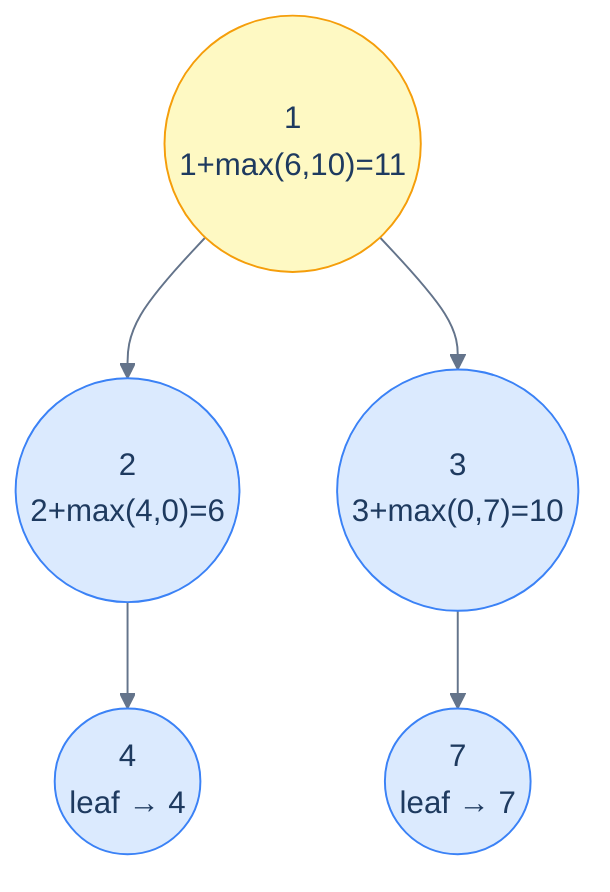

# Problem 3 — Maximum root-to-leaf path sum

> Compute the largest sum among all root-to-leaf paths.

Base case: empty tree contributes 0 (so the recursion at a single-child node still works). Leaf returns its own value. Internal node returns `node.val + max(maxPathSum(left), maxPathSum(right))`.



<p align="center"><strong>Max path sum — each node returns <em>its own value plus the better of the two subtree answers</em>. Empty subtrees contribute 0; the recursion bubbles the maximum up to the root.</strong></p>

<details>
<summary><h2>Solution</h2></summary>


```python run viz=binary-tree viz-root=root
from typing import Optional

class TreeNode:
    def __init__(self, val=0, left=None, right=None):
        self.val = val
        self.left = left
        self.right = right


def from_level_order(values):
    """Build tree from list like [1, 2, 3, None, 4]. None means missing child."""
    if not values:
        return None
    root = TreeNode(values[0])
    queue = [root]
    i = 1
    while queue and i < len(values):
        node = queue.pop(0)
        if i < len(values) and values[i] is not None:
            node.left = TreeNode(values[i])
            queue.append(node.left)
        i += 1
        if i < len(values) and values[i] is not None:
            node.right = TreeNode(values[i])
            queue.append(node.right)
        i += 1
    return root


class Solution:
    def maximum_path_sum(self, root: Optional[TreeNode]) -> int:
        if root is None:

            # Empty tree
            return 0

        # Recursive calls to calculate the maximum sum of left and
        # right subtrees
        left_sum: int = self.maximum_path_sum(root.left)
        right_sum: int = self.maximum_path_sum(root.right)

        # Return the maximum sum of root-to-leaf paths
        return root.val + max(left_sum, right_sum)


# Examples from the problem statement
print(Solution().maximum_path_sum(from_level_order([1, 2, 3, 4, None, None, 7])))  # 11
print(Solution().maximum_path_sum(from_level_order([1, 8, 4, None, None, 2, 7])))  # 12

# Edge cases
print(Solution().maximum_path_sum(None))                                             # 0
print(Solution().maximum_path_sum(from_level_order([5])))                            # 5
print(Solution().maximum_path_sum(from_level_order([1, 2, None, 3])))                # 6 (left-skew)
print(Solution().maximum_path_sum(from_level_order([1, None, 2, None, 3])))          # 6 (right-skew)
print(Solution().maximum_path_sum(from_level_order([1, 2, 3])))                      # 4
print(Solution().maximum_path_sum(from_level_order([10, 5, 20, 3, 7])))              # 30
```

```java run viz=binary-tree viz-root=root
import java.util.*;

public class Main {
    static class TreeNode {
        int val;
        TreeNode left;
        TreeNode right;
        TreeNode() {}
        TreeNode(int val) { this.val = val; }
    }

    static TreeNode fromLevelOrder(Integer... values) {
        if (values.length == 0 || values[0] == null) return null;
        TreeNode root = new TreeNode(values[0]);
        java.util.Deque<TreeNode> queue = new java.util.ArrayDeque<>();
        queue.add(root);
        int i = 1;
        while (!queue.isEmpty() && i < values.length) {
            TreeNode node = queue.poll();
            if (i < values.length && values[i] != null) {
                node.left = new TreeNode(values[i]);
                queue.add(node.left);
            }
            i++;
            if (i < values.length && values[i] != null) {
                node.right = new TreeNode(values[i]);
                queue.add(node.right);
            }
            i++;
        }
        return root;
    }

    static class Solution {
        public int maximumPathSum(TreeNode root) {

            // Empty tree
            if (root == null) {
                return 0;
            }

            // Recursive calls to calculate the maximum sum of left and
            // right subtrees
            int leftSum = maximumPathSum(root.left);
            int rightSum = maximumPathSum(root.right);

            // Return the maximum sum of root-to-leaf paths
            return root.val + Math.max(leftSum, rightSum);
        }
    }

    public static void main(String[] args) {
        // Examples from the problem statement
        System.out.println(new Solution().maximumPathSum(fromLevelOrder(1, 2, 3, 4, null, null, 7)));  // 11
        System.out.println(new Solution().maximumPathSum(fromLevelOrder(1, 8, 4, null, null, 2, 7)));  // 12

        // Edge cases
        System.out.println(new Solution().maximumPathSum(null));                                        // 0
        System.out.println(new Solution().maximumPathSum(fromLevelOrder(5)));                           // 5
        System.out.println(new Solution().maximumPathSum(fromLevelOrder(1, 2, null, 3)));               // 6 (left-skew)
        System.out.println(new Solution().maximumPathSum(fromLevelOrder(1, null, 2, null, 3)));         // 6 (right-skew)
        System.out.println(new Solution().maximumPathSum(fromLevelOrder(1, 2, 3)));                     // 4
        System.out.println(new Solution().maximumPathSum(fromLevelOrder(10, 5, 20, 3, 7)));             // 30
    }
}
```

</details>
