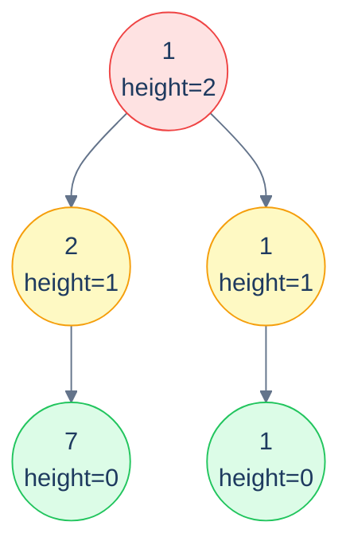

# Problem 6 — Collect leaves by height

> Iteratively peel off the leaves of the tree and collect them in a list of lists: first list = the original leaves, second list = the leaves *after* removing the first set, and so on, until the tree is empty.
>
> **Example:** `[1, 2, 1, 7, null, null, 1]` → `[[7, 1], [2, 1], [1]]`.

A clever postorder trick: each node has a *height* equal to `1 + max(leftHeight, rightHeight)` (with `null` having height -1). All nodes with height 0 are leaves, with height 1 they're "second wave" leaves (would-be leaves after the originals are peeled), and so on. So we run a single postorder, compute each node's height, and bucket the node into `out[height]`.



<p align="center"><strong>Collect leaves by height — every node ends up in the bucket matching its <em>height</em>. Bucket 0 is the originals; bucket 1 is the leaves after peeling; etc. One postorder pass and we're done.</strong></p>

<details>
<summary><h2>Solution</h2></summary>


```python run viz=binary-tree viz-root=root
from typing import List, Optional

class TreeNode:
    def __init__(self, val=0, left=None, right=None):
        self.val = val
        self.left = left
        self.right = right


def from_level_order(values):
    """Build tree from list like [1, 2, 3, None, 4]. None means missing child."""
    if not values:
        return None
    root = TreeNode(values[0])
    queue = [root]
    i = 1
    while queue and i < len(values):
        node = queue.pop(0)
        if i < len(values) and values[i] is not None:
            node.left = TreeNode(values[i])
            queue.append(node.left)
        i += 1
        if i < len(values) and values[i] is not None:
            node.right = TreeNode(values[i])
            queue.append(node.right)
        i += 1
    return root


class Solution:
    def find_height(
        self, root: Optional[TreeNode], result: List[List[int]]
    ) -> int:

        # If root is null, return -1.
        if not root:
            return -1

        # Recursively find the height of the left and right subtrees.
        left_height = self.find_height(root.left, result)
        right_height = self.find_height(root.right, result)

        # Calculate the height of the current node.
        height = max(left_height, right_height) + 1

        # If the result list's size is less than or equal to the
        # height of the node, add a new empty list to the result list.
        if len(result) <= height:
            result.append([])

        # Add the current node's value to the list at the current node's
        # height.
        result[height].append(root.val)

        # Return the height of the current node.
        return height

    def collect_leaves(
        self, root: Optional[TreeNode]
    ) -> List[List[int]]:

        # List of lists to store leaf nodes at each height.
        result: List[List[int]] = []

        # Find the height of the tree and collect leaf nodes.
        self.find_height(root, result)

        # Return result list.
        return result


# Examples from the problem statement
print(Solution().collect_leaves(from_level_order([1, 2, 1, 7, None, None, 1])))  # [[7, 1], [2, 1], [1]]
print(Solution().collect_leaves(from_level_order([1, 6, 5, None, None, 2, 7])))  # [[6, 2, 7], [5], [1]]

# Edge cases
print(Solution().collect_leaves(None))                                             # []
print(Solution().collect_leaves(from_level_order([5])))                            # [[5]]
print(Solution().collect_leaves(from_level_order([1, 2, None, 3])))                # [[3], [2], [1]] (left-skew)
print(Solution().collect_leaves(from_level_order([1, None, 2, None, 3])))          # [[3], [2], [1]] (right-skew)
print(Solution().collect_leaves(from_level_order([1, 2, 3])))                      # [[2, 3], [1]]
print(Solution().collect_leaves(from_level_order([1, 2, 3, 4, 5, 6, 7])))         # [[4, 5, 6, 7], [2, 3], [1]]
```

```java run viz=binary-tree viz-root=root
import java.util.*;

public class Main {
    static class TreeNode {
        int val;
        TreeNode left;
        TreeNode right;
        TreeNode() {}
        TreeNode(int val) { this.val = val; }
    }

    static TreeNode fromLevelOrder(Integer... values) {
        if (values.length == 0 || values[0] == null) return null;
        TreeNode root = new TreeNode(values[0]);
        java.util.Deque<TreeNode> queue = new java.util.ArrayDeque<>();
        queue.add(root);
        int i = 1;
        while (!queue.isEmpty() && i < values.length) {
            TreeNode node = queue.poll();
            if (i < values.length && values[i] != null) {
                node.left = new TreeNode(values[i]);
                queue.add(node.left);
            }
            i++;
            if (i < values.length && values[i] != null) {
                node.right = new TreeNode(values[i]);
                queue.add(node.right);
            }
            i++;
        }
        return root;
    }

    static class Solution {
        private int findHeight(TreeNode root, List<List<Integer>> result) {

            // If root is null, return -1.
            if (root == null) {
                return -1;
            }

            // Recursively find the height of the left and right subtrees.
            int leftHeight = findHeight(root.left, result);
            int rightHeight = findHeight(root.right, result);

            // Calculate the height of the current node.
            int height = Math.max(leftHeight, rightHeight) + 1;

            // If the result list's size is less than or equal to the
            // height of the node, add a new empty list to the result list.
            if (result.size() <= height) {
                result.add(new ArrayList<>());
            }

            // Add the current node's value to the list at the current node's
            // height.
            result.get(height).add(root.val);

            // Return the height of the current node.
            return height;
        }

        public List<List<Integer>> collectLeaves(TreeNode root) {

            // List of lists to store leaf nodes at each height.
            List<List<Integer>> result = new ArrayList<>();

            // Find the height of the tree and collect leaf nodes.
            findHeight(root, result);

            // Return result list.
            return result;
        }
    }

    public static void main(String[] args) {
        // Examples from the problem statement
        System.out.println(new Solution().collectLeaves(fromLevelOrder(1, 2, 1, 7, null, null, 1)));  // [[7, 1], [2, 1], [1]]
        System.out.println(new Solution().collectLeaves(fromLevelOrder(1, 6, 5, null, null, 2, 7)));  // [[6, 2, 7], [5], [1]]

        // Edge cases
        System.out.println(new Solution().collectLeaves(null));                                        // []
        System.out.println(new Solution().collectLeaves(fromLevelOrder(5)));                           // [[5]]
        System.out.println(new Solution().collectLeaves(fromLevelOrder(1, 2, null, 3)));               // [[3], [2], [1]] (left-skew)
        System.out.println(new Solution().collectLeaves(fromLevelOrder(1, null, 2, null, 3)));         // [[3], [2], [1]] (right-skew)
        System.out.println(new Solution().collectLeaves(fromLevelOrder(1, 2, 3)));                     // [[2, 3], [1]]
        System.out.println(new Solution().collectLeaves(fromLevelOrder(1, 2, 3, 4, 5, 6, 7)));        // [[4, 5, 6, 7], [2, 3], [1]]
    }
}
```

</details>
<details>
<summary><h2>Key Takeaway</h2></summary>


Stateless postorder is the most-used pattern in the chapter. Three things to walk away with:

1. **`baseCase` + `combine` is the entire algorithm.** Every problem reduces to choosing those two correctly. Once you've internalised the shape, you stop *reading* the algorithm and start *writing* it directly from the problem statement.
2. **The recurrence is the spec.** `f(node) = combine(f(left), f(right), node.val)`. If you can write the recurrence on paper, you've already written the program — the implementation is a five-line transcription. Practice writing the recurrence *first*; the code follows mechanically.
3. **Empty-tree base case is where the off-by-one bugs live.** Choose your base case to make the recurrence *uniformly applicable* — height of an empty tree is 0 (or -1, depending on convention), sum is 0, max is `-∞`, count is 0, "is a valid X" is `true`. Pick the one that makes the combine work cleanly without special-casing leaves.

> *Coming up — the <strong>stateful</strong> postorder pattern. When a single returned value isn't enough — for instance when each subtree must report both <em>"the longest path entirely within me"</em> AND <em>"the longest path from my root downward"</em> — we either return tuples or thread a shared best-so-far through the recursion. That covers diameter, longest monotonic path, distribute-coins, frequent-subtree-sums, and many more "two answers per call" problems.*

</details>
