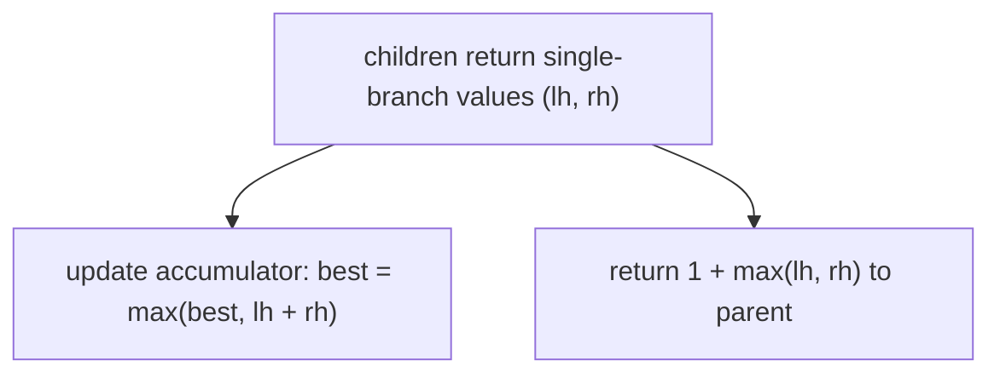

# Pattern: Postorder Traversal (Stateful)

## Why It Exists

[Postorder-stateless](/cortex/data-structures-and-algorithms/trees/binary-tree/pattern-postorder-traversal-stateless/pattern) returned one value per node, and the answer was the *root's* return. But a whole class of problems — the **diameter** (longest path between any two nodes), the **maximum path sum**, "distribute coins" — has an answer that lives at *some interior node* and combines **both** of that node's subtrees, yet **can't be passed up**: a path through a node uses both its children, but the *parent* can only extend through *one* of them.

So you split the two roles. The recursion **returns** the single-branch contribution (a height, a one-sided gain — "what I can offer my parent if it extends through me"), while a **shared accumulator** (an outer variable) is updated with the *through-the-node* value that uses both subtrees. The answer is the accumulator, not the return value. That separation — return one thing, track another — is the signature of stateful postorder, and the heart of tree DP.

## See It Work

The **diameter**: the longest root-to-root path measured in edges. At each node, the path *through* it is `left_height + right_height`; track the max of that while returning height upward. Run it.

```python run viz=binary-tree viz-root=root
import json
from collections import deque

class TreeNode:
    def __init__(self, val, left=None, right=None):
        self.val = val
        self.left = left
        self.right = right

def diameter(root):
    best = 0
    def height(node):
        nonlocal best
        if node is None:
            return 0
        lh = height(node.left)
        rh = height(node.right)
        best = max(best, lh + rh)        # path THROUGH this node (uses BOTH children)
        return 1 + max(lh, rh)            # height returned UP (parent extends ONE side)
    height(root)
    return best

def build_tree(values):              # [1, 2, 3, null, 4] level-order → root
    if not values:
        return None
    root = TreeNode(values[0])
    queue = deque([root])
    i = 1
    while queue and i < len(values):
        node = queue.popleft()
        if i < len(values):
            v = values[i]; i += 1
            if v is not None:
                node.left = TreeNode(v); queue.append(node.left)
        if i < len(values):
            v = values[i]; i += 1
            if v is not None:
                node.right = TreeNode(v); queue.append(node.right)
    return root

root = build_tree(json.loads(input()))   # the test case's level-order values
print(diameter(root))
```

```java run viz=binary-tree viz-root=root
import java.util.*;

public class Main {
  static class TreeNode {
    int val; TreeNode left, right;
    TreeNode(int val) { this.val = val; }
  }

  static int best;

  static int height(TreeNode n) {
    if (n == null) return 0;
    int lh = height(n.left), rh = height(n.right);
    best = Math.max(best, lh + rh);          // through-node (both branches)
    return 1 + Math.max(lh, rh);             // single-branch up
  }

  static int diameter(TreeNode root) { best = 0; height(root); return best; }

  public static void main(String[] args) {
    Scanner sc = new Scanner(System.in);
    TreeNode root = buildTree(parseIntegerArray(sc.nextLine()));
    System.out.println(diameter(root));
  }

  static TreeNode buildTree(Integer[] values) {   // [1, 2, 3, null, 4] level-order → root
    if (values.length == 0 || values[0] == null) return null;
    TreeNode root = new TreeNode(values[0]);
    Deque<TreeNode> queue = new ArrayDeque<>();
    queue.add(root);
    int i = 1;
    while (!queue.isEmpty() && i < values.length) {
      TreeNode node = queue.poll();
      if (i < values.length) {
        Integer v = values[i++];
        if (v != null) { node.left = new TreeNode(v); queue.add(node.left); }
      }
      if (i < values.length) {
        Integer v = values[i++];
        if (v != null) { node.right = new TreeNode(v); queue.add(node.right); }
      }
    }
    return root;
  }

  // "[1, 2, null, 4]" → {1, 2, null, 4} — reads the test case's level-order values
  static Integer[] parseIntegerArray(String line) {
    String inner = line.replaceAll("[\\[\\]\\s]", "");
    if (inner.isEmpty()) return new Integer[0];
    String[] parts = inner.split(",");
    Integer[] out = new Integer[parts.length];
    for (int i = 0; i < parts.length; i++)
      out[i] = parts[i].equals("null") ? null : Integer.parseInt(parts[i]);
    return out;
  }
}
```

```testcases
{
  "args": [
    { "id": "root", "label": "root", "type": "tree", "placeholder": "[1, 2, 3, 4, 5, null, 6]" }
  ],
  "cases": [
    { "args": { "root": "[1, 2, 3, 4, 5, null, 6]" }, "expected": "4" },
    { "args": { "root": "[-10, 9, 20, null, null, 15, 7]" }, "expected": "3" },
    { "args": { "root": "[1]" }, "expected": "0" },
    { "args": { "root": "[]" }, "expected": "0" },
    { "args": { "root": "[1, 2]" }, "expected": "1" },
    { "args": { "root": "[1, 2, 3, 4, 5]" }, "expected": "3" }
  ]
}
```

## How It Works

A postorder recursion with two distinct outputs:

1. **An outer accumulator** (`best`), declared in the enclosing scope.
2. At each node, recurse both children for their **single-branch** values (`lh`, `rh`).
3. **Update the accumulator** with the *combined* value — `lh + rh` (diameter), or `node.val + leftGain + rightGain` (max path sum) — the answer measured *through* this node.
4. **Return** the *single-branch* value upward — `1 + max(lh, rh)` (height), or `node.val + max(gains)` — because the parent can only continue through one child.



<p align="center"><strong>the recursion returns a one-branch value to the parent; on the side, it updates a shared accumulator with the two-branch "through this node" value.</strong></p>

Why can't you just return the through-value? Because a path is **linear** — once it passes through a node it can go down *one* child, not both. The through-the-node path (left + node + right) *bends* at the node and can never be extended by the parent, so it's a *candidate answer* recorded in the accumulator, while the *extendable* part (one branch) is what's returned. Each node is visited once → `O(n)` time, `O(h)` stack. The same shape solves **max path sum** (clamp negative gains to 0: `max(gain, 0)`) and **longest univalue path**.

### Key Takeaway

When the answer combines both subtrees at an interior node but can't be passed up (a path bends there), use stateful postorder: **return** the single-branch contribution for the parent, and **update an outer accumulator** with the both-branches through-value. Return one thing, track another — `O(n)`/`O(h)`.

## Trace It

`diameter(root)` — `best` updates as heights fold up:

| node | `lh` | `rh` | `best = max(best, lh+rh)` | returns `1+max(lh,rh)` |
|---|---|---|---|---|
| `4,5,6` (leaves) | 0 | 0 | 0 | `1` |
| `2` | `1` | `1` | `2` | `2` |
| `3` | `0` | `1` | `2` | `2` |
| `1` (root) | `2` | `2` | **`4`** | `3` |

The diameter `4` is found at the root (path `4→2→1→3→6`), but the root *returns* height `3` — the two values differ.

Before you read on: the root *records* a diameter of `4` (`lh + rh = 2 + 2`) into `best`, but *returns* `3` (`1 + max(lh, rh)`) to its caller. Why must these be two different numbers — what would break if the function returned the `4` instead?

Because the two numbers answer two different questions. `lh + rh = 4` is "the longest path that **bends at** this node, using both its subtrees" — a complete path, a candidate for the global answer, so it goes into `best`. But `1 + max(lh, rh) = 3` is "the longest **downward** path *starting* at this node and going into **one** subtree" — that's the only thing a *parent* can usefully extend, because attaching the parent turns it into `parent → this node → one child → …`, a path that can't also dip into this node's *other* child (that would visit this node twice, and a path is a simple line). If you returned `4` up, the parent would compute `1 + 4` and count a "path" that revisits this node's left subtree after coming from the right — a non-path. So the recursion must hand the parent only the *extendable* one-branch value, while the *non-extendable* two-branch value is captured on the side in the accumulator. Conflating "the best answer here" with "what I can contribute upward" is the single most common bug in diameter/max-path-sum; keeping them separate is the whole pattern.

## Your Turn

Write the stateful postorder template: `diameter(root)` tracks `best` in an outer variable, and `height(node)` returns the single-branch height while updating `best` with `lh + rh`.

```python run viz=binary-tree viz-root=root
import json
from collections import deque

class TreeNode:
    def __init__(self, val, left=None, right=None):
        self.val = val
        self.left = left
        self.right = right

def diameter(root):
    best = 0
    def height(node):
        nonlocal best
        # Your code goes here — base case None → 0; recurse both children;
        # update best with lh + rh (path through this node); return 1 + max(lh, rh).
        return 0
    height(root)
    return best

def build_tree(values):              # [1, 2, 3, null, 4] level-order → root
    if not values:
        return None
    root = TreeNode(values[0])
    queue = deque([root])
    i = 1
    while queue and i < len(values):
        node = queue.popleft()
        if i < len(values):
            v = values[i]; i += 1
            if v is not None:
                node.left = TreeNode(v); queue.append(node.left)
        if i < len(values):
            v = values[i]; i += 1
            if v is not None:
                node.right = TreeNode(v); queue.append(node.right)
    return root

root = build_tree(json.loads(input()))   # the test case's level-order values
print(diameter(root))
```

```java run viz=binary-tree viz-root=root
import java.util.*;

public class Main {
  static class TreeNode {
    int val; TreeNode left, right;
    TreeNode(int val) { this.val = val; }
  }

  static int best;

  static int height(TreeNode n) {
    // Your code goes here — base case null → 0; recurse both children;
    // update best with lh + rh (path through this node); return 1 + max(lh, rh).
    return 0;
  }

  static int diameter(TreeNode root) { best = 0; height(root); return best; }

  public static void main(String[] args) {
    Scanner sc = new Scanner(System.in);
    TreeNode root = buildTree(parseIntegerArray(sc.nextLine()));
    System.out.println(diameter(root));
  }

  static TreeNode buildTree(Integer[] values) {   // [1, 2, 3, null, 4] level-order → root
    if (values.length == 0 || values[0] == null) return null;
    TreeNode root = new TreeNode(values[0]);
    Deque<TreeNode> queue = new ArrayDeque<>();
    queue.add(root);
    int i = 1;
    while (!queue.isEmpty() && i < values.length) {
      TreeNode node = queue.poll();
      if (i < values.length) {
        Integer v = values[i++];
        if (v != null) { node.left = new TreeNode(v); queue.add(node.left); }
      }
      if (i < values.length) {
        Integer v = values[i++];
        if (v != null) { node.right = new TreeNode(v); queue.add(node.right); }
      }
    }
    return root;
  }

  // "[1, 2, null, 4]" → {1, 2, null, 4} — reads the test case's level-order values
  static Integer[] parseIntegerArray(String line) {
    String inner = line.replaceAll("[\\[\\]\\s]", "");
    if (inner.isEmpty()) return new Integer[0];
    String[] parts = inner.split(",");
    Integer[] out = new Integer[parts.length];
    for (int i = 0; i < parts.length; i++)
      out[i] = parts[i].equals("null") ? null : Integer.parseInt(parts[i]);
    return out;
  }
}
```

```testcases
{
  "args": [
    { "id": "root", "label": "root", "type": "tree", "placeholder": "[1, 2, 3, 4, 5, null, 6]" }
  ],
  "cases": [
    { "args": { "root": "[1, 2, 3, 4, 5, null, 6]" }, "expected": "4" },
    { "args": { "root": "[-10, 9, 20, null, null, 15, 7]" }, "expected": "3" },
    { "args": { "root": "[1]" }, "expected": "0" },
    { "args": { "root": "[]" }, "expected": "0" },
    { "args": { "root": "[1, 2]" }, "expected": "1" },
    { "args": { "root": "[1, 2, 3, 4, 5]" }, "expected": "3" }
  ]
}
```

<details>
<summary>Editorial</summary>

At each node, both children's heights are gathered first (postorder). The through-this-node diameter candidate is `lh + rh` — a two-branch path that bends at this node and can never be extended further, so it updates the outer `best`. The return value is `1 + max(lh, rh)` — the longest one-branch extension the parent can attach to.

```python solution time=O(n) space=O(h)
import json
from collections import deque

class TreeNode:
    def __init__(self, val, left=None, right=None):
        self.val = val
        self.left = left
        self.right = right

def diameter(root):
    best = 0
    def height(node):
        nonlocal best
        if node is None:
            return 0
        lh = height(node.left)
        rh = height(node.right)
        best = max(best, lh + rh)        # path THROUGH this node (uses BOTH children)
        return 1 + max(lh, rh)            # height returned UP (parent extends ONE side)
    height(root)
    return best

def build_tree(values):              # [1, 2, 3, null, 4] level-order → root
    if not values:
        return None
    root = TreeNode(values[0])
    queue = deque([root])
    i = 1
    while queue and i < len(values):
        node = queue.popleft()
        if i < len(values):
            v = values[i]; i += 1
            if v is not None:
                node.left = TreeNode(v); queue.append(node.left)
        if i < len(values):
            v = values[i]; i += 1
            if v is not None:
                node.right = TreeNode(v); queue.append(node.right)
    return root

root = build_tree(json.loads(input()))   # the test case's level-order values
print(diameter(root))
```

```java solution
import java.util.*;

public class Main {
  static class TreeNode {
    int val; TreeNode left, right;
    TreeNode(int val) { this.val = val; }
  }

  static int best;

  static int height(TreeNode n) {
    if (n == null) return 0;
    int lh = height(n.left), rh = height(n.right);
    best = Math.max(best, lh + rh);          // through-node (both branches)
    return 1 + Math.max(lh, rh);             // single-branch up
  }

  static int diameter(TreeNode root) { best = 0; height(root); return best; }

  public static void main(String[] args) {
    Scanner sc = new Scanner(System.in);
    TreeNode root = buildTree(parseIntegerArray(sc.nextLine()));
    System.out.println(diameter(root));
  }

  static TreeNode buildTree(Integer[] values) {   // [1, 2, 3, null, 4] level-order → root
    if (values.length == 0 || values[0] == null) return null;
    TreeNode root = new TreeNode(values[0]);
    Deque<TreeNode> queue = new ArrayDeque<>();
    queue.add(root);
    int i = 1;
    while (!queue.isEmpty() && i < values.length) {
      TreeNode node = queue.poll();
      if (i < values.length) {
        Integer v = values[i++];
        if (v != null) { node.left = new TreeNode(v); queue.add(node.left); }
      }
      if (i < values.length) {
        Integer v = values[i++];
        if (v != null) { node.right = new TreeNode(v); queue.add(node.right); }
      }
    }
    return root;
  }

  // "[1, 2, null, 4]" → {1, 2, null, 4} — reads the test case's level-order values
  static Integer[] parseIntegerArray(String line) {
    String inner = line.replaceAll("[\\[\\]\\s]", "");
    if (inner.isEmpty()) return new Integer[0];
    String[] parts = inner.split(",");
    Integer[] out = new Integer[parts.length];
    for (int i = 0; i < parts.length; i++)
      out[i] = parts[i].equals("null") ? null : Integer.parseInt(parts[i]);
    return out;
  }
}
```

</details>

## Reflect & Connect

Drill the family in **Practice** — [Diameter of Tree](/cortex/data-structures-and-algorithms/trees/binary-tree/pattern-postorder-traversal-stateful/problems/diameter-of-tree), [Descendants Sum Count](/cortex/data-structures-and-algorithms/trees/binary-tree/pattern-postorder-traversal-stateful/problems/descendants-sum-count), [Distribute Coins](/cortex/data-structures-and-algorithms/trees/binary-tree/pattern-postorder-traversal-stateful/problems/distribute-coins), and [Longest Monotonic Path](/cortex/data-structures-and-algorithms/trees/binary-tree/pattern-postorder-traversal-stateful/problems/longest-monotonic-path).

Stateful postorder is bottom-up recursion where the answer and the return value diverge:

- **The family** — diameter, maximum path sum, longest univalue/monotonic path, distribute-coins (return the surplus/deficit a subtree passes up, accumulate the moves). All return a one-branch value while tracking a through-node answer.
- **Return one thing, track another** — the return is "what I contribute to my parent" (one branch, extendable); the accumulator gets "the best complete answer here" (both branches, not extendable). Conflating them is the classic bug.
- **It's tree DP** — this *is* dynamic programming on a tree: each node's contribution is computed once from its children's, and a global optimum is tracked across all nodes. The same "local return + global best" structure recurs in interval and graph DP. Combined with [preorder](/cortex/data-structures-and-algorithms/trees/binary-tree/pattern-preorder-traversal-stateless/pattern)'s push-down, it covers nearly all single-pass tree computations.

**Prerequisites:** [Postorder Traversal (Stateless)](/cortex/data-structures-and-algorithms/trees/binary-tree/pattern-postorder-traversal-stateless/pattern).
**What's next:** root-to-leaf paths the stateless way — carrying the path down by argument — [Root-to-Leaf Path (Stateless)](/cortex/data-structures-and-algorithms/trees/binary-tree/pattern-root-to-leaf-path-stateless/pattern).

## Recall

> **Mnemonic:** *Answer bends at an interior node (both subtrees) but a path is linear — so RETURN the one-branch value (extendable) and UPDATE an outer accumulator with the two-branch through-value. Return one thing, track another.*

| | |
|---|---|
| Accumulator | outer variable holding the best through-node answer |
| Update with | both branches: `lh + rh` (diameter) / `val + lg + rg` (max sum) |
| Return upward | one branch: `1 + max(lh, rh)` / `val + max(gains)` |
| Why split | a path is linear — the parent can extend only one branch |
| Family | diameter, max path sum, longest univalue path, distribute coins |

<details>
<summary><strong>Q:</strong> Why does stateful postorder return a different value than it records?</summary>

**A:** The through-node answer uses both subtrees (a bent path) and can't be extended by the parent; the parent can only extend a single-branch value, so that's what's returned.

</details>
<details>
<summary><strong>Q:</strong> What goes in the accumulator vs the return?</summary>

**A:** Accumulator: the both-branches "through this node" answer; return: the one-branch extendable contribution.

</details>
<details>
<summary><strong>Q:</strong> What's the classic bug?</summary>

**A:** Returning the through-node (two-branch) value upward, which lets a parent build an impossible path that revisits a subtree.

</details>
<details>
<summary><strong>Q:</strong> Why is this "tree DP"?</summary>

**A:** Each node's value is computed once from its children's, while a global optimum is tracked across all nodes — dynamic programming on the tree.

</details>

## Sources & Verify

- **CLRS**, *Introduction to Algorithms*, 4th ed., §10.4 / §15 — recursive tree computation; DP on trees.
- **Sedgewick & Wayne**, *Algorithms*, 4th ed., §3.2 — recursive aggregates over trees.
- Diameter and max-path-sum via "return one branch, track through-node" (LeetCode 543, 124) are standard; both runnable blocks are verified by running (`diameter ⇒ 4`/`3`; `max_path_sum ⇒ 42`, the classic `[-10,9,20,15,7]` case).
