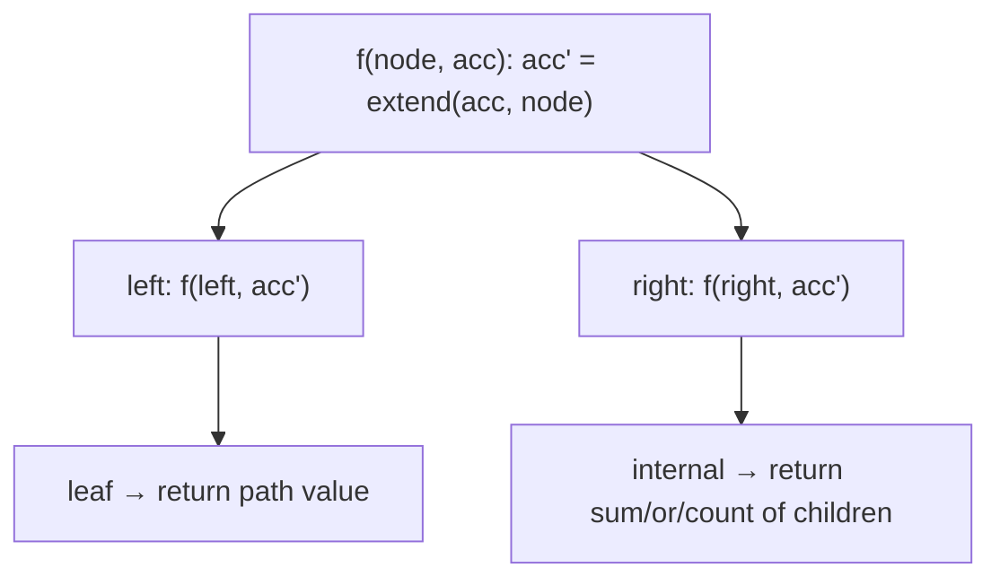

# Pattern: Root-to-Leaf Path (Stateless)

## Why It Exists

Many tree questions are about whole **root-to-leaf paths**: "sum all root-to-leaf *numbers* (the path `1→2→3` reads as 123)," "does any path sum to `k`?", "count the even-valued paths." A path is only *complete* at a leaf, so the work has two halves: build up the path value on the way **down**, and decide/aggregate once you **reach a leaf**.

The stateless approach threads the accumulated value **down as an argument** (extend it at each node — `acc*10 + val` for numbers, `acc + val` for sums) and combines the per-leaf results **up through the return values** (sum, OR, count). There's no shared mutable path: each call owns its accumulated value, and the returns fold the leaf answers together. It's [preorder-stateless](/cortex/data-structures-and-algorithms/trees/binary-tree/pattern-preorder-traversal-stateless/pattern)'s push-down *plus* a postorder-style aggregate-up — exactly the right shape when you want a *summary* of the paths, not the paths themselves.

## See It Work

Sum every root-to-leaf **number**. For `1 → 2` and `1 → 3` that's `12 + 13 = 25`. The number builds downward; leaf values sum upward. Pick a case and **Run** it.

```python run viz=binary-tree viz-root=root
import json
from collections import deque

class TreeNode:
    def __init__(self, val, left=None, right=None):
        self.val = val
        self.left = left
        self.right = right

def sum_numbers(node, cur=0):
    if node is None:
        return 0
    cur = cur * 10 + node.val                  # extend the path number going DOWN
    if node.left is None and node.right is None:
        return cur                             # leaf: this path's complete number
    return sum_numbers(node.left, cur) + sum_numbers(node.right, cur)   # aggregate UP

def build_tree(values):              # [1, 2, 3, null, 4] level-order → root
    if not values:
        return None
    root = TreeNode(values[0])
    queue = deque([root])
    i = 1
    while queue and i < len(values):
        node = queue.popleft()
        if i < len(values):
            v = values[i]; i += 1
            if v is not None:
                node.left = TreeNode(v); queue.append(node.left)
        if i < len(values):
            v = values[i]; i += 1
            if v is not None:
                node.right = TreeNode(v); queue.append(node.right)
    return root

root = build_tree(json.loads(input()))   # the test case's level-order values
print(sum_numbers(root))
```

```java run viz=binary-tree viz-root=root
import java.util.*;

public class Main {
  static class TreeNode {
    int val; TreeNode left, right;
    TreeNode(int val) { this.val = val; }
  }

  static int sumNumbers(TreeNode node, int cur) {
    if (node == null) return 0;
    cur = cur * 10 + node.val;                  // extend the path number going DOWN
    if (node.left == null && node.right == null) return cur;   // leaf: complete number
    return sumNumbers(node.left, cur) + sumNumbers(node.right, cur);   // aggregate UP
  }

  public static void main(String[] args) {
    Scanner sc = new Scanner(System.in);
    TreeNode root = buildTree(parseIntegerArray(sc.nextLine()));
    System.out.println(sumNumbers(root, 0));
  }

  static TreeNode buildTree(Integer[] values) {   // [1, 2, 3, null, 4] level-order → root
    if (values.length == 0 || values[0] == null) return null;
    TreeNode root = new TreeNode(values[0]);
    Deque<TreeNode> queue = new ArrayDeque<>();
    queue.add(root);
    int i = 1;
    while (!queue.isEmpty() && i < values.length) {
      TreeNode node = queue.poll();
      if (i < values.length) {
        Integer v = values[i++];
        if (v != null) { node.left = new TreeNode(v); queue.add(node.left); }
      }
      if (i < values.length) {
        Integer v = values[i++];
        if (v != null) { node.right = new TreeNode(v); queue.add(node.right); }
      }
    }
    return root;
  }

  // "[1, 2, null, 4]" → {1, 2, null, 4} — reads the test case's level-order values
  static Integer[] parseIntegerArray(String line) {
    String inner = line.replaceAll("[\\[\\]\\s]", "");
    if (inner.isEmpty()) return new Integer[0];
    String[] parts = inner.split(",");
    Integer[] out = new Integer[parts.length];
    for (int i = 0; i < parts.length; i++)
      out[i] = parts[i].equals("null") ? null : Integer.parseInt(parts[i]);
    return out;
  }
}
```

```testcases
{
  "args": [
    { "id": "root", "label": "root", "type": "tree", "placeholder": "[1, 2, 3]" }
  ],
  "cases": [
    { "args": { "root": "[1, 2, 3]" }, "expected": "25" },
    { "args": { "root": "[4, 9, 0, 5, 1]" }, "expected": "1026" },
    { "args": { "root": "[1]" }, "expected": "1" },
    { "args": { "root": "[]" }, "expected": "0" },
    { "args": { "root": "[1, 2, null, 3]" }, "expected": "123" },
    { "args": { "root": "[1, null, 2]" }, "expected": "12" }
  ]
}
```

## How It Works

`f(node, acc)` with three moves:

1. **Extend** the accumulated value with the current node (`acc*10 + val` for a number, `acc + val` for a sum, `acc` toggled for parity).
2. **At a leaf** (`no children`), the path is complete — return *this path's* value.
3. **At an internal node**, return the **aggregate** of the children's results — `sum` for "total over all paths," `or` for "does any path…", `+` of counts for "how many paths…".



<p align="center"><strong>the accumulator flows down as an argument; each leaf yields its path's value; internal nodes fold the children's returns upward.</strong></p>

Two flows in one pass: the **accumulator descends** (argument, top-down) and the **answer ascends** (return value, bottom-up). It's stateless because the accumulator lives in the argument — no shared list to mutate or restore. The aggregator at internal nodes decides the query: `+` totals paths, `or` asks "any path?", counting tallies. Cost is `O(n)` (each node once), `O(h)` stack.

### Key Takeaway

Root-to-leaf-stateless carries the path value **down** by argument and folds the per-leaf results **up** by return: extend at each node, finalize at leaves, aggregate (sum / or / count) at internal nodes. No shared state. Use it for *summaries* of paths (totals, existence, counts) rather than the paths themselves.

## Trace It

`sum_numbers` on `1(2, 3)`:

| node | incoming `cur` | `cur` after extend | leaf? | returns |
|---|---|---|---|---|
| `1` | `0` | `1` | no | `sum(left) + sum(right)` |
| `2` | `1` | `12` | yes | `12` |
| `3` | `1` | `13` | yes | `13` |
| `1` | — | — | — | `12 + 13 = 25` |

Before you read on: this *aggregates* the paths (sums them) but never builds the list `[12, 13]`. The [stateful variant](/cortex/data-structures-and-algorithms/trees/binary-tree/pattern-root-to-leaf-path-stateful/pattern) keeps a shared mutable path and backtracks. When is the stateless "carry-down-by-argument, aggregate-up-by-return" form the right choice, and when must you switch to the stateful one?

Use **stateless** when you only need a *summary* of the paths — their sum, whether any satisfies a predicate, how many do. The accumulated value (a number, a running sum, a parity bit) is a small immutable thing you pass down, and a single number folds up via the returns; there's nothing to collect and nothing to clean up, so it's the simpler, less bug-prone choice. Switch to **stateful** when you need the *actual paths themselves* — "return the list of all root-to-leaf paths" — because you must build and snapshot each concrete path, which means a shared mutable list with append-on-enter / pop-on-exit backtracking. The dividing question is "do I need the *paths* or just a *number about* them?" A summary → stateless (carry a value, aggregate); the concrete paths → stateful (shared list, backtrack). Reaching for a shared mutable path when a passed-down value would do is over-engineering and invites the missing-pop bug.

## Your Turn

Implement `sum_numbers(node, cur=0)` — extend the path number going down, finalize at leaves, aggregate up with `+`.

```python run viz=binary-tree viz-root=root
import json
from collections import deque

class TreeNode:
    def __init__(self, val, left=None, right=None):
        self.val = val
        self.left = left
        self.right = right

def sum_numbers(node, cur=0):
    # Your code goes here — base case None → 0; extend cur = cur*10 + node.val;
    # at a leaf return cur; at internal nodes return sum of both children.
    pass

def build_tree(values):              # [1, 2, 3, null, 4] level-order → root
    if not values:
        return None
    root = TreeNode(values[0])
    queue = deque([root])
    i = 1
    while queue and i < len(values):
        node = queue.popleft()
        if i < len(values):
            v = values[i]; i += 1
            if v is not None:
                node.left = TreeNode(v); queue.append(node.left)
        if i < len(values):
            v = values[i]; i += 1
            if v is not None:
                node.right = TreeNode(v); queue.append(node.right)
    return root

root = build_tree(json.loads(input()))   # the test case's level-order values
print(sum_numbers(root))
```

```java run viz=binary-tree viz-root=root
import java.util.*;

public class Main {
  static class TreeNode {
    int val; TreeNode left, right;
    TreeNode(int val) { this.val = val; }
  }

  static int sumNumbers(TreeNode node, int cur) {
    // Your code goes here — base case null → 0; extend cur = cur*10 + node.val;
    // at a leaf return cur; at internal nodes return sum of both children.
    return 0;
  }

  public static void main(String[] args) {
    Scanner sc = new Scanner(System.in);
    TreeNode root = buildTree(parseIntegerArray(sc.nextLine()));
    System.out.println(sumNumbers(root, 0));
  }

  static TreeNode buildTree(Integer[] values) {   // [1, 2, 3, null, 4] level-order → root
    if (values.length == 0 || values[0] == null) return null;
    TreeNode root = new TreeNode(values[0]);
    Deque<TreeNode> queue = new ArrayDeque<>();
    queue.add(root);
    int i = 1;
    while (!queue.isEmpty() && i < values.length) {
      TreeNode node = queue.poll();
      if (i < values.length) {
        Integer v = values[i++];
        if (v != null) { node.left = new TreeNode(v); queue.add(node.left); }
      }
      if (i < values.length) {
        Integer v = values[i++];
        if (v != null) { node.right = new TreeNode(v); queue.add(node.right); }
      }
    }
    return root;
  }

  // "[1, 2, null, 4]" → {1, 2, null, 4} — reads the test case's level-order values
  static Integer[] parseIntegerArray(String line) {
    String inner = line.replaceAll("[\\[\\]\\s]", "");
    if (inner.isEmpty()) return new Integer[0];
    String[] parts = inner.split(",");
    Integer[] out = new Integer[parts.length];
    for (int i = 0; i < parts.length; i++)
      out[i] = parts[i].equals("null") ? null : Integer.parseInt(parts[i]);
    return out;
  }
}
```

```testcases
{
  "args": [
    { "id": "root", "label": "root", "type": "tree", "placeholder": "[1, 2, 3]" }
  ],
  "cases": [
    { "args": { "root": "[1, 2, 3]" }, "expected": "25" },
    { "args": { "root": "[4, 9, 0, 5, 1]" }, "expected": "1026" },
    { "args": { "root": "[1]" }, "expected": "1" },
    { "args": { "root": "[]" }, "expected": "0" },
    { "args": { "root": "[1, 2, null, 3]" }, "expected": "123" },
    { "args": { "root": "[1, null, 2]" }, "expected": "12" }
  ]
}
```

<details>
<summary>Editorial</summary>

The template is exactly the See-It-Work walk, packaged to return a result. Base case `None → 0` handles both an empty tree and a missing child (internal nodes with one child will recurse into `None` on the missing side — returning 0 is the correct identity for `+`). Extending `cur = cur*10 + node.val` shifts the running decimal number left and appends the current digit. At a leaf, the path is complete: return `cur`. At an internal node, sum both children's results — the left and right subtrees each complete their own paths independently.

```python solution time=O(n) space=O(h)
import json
from collections import deque

class TreeNode:
    def __init__(self, val, left=None, right=None):
        self.val = val
        self.left = left
        self.right = right

def sum_numbers(node, cur=0):
    if node is None:
        return 0
    cur = cur * 10 + node.val                  # extend the path number going DOWN
    if node.left is None and node.right is None:
        return cur                             # leaf: this path's complete number
    return sum_numbers(node.left, cur) + sum_numbers(node.right, cur)   # aggregate UP

def build_tree(values):              # [1, 2, 3, null, 4] level-order → root
    if not values:
        return None
    root = TreeNode(values[0])
    queue = deque([root])
    i = 1
    while queue and i < len(values):
        node = queue.popleft()
        if i < len(values):
            v = values[i]; i += 1
            if v is not None:
                node.left = TreeNode(v); queue.append(node.left)
        if i < len(values):
            v = values[i]; i += 1
            if v is not None:
                node.right = TreeNode(v); queue.append(node.right)
    return root

root = build_tree(json.loads(input()))   # the test case's level-order values
print(sum_numbers(root))
```

```java solution
import java.util.*;

public class Main {
  static class TreeNode {
    int val; TreeNode left, right;
    TreeNode(int val) { this.val = val; }
  }

  static int sumNumbers(TreeNode node, int cur) {
    if (node == null) return 0;
    cur = cur * 10 + node.val;                  // extend the path number going DOWN
    if (node.left == null && node.right == null) return cur;   // leaf: complete number
    return sumNumbers(node.left, cur) + sumNumbers(node.right, cur);   // aggregate UP
  }

  public static void main(String[] args) {
    Scanner sc = new Scanner(System.in);
    TreeNode root = buildTree(parseIntegerArray(sc.nextLine()));
    System.out.println(sumNumbers(root, 0));
  }

  static TreeNode buildTree(Integer[] values) {   // [1, 2, 3, null, 4] level-order → root
    if (values.length == 0 || values[0] == null) return null;
    TreeNode root = new TreeNode(values[0]);
    Deque<TreeNode> queue = new ArrayDeque<>();
    queue.add(root);
    int i = 1;
    while (!queue.isEmpty() && i < values.length) {
      TreeNode node = queue.poll();
      if (i < values.length) {
        Integer v = values[i++];
        if (v != null) { node.left = new TreeNode(v); queue.add(node.left); }
      }
      if (i < values.length) {
        Integer v = values[i++];
        if (v != null) { node.right = new TreeNode(v); queue.add(node.right); }
      }
    }
    return root;
  }

  // "[1, 2, null, 4]" → {1, 2, null, 4} — reads the test case's level-order values
  static Integer[] parseIntegerArray(String line) {
    String inner = line.replaceAll("[\\[\\]\\s]", "");
    if (inner.isEmpty()) return new Integer[0];
    String[] parts = inner.split(",");
    Integer[] out = new Integer[parts.length];
    for (int i = 0; i < parts.length; i++)
      out[i] = parts[i].equals("null") ? null : Integer.parseInt(parts[i]);
    return out;
  }
}
```

</details>

## Reflect & Connect

Drill the family in **Practice** — [Root-to-Leaf Path Sum Check](/cortex/data-structures-and-algorithms/trees/binary-tree/pattern-root-to-leaf-path-stateless/problems/root-to-leaf-path-sum-check), [Binary Summation of Tree](/cortex/data-structures-and-algorithms/trees/binary-tree/pattern-root-to-leaf-path-stateless/problems/binary-summation-of-tree), [Even Path](/cortex/data-structures-and-algorithms/trees/binary-tree/pattern-root-to-leaf-path-stateless/problems/even-path), and [Odd Count](/cortex/data-structures-and-algorithms/trees/binary-tree/pattern-root-to-leaf-path-stateless/problems/odd-count).

Root-to-leaf-stateless is "summarize the paths without storing them":

- **The family** — sum of root-to-leaf numbers, "does any path sum to `k`?", binary-path value, even/odd path counts. The aggregator (`+`, `or`, count) picks the query; the descent is identical.
- **Two flows, one pass** — accumulator down (argument), answer up (return). It fuses [preorder](/cortex/data-structures-and-algorithms/trees/binary-tree/pattern-preorder-traversal-stateless/pattern)'s push-down with a [postorder](/cortex/data-structures-and-algorithms/trees/binary-tree/pattern-postorder-traversal-stateless/pattern)-style aggregate-up — most real tree code is exactly this combination.
- **Stateless vs stateful** — when you need a *number about* the paths, carry a value down and aggregate up (here). When you need the *paths themselves*, use a [shared mutable path with backtracking](/cortex/data-structures-and-algorithms/trees/binary-tree/pattern-root-to-leaf-path-stateful/pattern). Prefer the value-passing form unless you truly must collect concrete paths.

**Prerequisites:** [Preorder Traversal (Stateless)](/cortex/data-structures-and-algorithms/trees/binary-tree/pattern-preorder-traversal-stateless/pattern).
**What's next:** collect the actual paths with a shared, backtracked path list — [Root-to-Leaf Path (Stateful)](/cortex/data-structures-and-algorithms/trees/binary-tree/pattern-root-to-leaf-path-stateful/pattern).

## Recall

> **Mnemonic:** *Extend the accumulator DOWN (argument), finalize at LEAVES, aggregate UP (return: sum/or/count). No shared path. Summary of paths → stateless; the paths themselves → stateful.*

| | |
|---|---|
| Down (argument) | extend the path value: `cur*10+val`, `cur+val`, parity toggle |
| At a leaf | return this complete path's value |
| At an internal node | return the aggregate of children (`+` / `or` / count) |
| Why stateless | accumulator in the argument; nothing shared, nothing to undo |
| Use when | you want a *summary* (total/exists/count), not the concrete paths |

<details>
<summary><strong>Q:</strong> How does the stateless form handle a root-to-leaf path?</summary>

**A:** It carries the accumulated value down as an argument, finalizes at the leaf, and aggregates the leaf results up via return values.

</details>
<details>
<summary><strong>Q:</strong> What decides the query (sum vs any vs count)?</summary>

**A:** The aggregator at internal nodes — `+` totals, `or` checks existence, counting tallies.

</details>
<details>
<summary><strong>Q:</strong> When use stateless vs stateful root-to-leaf?</summary>

**A:** Stateless for a *summary* (a number about the paths); stateful when you need the *actual paths* (shared list + backtracking).

</details>
<details>
<summary><strong>Q:</strong> Which two traversal flows does it combine?</summary>

**A:** Preorder push-down (the accumulator argument) and postorder aggregate-up (the return values).

</details>

## Sources & Verify

- **CLRS**, *Introduction to Algorithms*, 4th ed., §10.4 — tree traversal; path computations.
- **Sedgewick & Wayne**, *Algorithms*, 4th ed., §3.2 — recursive path/aggregate processing.
- Sum-of-root-to-leaf-numbers and path-sum check (LeetCode 129, 112) are standard; both runnable blocks are verified by running (`sum_numbers ⇒ 25`, `1026`; `has_path_sum 18 ⇒ True`).
