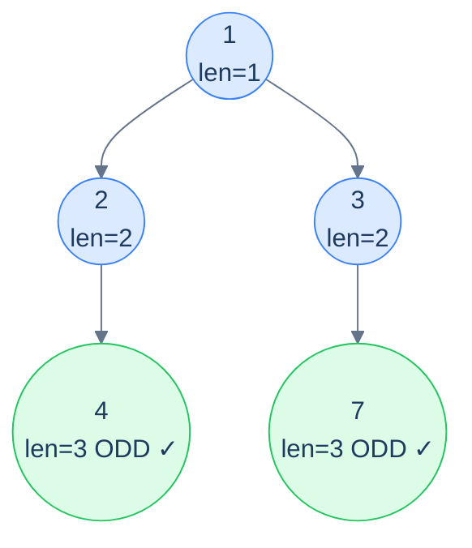

# Problem 4 — Odd count

> Count the number of root-to-leaf paths whose **length** (number of nodes) is odd.

Accumulator: current path length (just an integer counter). At a leaf, verdict is `1` if length is odd, `0` otherwise. Combine via `+` to count across all paths.



<p align="center"><strong>Odd count — both leaves are at depth 3 (path length 3, which is odd), so the answer is <strong>2</strong>. Each leaf's verdict is bubbled up via <code>+</code>.</strong></p>

<details>
<summary><h2>Solution</h2></summary>


```python run viz=binary-tree viz-root=root
from typing import Optional


class TreeNode:
    def __init__(self, val=0, left=None, right=None):
        self.val = val
        self.left = left
        self.right = right


def from_level_order(values):
    """Build tree from list like [1, 2, 3, None, 4]. None means missing child."""
    if not values:
        return None
    root = TreeNode(values[0])
    queue = [root]
    i = 1
    while queue and i < len(values):
        node = queue.pop(0)
        if i < len(values) and values[i] is not None:
            node.left = TreeNode(values[i])
            queue.append(node.left)
        i += 1
        if i < len(values) and values[i] is not None:
            node.right = TreeNode(values[i])
            queue.append(node.right)
        i += 1
    return root


class Solution:
    def odd_count_helper(
        self, root: Optional[TreeNode], path_len: int
    ) -> int:

        # Base case: if the current node is null, return 0
        if root is None:
            return 0

        # Include current node in path length
        path_len += 1

        # If this is a leaf, check if path length is odd
        if root.left is None and root.right is None:

            # Return 1 if path length is odd
            if path_len % 2 == 1:
                return 1

            # Return 0 if path length is even
            else:
                return 0

        # Recurse separately into left and right subtrees
        left_count = self.odd_count_helper(root.left, path_len)
        right_count = self.odd_count_helper(root.right, path_len)

        # Return total count of odd-length paths from both subtrees
        return left_count + right_count

    def odd_count(self, root: Optional[TreeNode]) -> int:

        # Start odd_count_helper with path_len = 0
        return self.odd_count_helper(root, 0)


# Examples from the problem statement
print(Solution().odd_count(from_level_order([1, 2, 3, 4, None, None, 7])))   # 2
print(Solution().odd_count(from_level_order([1, 8, 4, None, None, 2, 7])))   # 2

# Edge cases
print(Solution().odd_count(None))                                              # 0
print(Solution().odd_count(from_level_order([1])))                             # 1 (single node, length=1 odd)
print(Solution().odd_count(from_level_order([1, 2])))                          # 0 (length=2 even)
print(Solution().odd_count(from_level_order([1, 2, 3])))                       # 0 (both paths length=2)
print(Solution().odd_count(from_level_order([1, 2, None, 3])))                 # 1 (path 1->2->3 length=3 odd)
print(Solution().odd_count(from_level_order([1, 2, 3, 4, 5, 6, 7])))          # 4 (all leaves at depth 3, odd)
```

```java run viz=binary-tree viz-root=root
import java.util.*;

public class Main {
    static class TreeNode {
        int val;
        TreeNode left;
        TreeNode right;
        TreeNode() {}
        TreeNode(int val) { this.val = val; }
    }

    static TreeNode fromLevelOrder(Integer... values) {
        if (values.length == 0 || values[0] == null) return null;
        TreeNode root = new TreeNode(values[0]);
        java.util.Deque<TreeNode> queue = new java.util.ArrayDeque<>();
        queue.add(root);
        int i = 1;
        while (!queue.isEmpty() && i < values.length) {
            TreeNode node = queue.poll();
            if (i < values.length && values[i] != null) {
                node.left = new TreeNode(values[i]);
                queue.add(node.left);
            }
            i++;
            if (i < values.length && values[i] != null) {
                node.right = new TreeNode(values[i]);
                queue.add(node.right);
            }
            i++;
        }
        return root;
    }

    static class Solution {
        private int oddCountHelper(TreeNode root, int pathLen) {

            // Base case: if the current node is null, return 0
            if (root == null) {
                return 0;
            }

            // Include current node in path length
            pathLen++;

            // If this is a leaf, check if path length is odd
            if (root.left == null && root.right == null) {

                // Return 1 if path length is odd
                if (pathLen % 2 == 1) {
                    return 1;
                }

                // Return 0 if path length is even
                else {
                    return 0;
                }
            }

            // Recurse separately into left and right subtrees
            int leftCount = oddCountHelper(root.left, pathLen);
            int rightCount = oddCountHelper(root.right, pathLen);

            // Return total count of odd-length paths from both subtrees
            return leftCount + rightCount;
        }

        public int oddCount(TreeNode root) {

            // Start oddCountHelper with pathLen = 0
            return oddCountHelper(root, 0);
        }
    }

    public static void main(String[] args) {
        // Examples from the problem statement
        System.out.println(new Solution().oddCount(fromLevelOrder(1, 2, 3, 4, null, null, 7)));   // 2
        System.out.println(new Solution().oddCount(fromLevelOrder(1, 8, 4, null, null, 2, 7)));   // 2

        // Edge cases
        System.out.println(new Solution().oddCount(null));                                          // 0
        System.out.println(new Solution().oddCount(fromLevelOrder(1)));                             // 1
        System.out.println(new Solution().oddCount(fromLevelOrder(1, 2)));                          // 0
        System.out.println(new Solution().oddCount(fromLevelOrder(1, 2, 3)));                       // 0
        System.out.println(new Solution().oddCount(fromLevelOrder(1, 2, null, 3)));                 // 1
        System.out.println(new Solution().oddCount(fromLevelOrder(1, 2, 3, 4, 5, 6, 7)));          // 4
    }
}
```

</details>
<details>
<summary><h2>Key Takeaway</h2></summary>


The stateless root-to-leaf path pattern fuses preorder and postorder mechanics: **descend with an accumulator, decide at leaves, combine on the way back up**. Three things to walk away with:

1. **The combinator picks the question.** `OR` answers "does *any* path …?". `AND` answers "do *all* paths …?". `+` counts. `max`/`min` find the extreme. The accumulator and verdict change with the problem; the combinator changes with the question.
2. **Leaves are special — internal nodes are not.** Only leaves emit a verdict. Internal nodes are pass-through routers that combine. This is the structural difference from preorder-stateless (where every node is a "process" point) — root-to-leaf-path explicitly waits until the path is *complete*.
3. **The base case identity matters.** When `node` is `null`, return whatever value makes the combine ignore that subtree: `false` for OR, `true` for AND (yes — for AND, an empty subtree should *not* defeat its sibling), `0` for `+`, `-∞` for `max`. Get the identity wrong and you'll silently produce garbage on degenerate trees.

> *Coming up — the <strong>stateful</strong> root-to-leaf path pattern. When you need not just a per-path verdict but the actual <em>nodes</em> in each path (e.g., "list every root-to-leaf path that sums to N"), the accumulator becomes a mutable list with the canonical push-pop discipline. Same recipe, but now we collect actual paths instead of just counting them.*

</details>
