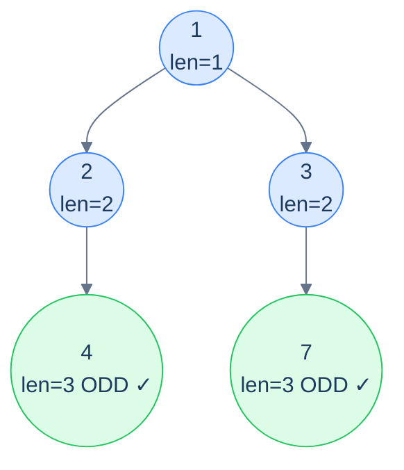

# Problem 4 — Odd count

## Problem Statement

Count the number of root-to-leaf paths whose **length** (number of nodes) is odd.

Accumulator: current path length (an integer counter). At a leaf, the verdict is `1` if length is odd, `0` otherwise. Combine via `+` to count across all paths.

## Examples

**Example 1:**
```
Input:  root = [1, 2, 3, 4, null, null, 7]
Output: 2
```



<p align="center"><strong>Odd count — both leaves are at depth 3 (path length 3, which is odd), so the answer is <strong>2</strong>. Each leaf's verdict is bubbled up via <code>+</code>.</strong></p>

**Example 2:**
```
Input:  root = [1, 8, 4, null, null, 2, 7]
Output: 2
```

## Constraints

- `0 ≤ number of nodes ≤ 10⁴`
- `-10⁴ ≤ node.val ≤ 10⁴`
- `O(n)` time, `O(h)` recursion stack

```python run viz=binary-tree viz-root=root
import json
from collections import deque

class TreeNode:
    def __init__(self, val, left=None, right=None):
        self.val = val
        self.left = left
        self.right = right

class Solution:
    def odd_count(self, root):
        # Your code goes here — carry the path length DOWN as an argument;
        # at a leaf return 1 if path_len is odd, else 0;
        # at internal nodes return sum of both children.
        return 0

def build_tree(values):              # [1, 2, 3, null, 4] level-order → root
    if not values:
        return None
    root = TreeNode(values[0])
    queue = deque([root])
    i = 1
    while queue and i < len(values):
        node = queue.popleft()
        if i < len(values):
            v = values[i]; i += 1
            if v is not None:
                node.left = TreeNode(v); queue.append(node.left)
        if i < len(values):
            v = values[i]; i += 1
            if v is not None:
                node.right = TreeNode(v); queue.append(node.right)
    return root

root = build_tree(json.loads(input()))   # the test case's level-order values
print(Solution().odd_count(root))
```

```java run viz=binary-tree viz-root=root
import java.util.*;

public class Main {
    static class TreeNode {
        int val; TreeNode left, right;
        TreeNode(int val) { this.val = val; }
    }

    static class Solution {
        int oddCount(TreeNode root) {
            // Your code goes here — carry the path length DOWN as an argument;
            // at a leaf return 1 if pathLen is odd, else 0;
            // at internal nodes return sum of both children.
            return 0;
        }
    }

    public static void main(String[] args) {
        TreeNode root = buildTree(parseIntegerArray(new Scanner(System.in).nextLine()));
        System.out.println(new Solution().oddCount(root));
    }

    static TreeNode buildTree(Integer[] values) {   // [1, 2, 3, null, 4] level-order → root
        if (values.length == 0 || values[0] == null) return null;
        TreeNode root = new TreeNode(values[0]);
        Deque<TreeNode> queue = new ArrayDeque<>();
        queue.add(root);
        int i = 1;
        while (!queue.isEmpty() && i < values.length) {
            TreeNode node = queue.poll();
            if (i < values.length) {
                Integer v = values[i++];
                if (v != null) { node.left = new TreeNode(v); queue.add(node.left); }
            }
            if (i < values.length) {
                Integer v = values[i++];
                if (v != null) { node.right = new TreeNode(v); queue.add(node.right); }
            }
        }
        return root;
    }

    // "[1, 2, null, 4]" → {1, 2, null, 4} — reads the test case's level-order values
    static Integer[] parseIntegerArray(String line) {
        String inner = line.replaceAll("[\\[\\]\\s]", "");
        if (inner.isEmpty()) return new Integer[0];
        String[] parts = inner.split(",");
        Integer[] out = new Integer[parts.length];
        for (int i = 0; i < parts.length; i++)
            out[i] = parts[i].equals("null") ? null : Integer.parseInt(parts[i]);
        return out;
    }
}
```

```testcases
{
  "args": [
    { "id": "root", "label": "root", "type": "tree", "placeholder": "[1, 2, 3, 4, null, null, 7]" }
  ],
  "cases": [
    { "args": { "root": "[1, 2, 3, 4, null, null, 7]" }, "expected": "2" },
    { "args": { "root": "[1, 8, 4, null, null, 2, 7]" }, "expected": "2" },
    { "args": { "root": "[]" }, "expected": "0" },
    { "args": { "root": "[1]" }, "expected": "1" },
    { "args": { "root": "[1, 2]" }, "expected": "0" },
    { "args": { "root": "[1, 2, 3]" }, "expected": "0" },
    { "args": { "root": "[1, 2, null, 3]" }, "expected": "1" },
    { "args": { "root": "[1, 2, 3, 4, 5, 6, 7]" }, "expected": "4" }
  ]
}
```

<details>
<summary><h2>Solution</h2></summary>

A top-down recursion carries the path length as an argument, incrementing by 1 at each node. At a leaf, return `1` if the length is odd, else `0`. At an internal node, return the sum of both children's counts. The base case (`None`) returns `0` — a missing child does not constitute a path.

```python solution time=O(n) space=O(h)
import json
from collections import deque

class TreeNode:
    def __init__(self, val, left=None, right=None):
        self.val = val
        self.left = left
        self.right = right

class Solution:
    def odd_count_helper(self, root, path_len):
        if root is None:
            return 0
        path_len += 1
        if root.left is None and root.right is None:
            return 1 if path_len % 2 == 1 else 0
        left_count = self.odd_count_helper(root.left, path_len)
        right_count = self.odd_count_helper(root.right, path_len)
        return left_count + right_count

    def odd_count(self, root):
        return self.odd_count_helper(root, 0)

def build_tree(values):              # [1, 2, 3, null, 4] level-order → root
    if not values:
        return None
    root = TreeNode(values[0])
    queue = deque([root])
    i = 1
    while queue and i < len(values):
        node = queue.popleft()
        if i < len(values):
            v = values[i]; i += 1
            if v is not None:
                node.left = TreeNode(v); queue.append(node.left)
        if i < len(values):
            v = values[i]; i += 1
            if v is not None:
                node.right = TreeNode(v); queue.append(node.right)
    return root

root = build_tree(json.loads(input()))   # the test case's level-order values
print(Solution().odd_count(root))
```

```java solution
import java.util.*;

public class Main {
    static class TreeNode {
        int val; TreeNode left, right;
        TreeNode(int val) { this.val = val; }
    }

    static class Solution {
        private int oddCountHelper(TreeNode root, int pathLen) {
            if (root == null) return 0;
            pathLen++;
            if (root.left == null && root.right == null) {
                return pathLen % 2 == 1 ? 1 : 0;
            }
            int leftCount = oddCountHelper(root.left, pathLen);
            int rightCount = oddCountHelper(root.right, pathLen);
            return leftCount + rightCount;
        }

        public int oddCount(TreeNode root) {
            return oddCountHelper(root, 0);
        }
    }

    public static void main(String[] args) {
        TreeNode root = buildTree(parseIntegerArray(new Scanner(System.in).nextLine()));
        System.out.println(new Solution().oddCount(root));
    }

    static TreeNode buildTree(Integer[] values) {   // [1, 2, 3, null, 4] level-order → root
        if (values.length == 0 || values[0] == null) return null;
        TreeNode root = new TreeNode(values[0]);
        Deque<TreeNode> queue = new ArrayDeque<>();
        queue.add(root);
        int i = 1;
        while (!queue.isEmpty() && i < values.length) {
            TreeNode node = queue.poll();
            if (i < values.length) {
                Integer v = values[i++];
                if (v != null) { node.left = new TreeNode(v); queue.add(node.left); }
            }
            if (i < values.length) {
                Integer v = values[i++];
                if (v != null) { node.right = new TreeNode(v); queue.add(node.right); }
            }
        }
        return root;
    }

    // "[1, 2, null, 4]" → {1, 2, null, 4} — reads the test case's level-order values
    static Integer[] parseIntegerArray(String line) {
        String inner = line.replaceAll("[\\[\\]\\s]", "");
        if (inner.isEmpty()) return new Integer[0];
        String[] parts = inner.split(",");
        Integer[] out = new Integer[parts.length];
        for (int i = 0; i < parts.length; i++)
            out[i] = parts[i].equals("null") ? null : Integer.parseInt(parts[i]);
        return out;
    }
}
```

</details>
<details>
<summary><h2>Key Takeaway</h2></summary>

The stateless root-to-leaf path pattern fuses preorder and postorder mechanics: **descend with an accumulator, decide at leaves, combine on the way back up**. Three things to walk away with:

1. **The combinator picks the question.** `OR` answers "does *any* path …?". `AND` answers "do *all* paths …?". `+` counts. `max`/`min` find the extreme. The accumulator and verdict change with the problem; the combinator changes with the question.
2. **Leaves are special — internal nodes are not.** Only leaves emit a verdict. Internal nodes are pass-through routers that combine. This is the structural difference from preorder-stateless (where every node is a "process" point) — root-to-leaf-path explicitly waits until the path is *complete*.
3. **The base case identity matters.** When `node` is `null`, return whatever value makes the combine ignore that subtree: `false` for OR, `true` for AND (yes — for AND, an empty subtree should *not* defeat its sibling), `0` for `+`, `-∞` for `max`. Get the identity wrong and you'll silently produce garbage on degenerate trees.

> *Coming up — the <strong>stateful</strong> root-to-leaf path pattern. When you need not just a per-path verdict but the actual <em>nodes</em> in each path (e.g., "list every root-to-leaf path that sums to N"), the accumulator becomes a mutable list with the canonical push-pop discipline. Same recipe, but now we collect actual paths instead of just counting them.*

</details>
