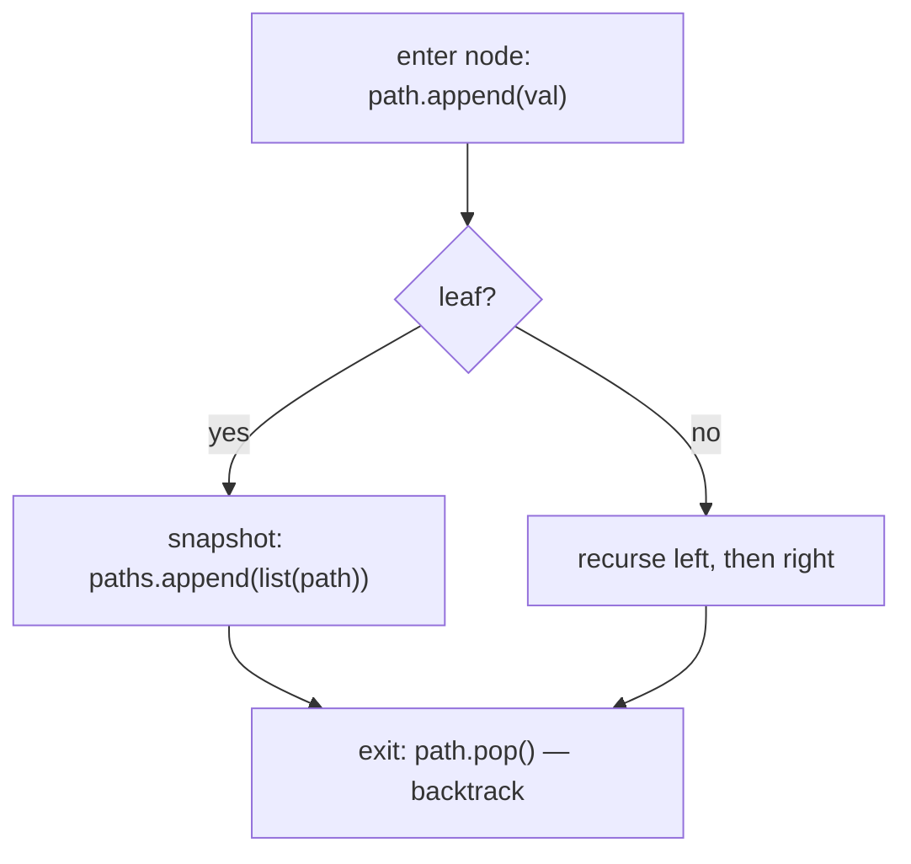

# Pattern: Root-to-Leaf Path (Stateful)

## Why It Exists

[Root-to-leaf-stateless](/cortex/data-structures-and-algorithms/trees/binary-tree/pattern-root-to-leaf-path-stateless/pattern) answered *summaries* — the sum of all paths, whether any path hits `k`, how many are even. But some questions want the **paths themselves**: "return every root-to-leaf path," "list all paths summing to `k`." Now a passed-down number isn't enough — you have to *materialize* each concrete sequence of nodes.

The trick is to maintain **one** shared list that always holds the path from the root to the node you're currently visiting. You **append** the node on the way in, and at a leaf you **snapshot** a copy of that list into your results; then — the crucial move — you **pop** the node on the way out, so the list is exactly right for the next branch. That append-enter / pop-exit dance is **backtracking**: a single mutable buffer reused across the whole tree instead of building a fresh path per node. It costs `O(n)` work to walk plus `O(L)` to copy out the `L` leaf paths.

## See It Work

Collect **every** root-to-leaf path. For `[1, 2, 3]` that's `[[1, 2], [1, 3]]`. Watch the shared path grow on the way down and shrink as we back out. Pick a case and **Run** it.

```python run viz=binary-tree viz-root=root
import json
from collections import deque

class TreeNode:
    def __init__(self, val, left=None, right=None):
        self.val = val
        self.left = left
        self.right = right

def all_paths(root):
    paths, path = [], []
    def dfs(node):
        if node is None:
            return
        path.append(node.val)                       # ENTER: extend the shared path
        if node.left is None and node.right is None:
            paths.append(list(path))                # LEAF: snapshot a COPY
        else:
            dfs(node.left)
            dfs(node.right)
        path.pop()                                  # EXIT: backtrack (undo the append)
    dfs(root)
    return paths

def build_tree(values):              # [1, 2, 3, null, 4] level-order → root
    if not values:
        return None
    root = TreeNode(values[0])
    queue = deque([root])
    i = 1
    while queue and i < len(values):
        node = queue.popleft()
        if i < len(values):
            v = values[i]; i += 1
            if v is not None:
                node.left = TreeNode(v); queue.append(node.left)
        if i < len(values):
            v = values[i]; i += 1
            if v is not None:
                node.right = TreeNode(v); queue.append(node.right)
    return root

root = build_tree(json.loads(input()))   # the test case's level-order values
print(all_paths(root))
```

```java run viz=binary-tree viz-root=root
import java.util.*;

public class Main {
  static class TreeNode {
    int val; TreeNode left, right;
    TreeNode(int val) { this.val = val; }
  }

  static List<List<Integer>> allPaths(TreeNode root) {
    List<List<Integer>> paths = new ArrayList<>();
    dfs(root, new ArrayList<>(), paths);
    return paths;
  }

  static void dfs(TreeNode node, List<Integer> path, List<List<Integer>> paths) {
    if (node == null) return;
    path.add(node.val);                                      // ENTER: extend the shared path
    if (node.left == null && node.right == null)
      paths.add(new ArrayList<>(path));                      // LEAF: snapshot a COPY
    else { dfs(node.left, path, paths); dfs(node.right, path, paths); }
    path.remove(path.size() - 1);                            // EXIT: backtrack
  }

  public static void main(String[] args) {
    Scanner sc = new Scanner(System.in);
    TreeNode root = buildTree(parseIntegerArray(sc.nextLine()));
    System.out.println(allPaths(root));
  }

  static TreeNode buildTree(Integer[] values) {   // [1, 2, 3, null, 4] level-order → root
    if (values.length == 0 || values[0] == null) return null;
    TreeNode root = new TreeNode(values[0]);
    Deque<TreeNode> queue = new ArrayDeque<>();    // build queue: only real nodes, ArrayDeque ok
    queue.add(root);
    int i = 1;
    while (!queue.isEmpty() && i < values.length) {
      TreeNode node = queue.poll();
      if (i < values.length) {
        Integer v = values[i++];
        if (v != null) { node.left = new TreeNode(v); queue.add(node.left); }
      }
      if (i < values.length) {
        Integer v = values[i++];
        if (v != null) { node.right = new TreeNode(v); queue.add(node.right); }
      }
    }
    return root;
  }

  // "[1, 2, null, 4]" → {1, 2, null, 4} — reads the test case's level-order values
  static Integer[] parseIntegerArray(String line) {
    String inner = line.replaceAll("[\\[\\]\\s]", "");
    if (inner.isEmpty()) return new Integer[0];
    String[] parts = inner.split(",");
    Integer[] out = new Integer[parts.length];
    for (int i = 0; i < parts.length; i++)
      out[i] = parts[i].equals("null") ? null : Integer.parseInt(parts[i]);
    return out;
  }
}
```

```testcases
{
  "args": [
    { "id": "root", "label": "root", "type": "tree", "placeholder": "[1, 2, 3]" }
  ],
  "cases": [
    { "args": { "root": "[1, 2, 3]" }, "expected": "[[1, 2], [1, 3]]" },
    { "args": { "root": "[5, 4, 8, 11, null, 13, 4, 7, 2, null, null, null, 1]" }, "expected": "[[5, 4, 11, 7], [5, 4, 11, 2], [5, 8, 13], [5, 8, 4, 1]]" },
    { "args": { "root": "[1]" }, "expected": "[[1]]" },
    { "args": { "root": "[]" }, "expected": "[]" }
  ]
}
```

## How It Works

One recursion, one shared `path`, three moves per node:

1. **Enter** — `path.append(node.val)`. The list now spells the route root → here.
2. **At a leaf** — `paths.append(list(path))`. Copy the list (a *snapshot*), because `path` will keep mutating.
3. **Exit** — `path.pop()`, *unconditionally*, after visiting children. This undoes step 1 so the parent's loop sees the path it had before descending into this child.



<p align="center"><strong>append on the way down, snapshot at a leaf, pop on the way back up; the same list is reused for every branch.</strong></p>

The append and the pop must be **balanced** — every push has exactly one matching pop on the way out — so that when control returns to a node's parent, `path` is restored to the parent's prefix. The leaf snapshot must be a **copy** (`list(path)`), because the live `path` keeps changing; store the reference and every "saved" path would end up identical (and empty) at the end. This is the canonical backtracking skeleton — the same enter/record/exit shape powers subsets, permutations, and combinations.

### Key Takeaway

When you need the *actual* root-to-leaf paths, keep **one** shared path list: append on enter, snapshot a **copy** at each leaf, and **pop on exit** to backtrack. Balanced push/pop keeps the buffer correct for every branch; the copy keeps each saved path from being clobbered. `O(n)` to walk + `O(L)` to emit.

## Trace It

`all_paths` on `[1, 2, 3]` — watch `path` and `paths`:

| step | action | `path` | `paths` |
|---|---|---|---|
| enter `1` | append | `[1]` | `[]` |
| enter `2` (leaf) | append, snapshot | `[1, 2]` | `[[1, 2]]` |
| exit `2` | pop | `[1]` | `[[1, 2]]` |
| enter `3` (leaf) | append, snapshot | `[1, 3]` | `[[1, 2], [1, 3]]` |
| exit `3` | pop | `[1]` | `[[1, 2], [1, 3]]` |
| exit `1` | pop | `[]` | `[[1, 2], [1, 3]]` |

Before you read on: two lines look almost optional — the `list(path)` *copy* at the leaf, and the `path.pop()` on exit. Suppose you "simplify" by storing `path` directly (no copy) **and** drop the pop. What does `all_paths([1, 2, 3])` return then, and why?

You'd get **`[[1, 2, 3], [1, 2, 3]]`** — two references to the *same* never-unwound list. Here's the chain of failures. First, `paths.append(path)` without a copy stores a *reference* to the one shared list, not its current contents — so `paths` ends up holding the same object twice, and whatever `path` looks like at the very end is what you "see" through both entries. Second, dropping `path.pop()` means the buffer is never unwound: after visiting `2` the list is `[1, 2]`, and you descend into `3` *without* removing `2`, so the list becomes `[1, 2, 3]` — already wrong (`3` is not a child of `2`), and it stays that way to the end. The copy fixes the aliasing (each snapshot is frozen at its leaf); the pop fixes the buffer (each branch starts from the correct prefix). Both are load-bearing: omit the copy and all results alias to one list; omit the pop and the prefixes bleed across siblings. This is *the* backtracking bug, and it's why the enter/record/exit triple is always written together.

## Your Turn

All paths plus **path-sum II** (every root-to-leaf path summing to a target) — same skeleton, a predicate at the leaf:

```python run viz=binary-tree viz-root=root
import json
from collections import deque

class TreeNode:
    def __init__(self, val, left=None, right=None):
        self.val = val; self.left = left; self.right = right

def all_paths(root):
    # Your code goes here — shared path list, append on enter, snapshot at leaf, pop on exit
    pass

def path_sum_ii(root, target):
    # Your code goes here — same skeleton but only snapshot when rem == 0 at a leaf
    pass

def build_tree(values):              # [1, 2, 3, null, 4] level-order → root
    if not values:
        return None
    root = TreeNode(values[0])
    queue = deque([root])
    i = 1
    while queue and i < len(values):
        node = queue.popleft()
        if i < len(values):
            v = values[i]; i += 1
            if v is not None:
                node.left = TreeNode(v); queue.append(node.left)
        if i < len(values):
            v = values[i]; i += 1
            if v is not None:
                node.right = TreeNode(v); queue.append(node.right)
    return root

root = build_tree(json.loads(input()))   # the test case's level-order values
target = int(input())
print(all_paths(root))
print(path_sum_ii(root, target))
```

```java run viz=binary-tree viz-root=root
import java.util.*;

public class Main {
  static class TreeNode {
    int val; TreeNode left, right;
    TreeNode(int val) { this.val = val; }
  }

  static List<List<Integer>> allPaths(TreeNode root) {
    // Your code goes here — shared path list, add on enter, snapshot at leaf, remove on exit
    return new ArrayList<>();
  }

  static List<List<Integer>> pathSumII(TreeNode root, int target) {
    // Your code goes here — same skeleton but only snapshot when rem == 0 at a leaf
    return new ArrayList<>();
  }

  public static void main(String[] args) {
    Scanner sc = new Scanner(System.in);
    TreeNode root = buildTree(parseIntegerArray(sc.nextLine()));
    int target = Integer.parseInt(sc.nextLine().trim());
    System.out.println(allPaths(root));
    System.out.println(pathSumII(root, target));
  }

  static TreeNode buildTree(Integer[] values) {
    if (values.length == 0 || values[0] == null) return null;
    TreeNode root = new TreeNode(values[0]);
    Deque<TreeNode> queue = new ArrayDeque<>();
    queue.add(root);
    int i = 1;
    while (!queue.isEmpty() && i < values.length) {
      TreeNode node = queue.poll();
      if (i < values.length) {
        Integer v = values[i++];
        if (v != null) { node.left = new TreeNode(v); queue.add(node.left); }
      }
      if (i < values.length) {
        Integer v = values[i++];
        if (v != null) { node.right = new TreeNode(v); queue.add(node.right); }
      }
    }
    return root;
  }

  static Integer[] parseIntegerArray(String line) {
    String inner = line.replaceAll("[\\[\\]\\s]", "");
    if (inner.isEmpty()) return new Integer[0];
    String[] parts = inner.split(",");
    Integer[] out = new Integer[parts.length];
    for (int i = 0; i < parts.length; i++)
      out[i] = parts[i].equals("null") ? null : Integer.parseInt(parts[i]);
    return out;
  }
}
```

```testcases
{
  "args": [
    { "id": "root", "label": "root", "type": "tree", "placeholder": "[5, 4, 8, 11, null, 13, 4, 7, 2, null, null, null, 1]" },
    { "id": "target", "label": "target", "type": "int", "placeholder": "22" }
  ],
  "cases": [
    { "args": { "root": "[5, 4, 8, 11, null, 13, 4, 7, 2, null, null, null, 1]", "target": "22" }, "expected": "[[5, 4, 11, 7], [5, 4, 11, 2], [5, 8, 13], [5, 8, 4, 1]]\n[[5, 4, 11, 2]]" },
    { "args": { "root": "[1, 2, 3]", "target": "3" }, "expected": "[[1, 2], [1, 3]]\n[[1, 2]]" },
    { "args": { "root": "[1]", "target": "1" }, "expected": "[[1]]\n[[1]]" },
    { "args": { "root": "[]", "target": "0" }, "expected": "[]\n[]" }
  ]
}
```

<details>
<summary>Editorial</summary>

`all_paths`: shared `path` list, append on enter, copy at leaf, pop on exit. `path_sum_ii`: same skeleton with a running `rem = target - node.val`; at a leaf, snapshot only when `rem == node.val` (i.e. `rem - node.val == 0`). The path travels purely as the shared buffer; the remaining target travels as the argument, so left/right subtrees can't cross-contaminate.

```python solution time=O(n) space=O(h)
import json
from collections import deque

class TreeNode:
    def __init__(self, val, left=None, right=None):
        self.val = val; self.left = left; self.right = right

def all_paths(root):
    paths, path = [], []
    def dfs(node):
        if node is None:
            return
        path.append(node.val)
        if node.left is None and node.right is None:
            paths.append(list(path))
        else:
            dfs(node.left)
            dfs(node.right)
        path.pop()
    dfs(root)
    return paths

def path_sum_ii(root, target):
    paths, path = [], []
    def dfs(node, rem):
        if node is None: return
        path.append(node.val)
        if node.left is None and node.right is None and rem == node.val:
            paths.append(list(path))
        else:
            dfs(node.left, rem - node.val); dfs(node.right, rem - node.val)
        path.pop()
    dfs(root, target)
    return paths

def build_tree(values):              # [1, 2, 3, null, 4] level-order → root
    if not values:
        return None
    root = TreeNode(values[0])
    queue = deque([root])
    i = 1
    while queue and i < len(values):
        node = queue.popleft()
        if i < len(values):
            v = values[i]; i += 1
            if v is not None:
                node.left = TreeNode(v); queue.append(node.left)
        if i < len(values):
            v = values[i]; i += 1
            if v is not None:
                node.right = TreeNode(v); queue.append(node.right)
    return root

root = build_tree(json.loads(input()))   # the test case's level-order values
target = int(input())
print(all_paths(root))
print(path_sum_ii(root, target))
```

```java solution
import java.util.*;

public class Main {
  static class TreeNode {
    int val; TreeNode left, right;
    TreeNode(int val) { this.val = val; }
  }

  static List<List<Integer>> allPaths(TreeNode root) {
    List<List<Integer>> paths = new ArrayList<>();
    dfsAll(root, new ArrayList<>(), paths);
    return paths;
  }

  static void dfsAll(TreeNode node, List<Integer> path, List<List<Integer>> paths) {
    if (node == null) return;
    path.add(node.val);
    if (node.left == null && node.right == null)
      paths.add(new ArrayList<>(path));
    else { dfsAll(node.left, path, paths); dfsAll(node.right, path, paths); }
    path.remove(path.size() - 1);
  }

  static List<List<Integer>> pathSumII(TreeNode root, int target) {
    List<List<Integer>> paths = new ArrayList<>();
    dfsSum(root, target, new ArrayList<>(), paths);
    return paths;
  }

  static void dfsSum(TreeNode node, int rem, List<Integer> path, List<List<Integer>> paths) {
    if (node == null) return;
    path.add(node.val);
    if (node.left == null && node.right == null && rem == node.val)
      paths.add(new ArrayList<>(path));
    else { dfsSum(node.left, rem - node.val, path, paths); dfsSum(node.right, rem - node.val, path, paths); }
    path.remove(path.size() - 1);
  }

  public static void main(String[] args) {
    Scanner sc = new Scanner(System.in);
    TreeNode root = buildTree(parseIntegerArray(sc.nextLine()));
    int target = Integer.parseInt(sc.nextLine().trim());
    System.out.println(allPaths(root));
    System.out.println(pathSumII(root, target));
  }

  static TreeNode buildTree(Integer[] values) {
    if (values.length == 0 || values[0] == null) return null;
    TreeNode root = new TreeNode(values[0]);
    Deque<TreeNode> queue = new ArrayDeque<>();
    queue.add(root);
    int i = 1;
    while (!queue.isEmpty() && i < values.length) {
      TreeNode node = queue.poll();
      if (i < values.length) {
        Integer v = values[i++];
        if (v != null) { node.left = new TreeNode(v); queue.add(node.left); }
      }
      if (i < values.length) {
        Integer v = values[i++];
        if (v != null) { node.right = new TreeNode(v); queue.add(node.right); }
      }
    }
    return root;
  }

  static Integer[] parseIntegerArray(String line) {
    String inner = line.replaceAll("[\\[\\]\\s]", "");
    if (inner.isEmpty()) return new Integer[0];
    String[] parts = inner.split(",");
    Integer[] out = new Integer[parts.length];
    for (int i = 0; i < parts.length; i++)
      out[i] = parts[i].equals("null") ? null : Integer.parseInt(parts[i]);
    return out;
  }
}
```

</details>

## Reflect & Connect

Drill the family in **Practice** — [Root-to-Leaf Paths Summing to Target](/cortex/data-structures-and-algorithms/trees/binary-tree/pattern-root-to-leaf-path-stateful/problems/root-to-leaf-paths-summing-to-target), [Equal Evens and Odds Paths](/cortex/data-structures-and-algorithms/trees/binary-tree/pattern-root-to-leaf-path-stateful/problems/equal-evens-and-odds-paths), [Duplicate Paths](/cortex/data-structures-and-algorithms/trees/binary-tree/pattern-root-to-leaf-path-stateful/problems/duplicate-paths), and [Prefix Paths](/cortex/data-structures-and-algorithms/trees/binary-tree/pattern-root-to-leaf-path-stateful/problems/prefix-paths).

Stateful root-to-leaf is the materialize-the-paths sibling of the stateless summary:

- **The family** — all root-to-leaf paths, path-sum II (paths equal to `k`), paths matching a parity/duplicate condition. The descent and backtracking are identical; only the leaf test and what you snapshot change.
- **It's backtracking** — append-enter / record / pop-exit is the exact skeleton behind subsets, permutations, and combinations. A tree makes the "choice" structure literal: each edge is a choice, each leaf a complete candidate.
- **Stateless vs stateful, decided** — need a *number about* the paths (sum/exists/count)? Carry a value down and aggregate up — [stateless](/cortex/data-structures-and-algorithms/trees/binary-tree/pattern-root-to-leaf-path-stateless/pattern), no cleanup. Need the *paths themselves*? Shared list + backtracking — stateful. The cost of stateful is the discipline: balanced push/pop and a copy at the leaf.

**Prerequisites:** [Root-to-Leaf Path (Stateless)](/cortex/data-structures-and-algorithms/trees/binary-tree/pattern-root-to-leaf-path-stateless/pattern).
**What's next:** stop going depth-first — visit the tree level by level with a queue — [Level-Order Traversal](/cortex/data-structures-and-algorithms/trees/binary-tree/pattern-level-order-traversal/pattern).

## Recall

> **Mnemonic:** *One shared path: append on ENTER, snapshot a COPY at the LEAF, pop on EXIT. Balanced push/pop, copy-don't-alias. Paths themselves → stateful; a number about them → stateless.*

| | |
|---|---|
| Enter (top-down) | `path.append(node.val)` — extend the shared route |
| At a leaf | `paths.append(list(path))` — snapshot a **copy** |
| Exit (bottom-up) | `path.pop()` — **unconditional** backtrack |
| Two load-bearing lines | the copy (no aliasing) + the pop (correct prefix per branch) |
| Use when | you need the *actual paths*, not a summary number |

<details>
<summary><strong>Q:</strong> Why snapshot `list(path)` instead of `path` at a leaf?</summary>

**A:** `path` keeps mutating; storing the reference makes every saved path alias the same (eventually wrong) list.

</details>
<details>
<summary><strong>Q:</strong> Why must the pop be unconditional?</summary>

**A:** It must undo the enter on *every* exit so the parent's other branch starts from the correct prefix; skip it and prefixes bleed across siblings.

</details>
<details>
<summary><strong>Q:</strong> When stateful vs stateless root-to-leaf?</summary>

**A:** Stateful to collect the *paths themselves*; stateless for a *summary* (sum / exists / count).

</details>
<details>
<summary><strong>Q:</strong> What general technique is this?</summary>

**A:** Backtracking — the append-enter / record / pop-exit skeleton shared with subsets, permutations, and combinations.

</details>

## Sources & Verify

- **CLRS**, *Introduction to Algorithms*, 4th ed., §10.4 — tree traversal; recursion over paths.
- **Sedgewick & Wayne**, *Algorithms*, 4th ed., §3.2 — recursive path enumeration.
- Binary Tree Paths and Path Sum II (LeetCode 257, 113) are the standard statements; both runnable blocks are verified by running (`all_paths ⇒ [[1,2],[1,3]]` and the 5-leaf list; `path_sum_ii 22 ⇒ [[5,4,11,2],[5,8,4,5]]`).
