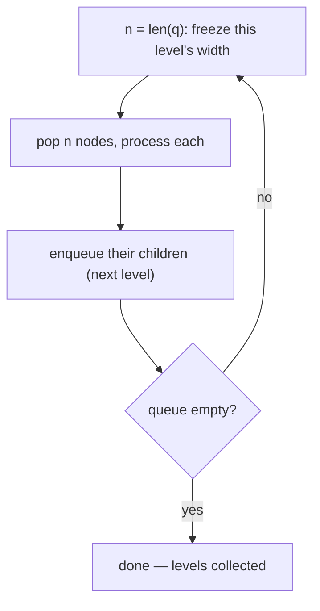

# Pattern: Level-Order Traversal

## Why It Exists

Every pattern so far went **depth-first** — down one branch, all the way to a leaf, then back up. But a whole class of questions is about **levels**, not paths: "sum each level," "return the rightmost node on each level," "print the tree in zigzag," "are these two nodes cousins (same depth, different parent)?" Depth-first visits node `7` long before node `15`'s sibling on another branch — it has no notion of "all the nodes at depth 2."

**Breadth-first search** with a queue does: it visits nodes in increasing distance from the root. The catch is that a plain BFS gives you one flat stream of nodes with the level boundaries erased. The fix is one line — at the top of each round, **snapshot the queue's current length** and drain *exactly that many* nodes. Those `n` nodes are precisely the current level (their children, queued during the drain, wait for the next round). That `n = len(queue)` snapshot *is* the level boundary, and it turns BFS into a level-by-level loop. `O(n)` time, `O(w)` space where `w` is the maximum width.

## See It Work

Group the nodes by level. For the tree below, that's `[[3], [9, 20], [15, 7]]`. The `n = len(q)` line freezes each level's width before we enqueue its children. Run it.

```python run viz=binary-tree viz-root=root
from collections import deque

class TreeNode:
    def __init__(self, val, left=None, right=None):
        self.val = val
        self.left = left
        self.right = right

def level_order(root):
    if root is None:
        return []
    levels, q = [], deque([root])
    while q:
        n = len(q)                       # SNAPSHOT this level's width
        level = []
        for _ in range(n):               # drain exactly n → one level
            node = q.popleft()
            level.append(node.val)
            if node.left:  q.append(node.left)    # children wait for next round
            if node.right: q.append(node.right)
        levels.append(level)
    return levels

root = TreeNode(3, TreeNode(9), TreeNode(20, TreeNode(15), TreeNode(7)))
print(level_order(root))     # [[3], [9, 20], [15, 7]]
```

## How It Works

A queue (FIFO), seeded with the root, drained one level per outer iteration:

1. **Snapshot** `n = len(q)` — the number of nodes currently queued *is* this level's size.
2. **Drain `n`** times: pop a node, process it, and enqueue its children (which belong to the *next* level).
3. After the inner loop, the queue holds exactly the next level; repeat until empty.



<p align="center"><strong>each round freezes the level width <code>n</code>, drains those <code>n</code> nodes, and the children they enqueue become the next round's level.</strong></p>

The snapshot is the whole trick. Inside the inner loop you're *appending* children to the **same** queue you're *draining* — so without freezing `n` first, the `for` would keep running into the children and merge two levels into one. Capture `n` before the drain and the boundary is exact. From this skeleton: **level sum / average** (aggregate `level`), **right-side view** (take the node at `i == n-1`), **zigzag** (alternate append-left / append-right per level), **deepest-leaves sum** (keep only the last level's total), **cousins** (track each node's depth and parent). FIFO order guarantees nodes come out nearest-first; the snapshot slices that stream into levels.

### Key Takeaway

Level-order is BFS with a queue **plus** a level boundary: snapshot `n = len(queue)` at the top of each round and drain exactly `n` nodes — those are one level; their children form the next. Without the snapshot the levels merge. `O(n)` time, `O(w)` space (max width).

## Trace It

`level_order` on `3(9, 20(15, 7))` — `q` shown *before* each round's drain:

| round | `n` | drained (this level) | enqueued (next) | `levels` |
|---|---|---|---|---|
| 1 | `1` | `3` | `9, 20` | `[[3]]` |
| 2 | `2` | `9, 20` | `15, 7` | `[[3], [9, 20]]` |
| 3 | `2` | `15, 7` | — | `[[3], [9, 20], [15, 7]]` |

Before you read on: the inner loop runs `for _ in range(n)` where `n` was captured *before* the drain. Suppose you delete that snapshot and instead loop `while q:` directly (popping until the queue empties) — what does the output look like, and why does the level structure collapse?

You'd get a **single flat level holding every node** — `[[3, 9, 20, 15, 7]]` — because the boundary disappears. Walk it: you pop `3` and enqueue `9, 20`; the inner `while q` doesn't stop there — `q` is non-empty, so it pops `9` (enqueues nothing), then `20` (enqueues `15, 7`), then `15`, then `7`, draining the whole tree in one pass. The nodes still come out in correct breadth-first *order* (`3, 9, 20, 15, 7`), but they all land in the same `level` list because nothing ever told the loop "stop — the rest belong to the next level." The `n = len(q)` snapshot is exactly that signal: at the instant you take it, the queue holds *only* the current level (children haven't been added yet), so `range(n)` drains precisely those and no more. The children enqueued during the drain are invisible to this round's count and wait for the next `len(q)`. This is why the snapshot must be read *before* the inner loop, and why it's the one line that separates "BFS" from "level-order BFS." Forget it and every per-level query — level sums, right-side view, zigzag — silently collapses into a single bucket.

## Your Turn

Level groups, plus **right-side view** (last node per level) and **zigzag** (alternating direction) — all the same drain-`n` skeleton:

```python run viz=binary-tree viz-root=root
from collections import deque

class TreeNode:
    def __init__(self, val, left=None, right=None):
        self.val = val; self.left = left; self.right = right

def level_order(root):
    if root is None: return []
    levels, q = [], deque([root])
    while q:
        n = len(q); level = []
        for _ in range(n):
            node = q.popleft()
            level.append(node.val)
            if node.left:  q.append(node.left)
            if node.right: q.append(node.right)
        levels.append(level)
    return levels

def right_side_view(root):
    if root is None: return []
    out, q = [], deque([root])
    while q:
        n = len(q)
        for i in range(n):
            node = q.popleft()
            if i == n - 1: out.append(node.val)     # last node of the level
            if node.left:  q.append(node.left)
            if node.right: q.append(node.right)
    return out

def zigzag(root):
    if root is None: return []
    out, q, ltr = [], deque([root]), True
    while q:
        n = len(q); level = deque()
        for _ in range(n):
            node = q.popleft()
            level.append(node.val) if ltr else level.appendleft(node.val)
            if node.left:  q.append(node.left)
            if node.right: q.append(node.right)
        out.append(list(level)); ltr = not ltr
    return out

root = TreeNode(3, TreeNode(9), TreeNode(20, TreeNode(15), TreeNode(7)))
print(level_order(root))        # [[3], [9, 20], [15, 7]]
print(right_side_view(root))    # [3, 20, 7]
print(zigzag(root))             # [[3], [20, 9], [15, 7]]
```

```java run viz=binary-tree viz-root=root
import java.util.*;
public class Main {
  static class TreeNode { int val; TreeNode left, right; TreeNode(int v){ val = v; } TreeNode(int v, TreeNode l, TreeNode r){ val=v; left=l; right=r; } }

  static List<List<Integer>> levelOrder(TreeNode root) {
    List<List<Integer>> out = new ArrayList<>();
    if (root == null) return out;
    Deque<TreeNode> q = new ArrayDeque<>();
    q.add(root);
    while (!q.isEmpty()) {
      int n = q.size();                              // snapshot this level's width
      List<Integer> level = new ArrayList<>();
      for (int i = 0; i < n; i++) {
        TreeNode node = q.poll();
        level.add(node.val);
        if (node.left != null)  q.add(node.left);
        if (node.right != null) q.add(node.right);
      }
      out.add(level);
    }
    return out;
  }
  public static void main(String[] args) {
    TreeNode root = new TreeNode(3, new TreeNode(9), new TreeNode(20, new TreeNode(15), new TreeNode(7)));
    System.out.println(levelOrder(root));   // [[3], [9, 20], [15, 7]]
  }
}
```

Drill the family in **Practice** — [Level Sum](/cortex/data-structures-and-algorithms/trees/binary-tree/pattern-level-order-traversal/problems/level-sum), [Deepest Leaves Sum](/cortex/data-structures-and-algorithms/trees/binary-tree/pattern-level-order-traversal/problems/deepest-leaves-sum), [Complete Binary Tree Check](/cortex/data-structures-and-algorithms/trees/binary-tree/pattern-level-order-traversal/problems/complete-binary-tree-check), [Zigzag Traversal](/cortex/data-structures-and-algorithms/trees/binary-tree/pattern-level-order-traversal/problems/zigzag-traversal), and [Cousin Check](/cortex/data-structures-and-algorithms/trees/binary-tree/pattern-level-order-traversal/problems/cousin-check).

## Reflect & Connect

Level-order is the breadth-first counterpart to every depth-first tree pattern:

- **The family** — per-level group / sum / average, right-side view, zigzag, deepest-leaves sum, complete-tree check, cousins. All share the queue + `len(queue)` snapshot; only the per-level bookkeeping differs.
- **BFS vs DFS** — depth-first ([preorder](/cortex/data-structures-and-algorithms/trees/binary-tree/pattern-preorder-traversal-stateless/pattern)/[postorder](/cortex/data-structures-and-algorithms/trees/binary-tree/pattern-postorder-traversal-stateless/pattern)) follows *paths* with a stack/recursion; breadth-first follows *levels* with a queue. Reach for BFS the moment the question mentions depth, levels, "nearest," or shortest unweighted distance.
- **It's graph BFS on a tree** — this exact queue + frontier-by-frontier expansion is [graph breadth-first search](/cortex/data-structures-and-algorithms/graphs-pattern-breadth-first-search-pattern); a tree is just a graph with no cycles, so no `visited` set is needed. Learn it here and graph shortest-path BFS is the same loop.

**Prerequisites:** [Recursive Traversals](/cortex/data-structures-and-algorithms/trees/binary-tree/recursive-traversals-in-binary-trees).
**What's next:** group nodes by horizontal column instead of by level — BFS carrying a coordinate — [Level-Order Traversal (Columns)](/cortex/data-structures-and-algorithms/trees/binary-tree/pattern-level-order-traversal-columns/pattern).

## Recall

> **Mnemonic:** *Queue + snapshot `n = len(q)` at the top of each round; drain exactly `n` → that's one level; their children are the next. Forget the snapshot and all levels merge into one.*

| | |
|---|---|
| Data structure | a queue (FIFO), seeded with the root |
| Level boundary | `n = len(q)` captured **before** the inner drain |
| Inner loop | pop `n` nodes, process, enqueue their children |
| Why it works | at snapshot time the queue holds *only* this level |
| Family | level sum, right-side view, zigzag, deepest leaves, cousins |

<details>
<summary><strong>Q:</strong> What makes BFS "level-order" rather than a flat stream?</summary>

**A:** Snapshotting `n = len(queue)` before draining, so each round processes exactly one level's worth of nodes.

</details>
<details>
<summary><strong>Q:</strong> Why must the snapshot come before the inner loop?</summary>

**A:** The drain enqueues children into the same queue; if you don't freeze `n` first, those children get counted in the current level and the boundaries merge.

</details>
<details>
<summary><strong>Q:</strong> When choose BFS over DFS on a tree?</summary>

**A:** When the question is about levels/depth/nearest — level sums, right-side view, zigzag, shortest unweighted distance.

</details>
<details>
<summary><strong>Q:</strong> How does this relate to graphs?</summary>

**A:** It's graph BFS with no `visited` set (a tree has no cycles); the frontier-by-frontier loop is identical.

</details>

## Sources & Verify

- **CLRS**, *Introduction to Algorithms*, 4th ed., §20.2 — breadth-first search.
- **Sedgewick & Wayne**, *Algorithms*, 4th ed., §4.1 — BFS and the queue frontier.
- Binary Tree Level Order Traversal, Right Side View, and Zigzag (LeetCode 102, 199, 103) are the standard statements; all runnable blocks are verified by running (`level_order ⇒ [[3],[9,20],[15,7]]`; `right_side_view ⇒ [3,20,7]`; `zigzag ⇒ [[3],[20,9],[15,7]]`).
