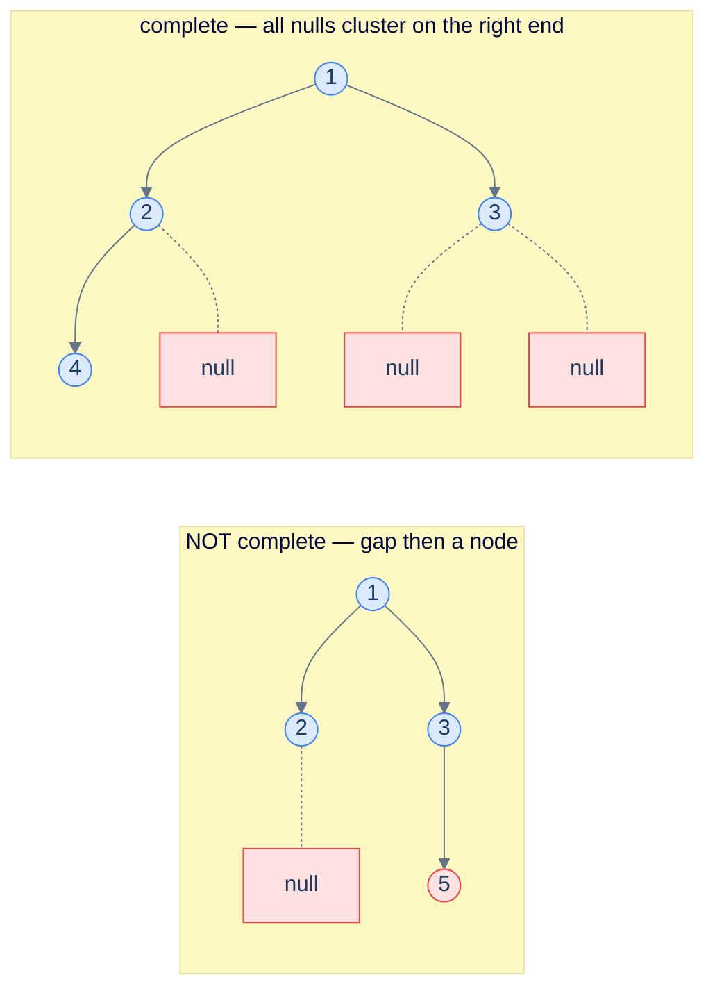

# Problem 3 — Complete binary tree check

> Return `true` iff the tree is *complete* — every level full except possibly the last, which is filled left-to-right with no gaps.

Trick: do a level-order traversal that **enqueues `null` children too** (don't skip them). Walk the queue; the moment you see a `null`, set a flag; if you ever see a *non-null* node *after* the flag is set, the tree is not complete (gap detected). If you finish without that happening, it's complete.



<p align="center"><strong>Completeness check — enqueue every child including nulls. Walk the resulting queue; once you've seen a null, no real node may follow. The left tree fails because node 5 follows a null.</strong></p>

<details>
<summary><h2>Solution</h2></summary>


```python run viz=binary-tree viz-root=root
def is_complete(root):
    if root is None: return True
    q = deque([root]); seen_null = False
    while q:
        n = q.popleft()
        if n is None:
            seen_null = True
        else:
            if seen_null: return False
            q.append(n.left); q.append(n.right)
    return True
```

```java run viz=binary-tree viz-root=root
public static boolean isComplete(TreeNode root) {
    if (root == null) return true;
    Deque<TreeNode> q = new ArrayDeque<>();
    // ArrayDeque can't store null; use LinkedList for null support, OR use a sentinel.
    Queue<TreeNode> qq = new java.util.LinkedList<>();
    qq.offer(root);
    boolean seenNull = false;
    while (!qq.isEmpty()) {
        TreeNode n = qq.poll();
        if (n == null) seenNull = true;
        else {
            if (seenNull) return false;
            qq.offer(n.left); qq.offer(n.right);
        }
    }
    return true;
}
```

</details>
