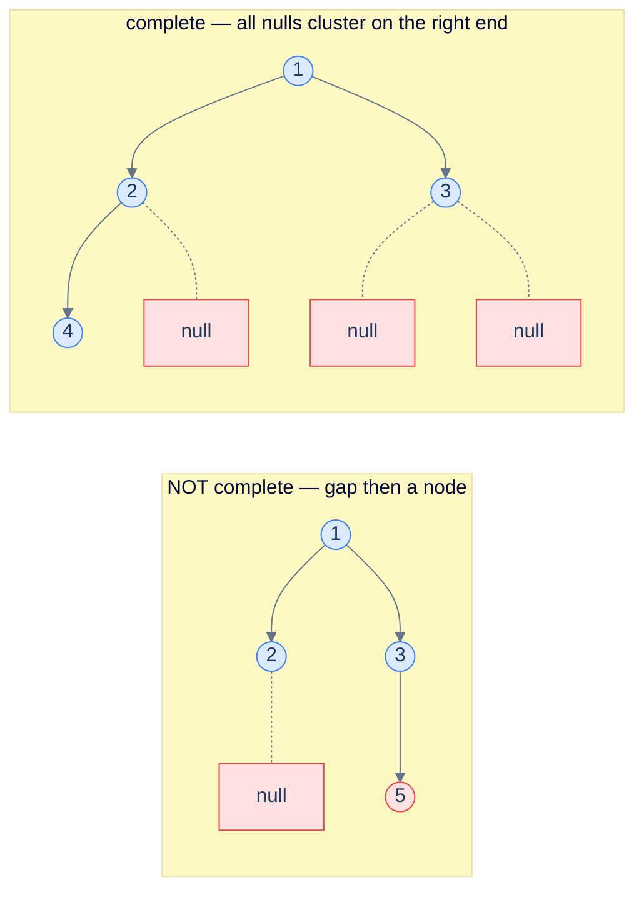

# Problem 3 — Complete binary tree check

## Problem Statement

Return `true` iff the tree is *complete* — every level full except possibly the last, which is filled left-to-right with no gaps.

Trick: do a level-order traversal that **enqueues `null` children too** (don't skip them). Walk the queue; the moment you see a `null`, set a flag; if you ever see a *non-null* node *after* the flag is set, the tree is not complete (gap detected). If you finish without that happening, it's complete.

## Examples

**Example 1:**
```
Input:  root = [1, 2, 3, 4]
Output: true
```

**Example 2:**
```
Input:  root = [1, 2, 3, null, 5]
Output: false
```



<p align="center"><strong>Completeness check — enqueue every child including nulls. Walk the resulting queue; once you've seen a null, no real node may follow. The left tree fails because node 5 follows a null.</strong></p>

## Constraints

- `0 ≤ number of nodes ≤ 10⁴`
- `1 ≤ node.val ≤ 10⁴`

```python run viz=binary-tree viz-root=root
import json
from collections import deque

class TreeNode:
    def __init__(self, val, left=None, right=None):
        self.val = val
        self.left = left
        self.right = right

class Solution:
    def is_complete(self, root):
        # Your code goes here — enqueue null children too; once you see a null,
        # set a flag; if a non-null node follows, return false. Return true if done.
        return True

def build_tree(values):              # [1, 2, 3, null, 4] level-order → root
    if not values:
        return None
    root = TreeNode(values[0])
    queue = deque([root])
    i = 1
    while queue and i < len(values):
        node = queue.popleft()
        if i < len(values):
            v = values[i]; i += 1
            if v is not None:
                node.left = TreeNode(v); queue.append(node.left)
        if i < len(values):
            v = values[i]; i += 1
            if v is not None:
                node.right = TreeNode(v); queue.append(node.right)
    return root

root = build_tree(json.loads(input()))   # the test case's level-order values
r = Solution().is_complete(root)
print("true" if r else "false")
```

```java run viz=binary-tree viz-root=root
import java.util.*;

public class Main {
    static class TreeNode {
        int val; TreeNode left, right;
        TreeNode(int val) { this.val = val; }
    }

    static class Solution {
        boolean isComplete(TreeNode root) {
            // Your code goes here — use a LinkedList queue (supports null);
            // enqueue both children (even nulls); once you dequeue null, set a
            // flag; a subsequent non-null means return false.
            return true;
        }
    }

    public static void main(String[] args) {
        TreeNode root = buildTree(parseIntegerArray(new Scanner(System.in).nextLine()));
        System.out.println(new Solution().isComplete(root));
    }

    static TreeNode buildTree(Integer[] values) {   // [1, 2, 3, null, 4] level-order → root
        if (values.length == 0 || values[0] == null) return null;
        TreeNode root = new TreeNode(values[0]);
        Deque<TreeNode> queue = new ArrayDeque<>();
        queue.add(root);
        int i = 1;
        while (!queue.isEmpty() && i < values.length) {
            TreeNode node = queue.poll();
            if (i < values.length) {
                Integer v = values[i++];
                if (v != null) { node.left = new TreeNode(v); queue.add(node.left); }
            }
            if (i < values.length) {
                Integer v = values[i++];
                if (v != null) { node.right = new TreeNode(v); queue.add(node.right); }
            }
        }
        return root;
    }

    // "[1, 2, null, 4]" → {1, 2, null, 4} — reads the test case's level-order values
    static Integer[] parseIntegerArray(String line) {
        String inner = line.replaceAll("[\\[\\]\\s]", "");
        if (inner.isEmpty()) return new Integer[0];
        String[] parts = inner.split(",");
        Integer[] out = new Integer[parts.length];
        for (int i = 0; i < parts.length; i++)
            out[i] = parts[i].equals("null") ? null : Integer.parseInt(parts[i]);
        return out;
    }
}
```

```testcases
{
  "args": [
    { "id": "root", "label": "root", "type": "tree", "placeholder": "[1, 2, 3, 4]" }
  ],
  "cases": [
    { "args": { "root": "[1, 2, 3, 4]" }, "expected": "true" },
    { "args": { "root": "[1, 2, 3, null, 5]" }, "expected": "false" },
    { "args": { "root": "[]" }, "expected": "true" },
    { "args": { "root": "[1]" }, "expected": "true" },
    { "args": { "root": "[1, 2, 3, 4, 5, 6, 7]" }, "expected": "true" },
    { "args": { "root": "[1, 2, 3, null, null, 6]" }, "expected": "false" }
  ]
}
```

<details>
<summary><h2>Solution</h2></summary>

Enqueue both children of every node, even when they are `null`. Walk the queue node by node: the first `null` encountered means we've passed all real nodes on the last level. Any non-null node after that null is evidence of a gap — return `false`. If the queue empties without triggering the flag, the tree is complete.

```python solution time=O(n) space=O(w)
import json
from collections import deque

class TreeNode:
    def __init__(self, val, left=None, right=None):
        self.val = val
        self.left = left
        self.right = right

class Solution:
    def is_complete(self, root):
        if root is None: return True
        q = deque([root]); seen_null = False
        while q:
            n = q.popleft()
            if n is None:
                seen_null = True
            else:
                if seen_null: return False
                q.append(n.left); q.append(n.right)
        return True

def build_tree(values):              # [1, 2, 3, null, 4] level-order → root
    if not values:
        return None
    root = TreeNode(values[0])
    queue = deque([root])
    i = 1
    while queue and i < len(values):
        node = queue.popleft()
        if i < len(values):
            v = values[i]; i += 1
            if v is not None:
                node.left = TreeNode(v); queue.append(node.left)
        if i < len(values):
            v = values[i]; i += 1
            if v is not None:
                node.right = TreeNode(v); queue.append(node.right)
    return root

root = build_tree(json.loads(input()))   # the test case's level-order values
r = Solution().is_complete(root)
print("true" if r else "false")
```

```java solution
import java.util.*;

public class Main {
    static class TreeNode {
        int val; TreeNode left, right;
        TreeNode(int val) { this.val = val; }
    }

    static class Solution {
        boolean isComplete(TreeNode root) {
            if (root == null) return true;
            Queue<TreeNode> q = new LinkedList<>();    // LinkedList: supports null entries
            q.offer(root);
            boolean seenNull = false;
            while (!q.isEmpty()) {
                TreeNode n = q.poll();
                if (n == null) {
                    seenNull = true;
                } else {
                    if (seenNull) return false;
                    q.offer(n.left);
                    q.offer(n.right);
                }
            }
            return true;
        }
    }

    public static void main(String[] args) {
        TreeNode root = buildTree(parseIntegerArray(new Scanner(System.in).nextLine()));
        System.out.println(new Solution().isComplete(root));
    }

    static TreeNode buildTree(Integer[] values) {   // [1, 2, 3, null, 4] level-order → root
        if (values.length == 0 || values[0] == null) return null;
        TreeNode root = new TreeNode(values[0]);
        Deque<TreeNode> queue = new ArrayDeque<>();
        queue.add(root);
        int i = 1;
        while (!queue.isEmpty() && i < values.length) {
            TreeNode node = queue.poll();
            if (i < values.length) {
                Integer v = values[i++];
                if (v != null) { node.left = new TreeNode(v); queue.add(node.left); }
            }
            if (i < values.length) {
                Integer v = values[i++];
                if (v != null) { node.right = new TreeNode(v); queue.add(node.right); }
            }
        }
        return root;
    }

    // "[1, 2, null, 4]" → {1, 2, null, 4} — reads the test case's level-order values
    static Integer[] parseIntegerArray(String line) {
        String inner = line.replaceAll("[\\[\\]\\s]", "");
        if (inner.isEmpty()) return new Integer[0];
        String[] parts = inner.split(",");
        Integer[] out = new Integer[parts.length];
        for (int i = 0; i < parts.length; i++)
            out[i] = parts[i].equals("null") ? null : Integer.parseInt(parts[i]);
        return out;
    }
}
```

</details>
