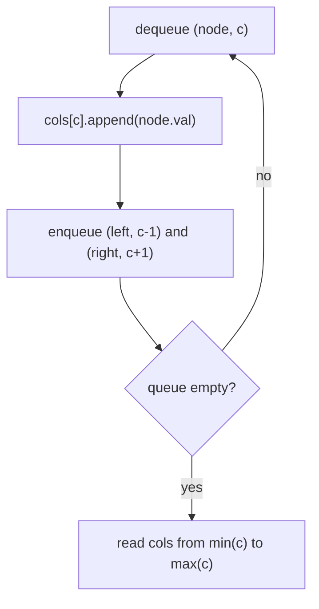

# Pattern: Level-Order Traversal (Columns)

## Why It Exists

[Level-order](/cortex/data-structures-and-algorithms/trees-binary-tree-pattern-level-order-traversal-pattern) groups nodes by **depth** (horizontal rows). But some questions group by **horizontal position** instead: "print the tree in vertical columns left to right," "what's the **top view** (the node you'd see looking straight down each column)?", "the **bottom view**?", "the diagonal order?" These need a second coordinate — not how *deep* a node is, but how far *left or right* it sits.

Give every node a **column index**: the root is column `0`, a left child is `col − 1`, a right child is `col + 1`. Run a BFS that carries `(node, col)` and **bucket** each node into `cols[col]`. Because BFS visits nodes in increasing depth, every bucket fills **top-to-bottom** automatically. Read the buckets from the smallest column to the largest and you have vertical order; keep only the **first** node in each bucket and you have the top view; the **last**, the bottom view. One traversal, three answers — all from attaching a coordinate. `O(n)` time, `O(n)` space.

## See It Work

Vertical columns, left to right. Left children drift to negative columns, right children to positive; nodes sharing a column stack top-down. Run it.

```python run viz=binary-tree viz-root=root
from collections import deque, defaultdict

class TreeNode:
    def __init__(self, val, left=None, right=None):
        self.val = val
        self.left = left
        self.right = right

def vertical_order(root):
    if root is None:
        return []
    cols = defaultdict(list)
    q = deque([(root, 0)])                       # carry (node, column)
    while q:
        node, c = q.popleft()
        cols[c].append(node.val)                 # BFS ⇒ each column fills top-down
        if node.left:  q.append((node.left,  c - 1))   # left  ⇒ column − 1
        if node.right: q.append((node.right, c + 1))   # right ⇒ column + 1
    return [cols[c] for c in range(min(cols), max(cols) + 1)]   # read left → right

root = TreeNode(3, TreeNode(9, TreeNode(4), TreeNode(11)),
                   TreeNode(20, TreeNode(15), TreeNode(7)))
print(vertical_order(root))     # [[4], [9], [3, 11, 15], [20], [7]]
```

## How It Works

A breadth-first walk that threads a column coordinate through the queue:

1. **Seed** the queue with `(root, 0)`.
2. **Pop `(node, c)`**, append `node.val` to `cols[c]`. Enqueue `(left, c−1)` and `(right, c+1)`.
3. **Read out** the columns from `min` to `max` index.



<p align="center"><strong>each node carries a column; left subtracts, right adds; BFS fills each column top-down, then columns are read left→right.</strong></p>

Why **BFS** and not DFS? Because BFS dequeues strictly in order of increasing depth, so within any single column the nodes land in the bucket **shallowest-first** — exactly top-to-bottom. That ordering is what makes the rest free: the **top view** is the *first* node placed in each column (shallowest = what you'd see from above), the **bottom view** is the *last* (deepest), and full vertical order is the whole bucket. Switch to DFS and a column's bucket fills in branch order, not depth order — the "first" node is no longer the topmost, and top-view breaks. The column index can go negative, so you read from `min(cols)` to `max(cols)`, not from `0`. (The stricter LeetCode-987 variant additionally sorts ties *within* a (row, column) cell by value; the BFS-order version here is LeetCode 314.)

### Key Takeaway

Attach a column coordinate (`root = 0`, left = `c−1`, right = `c+1`), BFS carrying `(node, col)`, and bucket by column. BFS fills each column **top-down**, so reading buckets left→right is vertical order, first-per-column is the top view, last-per-column is the bottom view. `O(n)`/`O(n)`.

## Trace It

`vertical_order` on the tree above — queue entries are `(val, col)`:

| dequeued | col `c` | `cols` after | enqueued |
|---|---|---|---|
| `(3, 0)` | `0` | `{0:[3]}` | `(9,-1), (20,1)` |
| `(9, -1)` | `-1` | `{-1:[9], 0:[3]}` | `(4,-2), (11,0)` |
| `(20, 1)` | `1` | `… 1:[20]` | `(15,0), (7,2)` |
| `(4, -2)` | `-2` | `-2:[4]` | — |
| `(11, 0)` | `0` | `0:[3, 11]` | — |
| `(15, 0)` | `0` | `0:[3, 11, 15]` | — |
| `(7, 2)` | `2` | `2:[7]` | — |

Read `-2 … 2`: `[[4], [9], [3, 11, 15], [20], [7]]`.

Before you read on: `top_view` and `bottom_view` use this *exact* loop — the only change is what you keep per column: top-view keeps the **first** node BFS puts in each column, bottom-view the **last**. Why does "first in BFS order" equal "highest up" and "last" equal "lowest down" — and what breaks if you swap BFS for a DFS preorder?

It works because **BFS dequeues in nondecreasing depth**: level 0, then level 1, then level 2, never out of order. So for a fixed column, the *first* node that lands in that bucket is the one at the smallest depth — literally the node you'd hit first looking straight down from the top. The *last* to land is the deepest — what you'd see looking up from the bottom. The column bucket is therefore implicitly sorted by depth for free, and "first/last" cleanly mean "top/bottom." Now swap in **DFS preorder**: it dives down one whole branch before touching the other, so a column's bucket fills in *branch* order, not depth order. A node deep in the left subtree can enter column `0` *before* a shallow node from the right subtree that shares column `0` — so the "first" entry is no longer the shallowest, and `top_view` returns the wrong node. (Full vertical order can be recovered with DFS *if* you also record each node's row and sort every bucket by row afterward — but then you've paid for a sort to re-derive what BFS gave you for free.) The lesson: the coordinate (column) is what *groups*, but BFS's depth-ordering is what makes first/last mean top/bottom. Keep both.

## Your Turn

Vertical order, plus **top view** (first per column) and **bottom view** (last per column) — same BFS, three reducers:

```python run viz=binary-tree viz-root=root
from collections import deque, defaultdict

class TreeNode:
    def __init__(self, val, left=None, right=None):
        self.val = val; self.left = left; self.right = right

def vertical_order(root):
    if root is None: return []
    cols = defaultdict(list)
    q = deque([(root, 0)])
    while q:
        node, c = q.popleft()
        cols[c].append(node.val)
        if node.left:  q.append((node.left,  c - 1))
        if node.right: q.append((node.right, c + 1))
    return [cols[c] for c in range(min(cols), max(cols) + 1)]

def top_view(root):
    if root is None: return []
    seen, q = {}, deque([(root, 0)])
    while q:
        node, c = q.popleft()
        if c not in seen: seen[c] = node.val        # first BFS node in the column = top
        if node.left:  q.append((node.left,  c - 1))
        if node.right: q.append((node.right, c + 1))
    return [seen[c] for c in range(min(seen), max(seen) + 1)]

def bottom_view(root):
    if root is None: return []
    seen, q = {}, deque([(root, 0)])
    while q:
        node, c = q.popleft()
        seen[c] = node.val                          # last write wins = bottom
        if node.left:  q.append((node.left,  c - 1))
        if node.right: q.append((node.right, c + 1))
    return [seen[c] for c in range(min(seen), max(seen) + 1)]

root = TreeNode(3, TreeNode(9, TreeNode(4), TreeNode(11)),
                   TreeNode(20, TreeNode(15), TreeNode(7)))
print(vertical_order(root))   # [[4], [9], [3, 11, 15], [20], [7]]
print(top_view(root))         # [4, 9, 3, 20, 7]
print(bottom_view(root))      # [4, 9, 15, 20, 7]
```

```java run viz=binary-tree viz-root=root
import java.util.*;
public class Main {
  static class TreeNode { int val; TreeNode left, right; TreeNode(int v){ val = v; } TreeNode(int v, TreeNode l, TreeNode r){ val=v; left=l; right=r; } }

  static List<List<Integer>> verticalOrder(TreeNode root) {
    List<List<Integer>> out = new ArrayList<>();
    if (root == null) return out;
    Map<Integer, List<Integer>> cols = new HashMap<>();
    int min = 0, max = 0;
    Deque<Map.Entry<TreeNode, Integer>> q = new ArrayDeque<>();
    q.add(Map.entry(root, 0));
    while (!q.isEmpty()) {
      var e = q.poll();
      TreeNode node = e.getKey(); int c = e.getValue();
      cols.computeIfAbsent(c, k -> new ArrayList<>()).add(node.val);
      min = Math.min(min, c); max = Math.max(max, c);
      if (node.left  != null) q.add(Map.entry(node.left,  c - 1));
      if (node.right != null) q.add(Map.entry(node.right, c + 1));
    }
    for (int c = min; c <= max; c++) out.add(cols.get(c));
    return out;
  }
  public static void main(String[] args) {
    TreeNode root = new TreeNode(3, new TreeNode(9, new TreeNode(4), new TreeNode(11)),
                                    new TreeNode(20, new TreeNode(15), new TreeNode(7)));
    System.out.println(verticalOrder(root));   // [[4], [9], [3, 11, 15], [20], [7]]
  }
}
```

Drill the family in **Practice** — [Top View](/cortex/data-structures-and-algorithms/trees-binary-tree-pattern-level-order-traversal-columns-problems-top-view), [Bottom View](/cortex/data-structures-and-algorithms/trees-binary-tree-pattern-level-order-traversal-columns-problems-bottom-view), [Vertical Traversal](/cortex/data-structures-and-algorithms/trees-binary-tree-pattern-level-order-traversal-columns-problems-vertical-traversal), and [Diagonal Traversal](/cortex/data-structures-and-algorithms/trees-binary-tree-pattern-level-order-traversal-columns-problems-diagonal-traversal).

## Reflect & Connect

Column-order is level-order with a *second* coordinate threaded through the queue:

- **The family** — vertical order, top view, bottom view, diagonal order (use `c` for diagonals: left = `c+1`, right = `c`). All BFS, all bucket-by-coordinate; only the coordinate update and the per-bucket reducer change.
- **Coordinate-carrying BFS** — the queue can carry *anything* alongside the node: a column (here), a depth, a running path, a `(row, col)` for a grid. The same "enqueue node + metadata" trick reappears in [grid BFS](/cortex/data-structures-and-algorithms/graphs-pattern-grid-traversal-pattern), where each cell carries its coordinates and distance.
- **Why first/last = top/bottom** — it's BFS's depth-ordering doing the work. Whenever a problem says "the first/nearest thing along some axis," check whether a breadth-first order already sorts your buckets for you before reaching for an explicit sort.

**Prerequisites:** [Level-Order Traversal](/cortex/data-structures-and-algorithms/trees-binary-tree-pattern-level-order-traversal-pattern).
**What's next:** find where two nodes' paths converge — the lowest common ancestor — [Lowest Common Ancestor](/cortex/data-structures-and-algorithms/trees-binary-tree-pattern-lowest-common-ancestor-pattern).

## Recall

> **Mnemonic:** *Carry a column with each node (root 0, left −1, right +1), BFS-bucket by column, read min→max. BFS fills columns top-down ⇒ first-per-column = top view, last = bottom view.*

| | |
|---|---|
| Coordinate | column: root `0`, left `c−1`, right `c+1` |
| Queue carries | `(node, col)` — node plus its metadata |
| Per column | append in BFS (top-down) order |
| Read order | columns from `min(col)` to `max(col)` |
| Reducers | all = vertical · first = top view · last = bottom view |

<details>
<summary><strong>Q:</strong> What coordinate makes columns work, and how does it update?</summary>

**A:** A column index — root `0`, left child `c−1`, right child `c+1` — carried through the BFS queue.

</details>
<details>
<summary><strong>Q:</strong> Why does BFS (not DFS) give correct top/bottom views?</summary>

**A:** BFS visits by increasing depth, so each column bucket fills top-down; the first node is the shallowest (top), the last is the deepest (bottom).

</details>
<details>
<summary><strong>Q:</strong> How do vertical / top / bottom differ in code?</summary>

**A:** Same BFS; the reducer per column differs — keep all (vertical), keep first (top), keep last (bottom).

</details>
<details>
<summary><strong>Q:</strong> Why read from `min(col)` to `max(col)`?</summary>

**A:** Left children produce negative columns, so the leftmost column is negative, not `0`.

</details>

## Sources & Verify

- **CLRS**, *Introduction to Algorithms*, 4th ed., §20.2 — breadth-first search (the carry-metadata-in-the-queue idea).
- **Sedgewick & Wayne**, *Algorithms*, 4th ed., §4.1 — BFS frontier ordering.
- Binary Tree Vertical Order Traversal and Top/Bottom View (LeetCode 314; classic interview views) are the standard statements; all runnable blocks are verified by running (`vertical_order ⇒ [[4],[9],[3,11,15],[20],[7]]`; `top_view ⇒ [4,9,3,20,7]`; `bottom_view ⇒ [4,9,15,20,7]`).
