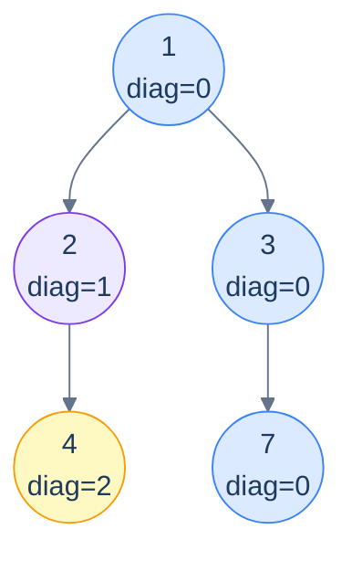

# Problem 4 — Diagonal traversal

> Return groups of nodes on the same *diagonal*. A diagonal starts at any node and follows the right-spine; left-edges start a *new* diagonal.

The coordinate change: `right → same diagonal`, `left → diagonal + 1`. Otherwise the template is identical to vertical traversal.



<p align="center"><strong>Diagonal traversal — same-color nodes share a diagonal. The blue diagonal <code>(1, 3, 7)</code> stays "right" the whole way. Going left jumps to a new diagonal.</strong></p>

<details>
<summary><h2>Solution</h2></summary>


```python run viz=binary-tree viz-root=root
from queue import Queue
from collections import defaultdict
from typing import List, Optional


class TreeNode:
    def __init__(self, val=0, left=None, right=None):
        self.val = val
        self.left = left
        self.right = right


def from_level_order(values):
    """Build tree from list like [1, 2, 3, None, 4]. None means missing child."""
    if not values:
        return None
    root = TreeNode(values[0])
    queue = [root]
    i = 1
    while queue and i < len(values):
        node = queue.pop(0)
        if i < len(values) and values[i] is not None:
            node.left = TreeNode(values[i])
            queue.append(node.left)
        i += 1
        if i < len(values) and values[i] is not None:
            node.right = TreeNode(values[i])
            queue.append(node.right)
        i += 1
    return root


# Define a class to store the node and its diagonal index
class NodeInfo:
    def __init__(self, node: TreeNode, diagonal: int):
        self.node = node
        self.diagonal = diagonal


class Solution:
    def diagonal_traversal(
        self, root: Optional[TreeNode]
    ) -> List[List[int]]:
        result: List[List[int]] = []
        if not root:
            return result

        # HashMap to store diagonals and their corresponding nodes
        diagonals = defaultdict(list)

        # Queue to perform level-order traversal
        queue = Queue()
        queue.put(NodeInfo(root, 0))

        # Loop through each level in the tree
        while not queue.empty():
            current = queue.get()
            node = current.node
            diagonal = current.diagonal

            # Add the current node to its corresponding diagonal
            diagonals[diagonal].append(node.val)

            # Left child goes to next diagonal (diagonal + 1)
            if node.left:
                queue.put(NodeInfo(node.left, diagonal + 1))

            # Right child stays on same diagonal (diagonal)
            if node.right:
                queue.put(NodeInfo(node.right, diagonal))

        # Sort diagonals by their diagonal index and add them to the
        # result
        for diagonal in sorted(diagonals.keys()):
            result.append(diagonals[diagonal])

        return result


# Examples from the problem statement
print(Solution().diagonal_traversal(from_level_order([1, 2, 3, 4, None, None, 7])))        # [[1, 3, 7], [2], [4]]
print(Solution().diagonal_traversal(from_level_order([1, 8, 4, None, 6, None, None, 3, 2])))  # [[1, 4], [8, 6, 2], [3]]

# Edge cases
print(Solution().diagonal_traversal(None))                                                   # []
print(Solution().diagonal_traversal(TreeNode(1)))                                            # [[1]]
print(Solution().diagonal_traversal(from_level_order([1, 2, None, 3, None, 4])))           # left skew: [[1], [2], [3], [4]]
print(Solution().diagonal_traversal(from_level_order([1, None, 2, None, None, None, 3])))  # right skew: [[1, 2, 3]]
print(Solution().diagonal_traversal(from_level_order([1, 2, 3])))                          # [[1, 3], [2]]
```

```java run viz=binary-tree viz-root=root
import java.util.*;

public class Main {
    static class TreeNode {
        int val;
        TreeNode left;
        TreeNode right;
        TreeNode() {}
        TreeNode(int val) { this.val = val; }
    }

    static TreeNode fromLevelOrder(Integer... values) {
        if (values.length == 0 || values[0] == null) return null;
        TreeNode root = new TreeNode(values[0]);
        java.util.Deque<TreeNode> queue = new java.util.ArrayDeque<>();
        queue.add(root);
        int i = 1;
        while (!queue.isEmpty() && i < values.length) {
            TreeNode node = queue.poll();
            if (i < values.length && values[i] != null) {
                node.left = new TreeNode(values[i]);
                queue.add(node.left);
            }
            i++;
            if (i < values.length && values[i] != null) {
                node.right = new TreeNode(values[i]);
                queue.add(node.right);
            }
            i++;
        }
        return root;
    }

    // Define a class to store the node and its diagonal index
    static class NodeInfo {
        TreeNode node;
        int diagonal;
        NodeInfo(TreeNode node, int diagonal) {
            this.node = node;
            this.diagonal = diagonal;
        }
    }

    static class Solution {
        public List<List<Integer>> diagonalTraversal(TreeNode root) {
            List<List<Integer>> result = new ArrayList<>();
            if (root == null) {
                return result;
            }

            // HashMap to store diagonals and their corresponding nodes
            Map<Integer, List<Integer>> diagonals = new TreeMap<>();

            // Queue to perform level-order traversal
            Queue<NodeInfo> queue = new LinkedList<>();
            queue.add(new NodeInfo(root, 0));

            // Loop through each level in the tree
            while (!queue.isEmpty()) {
                NodeInfo current = queue.poll();
                TreeNode node = current.node;
                int diagonal = current.diagonal;

                // Add the current node to its corresponding diagonal
                diagonals.putIfAbsent(diagonal, new ArrayList<>());
                diagonals.get(diagonal).add(node.val);

                // Enqueue the left child with diagonal + 1
                if (node.left != null) {
                    queue.add(new NodeInfo(node.left, diagonal + 1));
                }

                // Enqueue the right child with diagonal
                if (node.right != null) {
                    queue.add(new NodeInfo(node.right, diagonal));
                }
            }

            // Add all diagonals to the vertical order result
            for (List<Integer> diagonal : diagonals.values()) {
                result.add(diagonal);
            }

            return result;
        }
    }

    public static void main(String[] args) {
        // Examples from the problem statement
        System.out.println(new Solution().diagonalTraversal(fromLevelOrder(1, 2, 3, 4, null, null, 7)));        // [[1, 3, 7], [2], [4]]
        System.out.println(new Solution().diagonalTraversal(fromLevelOrder(1, 8, 4, null, 6, null, null, 3, 2)));  // [[1, 4], [8, 6, 2], [3]]

        // Edge cases
        System.out.println(new Solution().diagonalTraversal(null));                                               // []
        System.out.println(new Solution().diagonalTraversal(new TreeNode(1)));                                   // [[1]]
        System.out.println(new Solution().diagonalTraversal(fromLevelOrder(1, 2, null, 3)));                    // left skew
        System.out.println(new Solution().diagonalTraversal(fromLevelOrder(1, null, 2, null, null, null, 3)));  // right skew: [[1, 2, 3]]
        System.out.println(new Solution().diagonalTraversal(fromLevelOrder(1, 2, 3)));                          // [[1, 3], [2]]
    }
}
```

</details>
<details>
<summary><h2>Key Takeaway</h2></summary>


Column-based traversals are tiny variations on one BFS template. Three things to walk away with:

1. **Augment the queue with coordinates.** When a question needs nodes grouped by anything other than visit order — column, diagonal, depth+column, distance from a target — the right move is to enqueue `(node, coord)` pairs and let a sorted map collect by coordinate.
2. **Top vs bottom is one line.** Top view: `putIfAbsent` (first wins). Bottom view: `put` (last wins). Both leverage BFS's depth-first ordering of arrivals at each column.
3. **Sorted map = output already in order.** Using a `TreeMap`/`std::map`/`BTreeMap` instead of a hash map means iterating the values directly gives them in column order — no post-sorting needed. Reach for the sorted variant whenever the output has a numerical ordering.

> *Coming up — the chapter pivots from traversals to a more <em>relational</em> question: <strong>given two nodes, where do they meet?</strong> The lowest common ancestor (LCA) is one of the most important tree primitives — used in network routing, version-control merges, phylogenetics, and dozens of LeetCode "what's the closest common point" problems. The next lesson covers the canonical recursive LCA algorithm and four related variants.*

</details>
