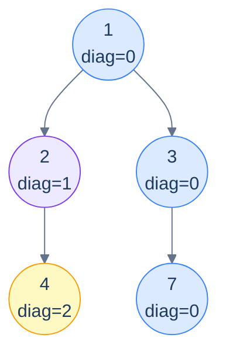

# Problem 4 — Diagonal traversal

## Problem Statement

Return groups of nodes on the same *diagonal*, as a list-of-lists ordered by diagonal index (smallest to largest). A diagonal starts at any node and follows the right-spine; left-edges start a *new* diagonal.

The coordinate change from vertical traversal: `right → same diagonal` (diagonal stays), `left → diagonal + 1` (new diagonal). Otherwise the template is identical to vertical traversal.

## Examples

**Example 1:**
```
Input:  root = [3, 9, 20, 4, 11, 15, 7]
Output: [[3, 20, 7], [9, 11, 15], [4]]
```

**Example 2:**
```
Input:  root = [1, 8, 4, null, 6, null, null, 3, 2]
Output: [[1, 4], [8, 6, 2], [3]]
```



<p align="center"><strong>Diagonal traversal — same-color nodes share a diagonal. The blue diagonal <code>(1, 3, 7)</code> stays "right" the whole way. Going left jumps to a new diagonal.</strong></p>

## Constraints

- `0 ≤ number of nodes ≤ 10⁴`
- `-10⁴ ≤ node.val ≤ 10⁴`
- `O(n)` time, `O(n)` space

```python run viz=binary-tree viz-root=root
import json
from collections import deque

class TreeNode:
    def __init__(self, val, left=None, right=None):
        self.val = val
        self.left = left
        self.right = right

def build_tree(values):              # [1, 2, 3, null, 4] level-order → root
    if not values:
        return None
    root = TreeNode(values[0])
    queue = deque([root])
    i = 1
    while queue and i < len(values):
        node = queue.popleft()
        if i < len(values):
            v = values[i]; i += 1
            if v is not None:
                node.left = TreeNode(v); queue.append(node.left)
        if i < len(values):
            v = values[i]; i += 1
            if v is not None:
                node.right = TreeNode(v); queue.append(node.right)
    return root

class Solution:
    def diagonal_traversal(self, root):
        # Your code goes here — BFS carrying (node, diag);
        # left child → diag + 1, right child → diag (same diagonal);
        # return [diags[d] for d in range(min, max+1)]
        return []

root = build_tree(json.loads(input()))
print(Solution().diagonal_traversal(root))
```

```java run viz=binary-tree viz-root=root
import java.util.*;

public class Main {
    static class TreeNode {
        int val; TreeNode left, right;
        TreeNode(int val) { this.val = val; }
    }

    static class Solution {
        public List<List<Integer>> diagonalTraversal(TreeNode root) {
            // Your code goes here — BFS with Map.entry(node, diag);
            // left → d+1, right → d; TreeMap for sorted output
            return new ArrayList<>();
        }
    }

    public static void main(String[] args) {
        Scanner sc = new Scanner(System.in);
        TreeNode root = buildTree(parseIntegerArray(sc.nextLine()));
        System.out.println(new Solution().diagonalTraversal(root));
    }

    static TreeNode buildTree(Integer[] values) {   // [1, 2, 3, null, 4] level-order → root
        if (values.length == 0 || values[0] == null) return null;
        TreeNode root = new TreeNode(values[0]);
        Deque<TreeNode> queue = new ArrayDeque<>();
        queue.add(root);
        int i = 1;
        while (!queue.isEmpty() && i < values.length) {
            TreeNode node = queue.poll();
            if (i < values.length) {
                Integer v = values[i++];
                if (v != null) { node.left = new TreeNode(v); queue.add(node.left); }
            }
            if (i < values.length) {
                Integer v = values[i++];
                if (v != null) { node.right = new TreeNode(v); queue.add(node.right); }
            }
        }
        return root;
    }

    // "[1, 2, null, 4]" → {1, 2, null, 4} — reads the test case's level-order values
    static Integer[] parseIntegerArray(String line) {
        String inner = line.replaceAll("[\\[\\]\\s]", "");
        if (inner.isEmpty()) return new Integer[0];
        String[] parts = inner.split(",");
        Integer[] out = new Integer[parts.length];
        for (int i = 0; i < parts.length; i++)
            out[i] = parts[i].equals("null") ? null : Integer.parseInt(parts[i]);
        return out;
    }
}
```

```testcases
{
  "args": [
    { "id": "root", "label": "root", "type": "tree", "placeholder": "[3, 9, 20, 4, 11, 15, 7]" }
  ],
  "cases": [
    { "args": { "root": "[3, 9, 20, 4, 11, 15, 7]" }, "expected": "[[3, 20, 7], [9, 11, 15], [4]]" },
    { "args": { "root": "[1, 8, 4, null, 6, null, null, 3, 2]" }, "expected": "[[1, 4], [8, 6, 2], [3]]" },
    { "args": { "root": "[]" }, "expected": "[]" },
    { "args": { "root": "[1]" }, "expected": "[[1]]" },
    { "args": { "root": "[1, 2, null, 3]" }, "expected": "[[1], [2], [3]]" },
    { "args": { "root": "[1, null, 2, null, 3]" }, "expected": "[[1, 2, 3]]" },
    { "args": { "root": "[1, 2, 3]" }, "expected": "[[1, 3], [2]]" }
  ]
}
```

<details>
<summary><h2>Solution</h2></summary>

BFS carrying `(node, diag)`. Left edges increase the diagonal (`d + 1`); right edges stay on the same diagonal (`d`). Append every node to `diags[d]`. Iterate by sorted diagonal index to produce groups from smallest to largest diagonal.

```python solution time=O(n) space=O(n)
import json
from collections import deque

class TreeNode:
    def __init__(self, val, left=None, right=None):
        self.val = val
        self.left = left
        self.right = right

def build_tree(values):              # [1, 2, 3, null, 4] level-order → root
    if not values:
        return None
    root = TreeNode(values[0])
    queue = deque([root])
    i = 1
    while queue and i < len(values):
        node = queue.popleft()
        if i < len(values):
            v = values[i]; i += 1
            if v is not None:
                node.left = TreeNode(v); queue.append(node.left)
        if i < len(values):
            v = values[i]; i += 1
            if v is not None:
                node.right = TreeNode(v); queue.append(node.right)
    return root

class Solution:
    def diagonal_traversal(self, root):
        if root is None:
            return []
        diags = {}
        q = deque([(root, 0)])
        while q:
            node, d = q.popleft()
            if d not in diags: diags[d] = []
            diags[d].append(node.val)
            if node.left:  q.append((node.left,  d + 1))   # left  ⇒ new diagonal
            if node.right: q.append((node.right, d))        # right ⇒ same diagonal
        return [diags[d] for d in range(min(diags), max(diags) + 1)]

root = build_tree(json.loads(input()))
print(Solution().diagonal_traversal(root))
```

```java solution
import java.util.*;

public class Main {
    static class TreeNode {
        int val; TreeNode left, right;
        TreeNode(int val) { this.val = val; }
    }

    static class Solution {
        public List<List<Integer>> diagonalTraversal(TreeNode root) {
            List<List<Integer>> out = new ArrayList<>();
            if (root == null) return out;
            Map<Integer, List<Integer>> diags = new TreeMap<>();
            Deque<Map.Entry<TreeNode, Integer>> q = new ArrayDeque<>();
            q.add(Map.entry(root, 0));
            while (!q.isEmpty()) {
                var e = q.poll();
                TreeNode node = e.getKey(); int d = e.getValue();
                diags.computeIfAbsent(d, k -> new ArrayList<>()).add(node.val);
                if (node.left  != null) q.add(Map.entry(node.left,  d + 1));   // left  ⇒ new diagonal
                if (node.right != null) q.add(Map.entry(node.right, d));        // right ⇒ same diagonal
            }
            out.addAll(diags.values());
            return out;
        }
    }

    public static void main(String[] args) {
        Scanner sc = new Scanner(System.in);
        TreeNode root = buildTree(parseIntegerArray(sc.nextLine()));
        System.out.println(new Solution().diagonalTraversal(root));
    }

    static TreeNode buildTree(Integer[] values) {   // [1, 2, 3, null, 4] level-order → root
        if (values.length == 0 || values[0] == null) return null;
        TreeNode root = new TreeNode(values[0]);
        Deque<TreeNode> queue = new ArrayDeque<>();
        queue.add(root);
        int i = 1;
        while (!queue.isEmpty() && i < values.length) {
            TreeNode node = queue.poll();
            if (i < values.length) {
                Integer v = values[i++];
                if (v != null) { node.left = new TreeNode(v); queue.add(node.left); }
            }
            if (i < values.length) {
                Integer v = values[i++];
                if (v != null) { node.right = new TreeNode(v); queue.add(node.right); }
            }
        }
        return root;
    }

    // "[1, 2, null, 4]" → {1, 2, null, 4} — reads the test case's level-order values
    static Integer[] parseIntegerArray(String line) {
        String inner = line.replaceAll("[\\[\\]\\s]", "");
        if (inner.isEmpty()) return new Integer[0];
        String[] parts = inner.split(",");
        Integer[] out = new Integer[parts.length];
        for (int i = 0; i < parts.length; i++)
            out[i] = parts[i].equals("null") ? null : Integer.parseInt(parts[i]);
        return out;
    }
}
```

</details>
<details>
<summary><h2>Key Takeaway</h2></summary>


Column-based traversals are tiny variations on one BFS template. Three things to walk away with:

1. **Augment the queue with coordinates.** When a question needs nodes grouped by anything other than visit order — column, diagonal, depth+column, distance from a target — the right move is to enqueue `(node, coord)` pairs and let a sorted map collect by coordinate.
2. **Top vs bottom is one line.** Top view: `putIfAbsent` (first wins). Bottom view: `put` (last wins). Both leverage BFS's depth-first ordering of arrivals at each column.
3. **Sorted map = output already in order.** Using a `TreeMap`/`sorted()` instead of a hash map means iterating the values directly gives them in column order — no post-sorting needed. Reach for the sorted variant whenever the output has a numerical ordering.

> *Coming up — the chapter pivots from traversals to a more relational question: **given two nodes, where do they meet?** The lowest common ancestor (LCA) is one of the most important tree primitives — used in network routing, version-control merges, phylogenetics, and dozens of LeetCode "what's the closest common point" problems. The next lesson covers the canonical recursive LCA algorithm and four related variants.*

</details>
