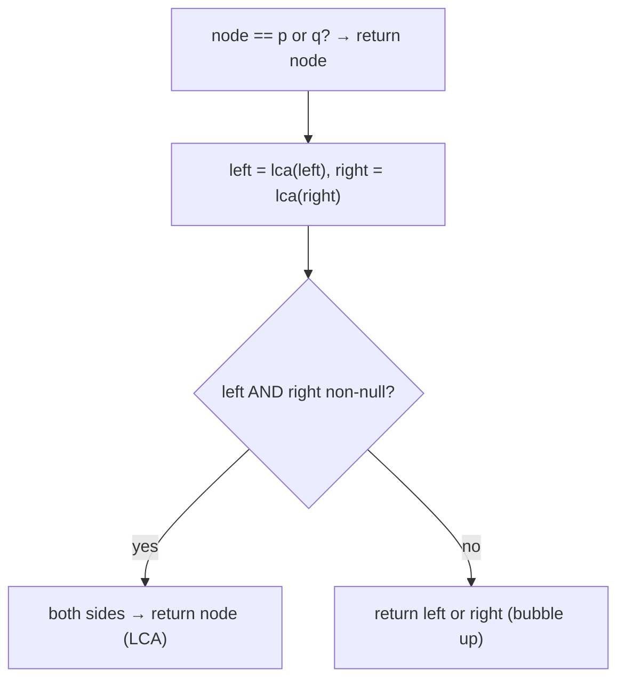

# Pattern: Lowest Common Ancestor

## Why It Exists

The **lowest common ancestor** of two nodes `p` and `q` is the deepest node that has *both* as descendants — the point where their two root-to-node paths converge. It's the backbone of "distance between two nodes," "is X an ancestor of Y," and a dozen tree-relationship queries.

On a [BST you could exploit ordering](/cortex/data-structures-and-algorithms/trees-binary-search-tree-lowest-common-ancestor-in-binary-search-trees) — walk down, turn left when both targets are smaller, right when both are larger, and the first node that *splits* them is the LCA. But a **general** binary tree has no such order; the only way to know where the targets are is to *look*. So you do a single [postorder](/cortex/data-structures-and-algorithms/trees-binary-tree-pattern-postorder-traversal-stateless-pattern) pass: each call reports "did I find a target somewhere below me?" by **bubbling the target up**. The node that hears "yes" from its **left** *and* "yes" from its **right** is sitting exactly at the split — it's the LCA. `O(n)` time, `O(h)` stack, one traversal.

## See It Work

`LCA(5, 1)` in the classic tree is the root `3` — `5` is in the left subtree, `1` in the right, so they split at `3`. Run it.

```python run viz=binary-tree viz-root=root
class TreeNode:
    def __init__(self, val, left=None, right=None):
        self.val = val
        self.left = left
        self.right = right

def lca(node, p, q):
    if node is None or node is p or node is q:
        return node                      # hit a target (or dead end) → bubble it up
    left  = lca(node.left,  p, q)
    right = lca(node.right, p, q)
    if left and right:
        return node                      # targets came from BOTH sides → this is the LCA
    return left or right                 # both on one side (or neither) → pass it up

#            3
#          /   \
#         5     1
#        / \   / \
#       6   2 0   8
n5 = TreeNode(5, TreeNode(6), TreeNode(2))
n1 = TreeNode(1, TreeNode(0), TreeNode(8))
root = TreeNode(3, n5, n1)
print(lca(root, n5, n1).val)     # 3
```

## How It Works

A postorder recursion returning "a target found below me, or `None`":

1. **Base case** — `node is None` → `None`; `node is p or node is q` → return `node`. (You found a target; stop and report it.)
2. **Recurse** both children → `left`, `right`.
3. **Both non-`None`** → `p` and `q` were found in *different* subtrees, so they converge here → **return `node`**: this is the LCA.
4. **Otherwise** — return whichever side is non-`None` (the target bubbling up), or `None` if neither.



<p align="center"><strong>each node returns a found-target upward; the node that receives a target from <em>both</em> sides is the split point — the LCA.</strong></p>

The return value does double duty: most of the way up it means "here's a target I found," but at exactly one node it means "I am the answer." That one node is where the two upward streams meet. It needs **no** BST ordering — it works on any binary tree because it *searches* rather than *navigates*. The whole thing is `postorder`: you can't decide a node until both its subtrees have reported, so the answer folds up from the leaves.

### Key Takeaway

LCA on a general binary tree is one postorder pass: return a target the instant you hit it, and the node that gets a non-`None` from **both** children is the LCA. Return-value means "found a target" everywhere except the split node, where it means "I'm the answer." `O(n)` / `O(h)`, no ordering required.

## Trace It

`lca(root, 5, 1)` — what each call returns:

| node | `left` | `right` | returns | meaning |
|---|---|---|---|---|
| `6, 2, 0, 8` | — | — | `None` | no target below |
| `5` | — | — | `5` | base case: `node is p` |
| `1` | — | — | `1` | base case: `node is q` |
| `3` (root) | `5` | `1` | **`3`** | both sides → LCA |

Before you read on: consider `LCA(5, 4)` where `4` lives *inside* `5`'s subtree (so `5` is an *ancestor* of `4`). The recursion hits node `5`, matches the base case `node is p`, and **returns `5` immediately — without ever descending to look for `4`**. Yet the correct answer *is* `5`. How can returning early, before confirming `4` is even down there, be correct?

It's correct because of an **assumed precondition: both `p` and `q` exist in the tree.** Grant that, and the logic is airtight. When the recursion reaches `5` and stops, it doesn't *need* to find `4` below — it only needs to guarantee that **no other node** will mistakenly claim to be the LCA. And none can: since `4` is guaranteed to exist and `5` is its ancestor, `4` lives entirely *within* `5`'s subtree, so `4` can never surface in any *other* subtree. Therefore no node outside `5`'s subtree ever receives targets from both sides; the only non-`None` value bubbling up past `5` is `5` itself, and the root returns `5`. The early return is an *optimization* that's safe **only** under the existence guarantee — it trades "confirm both targets" for "trust they're there." Drop the guarantee (a target might be missing), and this exact code can return a node that isn't a true common ancestor; then you need the **existence-check variant** that recurses fully and verifies *both* targets were actually seen before trusting the split. Knowing which assumption you're standing on is the difference between the 5-line interview answer and a subtle bug.

## Your Turn

LCA on a general tree, plus **distance between two nodes** built on top of it (depth of `p` + depth of `q` − 2·depth of their LCA):

```python run viz=binary-tree viz-root=root
class TreeNode:
    def __init__(self, val, left=None, right=None):
        self.val = val; self.left = left; self.right = right

def lca(node, p, q):
    if node is None or node is p or node is q:
        return node
    left, right = lca(node.left, p, q), lca(node.right, p, q)
    if left and right:
        return node
    return left or right

def depth(node, target, d=0):
    if node is None: return -1
    if node is target: return d
    left = depth(node.left, target, d + 1)
    return left if left != -1 else depth(node.right, target, d + 1)

def distance(root, p, q):
    a = lca(root, p, q)
    return depth(a, p) + depth(a, q)        # path p→LCA + LCA→q

n7, n4 = TreeNode(7), TreeNode(4)
n5 = TreeNode(5, TreeNode(6), TreeNode(2, n7, n4))
n1 = TreeNode(1, TreeNode(0), TreeNode(8))
root = TreeNode(3, n5, n1)
print(lca(root, n5, n1).val)     # 3
print(lca(root, n5, n4).val)     # 5   (5 is an ancestor of 4)
print(distance(root, n7, n4))    # 2   (7 → 2 → 4)
```

```java run viz=binary-tree viz-root=root
public class Main {
  static class TreeNode { int val; TreeNode left, right; TreeNode(int v){ val = v; } TreeNode(int v, TreeNode l, TreeNode r){ val=v; left=l; right=r; } }

  static TreeNode lca(TreeNode node, TreeNode p, TreeNode q) {
    if (node == null || node == p || node == q) return node;   // bubble a target up
    TreeNode left = lca(node.left, p, q), right = lca(node.right, p, q);
    if (left != null && right != null) return node;            // split → LCA
    return left != null ? left : right;                        // pass up the one side
  }
  public static void main(String[] args) {
    TreeNode n7 = new TreeNode(7), n4 = new TreeNode(4);
    TreeNode n5 = new TreeNode(5, new TreeNode(6), new TreeNode(2, n7, n4));
    TreeNode n1 = new TreeNode(1, new TreeNode(0), new TreeNode(8));
    TreeNode root = new TreeNode(3, n5, n1);
    System.out.println(lca(root, n5, n1).val);   // 3
    System.out.println(lca(root, n5, n4).val);   // 5
  }
}
```

Drill the family in **Practice** — [Lowest Common Ancestor](/cortex/data-structures-and-algorithms/trees-binary-tree-pattern-lowest-common-ancestor-problems-lowest-common-ancestor), [LCA with Existence Check](/cortex/data-structures-and-algorithms/trees-binary-tree-pattern-lowest-common-ancestor-problems-lca-with-existence-check), [LCA of N Random Nodes](/cortex/data-structures-and-algorithms/trees-binary-tree-pattern-lowest-common-ancestor-problems-lca-of-n-random-nodes), [LCA of the Deepest Leaves](/cortex/data-structures-and-algorithms/trees-binary-tree-pattern-lowest-common-ancestor-problems-lca-of-the-deepest-leaves), and [Distance Between Two Nodes](/cortex/data-structures-and-algorithms/trees-binary-tree-pattern-lowest-common-ancestor-problems-distance-between-two-nodes).

## Reflect & Connect

LCA is the canonical "answer lives at the split point" postorder:

- **The family** — plain LCA, LCA-with-existence-check (verify both were found), LCA of the deepest leaves, distance between two nodes (`depth(p) + depth(q) − 2·depth(LCA)`), and LCA of many nodes (fold pairwise). All share the bubble-up-and-split core.
- **BST vs general tree** — a [BST LCA](/cortex/data-structures-and-algorithms/trees-binary-search-tree-lowest-common-ancestor-in-binary-search-trees) *navigates* by comparing values (`O(h)`, no recursion needed); the general-tree LCA *searches* every node (`O(n)`). Order buys you the shortcut; without it you pay the full traversal.
- **It's stateful-postorder's cousin** — like [diameter / max-path-sum](/cortex/data-structures-and-algorithms/trees-binary-tree-pattern-postorder-traversal-stateful-pattern), the answer is decided at an interior node using *both* subtrees. Here the "accumulator" is implicit: the single node that receives two non-`None` returns. Mind the existence precondition — it's the one assumption holding the early-return up.

**Prerequisites:** [Postorder Traversal (Stateless)](/cortex/data-structures-and-algorithms/trees-binary-tree-pattern-postorder-traversal-stateless-pattern).
**What's next:** walk *two* trees at once in lockstep — same-tree, mirror, merge, subtree-check — [Simultaneous Traversal](/cortex/data-structures-and-algorithms/trees-binary-tree-pattern-simultaneous-traversal-pattern).

## Recall

> **Mnemonic:** *Bubble a target up the instant you hit it; the node that gets a target from BOTH sides is the LCA. Early-return is safe only because both targets are assumed to exist.*

| | |
|---|---|
| Base case | `node is None` → `None`; `node is p or q` → `node` |
| Combine | `left and right` → return `node` (split = LCA) |
| Else | return `left or right` (a target bubbling up) |
| Cost | `O(n)` time, `O(h)` stack — searches, doesn't navigate |
| Precondition | both `p` and `q` exist; else use the existence-check variant |

<details>
<summary><strong>Q:</strong> What makes a node the LCA in this recursion?</summary>

**A:** It receives a non-`None` (a found target) from *both* its left and right subtrees — the targets split there.

</details>
<details>
<summary><strong>Q:</strong> Why does it work on any binary tree, unlike the BST version?</summary>

**A:** It *searches* every node rather than *navigating* by value order, so it needs no ordering — at the cost of `O(n)` instead of `O(h)`.

</details>
<details>
<summary><strong>Q:</strong> Why is the early return at `node is p` correct even if `q` is below it?</summary>

**A:** Both targets are assumed to exist; if `p` is an ancestor of `q`, then `q` is inside `p`'s subtree and no other subtree can claim them, so `p` is the answer.

</details>
<details>
<summary><strong>Q:</strong> When does this code break, and what's the fix?</summary>

**A:** When a target might be absent — the early return can pick a non-ancestor; fix with the existence-check variant that confirms both targets were actually seen.

</details>

## Sources & Verify

- **CLRS**, *Introduction to Algorithms*, 4th ed., §10.4 — tree traversal / recursive node queries.
- **Sedgewick & Wayne**, *Algorithms*, 4th ed., §3.2–§3.3 — tree recursion; BST vs general structure.
- Lowest Common Ancestor of a Binary Tree (LeetCode 236) is the standard statement; both runnable blocks are verified by running (`LCA(5,1) ⇒ 3`; `LCA(5,4) ⇒ 5`, the ancestor case; `distance(7,4) ⇒ 2`).
