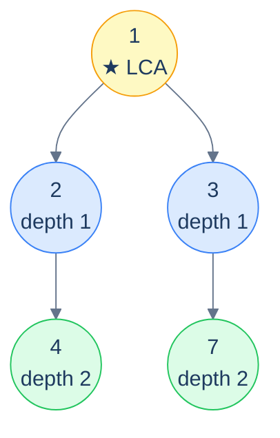

# Problem 5 — Distance between two nodes

> Given two values, return the number of edges on the path between the two nodes carrying those values.

Three steps:

1. Find the LCA of the two nodes.
2. Compute the depth of each target *measured from the LCA*.
3. Sum the two depths — that's the number of edges in the path.



<p align="center"><strong>Distance between 4 and 7 — LCA is 1; 4 is 2 edges down, 7 is 2 edges down. Total path length = 2 + 2 = <strong>4 edges</strong>.</strong></p>

<details>
<summary><h2>Solution</h2></summary>


```python run viz=binary-tree viz-root=root
from typing import Optional


class TreeNode:
    def __init__(self, val=0, left=None, right=None):
        self.val = val
        self.left = left
        self.right = right


def from_level_order(values):
    """Build tree from list like [1, 2, 3, None, 4]. None means missing child."""
    if not values:
        return None
    root = TreeNode(values[0])
    queue = [root]
    i = 1
    while queue and i < len(values):
        node = queue.pop(0)
        if i < len(values) and values[i] is not None:
            node.left = TreeNode(values[i])
            queue.append(node.left)
        i += 1
        if i < len(values) and values[i] is not None:
            node.right = TreeNode(values[i])
            queue.append(node.right)
        i += 1
    return root


class Solution:
    def lowest_common_ancestor(
        self, root: Optional[TreeNode], val_a: int, val_b: int
    ) -> Optional[TreeNode]:

        # If the root is null, return null
        if not root:
            return None

        # If the value of the current node is equal to either valA or
        # valB return the current node
        if root.val == val_a or root.val == val_b:
            return root

        # Recursively search in the left and right subtrees
        left_lca = self.lowest_common_ancestor(root.left, val_a, val_b)
        right_lca = self.lowest_common_ancestor(root.right, val_a, val_b)

        # If both subtrees return a non-null value
        # the current node is the lowest common ancestor
        if left_lca and right_lca:
            return root

        # If only one subtree returns a non-null value, return that value
        return left_lca if left_lca else right_lca

    def find_depth(
        self, root: Optional[TreeNode], val: int, depth: int
    ) -> int:

        # Base case: if the root is null, return -1
        if not root:
            return -1

        # If the current node is the target node, return the depth
        if root.val == val:
            return depth

        left_depth = self.find_depth(root.left, val, depth + 1)

        # If left_depth is not -1, the target node is in the left subtree
        if left_depth != -1:
            return left_depth

        # If left_depth is -1, search in the right subtree
        return self.find_depth(root.right, val, depth + 1)

    def distance_between_nodes(
        self, root: Optional[TreeNode], val_a: int, val_b: int
    ) -> int:

        # If the root is null, return -1
        if not root:
            return -1

        # Step 1: Find the LCA of valA and valB
        lca = self.lowest_common_ancestor(root, val_a, val_b)

        # If either node is missing, return -1
        if not lca:
            return -1

        # Step 2: Find the depths of valA, valB from LCA
        depth_a = self.find_depth(lca, val_a, 0)
        depth_b = self.find_depth(lca, val_b, 0)

        # Step 3: Compute the distance
        return depth_a + depth_b


# Examples from the problem statement
print(Solution().distance_between_nodes(from_level_order([1, 2, 3, 4, None, None, 7]), 4, 7))         # 4
print(Solution().distance_between_nodes(from_level_order([1, 8, 4, None, None, 2, 7, None, 9]), 2, 8))  # 3

# Edge cases
print(Solution().distance_between_nodes(None, 1, 2))                                                    # -1
print(Solution().distance_between_nodes(TreeNode(1), 1, 1))                                            # 0 (same node)
print(Solution().distance_between_nodes(from_level_order([1, 2, 3]), 2, 3))                            # 2 (siblings)
print(Solution().distance_between_nodes(from_level_order([1, 2, 3, 4, None, None, 7]), 1, 4))         # 2 (root to leaf)
print(Solution().distance_between_nodes(from_level_order([1, 2, 3, 4, None, None, 7]), 4, 2))         # 1 (parent-child)
```

```java run viz=binary-tree viz-root=root
import java.util.*;

public class Main {
    static class TreeNode {
        int val;
        TreeNode left;
        TreeNode right;
        TreeNode() {}
        TreeNode(int val) { this.val = val; }
    }

    static TreeNode fromLevelOrder(Integer... values) {
        if (values.length == 0 || values[0] == null) return null;
        TreeNode root = new TreeNode(values[0]);
        java.util.Deque<TreeNode> queue = new java.util.ArrayDeque<>();
        queue.add(root);
        int i = 1;
        while (!queue.isEmpty() && i < values.length) {
            TreeNode node = queue.poll();
            if (i < values.length && values[i] != null) {
                node.left = new TreeNode(values[i]);
                queue.add(node.left);
            }
            i++;
            if (i < values.length && values[i] != null) {
                node.right = new TreeNode(values[i]);
                queue.add(node.right);
            }
            i++;
        }
        return root;
    }

    static class Solution {
        private TreeNode lowestCommonAncestor(
            TreeNode root,
            int valA,
            int valB
        ) {

            // If the root is null, return null
            if (root == null) {
                return null;
            }

            // If the value of the current node is equal to either valA or
            // valB return the current node
            if (root.val == valA || root.val == valB) {
                return root;
            }

            // Recursively search in the left and right subtrees
            TreeNode leftLCA = lowestCommonAncestor(root.left, valA, valB);
            TreeNode rightLCA = lowestCommonAncestor(root.right, valA, valB);

            // If both subtrees return a non-null value
            // the current node is the lowest common ancestor
            if (leftLCA != null && rightLCA != null) {
                return root;
            }

            // If only one subtree returns a non-null value, return that
            // value
            if (leftLCA != null) {
                return leftLCA;
            }

            return rightLCA;
        }

        private int findDepth(TreeNode root, int val, int depth) {

            // Base case: if the root is null, return -1
            if (root == null) {
                return -1;
            }

            // If the current node is the target node, return the depth
            if (root.val == val) {
                return depth;
            }

            int leftDepth = findDepth(root.left, val, depth + 1);

            // If leftDepth is not -1, the target node is in the left subtree
            if (leftDepth != -1) {
                return leftDepth;
            }

            // If leftDepth is -1, search in the right subtree
            return findDepth(root.right, val, depth + 1);
        }

        public int distanceBetweenNodes(TreeNode root, int valA, int valB) {

            // If the root is null, return -1
            if (root == null) {
                return -1;
            }

            // Step 1: Find the LCA of valA and valB
            TreeNode lca = lowestCommonAncestor(root, valA, valB);

            // If either node is missing, return -1
            if (lca == null) {
                return -1;
            }

            // Step 2: Find the depths of valA, valB from LCA
            int depthA = findDepth(lca, valA, 0);
            int depthB = findDepth(lca, valB, 0);

            // Step 3: Compute the distance
            return depthA + depthB;
        }
    }

    public static void main(String[] args) {
        // Examples from the problem statement
        System.out.println(new Solution().distanceBetweenNodes(fromLevelOrder(1, 2, 3, 4, null, null, 7), 4, 7));         // 4
        System.out.println(new Solution().distanceBetweenNodes(fromLevelOrder(1, 8, 4, null, null, 2, 7, null, 9), 2, 8));  // 3

        // Edge cases
        System.out.println(new Solution().distanceBetweenNodes(null, 1, 2));                                                // -1
        System.out.println(new Solution().distanceBetweenNodes(new TreeNode(1), 1, 1));                                    // 0 (same node)
        System.out.println(new Solution().distanceBetweenNodes(fromLevelOrder(1, 2, 3), 2, 3));                            // 2 (siblings)
        System.out.println(new Solution().distanceBetweenNodes(fromLevelOrder(1, 2, 3, 4, null, null, 7), 1, 4));         // 2 (root to leaf)
        System.out.println(new Solution().distanceBetweenNodes(fromLevelOrder(1, 2, 3, 4, null, null, 7), 4, 2));         // 1 (parent-child)
    }
}
```

</details>
<details>
<summary><h2>Key Takeaway</h2></summary>


LCA is the single most useful tree primitive after height/depth. Three things to walk away with:

1. **The recursion is the algorithm.** "If I am one of the targets, return me. If both children returned a target, I am the LCA. Otherwise propagate the non-null one up." That's the entire algorithm. There's no smarter version for general binary trees — this *is* O(N) optimal.
2. **Existence checks first if uncertain.** The classical algorithm assumes both targets are present. If they might be missing, prepend an explicit existence pass — otherwise the algorithm will silently return a wrong answer (the present target instead of `null`).
3. **LCA reduces other problems.** Distance between nodes? LCA + depths. "Are X and Y in the same subtree of root R?" LCA(X, Y) descends from R. "Closest node sharing both X and Y as descendants?" That *is* LCA. Internalise the LCA primitive and dozens of "relational" tree questions become two-line wrappers.

> *Coming up — the next lesson covers the **simultaneous traversal** pattern: walking *two* trees in parallel, comparing them node-by-node. The recurring structure handles "are these two trees identical?", "is this tree symmetric to itself?", "is X a subtree of Y?", and "merge two trees node-by-node". Same recursive shape as a single-tree traversal, but with an extra parameter for the second tree.*

</details>
