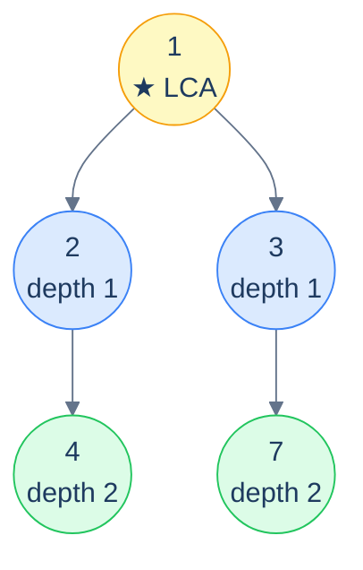

# Distance Between Two Nodes

## Problem Statement

Given the **root** of a binary tree and two integer values `val_a` and `val_b` (both guaranteed to exist in the tree), return the **number of edges** on the path between the two nodes.

Three steps:

1. Find the LCA of the two nodes (by value).
2. Compute the depth of each target measured *from the LCA*.
3. Sum the two depths — that's the edge count.



<p align="center"><strong>Distance between 4 and 7 — LCA is 1; 4 is 2 edges down, 7 is 2 edges down. Total path length = 2 + 2 = <strong>4 edges</strong>.</strong></p>

## Examples

**Example 1:**
```
Input:  root = [1, 2, 3, 4, null, null, 7], val_a = 4, val_b = 7
Output: 4
```
LCA is `1` (root); `4` is 2 edges down, `7` is 2 edges down.

**Example 2:**
```
Input:  root = [1, 2, 3], val_a = 2, val_b = 3
Output: 2
```
Both nodes are siblings; LCA is root `1`, each 1 edge away.

## Constraints

- `0 ≤ number of nodes ≤ 10⁴`
- `-10⁴ ≤ node.val ≤ 10⁴`; all values are **distinct**
- Both `val_a` and `val_b` exist in the tree
- O(N) time, O(h) stack

```python run viz=binary-tree viz-root=root
import json
from collections import deque

class TreeNode:
    def __init__(self, val, left=None, right=None):
        self.val = val
        self.left = left
        self.right = right

class Solution:
    def lowest_common_ancestor(self, root, val_a, val_b):
        # Your code goes here — standard value-based LCA
        return None

    def find_depth(self, root, val, depth):
        # Your code goes here — return depth of val from root, or -1 if not found
        return -1

    def distance_between_nodes(self, root, val_a, val_b):
        # Your code goes here — find LCA, then sum depths of val_a and val_b from LCA
        return -1

def build_tree(values):              # [1, 2, 3, null, 4] level-order → root
    if not values:
        return None
    root = TreeNode(values[0])
    queue = deque([root])
    i = 1
    while queue and i < len(values):
        node = queue.popleft()
        if i < len(values):
            v = values[i]; i += 1
            if v is not None:
                node.left = TreeNode(v); queue.append(node.left)
        if i < len(values):
            v = values[i]; i += 1
            if v is not None:
                node.right = TreeNode(v); queue.append(node.right)
    return root

root = build_tree(json.loads(input()))   # the test case's level-order values
val_a = int(input())                     # first node value
val_b = int(input())                     # second node value
print(Solution().distance_between_nodes(root, val_a, val_b))
```

```java run viz=binary-tree viz-root=root
import java.util.*;

public class Main {
    static class TreeNode {
        int val; TreeNode left, right;
        TreeNode(int val) { this.val = val; }
    }

    static class Solution {
        TreeNode lowestCommonAncestor(TreeNode root, int valA, int valB) {
            // Your code goes here — standard value-based LCA
            return null;
        }

        int findDepth(TreeNode root, int val, int depth) {
            // Your code goes here — return depth of val from root, or -1 if not found
            return -1;
        }

        int distanceBetweenNodes(TreeNode root, int valA, int valB) {
            // Your code goes here — find LCA, then sum depths of valA and valB from LCA
            return -1;
        }
    }

    public static void main(String[] args) {
        Scanner sc = new Scanner(System.in);
        TreeNode root = buildTree(parseIntegerArray(sc.nextLine()));
        int valA = Integer.parseInt(sc.nextLine().trim());
        int valB = Integer.parseInt(sc.nextLine().trim());
        System.out.println(new Solution().distanceBetweenNodes(root, valA, valB));
    }

    static TreeNode buildTree(Integer[] values) {   // [1, 2, 3, null, 4] level-order → root
        if (values.length == 0 || values[0] == null) return null;
        TreeNode root = new TreeNode(values[0]);
        Deque<TreeNode> queue = new ArrayDeque<>();
        queue.add(root);
        int i = 1;
        while (!queue.isEmpty() && i < values.length) {
            TreeNode node = queue.poll();
            if (i < values.length) {
                Integer v = values[i++];
                if (v != null) { node.left = new TreeNode(v); queue.add(node.left); }
            }
            if (i < values.length) {
                Integer v = values[i++];
                if (v != null) { node.right = new TreeNode(v); queue.add(node.right); }
            }
        }
        return root;
    }

    // "[1, 2, null, 4]" → {1, 2, null, 4} — reads the test case's level-order values
    static Integer[] parseIntegerArray(String line) {
        String inner = line.replaceAll("[\\[\\]\\s]", "");
        if (inner.isEmpty()) return new Integer[0];
        String[] parts = inner.split(",");
        Integer[] out = new Integer[parts.length];
        for (int i = 0; i < parts.length; i++)
            out[i] = parts[i].equals("null") ? null : Integer.parseInt(parts[i]);
        return out;
    }
}
```

```testcases
{
  "args": [
    { "id": "root", "label": "root", "type": "tree", "placeholder": "[1, 2, 3, 4, null, null, 7]" },
    { "id": "val_a", "label": "val_a", "type": "int", "placeholder": "4" },
    { "id": "val_b", "label": "val_b", "type": "int", "placeholder": "7" }
  ],
  "cases": [
    { "args": { "root": "[1, 2, 3, 4, null, null, 7]", "val_a": "4", "val_b": "7" }, "expected": "4" },
    { "args": { "root": "[1, 2, 3]", "val_a": "2", "val_b": "3" }, "expected": "2" },
    { "args": { "root": "[1, 2, 3, 4, null, null, 7]", "val_a": "1", "val_b": "4" }, "expected": "2" },
    { "args": { "root": "[1, 2, 3, 4, null, null, 7]", "val_a": "4", "val_b": "2" }, "expected": "1" },
    { "args": { "root": "[1, 2, 3, 4, null, null, 7]", "val_a": "1", "val_b": "1" }, "expected": "0" },
    { "args": { "root": "[1, 8, 4, null, null, 2, 7, null, 9]", "val_a": "2", "val_b": "8" }, "expected": "3" }
  ]
}
```

<details>
<summary><h2>Solution</h2></summary>

Three steps. First find the LCA by-value using the standard postorder search. Then measure the depth of `val_a` from the LCA using a depth-first search that returns -1 when not found. Repeat for `val_b`. Sum the two depths — that's the edge count. The distance is 0 when both values name the same node (since the LCA is itself at depth 0 from itself).

```python solution time=O(n) space=O(h)
import json
from collections import deque

class TreeNode:
    def __init__(self, val, left=None, right=None):
        self.val = val
        self.left = left
        self.right = right

class Solution:
    def lowest_common_ancestor(self, root, val_a, val_b):
        if not root:
            return None
        if root.val == val_a or root.val == val_b:
            return root
        left_lca = self.lowest_common_ancestor(root.left, val_a, val_b)
        right_lca = self.lowest_common_ancestor(root.right, val_a, val_b)
        if left_lca and right_lca:
            return root
        return left_lca if left_lca else right_lca

    def find_depth(self, root, val, depth):
        if not root:
            return -1
        if root.val == val:
            return depth
        left_depth = self.find_depth(root.left, val, depth + 1)
        if left_depth != -1:
            return left_depth
        return self.find_depth(root.right, val, depth + 1)

    def distance_between_nodes(self, root, val_a, val_b):
        if not root:
            return -1
        lca = self.lowest_common_ancestor(root, val_a, val_b)
        if not lca:
            return -1
        depth_a = self.find_depth(lca, val_a, 0)
        depth_b = self.find_depth(lca, val_b, 0)
        return depth_a + depth_b

def build_tree(values):              # [1, 2, 3, null, 4] level-order → root
    if not values:
        return None
    root = TreeNode(values[0])
    queue = deque([root])
    i = 1
    while queue and i < len(values):
        node = queue.popleft()
        if i < len(values):
            v = values[i]; i += 1
            if v is not None:
                node.left = TreeNode(v); queue.append(node.left)
        if i < len(values):
            v = values[i]; i += 1
            if v is not None:
                node.right = TreeNode(v); queue.append(node.right)
    return root

root = build_tree(json.loads(input()))   # the test case's level-order values
val_a = int(input())                     # first node value
val_b = int(input())                     # second node value
print(Solution().distance_between_nodes(root, val_a, val_b))
```

```java solution
import java.util.*;

public class Main {
    static class TreeNode {
        int val; TreeNode left, right;
        TreeNode(int val) { this.val = val; }
    }

    static class Solution {
        TreeNode lowestCommonAncestor(TreeNode root, int valA, int valB) {
            if (root == null) return null;
            if (root.val == valA || root.val == valB) return root;
            TreeNode leftLCA = lowestCommonAncestor(root.left, valA, valB);
            TreeNode rightLCA = lowestCommonAncestor(root.right, valA, valB);
            if (leftLCA != null && rightLCA != null) return root;
            return leftLCA != null ? leftLCA : rightLCA;
        }

        int findDepth(TreeNode root, int val, int depth) {
            if (root == null) return -1;
            if (root.val == val) return depth;
            int leftDepth = findDepth(root.left, val, depth + 1);
            if (leftDepth != -1) return leftDepth;
            return findDepth(root.right, val, depth + 1);
        }

        int distanceBetweenNodes(TreeNode root, int valA, int valB) {
            if (root == null) return -1;
            TreeNode lca = lowestCommonAncestor(root, valA, valB);
            if (lca == null) return -1;
            int depthA = findDepth(lca, valA, 0);
            int depthB = findDepth(lca, valB, 0);
            return depthA + depthB;
        }
    }

    public static void main(String[] args) {
        Scanner sc = new Scanner(System.in);
        TreeNode root = buildTree(parseIntegerArray(sc.nextLine()));
        int valA = Integer.parseInt(sc.nextLine().trim());
        int valB = Integer.parseInt(sc.nextLine().trim());
        System.out.println(new Solution().distanceBetweenNodes(root, valA, valB));
    }

    static TreeNode buildTree(Integer[] values) {   // [1, 2, 3, null, 4] level-order → root
        if (values.length == 0 || values[0] == null) return null;
        TreeNode root = new TreeNode(values[0]);
        Deque<TreeNode> queue = new ArrayDeque<>();
        queue.add(root);
        int i = 1;
        while (!queue.isEmpty() && i < values.length) {
            TreeNode node = queue.poll();
            if (i < values.length) {
                Integer v = values[i++];
                if (v != null) { node.left = new TreeNode(v); queue.add(node.left); }
            }
            if (i < values.length) {
                Integer v = values[i++];
                if (v != null) { node.right = new TreeNode(v); queue.add(node.right); }
            }
        }
        return root;
    }

    // "[1, 2, null, 4]" → {1, 2, null, 4} — reads the test case's level-order values
    static Integer[] parseIntegerArray(String line) {
        String inner = line.replaceAll("[\\[\\]\\s]", "");
        if (inner.isEmpty()) return new Integer[0];
        String[] parts = inner.split(",");
        Integer[] out = new Integer[parts.length];
        for (int i = 0; i < parts.length; i++)
            out[i] = parts[i].equals("null") ? null : Integer.parseInt(parts[i]);
        return out;
    }
}
```

</details>
<details>
<summary><h2>Key Takeaway</h2></summary>

LCA is the single most useful tree primitive after height/depth. Three things to walk away with:

1. **The recursion is the algorithm.** "If I am one of the targets, return me. If both children returned a target, I am the LCA. Otherwise propagate the non-null one up." That's the entire algorithm. There's no smarter version for general binary trees — this *is* O(N) optimal.
2. **Existence checks first if uncertain.** The classical algorithm assumes both targets are present. If they might be missing, prepend an explicit existence pass — otherwise the algorithm will silently return a wrong answer (the present target instead of `null`).
3. **LCA reduces other problems.** Distance between nodes? LCA + depths. "Are X and Y in the same subtree of root R?" LCA(X, Y) descends from R. "Closest node sharing both X and Y as descendants?" That *is* LCA. Internalise the LCA primitive and dozens of "relational" tree questions become two-line wrappers.

> *Coming up — the next lesson covers the **simultaneous traversal** pattern: walking *two* trees in parallel, comparing them node-by-node. The recurring structure handles "are these two trees identical?", "is this tree symmetric to itself?", "is X a subtree of Y?", and "merge two trees node-by-node". Same recursive shape as a single-tree traversal, but with an extra parameter for the second tree.*

</details>
