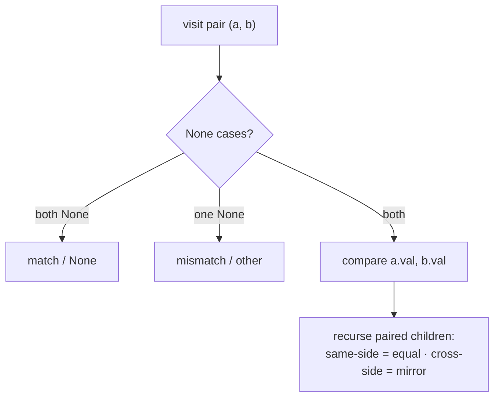

# Pattern: Simultaneous Traversal

## Why It Exists

Every tree pattern so far walked **one** tree. But a whole family of questions compares or combines **two**: "are these trees identical?", "is this tree a mirror of itself?", "is `s` a subtree of `t`?", "merge two trees by summing overlapping nodes." You *could* serialize both and compare strings, but that's two passes and `O(n)` extra space — and it can't merge.

The cleaner idea: recurse on **pairs**. Instead of `f(node)`, write `f(a, b)` and step through both trees **in lockstep** — visit `a` and `b` together, then recurse on their *paired* children. The structure falls out of the base cases (what to do when one or both of `a, b` is `None`) plus how you **pair** the children. And that pairing is the whole story: pair **same sides** (`a.left↔b.left`, `a.right↔b.right`) to test equality or merge; pair **cross sides** (`a.left↔b.right`, `a.right↔b.left`) to test mirror symmetry. `O(n)` time over the smaller tree, `O(h)` stack.

## See It Work

Are two trees **identical** — same shape, same values? Step through both at once; mismatch in structure or value fails fast. Run it.

```python run viz=binary-tree viz-root=a
class TreeNode:
    def __init__(self, val, left=None, right=None):
        self.val = val
        self.left = left
        self.right = right

def is_same(a, b):
    if a is None and b is None:    # both empty here → match
        return True
    if a is None or b is None:     # exactly one empty → shapes differ
        return False
    if a.val != b.val:             # values differ → not identical
        return False
    return is_same(a.left, b.left) and is_same(a.right, b.right)   # pair SAME sides

a = TreeNode(1, TreeNode(2), TreeNode(3))
b = TreeNode(1, TreeNode(2), TreeNode(3))
print(is_same(a, b))     # True
print(is_same(a, TreeNode(1, TreeNode(2), TreeNode(4))))   # False
```

## How It Works

A recursion whose argument is a **pair** `(a, b)`:

1. **Both `None`** → the trees agree on emptiness here → `True` (or, for merge, `None`).
2. **Exactly one `None`** → shapes diverge → `False` (or, for merge, return the non-`None` side).
3. **Both present** → compare/combine `a.val` and `b.val`, then **recurse on paired children**.
4. **The pairing decides the query**: same-side (`left↔left`, `right↔right`) for *equality* and *merge*; cross-side (`left↔right`, `right↔left`) for *mirror*.



<p align="center"><strong>one recursion advances through both trees together; how you pair the children (straight vs crossed) selects equality versus mirror.</strong></p>

Lockstep recursion keeps both cursors in sync, so a structural difference shows up as a `None`-vs-non-`None` base case the instant it appears — no serialization, no second pass. Equality, merge, and subtree-check all pair **same-side**; only **symmetry** crosses the pairing. The same skeleton extends to *n* trees (recurse on a tuple) and to "is `s` a subtree of `t`" (run `is_same(s, node)` at every node of `t`).

### Key Takeaway

To compare or combine two trees, recurse on **pairs** `(a, b)`: resolve the `None`/`None`, `None`/node, node/node base cases, then recurse on **paired** children. Pair *same sides* for equality / merge / subtree; pair *cross sides* for mirror symmetry. `O(n)` / `O(h)`, one lockstep pass.

## Trace It

`is_same(a, b)` on identical `1(2, 3)` trees:

| pair `(a, b)` | both `None`? | one `None`? | `val` match? | recurse |
|---|---|---|---|---|
| `(1, 1)` | no | no | `1 == 1` ✓ | `(2,2)` and `(3,3)` |
| `(2, 2)` | no | no | `2 == 2` ✓ | `(None,None)`×2 → `True` |
| `(3, 3)` | no | no | `3 == 3` ✓ | `(None,None)`×2 → `True` |

All branches `True` → `True`.

Before you read on: it's tempting to check whether a tree is **symmetric** by asking `is_same(root.left, root.right)` — "are the two halves the same?" Run that on the symmetric tree `1( 2(3,4), 2(4,3) )` and it returns **`False`**, even though the tree clearly *is* a mirror image of itself. Why does the equality check reject a genuinely symmetric tree, and what is the single change that fixes it?

Because **symmetry is a *mirror*, not a *copy*.** `is_same` pairs same-side children — it asks "does the left subtree's *left* child equal the right subtree's *left* child?" But a mirror flips left and right: in `1(2(3,4), 2(4,3))`, the left subtree reads `3,4` and the right reads `4,3` — *reversed*. `is_same` compares `3` against `4` (both the "left child of a 2") and fails. The tree isn't left-right *identical*; it's left-right *reflected*. The fix is to **cross the pairing**: compare `a`'s left against `b`'s **right**, and `a`'s right against `b`'s **left** — `mirror(a.left, b.right) and mirror(a.right, b.left)`. Now `3` (left subtree's left) is matched against `3` (right subtree's right), `4` against `4`, and it correctly returns `True`. That one swap — straight pairing → crossed pairing — is the *entire* difference between "are these two trees equal" and "is this tree a mirror." Same base cases, same `val` check, same lockstep walk; only the recursive pairing flips. It's the cleanest illustration that in two-tree recursion, **the pairing is the algorithm.**

## Your Turn

Mirror **symmetry** (cross-pairing) plus **merge two trees** (same-pairing, summing overlaps — LeetCode 617):

```python run viz=binary-tree viz-root=root
from collections import deque

class TreeNode:
    def __init__(self, val, left=None, right=None):
        self.val = val; self.left = left; self.right = right

def is_symmetric(root):
    def mirror(a, b):
        if a is None and b is None: return True
        if a is None or b is None:  return False
        if a.val != b.val:          return False
        return mirror(a.left, b.right) and mirror(a.right, b.left)   # CROSS pairing
    return root is None or mirror(root.left, root.right)

def merge(a, b):
    if a is None: return b                  # one missing → keep the other whole
    if b is None: return a
    return TreeNode(a.val + b.val, merge(a.left, b.left), merge(a.right, b.right))

def to_list(node):                          # level-order, trailing Nones trimmed
    if node is None: return []
    out, q = [], deque([node])
    while q:
        n = q.popleft()
        if n is None: out.append(None); continue
        out.append(n.val); q.append(n.left); q.append(n.right)
    while out and out[-1] is None: out.pop()
    return out

sym = TreeNode(1, TreeNode(2, TreeNode(3), TreeNode(4)),
                  TreeNode(2, TreeNode(4), TreeNode(3)))
print(is_symmetric(sym))    # True

a = TreeNode(1, TreeNode(3, TreeNode(5)), TreeNode(2))
b = TreeNode(2, TreeNode(1, None, TreeNode(4)), TreeNode(3, None, TreeNode(7)))
print(to_list(merge(a, b)))   # [3, 4, 5, 5, 4, None, 7]
```

```java run viz=binary-tree viz-root=root
public class Main {
  static class TreeNode { int val; TreeNode left, right; TreeNode(int v){ val = v; } TreeNode(int v, TreeNode l, TreeNode r){ val=v; left=l; right=r; } }

  static boolean mirror(TreeNode a, TreeNode b) {
    if (a == null && b == null) return true;
    if (a == null || b == null) return false;
    if (a.val != b.val) return false;
    return mirror(a.left, b.right) && mirror(a.right, b.left);   // cross pairing
  }
  static boolean isSymmetric(TreeNode root) {
    return root == null || mirror(root.left, root.right);
  }
  public static void main(String[] args) {
    TreeNode sym = new TreeNode(1, new TreeNode(2, new TreeNode(3), new TreeNode(4)),
                                   new TreeNode(2, new TreeNode(4), new TreeNode(3)));
    System.out.println(isSymmetric(sym));   // true
  }
}
```

Drill the family in **Practice** — [Identical Trees](/cortex/data-structures-and-algorithms/trees-binary-tree-pattern-simultaneous-traversal-problems-identical-trees), [Symmetry Detection](/cortex/data-structures-and-algorithms/trees-binary-tree-pattern-simultaneous-traversal-problems-symmetry-detection), [Subtree Detection](/cortex/data-structures-and-algorithms/trees-binary-tree-pattern-simultaneous-traversal-problems-subtree-detection), and [Merge Trees](/cortex/data-structures-and-algorithms/trees-binary-tree-pattern-simultaneous-traversal-problems-merge-trees).

## Reflect & Connect

Simultaneous traversal is single-tree recursion lifted to operate on a *pair*:

- **The family** — identical-tree, mirror symmetry, subtree-of (`is_same` at every node), merge-by-sum, and *n*-tree comparison (recurse on a tuple). All recurse on paired nodes with `None`-aware base cases; only the per-pair action and the *pairing* differ.
- **The pairing is the algorithm** — same-side pairing = equality / merge / subtree; cross-side pairing = mirror. The base cases and `val` step are shared boilerplate; the recursive pairing is where the meaning lives.
- **It's a product traversal** — you're walking the two trees' structures together, the same way [merging two sorted lists](/cortex/data-structures-and-algorithms/linear-structures-singly-linked-list-pattern-merge-pattern) advances two cursors in lockstep. Whenever a problem hands you *two* recursive structures to relate, reach for one recursion over the pair, not two separate walks.

**Prerequisites:** [Recursive Traversals](/cortex/data-structures-and-algorithms/trees-binary-tree-recursive-traversals-in-binary-trees).
**What's next:** you've finished the binary-tree pattern catalog — move to a structure built for prefix queries over strings, the [Trie](/cortex/data-structures-and-algorithms/trees-trie-introduction-to-tries).

## Recall

> **Mnemonic:** *Recurse on the PAIR (a, b). Resolve None/None, None/node, node/node — then recurse on paired children. Same-side = equal/merge; cross-side = mirror. The pairing is the algorithm.*

| | |
|---|---|
| Argument | a *pair* `(a, b)`, not one node |
| Base cases | both `None` → match/`None`; one `None` → mismatch/other; else compare vals |
| Equality / merge / subtree | pair same sides (`l↔l`, `r↔r`) |
| Mirror symmetry | pair cross sides (`l↔r`, `r↔l`) |
| Cost | `O(n)` over the smaller tree, `O(h)` stack |

<details>
<summary><strong>Q:</strong> What's the core move of simultaneous traversal?</summary>

**A:** Recurse on a *pair* of nodes `(a, b)`, advancing through both trees in lockstep, with base cases for the `None` combinations.

</details>
<details>
<summary><strong>Q:</strong> How do you turn an equality check into a symmetry check?</summary>

**A:** Cross the recursive pairing — compare `a.left` with `b.right` and `a.right` with `b.left` instead of same-side.

</details>
<details>
<summary><strong>Q:</strong> Why is lockstep better than serialize-and-compare?</summary>

**A:** One pass, `O(h)` space, fails fast at the first structural divergence, and it can *merge* (build a new tree), which string comparison can't.

</details>
<details>
<summary><strong>Q:</strong> How does subtree-of reuse this?</summary>

**A:** Run `is_same(s, node)` at every node of `t` — the lockstep equality check applied across all anchor points.

</details>

## Sources & Verify

- **CLRS**, *Introduction to Algorithms*, 4th ed., §10.4 — recursive tree procedures.
- **Sedgewick & Wayne**, *Algorithms*, 4th ed., §3.2 — structural recursion over trees.
- Same Tree, Symmetric Tree, and Merge Two Binary Trees (LeetCode 100, 101, 617) are the standard statements; all runnable blocks are verified by running (`is_same ⇒ True`/`False`; `is_symmetric ⇒ True`; `merge ⇒ [3,4,5,5,4,None,7]`, the canonical LC-617 answer).
