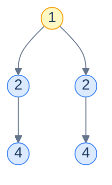

# Problem 2 — Symmetry detection

> Return `true` iff a tree is a mirror image of itself.

The trick: a tree is symmetric iff its *left subtree* is a mirror image of its *right subtree*. That's a two-tree question. The mirror-image relation is *almost* identical to identical-trees — same value, same overall shape — except the recursion descends into **swapped** pairs of children: left-of-the-left compared with right-of-the-right, right-of-the-left compared with left-of-the-right.



<p align="center"><strong>A symmetric tree — root <code>1</code>, two children both <code>2</code>, two grandchildren both <code>4</code>. The left subtree's <em>left</em> child mirrors the right subtree's <em>right</em> child.</strong></p>

<details>
<summary><h2>Solution</h2></summary>


```python run viz=binary-tree viz-root=root
from typing import Optional


class TreeNode:
    def __init__(self, val=0, left=None, right=None):
        self.val = val
        self.left = left
        self.right = right


def from_level_order(values):
    """Build tree from list like [1, 2, 3, None, 4]. None means missing child."""
    if not values:
        return None
    root = TreeNode(values[0])
    queue = [root]
    i = 1
    while queue and i < len(values):
        node = queue.pop(0)
        if i < len(values) and values[i] is not None:
            node.left = TreeNode(values[i])
            queue.append(node.left)
        i += 1
        if i < len(values) and values[i] is not None:
            node.right = TreeNode(values[i])
            queue.append(node.right)
        i += 1
    return root


class Solution:
    def is_mirror(
        self, left: Optional[TreeNode], right: Optional[TreeNode]
    ) -> bool:

        # If both trees are empty, they are considered mirror images
        if not left and not right:
            return True

        # If only one tree is empty, they are not mirror images
        if not left or not right:
            return False

        # If the values of the current nodes are different, they are not
        # mirror images
        if left.val != right.val:
            return False

        # Recursively check if the left subtree of the left tree is the
        # mirror image of the right subtree of the right tree and vice
        # versa
        left_and_right_subtree_are_mirrors = self.is_mirror(
            left.left, right.right
        )
        right_and_left_subtree_are_mirrors = self.is_mirror(
            left.right, right.left
        )

        # Return true if both subtrees are mirror images
        return (
            left_and_right_subtree_are_mirrors
            and right_and_left_subtree_are_mirrors
        )

    def symmetry_detection(self, root: Optional[TreeNode]) -> bool:

        # If the tree is empty, it is considered symmetric
        if root is None:
            return True

        # Check if the left and right subtrees are mirror images
        return self.is_mirror(root.left, root.right)


# Examples from the problem statement
print(Solution().symmetry_detection(from_level_order([1, 2, 2, 4, None, None, 4])))  # True
print(Solution().symmetry_detection(from_level_order([1, 8, 4, None, None, 2, 7])))  # False

# Edge cases
print(Solution().symmetry_detection(None))                                            # True
print(Solution().symmetry_detection(TreeNode(1)))                                    # True (single node)
print(Solution().symmetry_detection(from_level_order([1, 2, 2])))                   # True (balanced same children)
print(Solution().symmetry_detection(from_level_order([1, 2, None])))                # False (only left child)
print(Solution().symmetry_detection(from_level_order([1, 2, 2, 3, 4, 4, 3])))      # True (full symmetric)
print(Solution().symmetry_detection(from_level_order([1, 2, 2, None, 3, None, 3])))  # False (structure differs)
```

```java run viz=binary-tree viz-root=root
import java.util.*;

public class Main {
    static class TreeNode {
        int val;
        TreeNode left;
        TreeNode right;
        TreeNode() {}
        TreeNode(int val) { this.val = val; }
    }

    static TreeNode fromLevelOrder(Integer... values) {
        if (values.length == 0 || values[0] == null) return null;
        TreeNode root = new TreeNode(values[0]);
        java.util.Deque<TreeNode> queue = new java.util.ArrayDeque<>();
        queue.add(root);
        int i = 1;
        while (!queue.isEmpty() && i < values.length) {
            TreeNode node = queue.poll();
            if (i < values.length && values[i] != null) {
                node.left = new TreeNode(values[i]);
                queue.add(node.left);
            }
            i++;
            if (i < values.length && values[i] != null) {
                node.right = new TreeNode(values[i]);
                queue.add(node.right);
            }
            i++;
        }
        return root;
    }

    static class Solution {
        private boolean isMirror(TreeNode left, TreeNode right) {

            // If both trees are empty, they are considered mirror images
            if (left == null && right == null) {
                return true;
            }

            // If only one tree is empty, they are not mirror images
            if (left == null || right == null) {
                return false;
            }

            // If the values of the current nodes are different, they are not
            // mirror images
            if (left.val != right.val) {
                return false;
            }

            // Recursively check if the left subtree of the left tree is the
            // mirror image of the right subtree of the right tree and vice
            // versa
            boolean leftAndRightSubtreeAreMirrors = isMirror(
                left.left,
                right.right
            );
            boolean rightAndLeftSubtreeAreMirrors = isMirror(
                left.right,
                right.left
            );

            // Return true if both subtrees are mirror images
            return (
                leftAndRightSubtreeAreMirrors &&
                rightAndLeftSubtreeAreMirrors
            );
        }

        public boolean symmetryDetection(TreeNode root) {

            // If the tree is empty, it is considered symmetric
            if (root == null) {
                return true;
            }

            // Check if the left and right subtrees are mirror images
            return isMirror(root.left, root.right);
        }
    }

    public static void main(String[] args) {
        // Examples from the problem statement
        System.out.println(new Solution().symmetryDetection(fromLevelOrder(1, 2, 2, 4, null, null, 4)));  // true
        System.out.println(new Solution().symmetryDetection(fromLevelOrder(1, 8, 4, null, null, 2, 7)));  // false

        // Edge cases
        System.out.println(new Solution().symmetryDetection(null));                                        // true
        System.out.println(new Solution().symmetryDetection(new TreeNode(1)));                            // true
        System.out.println(new Solution().symmetryDetection(fromLevelOrder(1, 2, 2)));                   // true
        System.out.println(new Solution().symmetryDetection(fromLevelOrder(1, 2, null)));                // false
        System.out.println(new Solution().symmetryDetection(fromLevelOrder(1, 2, 2, 3, 4, 4, 3)));      // true
        System.out.println(new Solution().symmetryDetection(fromLevelOrder(1, 2, 2, null, 3, null, 3)));  // false
    }
}
```

</details>
