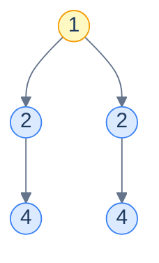

# Problem 2 — Symmetry detection

## Problem Statement

Return `true` iff a tree is a mirror image of itself.

The trick: a tree is symmetric iff its *left subtree* is a mirror image of its *right subtree*. That's a two-tree question. The mirror-image relation is *almost* identical to identical-trees — same value, same overall shape — except the recursion descends into **swapped** pairs of children: left-of-the-left compared with right-of-the-right, right-of-the-left compared with left-of-the-right.

## Examples

**Example 1:**
```
Input:  root = [1, 2, 2, 4, null, null, 4]
Output: true
```



<p align="center"><strong>A symmetric tree — root <code>1</code>, two children both <code>2</code>, two grandchildren both <code>4</code>. The left subtree's <em>left</em> child mirrors the right subtree's <em>right</em> child.</strong></p>

**Example 2:**
```
Input:  root = [1, 8, 4, null, null, 2, 7]
Output: false
```

## Constraints

- `0 ≤ number of nodes ≤ 10⁴`
- `-10⁴ ≤ node.val ≤ 10⁴`

```python run viz=binary-tree viz-root=root
import json
from collections import deque

class TreeNode:
    def __init__(self, val, left=None, right=None):
        self.val = val
        self.left = left
        self.right = right

class Solution:
    def symmetry_detection(self, root):
        # Your code goes here — define a helper mirror(a, b) with cross pairing:
        # mirror(a.left, b.right) and mirror(a.right, b.left).
        # Return True if root is None or mirror(root.left, root.right).
        return True

def build_tree(values):              # [1, 2, 3, null, 4] level-order → root
    if not values:
        return None
    root = TreeNode(values[0])
    queue = deque([root])
    i = 1
    while queue and i < len(values):
        node = queue.popleft()
        if i < len(values):
            v = values[i]; i += 1
            if v is not None:
                node.left = TreeNode(v); queue.append(node.left)
        if i < len(values):
            v = values[i]; i += 1
            if v is not None:
                node.right = TreeNode(v); queue.append(node.right)
    return root

root = build_tree(json.loads(input()))
print("true" if Solution().symmetry_detection(root) else "false")
```

```java run viz=binary-tree viz-root=root
import java.util.*;

public class Main {
    static class TreeNode {
        int val; TreeNode left, right;
        TreeNode(int val) { this.val = val; }
    }

    static class Solution {
        private boolean mirror(TreeNode a, TreeNode b) {
            // Your code goes here — cross pairing: mirror(a.left, b.right) && mirror(a.right, b.left)
            return false;
        }

        public boolean symmetryDetection(TreeNode root) {
            return root == null || mirror(root.left, root.right);
        }
    }

    public static void main(String[] args) {
        TreeNode root = buildTree(parseIntegerArray(new Scanner(System.in).nextLine()));
        System.out.println(new Solution().symmetryDetection(root));
    }

    static TreeNode buildTree(Integer[] values) {   // [1, 2, 3, null, 4] level-order → root
        if (values.length == 0 || values[0] == null) return null;
        TreeNode root = new TreeNode(values[0]);
        Deque<TreeNode> queue = new ArrayDeque<>();
        queue.add(root);
        int i = 1;
        while (!queue.isEmpty() && i < values.length) {
            TreeNode node = queue.poll();
            if (i < values.length) {
                Integer v = values[i++];
                if (v != null) { node.left = new TreeNode(v); queue.add(node.left); }
            }
            if (i < values.length) {
                Integer v = values[i++];
                if (v != null) { node.right = new TreeNode(v); queue.add(node.right); }
            }
        }
        return root;
    }

    // "[1, 2, null, 4]" → {1, 2, null, 4} — reads the test case's level-order values
    static Integer[] parseIntegerArray(String line) {
        String inner = line.replaceAll("[\\[\\]\\s]", "");
        if (inner.isEmpty()) return new Integer[0];
        String[] parts = inner.split(",");
        Integer[] out = new Integer[parts.length];
        for (int i = 0; i < parts.length; i++)
            out[i] = parts[i].equals("null") ? null : Integer.parseInt(parts[i]);
        return out;
    }
}
```

```testcases
{
  "args": [
    { "id": "root", "label": "root", "type": "tree", "placeholder": "[1, 2, 2, 4, null, null, 4]" }
  ],
  "cases": [
    { "args": { "root": "[1, 2, 2, 4, null, null, 4]" }, "expected": "true" },
    { "args": { "root": "[1, 8, 4, null, null, 2, 7]" }, "expected": "false" },
    { "args": { "root": "[]" }, "expected": "true" },
    { "args": { "root": "[1]" }, "expected": "true" },
    { "args": { "root": "[1, 2, 2]" }, "expected": "true" },
    { "args": { "root": "[1, 2, null]" }, "expected": "false" },
    { "args": { "root": "[1, 2, 2, 3, 4, 4, 3]" }, "expected": "true" },
    { "args": { "root": "[1, 2, 2, null, 3, null, 3]" }, "expected": "false" }
  ]
}
```

<details>
<summary><h2>Solution</h2></summary>

A tree is symmetric iff its left and right subtrees are mirror images of each other. Define `mirror(a, b)` with the same three base cases as `is_same`, but cross the recursive pairing — `mirror(a.left, b.right) and mirror(a.right, b.left)`. That single swap is the entire algorithm.

```python solution time=O(n) space=O(h)
import json
from collections import deque

class TreeNode:
    def __init__(self, val, left=None, right=None):
        self.val = val
        self.left = left
        self.right = right

class Solution:
    def is_mirror(self, left, right):
        if not left and not right:
            return True
        if not left or not right:
            return False
        if left.val != right.val:
            return False
        return self.is_mirror(left.left, right.right) and self.is_mirror(left.right, right.left)

    def symmetry_detection(self, root):
        if root is None:
            return True
        return self.is_mirror(root.left, root.right)

def build_tree(values):              # [1, 2, 3, null, 4] level-order → root
    if not values:
        return None
    root = TreeNode(values[0])
    queue = deque([root])
    i = 1
    while queue and i < len(values):
        node = queue.popleft()
        if i < len(values):
            v = values[i]; i += 1
            if v is not None:
                node.left = TreeNode(v); queue.append(node.left)
        if i < len(values):
            v = values[i]; i += 1
            if v is not None:
                node.right = TreeNode(v); queue.append(node.right)
    return root

root = build_tree(json.loads(input()))
print("true" if Solution().symmetry_detection(root) else "false")
```

```java solution
import java.util.*;

public class Main {
    static class TreeNode {
        int val; TreeNode left, right;
        TreeNode(int val) { this.val = val; }
    }

    static class Solution {
        private boolean isMirror(TreeNode left, TreeNode right) {
            if (left == null && right == null) return true;
            if (left == null || right == null) return false;
            if (left.val != right.val) return false;
            return isMirror(left.left, right.right) && isMirror(left.right, right.left);
        }

        public boolean symmetryDetection(TreeNode root) {
            if (root == null) return true;
            return isMirror(root.left, root.right);
        }
    }

    public static void main(String[] args) {
        TreeNode root = buildTree(parseIntegerArray(new Scanner(System.in).nextLine()));
        System.out.println(new Solution().symmetryDetection(root));
    }

    static TreeNode buildTree(Integer[] values) {   // [1, 2, 3, null, 4] level-order → root
        if (values.length == 0 || values[0] == null) return null;
        TreeNode root = new TreeNode(values[0]);
        Deque<TreeNode> queue = new ArrayDeque<>();
        queue.add(root);
        int i = 1;
        while (!queue.isEmpty() && i < values.length) {
            TreeNode node = queue.poll();
            if (i < values.length) {
                Integer v = values[i++];
                if (v != null) { node.left = new TreeNode(v); queue.add(node.left); }
            }
            if (i < values.length) {
                Integer v = values[i++];
                if (v != null) { node.right = new TreeNode(v); queue.add(node.right); }
            }
        }
        return root;
    }

    // "[1, 2, null, 4]" → {1, 2, null, 4} — reads the test case's level-order values
    static Integer[] parseIntegerArray(String line) {
        String inner = line.replaceAll("[\\[\\]\\s]", "");
        if (inner.isEmpty()) return new Integer[0];
        String[] parts = inner.split(",");
        Integer[] out = new Integer[parts.length];
        for (int i = 0; i < parts.length; i++)
            out[i] = parts[i].equals("null") ? null : Integer.parseInt(parts[i]);
        return out;
    }
}
```

</details>
