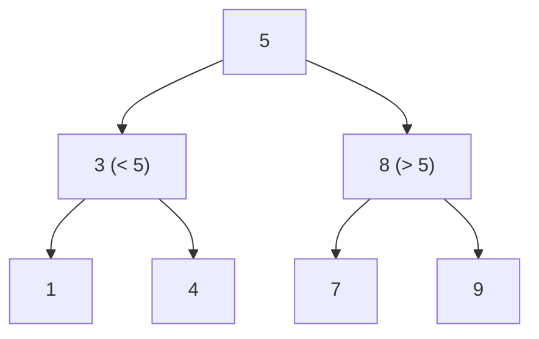

# Introduction to Binary Search Trees

## Why It Exists

Each structure so far trades something away. A sorted **array** searches in `O(log n)` but inserts in `O(n)` (shifting). A **linked list** inserts in `O(1)` but searches in `O(n)`. A **hash table** does both in `O(1)` average — but loses all ordering, so "next-largest", "everything in range `[a, b]`", and "in sorted order" are gone.

The **binary search tree** recovers ordered, *dynamic* operations. It's a binary tree with one invariant: for every node, **all values in its left subtree are smaller, and all values in its right subtree are larger**. That ordering means a search never explores both children — at each node one comparison sends it left or right, tracing a single root-to-leaf path. Search, insert, and delete all cost `O(h)`, the tree's height — `O(log n)` when the tree is balanced. And because left < node < right everywhere, an **in-order traversal visits the values in sorted order for free**.

## See It Work

Insert `[5, 3, 8, 1, 4, 7, 9]` into a BST, then read it back in order. Run it, then **Visualise** the shape — note the in-order walk comes out sorted.

> ▶ Run it, then click **Visualise** — each value drops left or right by comparison until it finds an empty spot; the in-order traversal emerges sorted.

```python run viz=binary-tree viz-root=root
class TreeNode:
    def __init__(self, val):
        self.val = val
        self.left = None
        self.right = None

def insert(root, val):
    if root is None:
        return TreeNode(val)             # found the empty spot — attach here
    if val < root.val:
        root.left = insert(root.left, val)    # smaller → go left
    elif val > root.val:
        root.right = insert(root.right, val)  # larger → go right
    return root

def inorder(node):
    return inorder(node.left) + [node.val] + inorder(node.right) if node else []

root = None
for v in [5, 3, 8, 1, 4, 7, 9]:
    root = insert(root, v)
print(inorder(root))                     # [1, 3, 4, 5, 7, 8, 9] — sorted!
```

## How It Works

The invariant — **left subtree < node < right subtree**, recursively — drives every operation:

- **Search** — compare the target to the node: equal → found; smaller → recurse left; larger → recurse right. One comparison eliminates an entire subtree, so the work is the path length, `O(h)`.
- **Insert** — search for the value; the first empty child slot you reach is where it belongs (always inserted as a new leaf). Also `O(h)`.
- **In-order traversal** (left, node, right) — visits the smaller subtree, then the node, then the larger, so the values come out **ascending**.



<p align="center"><strong>the BST invariant: every node's left subtree holds only smaller keys, its right subtree only larger; search follows one comparison-guided path down.</strong></p>

The cost of every operation is the **height `h`**. A *balanced* tree has `h = O(log n)`, giving `O(log n)` search/insert/delete — the BST's promise. But the height depends on *insertion order*: insert already-sorted data and every node becomes a right child, producing a degenerate "linked list" of height `n` and `O(n)` operations. That failure mode is exactly what self-balancing trees (AVL, red-black) exist to prevent — a later lesson.

### Key Takeaway

A BST is a binary tree with the invariant left < node < right everywhere, so search/insert/delete each follow one root-to-leaf path (`O(h)`) and in-order traversal yields sorted output. `h` is `O(log n)` when balanced but `O(n)` if it degenerates — which motivates self-balancing trees.

## Trace It

Searching for `4` in the tree built above (`5` at the root):

| at node | compare `4` | go |
|---|---|---|
| `5` | `4 < 5` | left |
| `3` | `4 > 3` | right |
| `4` | `4 == 4` | **found** |

Three comparisons, one path.

Before you read on: this tree has height ~2 and search took 3 steps. But suppose you'd inserted the *same* values in **sorted order** `[1, 3, 4, 5, 7, 8, 9]` instead. What shape would the BST take, and what would that do to search?

It would become a completely **right-leaning chain** — `1 → 3 → 4 → 5 → 7 → 8 → 9`, each value larger than the last so each becomes the right child of the previous. Height `n − 1`, not `log n`. Searching then degrades to walking the whole chain — `O(n)`, no better than a linked list, and you've paid tree overhead for nothing. The BST's `O(log n)` is a *best/average* case that holds only while the tree stays bushy; adversarial or sorted input collapses it. This is the single most important caveat about plain BSTs, and the entire reason **self-balancing** trees (AVL, red-black) were invented — they perform rotations on insert/delete to *guarantee* `h = O(log n)` regardless of input order.

## Your Turn

The reusable BST — insert, search, in-order:

```python run viz=binary-tree viz-root=root
class TreeNode:
    def __init__(self, val):
        self.val = val
        self.left = None
        self.right = None

def insert(root, val):
    if root is None:
        return TreeNode(val)
    if val < root.val:
        root.left = insert(root.left, val)
    elif val > root.val:
        root.right = insert(root.right, val)
    return root

def search(root, val):
    while root:
        if val == root.val:
            return True
        root = root.left if val < root.val else root.right
    return False

def inorder(node):
    return inorder(node.left) + [node.val] + inorder(node.right) if node else []

root = None
for v in [5, 3, 8, 1, 4, 7, 9]:
    root = insert(root, v)
print(inorder(root))                 # [1, 3, 4, 5, 7, 8, 9]
print(search(root, 7), search(root, 6))   # True False
```

```java run viz=binary-tree viz-root=root
public class Main {
  static class TreeNode { int val; TreeNode left, right; TreeNode(int v){ val = v; } }

  static TreeNode insert(TreeNode root, int val) {
    if (root == null) return new TreeNode(val);
    if (val < root.val) root.left = insert(root.left, val);
    else if (val > root.val) root.right = insert(root.right, val);
    return root;
  }
  static boolean search(TreeNode root, int val) {
    while (root != null) {
      if (val == root.val) return true;
      root = val < root.val ? root.left : root.right;
    }
    return false;
  }
  static void inorder(TreeNode n, java.util.List<Integer> out) {
    if (n == null) return;
    inorder(n.left, out); out.add(n.val); inorder(n.right, out);
  }
  public static void main(String[] args) {
    TreeNode root = null;
    for (int v : new int[]{5, 3, 8, 1, 4, 7, 9}) root = insert(root, v);
    java.util.List<Integer> out = new java.util.ArrayList<>();
    inorder(root, out);
    System.out.println(out + " " + search(root, 7) + " " + search(root, 6));
    // [1, 3, 4, 5, 7, 8, 9] true false
  }
}
```

This is a structural lesson — the BST subsection's search, insert, delete, and pattern lessons build on this invariant.

## Reflect & Connect

The BST is the canonical *ordered, dynamic* container:

- **Where it fits among containers** — sorted array (fast search, slow insert), hash table (`O(1)` but unordered), BST (`O(log n)` search *and* insert/delete *and* ordered operations: min/max, successor/predecessor, range queries, sorted iteration). When you need ordering *and* mutability, the BST is the answer.
- **Everything costs `O(h)`** — so the whole game is keeping `h` near `log n`. Plain BSTs don't; [self-balancing trees](/cortex/data-structures-and-algorithms/trees/self-balancing-bst-overview/self-balancing-bst-overview) ([AVL](/cortex/data-structures-and-algorithms/trees/avl-tree/introduction-to-avl-trees), [red-black](/cortex/data-structures-and-algorithms/trees/red-black-tree/introduction-to-red-black-trees)) do, via rotations.
- **In-order = sorted is the signature property** — it's why BSTs back ordered maps/sets (`std::map`, Java `TreeMap`), range queries, and "k-th smallest" — none of which a hash table can do. The upcoming pattern lessons (sorted/reverse traversal, range, two-pointer-on-BST) all exploit this.

**Prerequisites:** [Introduction to Binary Trees](/cortex/data-structures-and-algorithms/trees/binary-tree/introduction-to-binary-trees).
**What's next:** why height is everything, and what "balanced" means — [Height and Balance in BSTs](/cortex/data-structures-and-algorithms/trees/binary-search-tree/height-and-balance-in-binary-search-trees).

## Recall

> **Mnemonic:** *Left < node < right, everywhere. Search/insert/delete follow one path = O(h). In-order = sorted. Balanced ⇒ O(log n); sorted input ⇒ O(n) degenerate chain.*

| | |
|---|---|
| Invariant | left subtree < node < right subtree (recursive) |
| Search/insert/delete | one root-to-leaf path → `O(h)` |
| In-order traversal | yields values in sorted order |
| Height | `O(log n)` balanced; `O(n)` degenerate (e.g. sorted insertion) |
| Use when | you need ordered *and* dynamic: range, min/max, successor, sorted iteration |

<details>
<summary><strong>Q:</strong> What invariant defines a BST?</summary>

**A:** For every node, all left-subtree values are smaller and all right-subtree values are larger.

</details>
<details>
<summary><strong>Q:</strong> Why are search/insert/delete `O(h)`?</summary>

**A:** Each comparison eliminates one subtree, so an operation follows a single root-to-leaf path of length `h`.

</details>
<details>
<summary><strong>Q:</strong> What does an in-order traversal of a BST produce, and why?</summary>

**A:** The values in sorted order — it visits left (smaller), then node, then right (larger).

</details>
<details>
<summary><strong>Q:</strong> When does a BST degrade to `O(n)`, and what fixes it?</summary>

**A:** When it becomes an unbalanced chain (e.g. sorted insertion); self-balancing trees use rotations to keep `h = O(log n)`.

</details>

## Sources & Verify

- **CLRS**, *Introduction to Algorithms*, 4th ed., §12 — binary search trees, the BST property, and `O(h)` operations.
- **Sedgewick & Wayne**, *Algorithms*, 4th ed., §3.2 — BSTs, in-order traversal, and the balance problem.
- The BST invariant, `O(h)` operations, and in-order-sorted property are standard; both runnable blocks are verified by running (in-order `⇒ [1,3,4,5,7,8,9]`, search `7 ⇒ True, 6 ⇒ False`).
