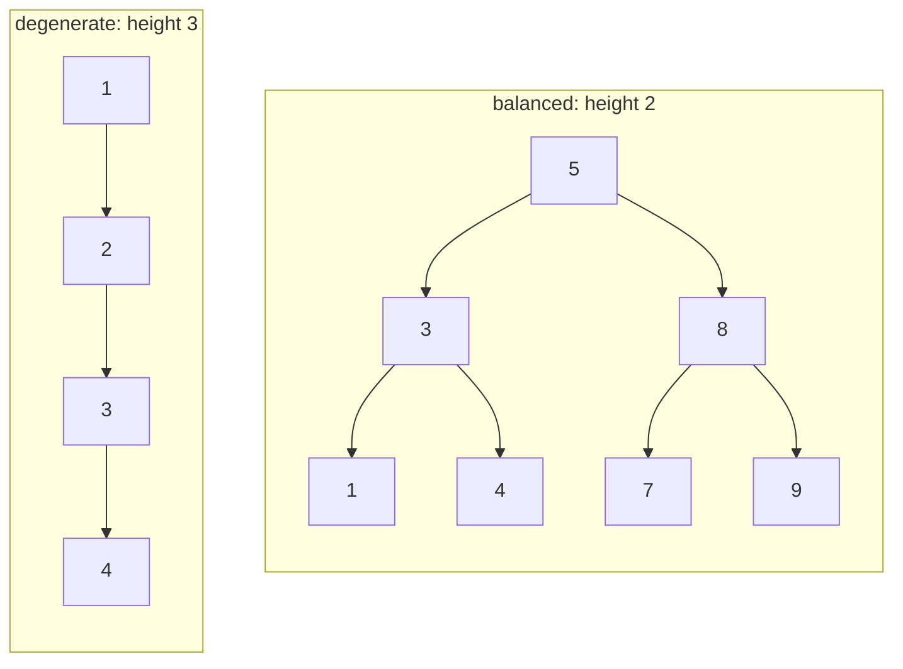

# Height and Balance in Binary Search Trees

## Why It Exists

The [BST intro](/cortex/data-structures-and-algorithms/trees/binary-search-tree/introduction-to-binary-search-trees) said every operation is `O(h)` and that "balanced" means `O(log n)` while "degenerate" means `O(n)`. Those two words — *height* and *balanced* — are doing all the work, so they deserve precise definitions.

**Height** is the length of the longest root-to-leaf path. Since search, insert, and delete each follow one such path, the height *is* the cost. **Balance** is the property that keeps height small: a tree is *height-balanced* when, at every node, its left and right subtrees differ in height by at most 1. That local rule has a global payoff — it forces `h = O(log n)`, so the BST keeps its promise. Defining this precisely is the foundation for the self-balancing trees (AVL, red-black) that *enforce* it.

## See It Work

Compute the height and balance of a BST built from an insertion sequence. Run it, then **Visualise** the difference in shape between bushy and sorted inputs.

> ▶ Run it, then click **Visualise** — a random insertion order gives a short, balanced tree; sorted input produces a degenerate chain whose height equals its node count.

```python run viz=binary-tree viz-root=root
import ast

class TreeNode:
    def __init__(self, val):
        self.val = val
        self.left = None
        self.right = None

def insert(root, val):
    if root is None:
        return TreeNode(val)
    if val < root.val:
        root.left = insert(root.left, val)
    elif val > root.val:
        root.right = insert(root.right, val)
    return root

def height(node):
    if node is None:
        return -1                         # empty has height -1 (edges); a leaf has height 0
    return 1 + max(height(node.left), height(node.right))

def is_balanced(node):
    if node is None:
        return True
    if abs(height(node.left) - height(node.right)) > 1:   # balance factor out of range
        return False
    return is_balanced(node.left) and is_balanced(node.right)

values = ast.literal_eval(input())
root = None
for v in values:
    root = insert(root, v)
print(height(root), "true" if is_balanced(root) else "false")
```

```java run viz=binary-tree viz-root=root
import java.util.*;
public class Main {
    static class TreeNode { int val; TreeNode left, right; TreeNode(int v){ val = v; } }

    static TreeNode insert(TreeNode root, int val) {
        if (root == null) return new TreeNode(val);
        if (val < root.val) root.left = insert(root.left, val);
        else if (val > root.val) root.right = insert(root.right, val);
        return root;
    }

    static int height(TreeNode n) {
        if (n == null) return -1;
        return 1 + Math.max(height(n.left), height(n.right));
    }

    static boolean isBalanced(TreeNode n) {
        if (n == null) return true;
        return Math.abs(height(n.left) - height(n.right)) <= 1
            && isBalanced(n.left) && isBalanced(n.right);
    }

    static int[] parseIntArray(String line) {
        String inner = line.replaceAll("[\\[\\]\\s]", "");
        if (inner.isEmpty()) return new int[0];
        String[] parts = inner.split(",");
        int[] out = new int[parts.length];
        for (int i = 0; i < parts.length; i++) out[i] = Integer.parseInt(parts[i]);
        return out;
    }

    public static void main(String[] a) {
        Scanner sc = new Scanner(System.in);
        int[] values = parseIntArray(sc.nextLine());
        TreeNode root = null;
        for (int v : values) root = insert(root, v);
        System.out.println(height(root) + " " + isBalanced(root));
    }
}
```

```testcases
{
  "args": [
    { "id": "values", "label": "insert sequence", "type": "array", "placeholder": "[5, 3, 8, 1, 4, 7, 9]" }
  ],
  "cases": [
    { "args": { "values": "[5, 3, 8, 1, 4, 7, 9]" }, "expected": "2 true" },
    { "args": { "values": "[1, 2, 3, 4]" }, "expected": "3 false" },
    { "args": { "values": "[4, 2, 6, 1, 3, 5, 7]" }, "expected": "2 true" },
    { "args": { "values": "[1]" }, "expected": "0 true" }
  ]
}
```

Both print `2 true` for the balanced input and `3 false` for the degenerate chain. The height is the longest root-to-leaf path; "true" means every node's subtrees differ by at most 1.

## How It Works

Two recursive definitions:

- **Height** — `height(node) = 1 + max(height(left), height(right))`, with empty `= −1` (so a leaf is `0`). It's the longest downward path.
- **Balance factor** of a node = `height(left) − height(right)`. A node is locally balanced when its balance factor is in `{−1, 0, +1}`; a tree is **height-balanced** when *every* node is.



<p align="center"><strong>same 7 keys: balanced (height 2, every balance factor ≤ 1) versus the sorted-insertion chain (height grows with n).</strong></p>

Why does the local "differ by ≤ 1" rule guarantee `h = O(log n)` globally? Run the bound the other way: what's the *fewest* nodes a height-balanced tree of height `h` can have? Call it `N(h)`. Its two subtrees can differ in height by 1, so the sparsest case is `N(h) = 1 + N(h−1) + N(h−2)` — the **Fibonacci recurrence**. Fibonacci numbers grow like `φ^h` (`φ ≈ 1.618`), so `N(h) ≥ φ^h`, which inverts to `h ≤ log_φ(n) ≈ 1.44 log₂ n`. A height-balanced tree of `n` nodes can be at most ~44% taller than a perfectly balanced one — still `O(log n)`. That's the guarantee AVL trees deliver.

### Key Takeaway

Height is the longest root-to-leaf path and equals every operation's cost. A tree is height-balanced when each node's subtrees differ in height by ≤ 1, which bounds `h ≤ ~1.44 log n` (a Fibonacci argument). Self-balancing trees exist to maintain exactly this property.

## Trace It

Heights in the balanced tree `[5, 3, 8, 1, 4, 7, 9]`, bottom-up:

| node | left h | right h | node height | balance factor |
|---|---|---|---|---|
| `1, 4, 7, 9` (leaves) | −1 | −1 | `0` | `0` |
| `3` | `0` | `0` | `1` | `0` |
| `8` | `0` | `0` | `1` | `0` |
| `5` (root) | `1` | `1` | `2` | `0` |

Every balance factor is `0` → perfectly balanced, height `2`.

Before you read on: this balanced tree has height `2` for `7` nodes (`log₂ 7 ≈ 2.8`). The degenerate chain had height `3` for just `4` nodes. As `n` grows to a million, the balanced height stays near `20` while the chain's height *is* a million. Given every operation costs `O(h)`, what does that gap mean in practice — and why can't a plain BST be trusted with it?

At a million nodes, a balanced BST answers each query in ~20 comparisons; the degenerate chain takes up to a million — a **50,000×** difference, and the chain is no better than a linked list despite the tree overhead. The catch is that a *plain* BST's height depends entirely on **insertion order**, which you often don't control (sorted or adversarial input produces exactly the chain). So a plain BST's advertised `O(log n)` is only an *average/best* case — untrustworthy for worst-case guarantees. That's precisely why production ordered maps never use a plain BST: they use **self-balancing** trees that perform rotations on every insert/delete to *force* the height-balanced property, converting `O(log n)` from a hope into a guarantee. Height isn't just a metric here — it's the dividing line between a usable structure and a degenerate one.

## Your Turn

The reusable height and balance checks:

```python run viz=binary-tree viz-root=root
import ast

class TreeNode:
    def __init__(self, val):
        self.val = val
        self.left = None
        self.right = None

def insert(root, val):
    if root is None:
        return TreeNode(val)
    if val < root.val: root.left = insert(root.left, val)
    elif val > root.val: root.right = insert(root.right, val)
    return root

def height(node):
    if node is None:
        return -1
    return 1 + max(height(node.left), height(node.right))

def is_balanced(node):
    if node is None:
        return True
    return (abs(height(node.left) - height(node.right)) <= 1
            and is_balanced(node.left) and is_balanced(node.right))

values = ast.literal_eval(input())
root = None
for v in values:
    root = insert(root, v)
print(height(root), "true" if is_balanced(root) else "false")
```

```java run viz=binary-tree viz-root=root
import java.util.*;
public class Main {
    static class TreeNode { int val; TreeNode left, right; TreeNode(int v){ val = v; } }

    static TreeNode insert(TreeNode r, int v) {
        if (r == null) return new TreeNode(v);
        if (v < r.val) r.left = insert(r.left, v);
        else if (v > r.val) r.right = insert(r.right, v);
        return r;
    }

    static int height(TreeNode n) {
        if (n == null) return -1;
        return 1 + Math.max(height(n.left), height(n.right));
    }

    static boolean isBalanced(TreeNode n) {
        if (n == null) return true;
        return Math.abs(height(n.left) - height(n.right)) <= 1
            && isBalanced(n.left) && isBalanced(n.right);
    }

    static int[] parseIntArray(String line) {
        String inner = line.replaceAll("[\\[\\]\\s]", "");
        if (inner.isEmpty()) return new int[0];
        String[] parts = inner.split(",");
        int[] out = new int[parts.length];
        for (int i = 0; i < parts.length; i++) out[i] = Integer.parseInt(parts[i]);
        return out;
    }

    public static void main(String[] args) {
        Scanner sc = new Scanner(System.in);
        int[] values = parseIntArray(sc.nextLine());
        TreeNode t = null;
        for (int v : values) t = insert(t, v);
        System.out.println(height(t) + " " + isBalanced(t));
    }
}
```

```testcases
{
  "args": [
    { "id": "values", "label": "insert sequence", "type": "array", "placeholder": "[5, 3, 8, 1, 4, 7, 9]" }
  ],
  "cases": [
    { "args": { "values": "[5, 3, 8, 1, 4, 7, 9]" }, "expected": "2 true" },
    { "args": { "values": "[1, 2, 3, 4, 5]" }, "expected": "4 false" },
    { "args": { "values": "[3, 1, 5]" }, "expected": "1 true" },
    { "args": { "values": "[2, 1, 4, 3, 5, 6]" }, "expected": "3 false" },
    { "args": { "values": "[5]" }, "expected": "0 true" }
  ]
}
```

This is a structural lesson — the BST search/insert/delete and balancing lessons all turn on the height defined here.

## Reflect & Connect

Height and balance are the lens for everything tree-shaped:

- **Cost = height** — search, insert, delete, successor, range — all `O(h)`. Optimizing a BST *is* minimizing its height.
- **Flavors of "balanced"** — *height-balanced* (subtree heights differ by ≤ 1, AVL's invariant), the looser *red-black* invariant (no path more than twice another → `h ≤ 2 log n`), and *perfectly balanced* (all leaves on ≤ 2 levels, what a sorted array achieves). They trade rebalancing frequency against height tightness.
- **The Fibonacci bound is the AVL guarantee** — `h ≤ 1.44 log n` is exactly the worst case [AVL trees](/cortex/data-structures-and-algorithms/trees/avl-tree/introduction-to-avl-trees) maintain; red-black trees accept a slightly taller `2 log n` for cheaper rebalancing. Knowing the bound tells you *how good* "balanced" is.

**Prerequisites:** [Introduction to Binary Search Trees](/cortex/data-structures-and-algorithms/trees/binary-search-tree/introduction-to-binary-search-trees).
**What's next:** the first operation that rides the height — [Recursive Searching in BSTs](/cortex/data-structures-and-algorithms/trees/binary-search-tree/recursive-searching-in-binary-search-trees).

## Recall

> **Mnemonic:** *Height = longest root-to-leaf path = the cost of everything. Height-balanced = every node's subtrees differ by ≤ 1 ⇒ `h ≤ ~1.44 log n` (Fibonacci bound). Balancing trees enforce it.*

| | |
|---|---|
| Height | `1 + max(h(left), h(right))`, empty `= −1` |
| Balance factor | `h(left) − h(right)`; balanced node ⇒ in `{−1,0,1}` |
| Height-balanced | every node balanced ⇒ `h = O(log n)` |
| Bound | `h ≤ log_φ(n) ≈ 1.44 log₂ n` (sparsest balanced tree is Fibonacci-sized) |
| Why it matters | every BST operation is `O(h)`; balanced vs degenerate = `O(log n)` vs `O(n)` |

<details>
<summary><strong>Q:</strong> Why does a BST's performance reduce to its height?</summary>

**A:** Search, insert, and delete each follow one root-to-leaf path, whose length is the height.

</details>
<details>
<summary><strong>Q:</strong> What is a height-balanced tree?</summary>

**A:** One where every node's left and right subtree heights differ by at most 1.

</details>
<details>
<summary><strong>Q:</strong> Why does height-balance guarantee `O(log n)`?</summary>

**A:** The sparsest such tree of height `h` has Fibonacci-many nodes (`≥ φ^h`), so `h ≤ ~1.44 log₂ n`.

</details>
<details>
<summary><strong>Q:</strong> Why can't a plain BST be trusted for `O(log n)`?</summary>

**A:** Its height depends on insertion order; sorted/adversarial input makes a height-`n` chain — only self-balancing trees force the bound.

</details>

## Sources & Verify

- **CLRS**, *Introduction to Algorithms*, 4th ed., §12–13 — tree height, balance, and the height bound for balanced trees.
- **Sedgewick & Wayne**, *Algorithms*, 4th ed., §3.3 — balanced search trees and height guarantees.
- The height/balance definitions and the `~1.44 log n` Fibonacci (AVL) bound are standard; both runnable blocks are verified by running (balanced `⇒ 2 true`; degenerate `⇒ 4 false`).
