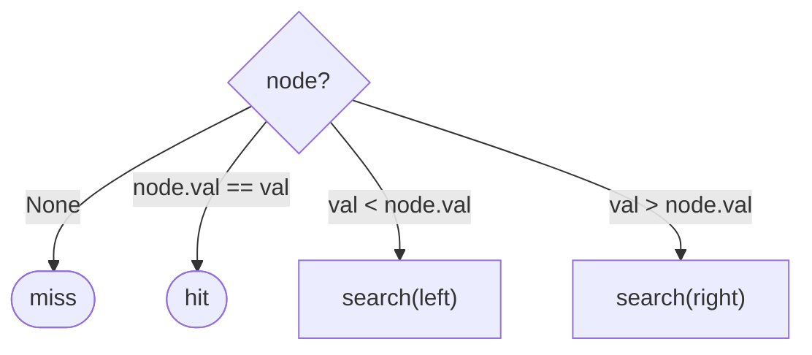

# Recursive Searching in Binary Search Trees

## Why It Exists

A BST is a recursive structure — each child is itself a smaller BST — so the most natural way to search it is recursion that mirrors that shape. The [BST invariant](/cortex/data-structures-and-algorithms/trees-binary-search-tree-introduction-to-binary-search-trees) (left < node < right) means a comparison at the current node tells you *which single subtree* could hold the target, so you recurse into exactly one child and ignore the other.

That "recurse into one child, never both" is the whole reason search is `O(h)` and not `O(n)`: a full tree traversal visits every node, but search prunes half the structure at each step. The recursive formulation makes the base cases explicit (empty subtree = not found, matching node = found) and reads almost like the definition of the BST itself — and the same one-sided descent gives you the minimum (keep going left) and maximum (keep going right) for free.

## See It Work

Search for a present key (`7`) and an absent one (`6`), and find the min and max — all by recursive descent. Run it.

```python run viz=binary-tree viz-root=root
class TreeNode:
    def __init__(self, val):
        self.val = val
        self.left = None
        self.right = None

def insert(root, val):
    if root is None:
        return TreeNode(val)
    if val < root.val: root.left = insert(root.left, val)
    elif val > root.val: root.right = insert(root.right, val)
    return root

def search(root, val):
    if root is None or root.val == val:      # base case: empty (miss) or match (hit)
        return root
    if val < root.val:
        return search(root.left, val)        # smaller → recurse left only
    return search(root.right, val)           # larger → recurse right only

root = None
for v in [5, 3, 8, 1, 4, 7, 9]:
    root = insert(root, v)

print(search(root, 7).val if search(root, 7) else None)   # 7  (found)
print(search(root, 6))                                     # None (absent)
```

## How It Works

`search(node, val)` has two base cases and one recursive step:

1. **`node is None`** → the subtree is empty, so the value isn't here — return `None` (miss).
2. **`node.val == val`** → found — return the node (hit).
3. Otherwise recurse into the **one** child the comparison selects: `val < node.val` → left, else right.



<p align="center"><strong>at each node, one comparison sends the search down a single child; the other subtree is pruned entirely.</strong></p>

Because each call recurses into *one* child, the recursion depth is the path length — `O(h)` time, and `O(h)` space for the call stack (the one cost versus the iterative version, next lesson). The same descent specializes:

- **Minimum** — the smallest key is the **leftmost** node: recurse left until `node.left is None`.
- **Maximum** — the largest is the **rightmost**: recurse right until `node.right is None`.

These power `successor`/`predecessor`, range queries, and deletion (which needs the in-order successor).

### Key Takeaway

Recursive BST search mirrors the structure: empty = miss, match = hit, else recurse into the *single* child the comparison chooses. One call per level → `O(h)` time and stack. Leftmost = min, rightmost = max — the same descent reused.

## Trace It

`search(root, 7)` in the tree (`5` at root):

| call | node | compare `7` | next |
|---|---|---|---|
| 1 | `5` | `7 > 5` | `search(right = 8)` |
| 2 | `8` | `7 < 8` | `search(left = 7)` |
| 3 | `7` | `7 == 7` | **return node 7** |

Before you read on: this search made 3 recursive calls for a 7-node tree. A full in-order traversal of the same tree visits all 7 nodes. Both are recursive over the same structure — so why is search `O(h)` while traversal is `O(n)`?

Because of **how many children each call recurses into**. Traversal recurses into *both* children at every node (it must visit everything), so it touches all `n` nodes — `O(n)`. Search recurses into *exactly one* child, chosen by the comparison: the BST invariant guarantees the target can only be in that side, so the other entire subtree is discarded unvisited. That prunes the work from "every node" down to "one root-to-leaf path" of length `h`. The branching factor of the recursion is what separates them: two-way branching enumerates the tree (`O(n)`); one-way branching walks a path (`O(h)`). It's the same insight as binary search on an array — one comparison eliminates half — expressed on a tree.

## Your Turn

The reusable recursive search, plus min and max:

```python run viz=binary-tree viz-root=root
class TreeNode:
    def __init__(self, val):
        self.val = val
        self.left = None
        self.right = None

def insert(root, val):
    if root is None: return TreeNode(val)
    if val < root.val: root.left = insert(root.left, val)
    elif val > root.val: root.right = insert(root.right, val)
    return root

def search(root, val):
    if root is None or root.val == val:
        return root
    return search(root.left, val) if val < root.val else search(root.right, val)

def find_min(root):
    return root if root is None or root.left is None else find_min(root.left)

def find_max(root):
    return root if root is None or root.right is None else find_max(root.right)

root = None
for v in [5, 3, 8, 1, 4, 7, 9]:
    root = insert(root, v)
print(bool(search(root, 4)), bool(search(root, 6)))   # True False
print(find_min(root).val, find_max(root).val)          # 1 9
```

```java run viz=binary-tree viz-root=root
public class Main {
  static class TreeNode { int val; TreeNode left, right; TreeNode(int v){ val = v; } }
  static TreeNode insert(TreeNode r, int v) {
    if (r == null) return new TreeNode(v);
    if (v < r.val) r.left = insert(r.left, v);
    else if (v > r.val) r.right = insert(r.right, v);
    return r;
  }
  static TreeNode search(TreeNode root, int val) {
    if (root == null || root.val == val) return root;
    return val < root.val ? search(root.left, val) : search(root.right, val);
  }
  static TreeNode findMin(TreeNode r) { return (r == null || r.left == null) ? r : findMin(r.left); }
  static TreeNode findMax(TreeNode r) { return (r == null || r.right == null) ? r : findMax(r.right); }

  public static void main(String[] args) {
    TreeNode root = null;
    for (int v : new int[]{5, 3, 8, 1, 4, 7, 9}) root = insert(root, v);
    System.out.println((search(root, 4) != null) + " " + (search(root, 6) != null));   // true false
    System.out.println(findMin(root).val + " " + findMax(root).val);                    // 1 9
  }
}
```

This is a structural lesson — search is the basis for insertion, deletion, and the BST pattern lessons.

## Reflect & Connect

Recursive search is the template every other BST operation extends:

- **Search is the foundation** — insertion searches for the empty slot; deletion searches for the node (and its in-order successor); `floor`/`ceiling`/`successor`/`predecessor` are searches that remember the last turn. Master this descent and the rest are variations.
- **Min/max are degenerate searches** — "always go left" / "always go right." They're needed by deletion (replace a two-child node with its successor = min of the right subtree) and by ordered iteration.
- **Recursive vs iterative** — the recursion is clean and matches the structure but uses `O(h)` stack space; the [iterative version](/cortex/data-structures-and-algorithms/trees-binary-search-tree-iterative-searching-in-binary-search-trees) is a simple `while` loop with `O(1)` space, preferred when `h` could be large. Same `O(h)` time, different space.

**Prerequisites:** [Introduction to Binary Search Trees](/cortex/data-structures-and-algorithms/trees-binary-search-tree-introduction-to-binary-search-trees).
**What's next:** the same search as a loop, with `O(1)` space — [Iterative Searching in BSTs](/cortex/data-structures-and-algorithms/trees-binary-search-tree-iterative-searching-in-binary-search-trees).

## Recall

> **Mnemonic:** *Empty = miss, match = hit, else recurse the ONE child the comparison picks. One call/level ⇒ O(h). Leftmost = min, rightmost = max.*

| | |
|---|---|
| Base cases | `node is None` (miss) · `node.val == val` (hit) |
| Recurse | `val < node.val` → left, else right (one child only) |
| Cost | `O(h)` time, `O(h)` stack space |
| Min / max | recurse left-only / right-only to the end |
| Builds | insertion, deletion, successor/predecessor, range |

<details>
<summary><strong>Q:</strong> What are the base cases of recursive BST search?</summary>

**A:** Empty node (miss) and a node whose value equals the target (hit).

</details>
<details>
<summary><strong>Q:</strong> Why is search `O(h)` while traversal is `O(n)`?</summary>

**A:** Search recurses into one child (the comparison prunes the other subtree); traversal recurses into both, visiting every node.

</details>
<details>
<summary><strong>Q:</strong> How do you find the min and max?</summary>

**A:** Recurse left-only to the end (min) or right-only to the end (max).

</details>
<details>
<summary><strong>Q:</strong> Recursive vs iterative search trade-off?</summary>

**A:** Same `O(h)` time; recursion is cleaner but uses `O(h)` stack, iterative uses `O(1)` space.

</details>

## Sources & Verify

- **CLRS**, *Introduction to Algorithms*, 4th ed., §12.2 — `TREE-SEARCH`, `TREE-MINIMUM`, `TREE-MAXIMUM`.
- **Sedgewick & Wayne**, *Algorithms*, 4th ed., §3.2 — recursive BST search and ordered operations.
- The recursive search and min/max descents are standard; both runnable blocks are verified by running (search `4 ⇒ True`, `6 ⇒ False`; min `1`, max `9`).
