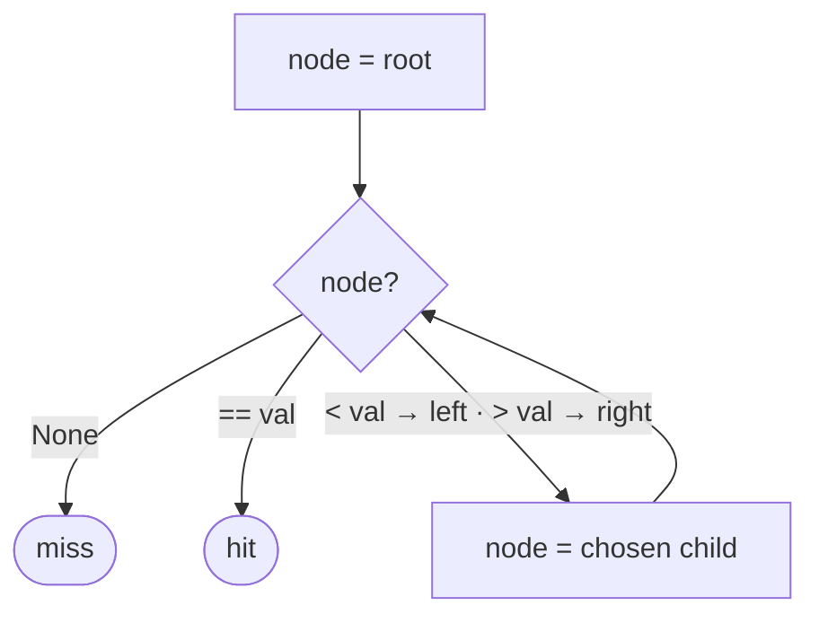

# Iterative Searching in Binary Search Trees

## Why It Exists

[Recursive search](/cortex/data-structures-and-algorithms/trees/binary-search-tree/recursive-searching-in-binary-search-trees) is clean, but each call frame costs stack space — `O(h)` of it. On a deep tree (and a degenerate BST can be height `n`), that's a real stack-overflow risk and per-call overhead.

The fix is to notice that BST search is **tail-recursive**: the recursive call is the *last* thing each invocation does, with no work waiting afterward. Any tail recursion converts mechanically to a loop — keep a "current node" pointer, and instead of recursing, just reassign it and loop. The descent is identical, the time is still `O(h)`, but the space drops to `O(1)`. For production code and deep trees, the iterative form is usually preferred.

## See It Work

The same search as before, now with a `while` loop and a single pointer. Run it.

```python run viz=binary-tree viz-root=root
import json
from collections import deque

class TreeNode:
    def __init__(self, val, left=None, right=None):
        self.val = val
        self.left = left
        self.right = right

def build_tree(values):              # [1, 2, 3, null, 4] level-order → root
    if not values:
        return None
    root = TreeNode(values[0])
    queue = deque([root])
    i = 1
    while queue and i < len(values):
        node = queue.popleft()
        if i < len(values):
            v = values[i]; i += 1
            if v is not None:
                node.left = TreeNode(v); queue.append(node.left)
        if i < len(values):
            v = values[i]; i += 1
            if v is not None:
                node.right = TreeNode(v); queue.append(node.right)
    return root

def insert(root, val):
    if root is None: return TreeNode(val)
    if val < root.val: root.left = insert(root.left, val)
    elif val > root.val: root.right = insert(root.right, val)
    return root

def search(root, val):
    node = root
    while node is not None:                  # walk down with one pointer — O(1) space
        if val == node.val:
            return node
        node = node.left if val < node.val else node.right
    return None                              # fell off the tree → not found

root = build_tree(json.loads(input()))
key = int(input())
print("true" if search(root, key) is not None else "false")
```

```java run viz=binary-tree viz-root=root
import java.util.*;

public class Main {
  static class TreeNode {
    int val; TreeNode left, right;
    TreeNode(int val) { this.val = val; }
  }

  static TreeNode buildTree(Integer[] values) {
    if (values.length == 0 || values[0] == null) return null;
    TreeNode root = new TreeNode(values[0]);
    Deque<TreeNode> queue = new ArrayDeque<>();
    queue.add(root);
    int i = 1;
    while (!queue.isEmpty() && i < values.length) {
      TreeNode node = queue.poll();
      if (i < values.length) {
        Integer v = values[i++];
        if (v != null) { node.left = new TreeNode(v); queue.add(node.left); }
      }
      if (i < values.length) {
        Integer v = values[i++];
        if (v != null) { node.right = new TreeNode(v); queue.add(node.right); }
      }
    }
    return root;
  }

  static TreeNode insert(TreeNode r, int v) {
    if (r == null) return new TreeNode(v);
    if (v < r.val) r.left = insert(r.left, v);
    else if (v > r.val) r.right = insert(r.right, v);
    return r;
  }

  static TreeNode search(TreeNode root, int val) {
    TreeNode node = root;
    while (node != null) {
      if (val == node.val) return node;
      node = val < node.val ? node.left : node.right;
    }
    return null;
  }

  static Integer[] parseIntegerArray(String line) {
    String inner = line.replaceAll("[\\[\\]\\s]", "");
    if (inner.isEmpty()) return new Integer[0];
    String[] parts = inner.split(",");
    Integer[] out = new Integer[parts.length];
    for (int i = 0; i < parts.length; i++)
      out[i] = parts[i].equals("null") ? null : Integer.parseInt(parts[i]);
    return out;
  }

  public static void main(String[] args) {
    Scanner sc = new Scanner(System.in);
    TreeNode root = buildTree(parseIntegerArray(sc.nextLine()));
    int key = Integer.parseInt(sc.nextLine().trim());
    System.out.println(search(root, key) != null);
  }
}
```

```testcases
{
  "args": [
    { "id": "root", "label": "root", "type": "tree", "placeholder": "[5, 3, 8, 1, 4, 7, 9]" },
    { "id": "key", "label": "key", "type": "int", "placeholder": "7" }
  ],
  "cases": [
    { "args": { "root": "[5, 3, 8, 1, 4, 7, 9]", "key": "7" }, "expected": "true" },
    { "args": { "root": "[5, 3, 8, 1, 4, 7, 9]", "key": "6" }, "expected": "false" },
    { "args": { "root": "[5, 3, 8, 1, 4, 7, 9]", "key": "1" }, "expected": "true" },
    { "args": { "root": "[5, 3, 8, 1, 4, 7, 9]", "key": "9" }, "expected": "true" },
    { "args": { "root": "[5, 3, 8, 1, 4, 7, 9]", "key": "2" }, "expected": "false" },
    { "args": { "root": "[10]", "key": "10" }, "expected": "true" },
    { "args": { "root": "[10]", "key": "5" }, "expected": "false" }
  ]
}
```

## How It Works

A single `node` pointer starts at the root and walks down:

- `val == node.val` → found, return the node.
- `val < node.val` → move to the left child; else move to the right child.
- `node` becomes `None` (you walked off the bottom) → not found.



<p align="center"><strong>the loop reassigns one pointer down the tree; no stack frames accumulate.</strong></p>

Identical descent, identical `O(h)` time — but the recursion's call stack is replaced by a single reassigned pointer, so space is **`O(1)`**. That matters precisely when `h` is large: a balanced tree's `h ≈ log n` makes the stack negligible, but a degenerate `h ≈ n` chain could overflow the recursion stack, while the loop just iterates. The trade is only stylistic otherwise — recursion reads closer to the BST's definition; iteration is leaner.

### Key Takeaway

Iterative search is recursive search as a `while` loop over one pointer: same `O(h)` time, `O(1)` space, no stack-overflow risk on deep trees. The conversion is mechanical because BST search is tail-recursive — the recursive call is the last action.

## Trace It

`search(root, 7)` iteratively (`node` starts at root `5`):

| `node` | compare `7` | reassign |
|---|---|---|
| `5` | `7 > 5` | `node = right (8)` |
| `8` | `7 < 8` | `node = left (7)` |
| `7` | `7 == 7` | **return node** |

Before you read on: the recursive and iterative searches do the *exact same* comparisons in the *exact same* order, both `O(h)` time. The only difference is space — `O(h)` stack vs `O(1)`. So when does that `O(h)`-vs-`O(1)` space difference actually matter, and when is it irrelevant?

It's irrelevant for a **balanced** tree: `h ≈ log n`, so even a billion nodes means a recursion stack ~30 frames deep — trivial. It matters when the tree can be **deep**: a degenerate BST (sorted insertion) has `h ≈ n`, so recursing on a million-node chain pushes a million stack frames and overflows (most languages cap the call stack in the low thousands to low millions), while the iterative loop sails through with one pointer. So the iterative form is a safety guarantee for *unbalanced or untrusted* trees, and a minor constant-factor win (no call overhead) everywhere. Since you can't always assume balance for a plain BST, production search code is usually iterative — the same reason you'd prefer it for linked-list traversal.

## Your Turn

Write the iterative search from scratch — a `while` loop over one pointer.

```python run viz=binary-tree viz-root=root
import json
from collections import deque

class TreeNode:
    def __init__(self, val, left=None, right=None):
        self.val = val
        self.left = left
        self.right = right

def build_tree(values):              # [1, 2, 3, null, 4] level-order → root
    if not values:
        return None
    root = TreeNode(values[0])
    queue = deque([root])
    i = 1
    while queue and i < len(values):
        node = queue.popleft()
        if i < len(values):
            v = values[i]; i += 1
            if v is not None:
                node.left = TreeNode(v); queue.append(node.left)
        if i < len(values):
            v = values[i]; i += 1
            if v is not None:
                node.right = TreeNode(v); queue.append(node.right)
    return root

def insert(root, val):
    if root is None: return TreeNode(val)
    if val < root.val: root.left = insert(root.left, val)
    elif val > root.val: root.right = insert(root.right, val)
    return root

def search(root, val):
    # Your code goes here
    pass

root = build_tree(json.loads(input()))
key = int(input())
print("true" if search(root, key) is not None else "false")
```

```java run viz=binary-tree viz-root=root
import java.util.*;

public class Main {
  static class TreeNode {
    int val; TreeNode left, right;
    TreeNode(int val) { this.val = val; }
  }

  static TreeNode buildTree(Integer[] values) {
    if (values.length == 0 || values[0] == null) return null;
    TreeNode root = new TreeNode(values[0]);
    Deque<TreeNode> queue = new ArrayDeque<>();
    queue.add(root);
    int i = 1;
    while (!queue.isEmpty() && i < values.length) {
      TreeNode node = queue.poll();
      if (i < values.length) {
        Integer v = values[i++];
        if (v != null) { node.left = new TreeNode(v); queue.add(node.left); }
      }
      if (i < values.length) {
        Integer v = values[i++];
        if (v != null) { node.right = new TreeNode(v); queue.add(node.right); }
      }
    }
    return root;
  }

  static TreeNode insert(TreeNode r, int v) {
    if (r == null) return new TreeNode(v);
    if (v < r.val) r.left = insert(r.left, v);
    else if (v > r.val) r.right = insert(r.right, v);
    return r;
  }

  static TreeNode search(TreeNode root, int val) {
    // Your code goes here
    return null;
  }

  static Integer[] parseIntegerArray(String line) {
    String inner = line.replaceAll("[\\[\\]\\s]", "");
    if (inner.isEmpty()) return new Integer[0];
    String[] parts = inner.split(",");
    Integer[] out = new Integer[parts.length];
    for (int i = 0; i < parts.length; i++)
      out[i] = parts[i].equals("null") ? null : Integer.parseInt(parts[i]);
    return out;
  }

  public static void main(String[] args) {
    Scanner sc = new Scanner(System.in);
    TreeNode root = buildTree(parseIntegerArray(sc.nextLine()));
    int key = Integer.parseInt(sc.nextLine().trim());
    System.out.println(search(root, key) != null);
  }
}
```

```testcases
{
  "args": [
    { "id": "root", "label": "root", "type": "tree", "placeholder": "[5, 3, 8, 1, 4, 7, 9]" },
    { "id": "key", "label": "key", "type": "int", "placeholder": "7" }
  ],
  "cases": [
    { "args": { "root": "[5, 3, 8, 1, 4, 7, 9]", "key": "7" }, "expected": "true" },
    { "args": { "root": "[5, 3, 8, 1, 4, 7, 9]", "key": "6" }, "expected": "false" },
    { "args": { "root": "[5, 3, 8, 1, 4, 7, 9]", "key": "1" }, "expected": "true" },
    { "args": { "root": "[5, 3, 8, 1, 4, 7, 9]", "key": "9" }, "expected": "true" },
    { "args": { "root": "[5, 3, 8, 1, 4, 7, 9]", "key": "2" }, "expected": "false" },
    { "args": { "root": "[10]", "key": "10" }, "expected": "true" },
    { "args": { "root": "[10]", "key": "5" }, "expected": "false" }
  ]
}
```

<details>
<summary><strong>Editorial</strong></summary>

```python solution
import json
from collections import deque

class TreeNode:
    def __init__(self, val, left=None, right=None):
        self.val = val
        self.left = left
        self.right = right

def build_tree(values):              # [1, 2, 3, null, 4] level-order → root
    if not values:
        return None
    root = TreeNode(values[0])
    queue = deque([root])
    i = 1
    while queue and i < len(values):
        node = queue.popleft()
        if i < len(values):
            v = values[i]; i += 1
            if v is not None:
                node.left = TreeNode(v); queue.append(node.left)
        if i < len(values):
            v = values[i]; i += 1
            if v is not None:
                node.right = TreeNode(v); queue.append(node.right)
    return root

def insert(root, val):
    if root is None: return TreeNode(val)
    if val < root.val: root.left = insert(root.left, val)
    elif val > root.val: root.right = insert(root.right, val)
    return root

def search(root, val):
    node = root
    while node is not None:
        if val == node.val:
            return node
        node = node.left if val < node.val else node.right
    return None

root = build_tree(json.loads(input()))
key = int(input())
print("true" if search(root, key) is not None else "false")
```

```java solution
import java.util.*;

public class Main {
  static class TreeNode {
    int val; TreeNode left, right;
    TreeNode(int val) { this.val = val; }
  }

  static TreeNode buildTree(Integer[] values) {
    if (values.length == 0 || values[0] == null) return null;
    TreeNode root = new TreeNode(values[0]);
    Deque<TreeNode> queue = new ArrayDeque<>();
    queue.add(root);
    int i = 1;
    while (!queue.isEmpty() && i < values.length) {
      TreeNode node = queue.poll();
      if (i < values.length) {
        Integer v = values[i++];
        if (v != null) { node.left = new TreeNode(v); queue.add(node.left); }
      }
      if (i < values.length) {
        Integer v = values[i++];
        if (v != null) { node.right = new TreeNode(v); queue.add(node.right); }
      }
    }
    return root;
  }

  static TreeNode insert(TreeNode r, int v) {
    if (r == null) return new TreeNode(v);
    if (v < r.val) r.left = insert(r.left, v);
    else if (v > r.val) r.right = insert(r.right, v);
    return r;
  }

  static TreeNode search(TreeNode root, int val) {
    TreeNode node = root;
    while (node != null) {
      if (val == node.val) return node;
      node = val < node.val ? node.left : node.right;
    }
    return null;
  }

  static Integer[] parseIntegerArray(String line) {
    String inner = line.replaceAll("[\\[\\]\\s]", "");
    if (inner.isEmpty()) return new Integer[0];
    String[] parts = inner.split(",");
    Integer[] out = new Integer[parts.length];
    for (int i = 0; i < parts.length; i++)
      out[i] = parts[i].equals("null") ? null : Integer.parseInt(parts[i]);
    return out;
  }

  public static void main(String[] args) {
    Scanner sc = new Scanner(System.in);
    TreeNode root = buildTree(parseIntegerArray(sc.nextLine()));
    int key = Integer.parseInt(sc.nextLine().trim());
    System.out.println(search(root, key) != null);
  }
}
```

</details>

This is a structural lesson — the iterative descent also underlies iterative insertion and ordered iteration.

## Reflect & Connect

Iterative search is a small lesson with a transferable habit:

- **Tail recursion → loop** — whenever the recursive call is the last action (no pending work after it), you can drop the stack and loop. BST search, linked-list traversal, and many "walk down a structure" routines are tail-recursive; converting them trades `O(h)`/`O(n)` stack for `O(1)`.
- **When to pick which** — recursion for readability when depth is bounded (balanced trees, where `h ≈ log n`); iteration for deep/untrusted structures and hot paths. The choice is about *space and safety*, not time — both are `O(h)`.
- **Insertion goes iterative too** — the same one-pointer walk finds the empty slot; attach there. Deletion is the one BST operation that resists a clean loop (it needs the successor and parent links), so it usually stays recursive.

**Prerequisites:** [Recursive Searching in BSTs](/cortex/data-structures-and-algorithms/trees/binary-search-tree/recursive-searching-in-binary-search-trees).
**What's next:** add new keys while preserving the invariant — [Insertion in BSTs](/cortex/data-structures-and-algorithms/trees/binary-search-tree/insertion-in-binary-search-trees).

## Recall

> **Mnemonic:** *One pointer, `while node`: match → return; else reassign to the chosen child. Same `O(h)` time as recursion, `O(1)` space. Tail recursion ⇒ loop.*

| | |
|---|---|
| Form | `while node:` reassign to left/right child |
| Time / space | `O(h)` time, `O(1)` space (vs recursion's `O(h)` stack) |
| Why convertible | BST search is tail-recursive (recursive call is the last action) |
| Matters when | deep/degenerate trees (`h ≈ n`) — avoids stack overflow |
| Also iterative | insertion; deletion usually stays recursive |

<details>
<summary><strong>Q:</strong> What does iterative search change versus recursive?</summary>

**A:** Same `O(h)` time, but `O(1)` space — a loop over one pointer replaces the `O(h)` call stack.

</details>
<details>
<summary><strong>Q:</strong> Why can BST search be converted to a loop so mechanically?</summary>

**A:** It's tail-recursive — the recursive call is the last action, so no stack frame needs to persist.

</details>
<details>
<summary><strong>Q:</strong> When does the space difference actually matter?</summary>

**A:** On deep/degenerate trees (`h ≈ n`), where recursion risks stack overflow; for balanced trees (`h ≈ log n`) it's negligible.

</details>
<details>
<summary><strong>Q:</strong> Which BST operations convert cleanly to iteration, and which doesn't?</summary>

**A:** Search and insertion do; deletion usually stays recursive (it needs successor and parent context).

</details>

## Sources & Verify

- **CLRS**, *Introduction to Algorithms*, 4th ed., §12.2 — the iterative `TREE-SEARCH` and the recursion-to-loop equivalence.
- **Sedgewick & Wayne**, *Algorithms*, 4th ed., §3.2 — iterative BST operations.
- Tail-recursion-to-loop and the `O(1)`-space iterative search are standard; both runnable blocks are verified by running (`7 ⇒ true, 6 ⇒ false`; `1,9,2 ⇒ true, true, false`).
