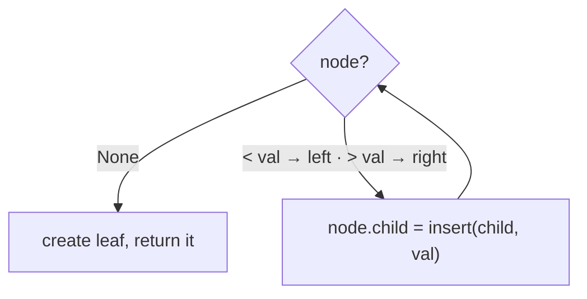

# Insertion in Binary Search Trees

## Why It Exists

A search tree you can't grow is useless. Insertion must add a key *while preserving the invariant* (left < node < right everywhere) — and the elegant fact is that there's exactly **one** spot where a new key can go and keep the tree valid.

Finding it is just a search. Search for the key; since it's not present, the search walks down and falls off the tree at some empty child slot — and *that* slot is precisely where the key belongs (everything above it already compares correctly). Attach the new key there as a **leaf**. No existing node moves; you only add one link. So insertion is "search, then attach at the failure point," `O(h)`. The one catch: because each key lands wherever the search leads, the *order* you insert determines the tree's shape — and a bad order yields a degenerate chain.

## See It Work

Insert a key into an existing BST and confirm it lands as a leaf at the search-failure point. The inorder traversal must still be sorted after the insert.

> ▶ Run it, then click **Visualise** — the new node hangs off an existing one; nothing else moves.

```python run viz=binary-tree viz-root=root
import json
from collections import deque

class TreeNode:
    def __init__(self, val, left=None, right=None):
        self.val = val
        self.left = left
        self.right = right

def build_tree(values):              # [1, 2, 3, null, 4] level-order → root
    if not values:
        return None
    root = TreeNode(values[0])
    queue = deque([root])
    i = 1
    while queue and i < len(values):
        node = queue.popleft()
        if i < len(values):
            v = values[i]; i += 1
            if v is not None:
                node.left = TreeNode(v); queue.append(node.left)
        if i < len(values):
            v = values[i]; i += 1
            if v is not None:
                node.right = TreeNode(v); queue.append(node.right)
    return root

def insert(root, val):
    if root is None:
        return TreeNode(val)             # search fell off here → this is the spot; new leaf
    if val < root.val:
        root.left = insert(root.left, val)
    elif val > root.val:
        root.right = insert(root.right, val)
    # val == root.val → duplicate; ignore (a policy choice)
    return root

def inorder(n):
    return inorder(n.left) + [n.val] + inorder(n.right) if n else []

root = build_tree(json.loads(input()))
key = int(input())
root = insert(root, key)
print(inorder(root))
```

```java run viz=binary-tree viz-root=root
import java.util.*;

public class Main {
  static class TreeNode {
    int val; TreeNode left, right;
    TreeNode(int val) { this.val = val; }
  }

  static TreeNode buildTree(Integer[] values) {
    if (values.length == 0 || values[0] == null) return null;
    TreeNode root = new TreeNode(values[0]);
    Deque<TreeNode> queue = new ArrayDeque<>();
    queue.add(root);
    int i = 1;
    while (!queue.isEmpty() && i < values.length) {
      TreeNode node = queue.poll();
      if (i < values.length) {
        Integer v = values[i++];
        if (v != null) { node.left = new TreeNode(v); queue.add(node.left); }
      }
      if (i < values.length) {
        Integer v = values[i++];
        if (v != null) { node.right = new TreeNode(v); queue.add(node.right); }
      }
    }
    return root;
  }

  static TreeNode insert(TreeNode r, int v) {
    if (r == null) return new TreeNode(v);
    if (v < r.val) r.left = insert(r.left, v);
    else if (v > r.val) r.right = insert(r.right, v);
    return r;
  }

  static List<Integer> inorder(TreeNode n) {
    List<Integer> out = new ArrayList<>();
    inorderHelper(n, out);
    return out;
  }

  static void inorderHelper(TreeNode n, List<Integer> out) {
    if (n == null) return;
    inorderHelper(n.left, out);
    out.add(n.val);
    inorderHelper(n.right, out);
  }

  static Integer[] parseIntegerArray(String line) {
    String inner = line.replaceAll("[\\[\\]\\s]", "");
    if (inner.isEmpty()) return new Integer[0];
    String[] parts = inner.split(",");
    Integer[] out = new Integer[parts.length];
    for (int i = 0; i < parts.length; i++)
      out[i] = parts[i].equals("null") ? null : Integer.parseInt(parts[i]);
    return out;
  }

  public static void main(String[] args) {
    Scanner sc = new Scanner(System.in);
    TreeNode root = buildTree(parseIntegerArray(sc.nextLine()));
    int key = Integer.parseInt(sc.nextLine().trim());
    root = insert(root, key);
    System.out.println(inorder(root));
  }
}
```

```testcases
{
  "args": [
    { "id": "root", "label": "root", "type": "tree", "placeholder": "[5, 3, 8, 1, 4, 7, 9]" },
    { "id": "key", "label": "key", "type": "int", "placeholder": "6" }
  ],
  "cases": [
    { "args": { "root": "[5, 3, 8, 1, 4, 7, 9]", "key": "6" }, "expected": "[1, 3, 4, 5, 6, 7, 8, 9]" },
    { "args": { "root": "[5, 3, 8, 1, 4, 7, 9]", "key": "2" }, "expected": "[1, 2, 3, 4, 5, 7, 8, 9]" },
    { "args": { "root": "[5, 3, 8, 1, 4, 7, 9]", "key": "10" }, "expected": "[1, 3, 4, 5, 7, 8, 9, 10]" },
    { "args": { "root": "[5]", "key": "3" }, "expected": "[3, 5]" },
    { "args": { "root": "[]", "key": "1" }, "expected": "[1]" }
  ]
}
```

Both print the inorder traversal after insertion — it must be sorted, confirming the BST invariant is preserved.

## How It Works

`insert(node, val)` is recursive search with one twist — the empty base case *creates* the node instead of reporting a miss:

1. **`node is None`** → the search has reached an empty slot; return a new leaf with `val`. The caller wires it in as a child.
2. **`val < node.val`** → recurse left and reattach: `node.left = insert(node.left, val)`.
3. **`val > node.val`** → recurse right and reattach.
4. **`val == node.val`** → a duplicate; the usual policy is to ignore it (or keep a count) — never insert a second equal key, or the invariant blurs.



<p align="center"><strong>search down by comparison; where the search falls off (an empty child), splice in the new leaf. Only one new link is added.</strong></p>

Insertion is `O(h)` — a search down plus an `O(1)` attach. The crucial property: **new keys are always added as leaves; existing nodes never move.** (That's the opposite of [deletion](/cortex/data-structures-and-algorithms/trees/binary-search-tree/deletion-in-binary-search-trees), which may restructure.) The price of this simplicity is that the *insertion order alone* fixes the shape: insert in random/balanced order and the tree stays bushy (`h ≈ log n`); insert sorted data and every key becomes a right child, giving a height-`n` chain. Plain BSTs can't prevent this — self-balancing trees rotate *during* insertion to keep `h = O(log n)`.

### Key Takeaway

Insert by searching for the key; the empty slot where the search fails is where it belongs — attach a new leaf there, `O(h)`. Existing nodes never move, and duplicates are ignored by policy. But insertion order alone determines balance, which is why self-balancing trees rebalance on insert.

## Trace It

Inserting `6` into the tree (root `5`):

| at node | compare `6` | go |
|---|---|---|
| `5` | `6 > 5` | right |
| `8` | `6 < 8` | left |
| `7` | `6 < 7` | left → **empty** |
| — | attach | `6` becomes `7`'s left child (a leaf) |

Before you read on: insertion always adds a leaf and never moves an existing node — beautifully simple. Yet the *order* of insertion completely determines the tree's shape. Insert `[5,3,8,1,4,7,9]` and you get a balanced tree of height 2; insert the *sorted* sequence `[1,2,3,4,…]` and you get a chain of height `n−1`. Why does an operation that "never moves anything" still produce wildly different — and sometimes terrible — trees?

Because each key is placed *relative to the keys already there*, and "always attach a leaf" gives the structure no chance to *correct* a lopsided history. With sorted input, every new key is larger than all existing ones, so the search always turns right and the key attaches at the far-right tip — extending a chain that can never re-balance itself, since insertion only ever *adds* at the bottom and never *rearranges*. The very simplicity that makes insertion `O(h)` (no restructuring) is also what makes a plain BST defenseless against bad input: it faithfully records the order it received. Fixing this requires *breaking* the "never move a node" rule — which is exactly what AVL/red-black trees do with **rotations** during insertion, trading a little restructuring work for a guaranteed `O(log n)` height. So this lesson's elegance and the next balancing lesson's necessity are two sides of the same fact.

## Your Turn

Insert a list of values one at a time into an empty tree and print the tree's height — watch how order changes the shape.

```python run viz=binary-tree viz-root=balanced
import json

class TreeNode:
    def __init__(self, val, left=None, right=None):
        self.val = val
        self.left = left
        self.right = right

def insert(root, val):
    if root is None:
        return TreeNode(val)
    if val < root.val: root.left = insert(root.left, val)
    elif val > root.val: root.right = insert(root.right, val)
    return root

def height(n):
    return -1 if n is None else 1 + max(height(n.left), height(n.right))

vals = json.loads(input())
root = None
for v in vals:
    root = insert(root, v)
print(height(root))
```

```java run viz=binary-tree viz-root=balanced
import java.util.*;

public class Main {
  static class TreeNode {
    int val; TreeNode left, right;
    TreeNode(int val) { this.val = val; }
  }

  static TreeNode insert(TreeNode r, int v) {
    if (r == null) return new TreeNode(v);
    if (v < r.val) r.left = insert(r.left, v);
    else if (v > r.val) r.right = insert(r.right, v);
    return r;
  }

  static int height(TreeNode n) {
    return n == null ? -1 : 1 + Math.max(height(n.left), height(n.right));
  }

  static int[] parseIntArray(String line) {
    String inner = line.replaceAll("[\\[\\]\\s]", "");
    if (inner.isEmpty()) return new int[0];
    String[] parts = inner.split(",");
    int[] out = new int[parts.length];
    for (int i = 0; i < parts.length; i++) out[i] = Integer.parseInt(parts[i].trim());
    return out;
  }

  public static void main(String[] args) {
    Scanner sc = new Scanner(System.in);
    int[] vals = parseIntArray(sc.nextLine());
    TreeNode root = null;
    for (int v : vals) root = insert(root, v);
    System.out.println(height(root));
  }
}
```

```testcases
{
  "args": [
    { "id": "vals", "label": "values to insert", "type": "int[]", "placeholder": "[4, 2, 6, 1, 3, 5, 7]" }
  ],
  "cases": [
    { "args": { "vals": "[4, 2, 6, 1, 3, 5, 7]" }, "expected": "2" },
    { "args": { "vals": "[1, 2, 3, 4, 5, 6, 7]" }, "expected": "6" },
    { "args": { "vals": "[5, 3, 8, 1, 4, 7, 9]" }, "expected": "2" },
    { "args": { "vals": "[7]" }, "expected": "0" },
    { "args": { "vals": "[3, 1, 2]" }, "expected": "2" }
  ]
}
```

<details>
<summary><strong>Editorial</strong></summary>

The same 7 keys produce height 2 (balanced order) vs height 6 (sorted order — a chain). Insertion only ever adds at the bottom; the shape is locked in by history.

```python solution
import json

class TreeNode:
    def __init__(self, val, left=None, right=None):
        self.val = val
        self.left = left
        self.right = right

def insert(root, val):
    if root is None:
        return TreeNode(val)
    if val < root.val: root.left = insert(root.left, val)
    elif val > root.val: root.right = insert(root.right, val)
    return root

def height(n):
    return -1 if n is None else 1 + max(height(n.left), height(n.right))

vals = json.loads(input())
root = None
for v in vals:
    root = insert(root, v)
print(height(root))
```

```java solution
import java.util.*;

public class Main {
  static class TreeNode {
    int val; TreeNode left, right;
    TreeNode(int val) { this.val = val; }
  }

  static TreeNode insert(TreeNode r, int v) {
    if (r == null) return new TreeNode(v);
    if (v < r.val) r.left = insert(r.left, v);
    else if (v > r.val) r.right = insert(r.right, v);
    return r;
  }

  static int height(TreeNode n) {
    return n == null ? -1 : 1 + Math.max(height(n.left), height(n.right));
  }

  static int[] parseIntArray(String line) {
    String inner = line.replaceAll("[\\[\\]\\s]", "");
    if (inner.isEmpty()) return new int[0];
    String[] parts = inner.split(",");
    int[] out = new int[parts.length];
    for (int i = 0; i < parts.length; i++) out[i] = Integer.parseInt(parts[i].trim());
    return out;
  }

  public static void main(String[] args) {
    Scanner sc = new Scanner(System.in);
    int[] vals = parseIntArray(sc.nextLine());
    TreeNode root = null;
    for (int v : vals) root = insert(root, v);
    System.out.println(height(root));
  }
}
```

</details>

This is a structural lesson — insertion plus search are the building blocks for construction, deletion, and the BST patterns.

## Reflect & Connect

Insertion is "search, then attach a leaf" — simple, with one consequential side effect:

- **New keys are always leaves** — insertion only adds a link; it never relocates an existing node. This is the cleanest BST mutation, and the conceptual opposite of deletion, which must fill the hole left by a removed node.
- **Order determines shape** — the same keys produce a balanced tree or a chain depending on insertion order. Bulk-loading *sorted* data into a plain BST is the classic mistake; insert in random or median-first order to stay bushy, or use a self-balancing tree.
- **Balancing breaks the "never move" rule** — [AVL](/cortex/data-structures-and-algorithms/trees/avl-tree/introduction-to-avl-trees) and [red-black](/cortex/data-structures-and-algorithms/trees/red-black-tree/introduction-to-red-black-trees) trees do the same search-and-attach, then perform `O(1)` **rotations** back up the path to restore balance, guaranteeing `h = O(log n)` regardless of order. Plain-BST insertion is the foundation they build on.

**Prerequisites:** [Recursive Searching in BSTs](/cortex/data-structures-and-algorithms/trees/binary-search-tree/recursive-searching-in-binary-search-trees).
**What's next:** the hard inverse — removing a key and filling the hole — [Deletion in BSTs](/cortex/data-structures-and-algorithms/trees/binary-search-tree/deletion-in-binary-search-trees).

## Recall

> **Mnemonic:** *Insert = search for the key; the empty slot where the search fails is its spot — attach a new leaf. `O(h)`. Existing nodes never move. Insertion order alone fixes the shape.*

| | |
|---|---|
| Method | search down; at the empty child, create a new leaf |
| Property | new keys are always leaves; no existing node moves |
| Duplicates | ignore (or count) by policy — never two equal keys |
| Cost | `O(h)` (search + `O(1)` attach) |
| Caveat | insertion order determines balance; sorted input → height-`n` chain |

<details>
<summary><strong>Q:</strong> Where does a new key get attached?</summary>

**A:** At the empty child slot where a search for it falls off the tree — as a new leaf.

</details>
<details>
<summary><strong>Q:</strong> Does insertion move existing nodes?</summary>

**A:** No — it only adds one link; new keys are always leaves.

</details>
<details>
<summary><strong>Q:</strong> How are duplicates handled?</summary>

**A:** By policy — usually ignored (or counted); never inserted as a second equal key.

</details>
<details>
<summary><strong>Q:</strong> Why does insertion order matter so much?</summary>

**A:** Each key attaches relative to existing keys with no re-balancing, so sorted input builds a degenerate chain; balancing trees use rotations to prevent this.

</details>

## Sources & Verify

- **CLRS**, *Introduction to Algorithms*, 4th ed., §12.3 — `TREE-INSERT` and the leaf-attachment property.
- **Sedgewick & Wayne**, *Algorithms*, 4th ed., §3.2 — BST insertion and the effect of insertion order on shape.
- The search-and-attach insertion and order-dependent shape are standard; both runnable blocks are verified by running (inorder stays sorted after inserting `6`; balanced vs sorted orders give heights `2` vs `6`).
