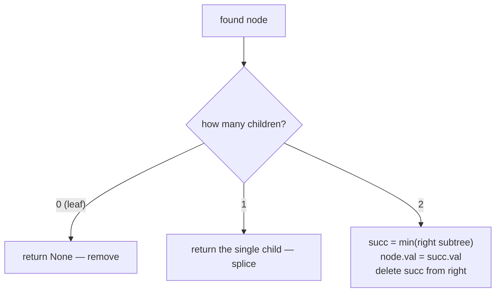

# Deletion in Binary Search Trees

## Why It Exists

[Insertion](/cortex/data-structures-and-algorithms/trees/binary-search-tree/insertion-in-binary-search-trees) was easy — a new key always attaches as a leaf, nothing moves. Deletion is the hard inverse: pull a node out and you leave a **hole** that has to be filled so the BST invariant (left < node < right) still holds everywhere. How you fill it depends on how many children the doomed node has.

The cases:

- **No children (leaf)** — just remove it; nothing depends on it.
- **One child** — splice it out: the single child (and its whole subtree) takes the node's place.
- **Two children** — you can't move into one slot from two subtrees. Instead, **overwrite the node's value with its in-order successor** — the smallest key in its right subtree — then delete *that* successor from the right subtree. The successor has at most one child, so it reduces to an easy case.

The successor is the unique value that can sit in the hole without disturbing order, which is why it's the canonical choice. Like search and insert, deletion is `O(h)`.

## See It Work

Delete a key from a BST — watch the three cases in action. The first input is the tree (level-order-with-nulls); the second is the key to delete. Run it, then **Visualise** the restructured tree.

> ▶ Run it, then click **Visualise** — for the default input, `5`'s value is overwritten by `7` (min of its right subtree), and the old `7` node is removed from below.

```python run viz=binary-tree viz-root=root
import json
from collections import deque

class TreeNode:
    def __init__(self, val, left=None, right=None):
        self.val = val
        self.left = left
        self.right = right

def build_tree(values):
    if not values:
        return None
    root = TreeNode(values[0])
    queue = deque([root])
    i = 1
    while queue and i < len(values):
        node = queue.popleft()
        if i < len(values):
            v = values[i]; i += 1
            if v is not None:
                node.left = TreeNode(v); queue.append(node.left)
        if i < len(values):
            v = values[i]; i += 1
            if v is not None:
                node.right = TreeNode(v); queue.append(node.right)
    return root

def print_tree(root):
    out, queue = [], deque([root])
    while queue:
        node = queue.popleft()
        if node is None:
            out.append(None)
        else:
            out.append(node.val)
            queue.append(node.left)
            queue.append(node.right)
    while out and out[-1] is None:
        out.pop()
    print(json.dumps(out))

def find_min(node):
    while node.left:
        node = node.left
    return node

def delete(root, val):
    if root is None:
        return None
    if val < root.val:
        root.left = delete(root.left, val)
    elif val > root.val:
        root.right = delete(root.right, val)
    else:                                     # found the node to remove
        if root.left is None:
            return root.right                 # 0 children or right-only → splice
        if root.right is None:
            return root.left                  # left-only → splice
        succ = find_min(root.right)           # two children → in-order successor
        root.val = succ.val                   # overwrite value
        root.right = delete(root.right, succ.val)   # delete the successor (≤1 child)
    return root

root = build_tree(json.loads(input()))
key  = int(input())
root = delete(root, key)
print_tree(root)
```

```java run viz=binary-tree viz-root=root
import java.util.*;

public class Main {
  static class TreeNode {
    int val; TreeNode left, right;
    TreeNode(int val) { this.val = val; }
  }

  static TreeNode buildTree(Integer[] values) {
    if (values.length == 0 || values[0] == null) return null;
    TreeNode root = new TreeNode(values[0]);
    Deque<TreeNode> queue = new ArrayDeque<>();
    queue.add(root);
    int i = 1;
    while (!queue.isEmpty() && i < values.length) {
      TreeNode node = queue.poll();
      if (i < values.length) {
        Integer v = values[i++];
        if (v != null) { node.left = new TreeNode(v); queue.add(node.left); }
      }
      if (i < values.length) {
        Integer v = values[i++];
        if (v != null) { node.right = new TreeNode(v); queue.add(node.right); }
      }
    }
    return root;
  }

  static void printTree(TreeNode root) {
    List<String> out = new ArrayList<>();
    Deque<TreeNode> queue = new LinkedList<>();
    queue.add(root);
    while (!queue.isEmpty()) {
      TreeNode node = queue.poll();
      if (node == null) {
        out.add("null");
      } else {
        out.add(String.valueOf(node.val));
        queue.add(node.left);
        queue.add(node.right);
      }
    }
    while (!out.isEmpty() && out.get(out.size() - 1).equals("null"))
      out.remove(out.size() - 1);
    System.out.println("[" + String.join(", ", out) + "]");
  }

  static Integer[] parseIntegerArray(String line) {
    String inner = line.replaceAll("[\\[\\]\\s]", "");
    if (inner.isEmpty()) return new Integer[0];
    String[] parts = inner.split(",");
    Integer[] out = new Integer[parts.length];
    for (int i = 0; i < parts.length; i++)
      out[i] = parts[i].equals("null") ? null : Integer.parseInt(parts[i]);
    return out;
  }

  static TreeNode findMin(TreeNode n) { while (n.left != null) n = n.left; return n; }

  static TreeNode delete(TreeNode root, int val) {
    if (root == null) return null;
    if (val < root.val) root.left = delete(root.left, val);
    else if (val > root.val) root.right = delete(root.right, val);
    else {
      if (root.left == null) return root.right;
      if (root.right == null) return root.left;
      TreeNode succ = findMin(root.right);
      root.val = succ.val;
      root.right = delete(root.right, succ.val);
    }
    return root;
  }

  public static void main(String[] args) {
    Scanner sc = new Scanner(System.in);
    TreeNode root = buildTree(parseIntegerArray(sc.nextLine()));
    int key = Integer.parseInt(sc.nextLine().trim());
    root = delete(root, key);
    printTree(root);
  }
}
```

```testcases
{
  "args": [
    { "id": "tree", "label": "tree (level-order)", "type": "tree", "placeholder": "[5, 3, 8, 1, 4, 7, 9]" },
    { "id": "key",  "label": "key to delete",      "type": "int",  "placeholder": "5" }
  ],
  "cases": [
    { "args": { "tree": "[5, 3, 8, 1, 4, 7, 9]", "key": "5" }, "expected": "[7, 3, 8, 1, 4, null, 9]" },
    { "args": { "tree": "[5, 3, 8, 1, 4, 7, 9]", "key": "1" }, "expected": "[5, 3, 8, null, 4, 7, 9]" },
    { "args": { "tree": "[5, 3, 8, 1, 4, 7, 9]", "key": "8" }, "expected": "[5, 3, 9, 1, 4, 7]" },
    { "args": { "tree": "[5, 3, 8, 1, 4, 7, 9]", "key": "3" }, "expected": "[5, 4, 8, 1, null, 7, 9]" },
    { "args": { "tree": "[1]", "key": "1" }, "expected": "[]" },
    { "args": { "tree": "[]",  "key": "5" }, "expected": "[]" }
  ]
}
```

Both print the restructured tree in level-order-with-nulls — the in-order traversal of the result is still sorted (minus the deleted key).

## How It Works

`delete(node, val)` first *searches* for the node (recurse left/right by comparison, reattaching the returned subtree). Once found, it branches on child count:



<p align="center"><strong>the three deletion cases: leaf vanishes; one-child node is replaced by its child; two-child node takes its in-order successor's value, then deletes that successor.</strong></p>

- **Leaf / one child** collapse into two lines: `if left is None: return right` handles *both* "no children" (right is also `None`) and "right-only"; the symmetric line handles "left-only."
- **Two children**: the **in-order successor** is `min(right subtree)` — found by walking left from the right child. Copy its value into the node (filling the hole with the correct value), then recursively delete the successor from the right subtree. Because the successor is a *leftmost* node, it has no left child, so its own deletion is the easy 0-or-1-child case — the recursion bottoms out immediately.

Everything is one root-to-leaf search plus `O(1)` pointer work (and one more descent to find the successor), so deletion is **`O(h)`**. The predecessor (`max` of the left subtree) works symmetrically and is equally valid.

### Key Takeaway

Delete by searching, then handling by child count: leaf → remove; one child → splice in the child; two children → overwrite with the in-order successor (`min` of the right subtree) and delete that successor below. `O(h)`. The successor is the only value that fits the hole without breaking order.

## Trace It

Deleting the two-child root `5` from `[5,3,8,1,4,7,9]`:

| step | action |
|---|---|
| find `5` | it's the root, has two children |
| successor | `min(right subtree of 5)` = `min({7,8,9})` = `7` |
| overwrite | root's value becomes `7` |
| delete `7` below | `7` was a leaf in the right subtree → just removed |

Result: `7` at the root, in-order `[1, 3, 4, 7, 8, 9]`.

Before you read on: for a two-child node we replaced its value with the **in-order successor** (min of the right subtree). Why is that specific node the right choice — could we use just *any* value from a subtree, and what would break?

No — the successor (or symmetrically, the predecessor) is the *only* value that preserves the invariant. The hole must be filled by a key that is **larger than everything in the left subtree and smaller than everything in the right subtree** — that's exactly the deleted node's order position. The smallest key in the *right* subtree (`min(right)`) is the next value up from the deleted node: it's bigger than all of the left subtree (everything right of the node exceeds everything left of it) and, being the right subtree's *minimum*, smaller than every other key in the right subtree. So it slots in perfectly. Any *other* value — say an arbitrary node from the right subtree — would be larger than some sibling it now sits above, violating left < node < right. And the successor is convenient as well as correct: as the leftmost node of the right subtree it has no left child, so removing it from below is always the trivial 0-or-1-child case. Correctness *and* a guaranteed easy recursion — that's why "in-order successor" is the textbook answer.

## Your Turn

Implement the reusable BST delete (all three cases). The input is a tree in level-order-with-nulls followed by the key to delete; print the resulting tree with `print_tree`.

```python run viz=binary-tree viz-root=root
import json
from collections import deque

class TreeNode:
    def __init__(self, val, left=None, right=None):
        self.val = val
        self.left = left
        self.right = right

def build_tree(values):
    if not values:
        return None
    root = TreeNode(values[0])
    queue = deque([root])
    i = 1
    while queue and i < len(values):
        node = queue.popleft()
        if i < len(values):
            v = values[i]; i += 1
            if v is not None:
                node.left = TreeNode(v); queue.append(node.left)
        if i < len(values):
            v = values[i]; i += 1
            if v is not None:
                node.right = TreeNode(v); queue.append(node.right)
    return root

def print_tree(root):
    out, queue = [], deque([root])
    while queue:
        node = queue.popleft()
        if node is None:
            out.append(None)
        else:
            out.append(node.val)
            queue.append(node.left)
            queue.append(node.right)
    while out and out[-1] is None:
        out.pop()
    print(json.dumps(out))

def find_min(node):
    # Your code goes here
    pass

def delete(root, val):
    # Your code goes here
    pass

root = build_tree(json.loads(input()))
key  = int(input())
root = delete(root, key)
print_tree(root)
```

```java run viz=binary-tree viz-root=root
import java.util.*;

public class Main {
  static class TreeNode {
    int val; TreeNode left, right;
    TreeNode(int val) { this.val = val; }
  }

  static TreeNode buildTree(Integer[] values) {
    if (values.length == 0 || values[0] == null) return null;
    TreeNode root = new TreeNode(values[0]);
    Deque<TreeNode> queue = new ArrayDeque<>();
    queue.add(root);
    int i = 1;
    while (!queue.isEmpty() && i < values.length) {
      TreeNode node = queue.poll();
      if (i < values.length) {
        Integer v = values[i++];
        if (v != null) { node.left = new TreeNode(v); queue.add(node.left); }
      }
      if (i < values.length) {
        Integer v = values[i++];
        if (v != null) { node.right = new TreeNode(v); queue.add(node.right); }
      }
    }
    return root;
  }

  static void printTree(TreeNode root) {
    List<String> out = new ArrayList<>();
    Deque<TreeNode> queue = new LinkedList<>();
    queue.add(root);
    while (!queue.isEmpty()) {
      TreeNode node = queue.poll();
      if (node == null) {
        out.add("null");
      } else {
        out.add(String.valueOf(node.val));
        queue.add(node.left);
        queue.add(node.right);
      }
    }
    while (!out.isEmpty() && out.get(out.size() - 1).equals("null"))
      out.remove(out.size() - 1);
    System.out.println("[" + String.join(", ", out) + "]");
  }

  static Integer[] parseIntegerArray(String line) {
    String inner = line.replaceAll("[\\[\\]\\s]", "");
    if (inner.isEmpty()) return new Integer[0];
    String[] parts = inner.split(",");
    Integer[] out = new Integer[parts.length];
    for (int i = 0; i < parts.length; i++)
      out[i] = parts[i].equals("null") ? null : Integer.parseInt(parts[i]);
    return out;
  }

  static TreeNode findMin(TreeNode n) {
    // Your code goes here
    return null;
  }

  static TreeNode delete(TreeNode root, int val) {
    // Your code goes here
    return null;
  }

  public static void main(String[] args) {
    Scanner sc = new Scanner(System.in);
    TreeNode root = buildTree(parseIntegerArray(sc.nextLine()));
    int key = Integer.parseInt(sc.nextLine().trim());
    root = delete(root, key);
    printTree(root);
  }
}
```

```testcases
{
  "args": [
    { "id": "tree", "label": "tree (level-order)", "type": "tree", "placeholder": "[5, 3, 8, 1, 4, 7, 9]" },
    { "id": "key",  "label": "key to delete",      "type": "int",  "placeholder": "5" }
  ],
  "cases": [
    { "args": { "tree": "[5, 3, 8, 1, 4, 7, 9]", "key": "5" }, "expected": "[7, 3, 8, 1, 4, null, 9]" },
    { "args": { "tree": "[5, 3, 8, 1, 4, 7, 9]", "key": "1" }, "expected": "[5, 3, 8, null, 4, 7, 9]" },
    { "args": { "tree": "[5, 3, 8, 1, 4, 7, 9]", "key": "8" }, "expected": "[5, 3, 9, 1, 4, 7]" },
    { "args": { "tree": "[5, 3, 8, 1, 4, 7, 9]", "key": "3" }, "expected": "[5, 4, 8, 1, null, 7, 9]" },
    { "args": { "tree": "[1]", "key": "1" }, "expected": "[]" },
    { "args": { "tree": "[]",  "key": "5" }, "expected": "[]" }
  ]
}
```

<details>
<summary><strong>Editorial</strong></summary>

```python solution viz=binary-tree viz-root=root
import json
from collections import deque

class TreeNode:
    def __init__(self, val, left=None, right=None):
        self.val = val
        self.left = left
        self.right = right

def build_tree(values):
    if not values:
        return None
    root = TreeNode(values[0])
    queue = deque([root])
    i = 1
    while queue and i < len(values):
        node = queue.popleft()
        if i < len(values):
            v = values[i]; i += 1
            if v is not None:
                node.left = TreeNode(v); queue.append(node.left)
        if i < len(values):
            v = values[i]; i += 1
            if v is not None:
                node.right = TreeNode(v); queue.append(node.right)
    return root

def print_tree(root):
    out, queue = [], deque([root])
    while queue:
        node = queue.popleft()
        if node is None:
            out.append(None)
        else:
            out.append(node.val)
            queue.append(node.left)
            queue.append(node.right)
    while out and out[-1] is None:
        out.pop()
    print(json.dumps(out))

def find_min(node):
    while node.left:
        node = node.left
    return node

def delete(root, val):
    if root is None: return None
    if val < root.val: root.left = delete(root.left, val)
    elif val > root.val: root.right = delete(root.right, val)
    else:
        if root.left is None: return root.right
        if root.right is None: return root.left
        succ = find_min(root.right)
        root.val = succ.val
        root.right = delete(root.right, succ.val)
    return root

root = build_tree(json.loads(input()))
key  = int(input())
root = delete(root, key)
print_tree(root)
```

```java solution viz=binary-tree viz-root=root
import java.util.*;

public class Main {
  static class TreeNode {
    int val; TreeNode left, right;
    TreeNode(int val) { this.val = val; }
  }

  static TreeNode buildTree(Integer[] values) {
    if (values.length == 0 || values[0] == null) return null;
    TreeNode root = new TreeNode(values[0]);
    Deque<TreeNode> queue = new ArrayDeque<>();
    queue.add(root);
    int i = 1;
    while (!queue.isEmpty() && i < values.length) {
      TreeNode node = queue.poll();
      if (i < values.length) {
        Integer v = values[i++];
        if (v != null) { node.left = new TreeNode(v); queue.add(node.left); }
      }
      if (i < values.length) {
        Integer v = values[i++];
        if (v != null) { node.right = new TreeNode(v); queue.add(node.right); }
      }
    }
    return root;
  }

  static void printTree(TreeNode root) {
    List<String> out = new ArrayList<>();
    Deque<TreeNode> queue = new LinkedList<>();
    queue.add(root);
    while (!queue.isEmpty()) {
      TreeNode node = queue.poll();
      if (node == null) {
        out.add("null");
      } else {
        out.add(String.valueOf(node.val));
        queue.add(node.left);
        queue.add(node.right);
      }
    }
    while (!out.isEmpty() && out.get(out.size() - 1).equals("null"))
      out.remove(out.size() - 1);
    System.out.println("[" + String.join(", ", out) + "]");
  }

  static Integer[] parseIntegerArray(String line) {
    String inner = line.replaceAll("[\\[\\]\\s]", "");
    if (inner.isEmpty()) return new Integer[0];
    String[] parts = inner.split(",");
    Integer[] out = new Integer[parts.length];
    for (int i = 0; i < parts.length; i++)
      out[i] = parts[i].equals("null") ? null : Integer.parseInt(parts[i]);
    return out;
  }

  static TreeNode findMin(TreeNode n) { while (n.left != null) n = n.left; return n; }

  static TreeNode delete(TreeNode root, int val) {
    if (root == null) return null;
    if (val < root.val) root.left = delete(root.left, val);
    else if (val > root.val) root.right = delete(root.right, val);
    else {
      if (root.left == null) return root.right;
      if (root.right == null) return root.left;
      TreeNode succ = findMin(root.right);
      root.val = succ.val;
      root.right = delete(root.right, succ.val);
    }
    return root;
  }

  public static void main(String[] args) {
    Scanner sc = new Scanner(System.in);
    TreeNode root = buildTree(parseIntegerArray(sc.nextLine()));
    int key = Integer.parseInt(sc.nextLine().trim());
    root = delete(root, key);
    printTree(root);
  }
}
```

</details>

## Reflect & Connect

Deletion is the BST operation that exposes the real subtlety:

- **Three cases, one reduction** — leaf and one-child are trivial; the two-child case *reduces* to one of them by promoting the in-order successor (whose own removal is easy). Recognizing "hard case reduces to easy case" is the structural insight.
- **Deletion can unbalance the tree** — like insertion, it changes the shape; self-balancing trees ([AVL](/cortex/data-structures-and-algorithms/trees/avl-tree/introduction-to-avl-trees), [red-black](/cortex/data-structures-and-algorithms/trees/red-black-tree/introduction-to-red-black-trees)) run rotations *after* a delete to restore `O(log n)` height, just as they do after insert.
- **A known wart: asymmetric (Hibbard) deletion** — always taking the *successor* biases the tree leftward over many delete/insert cycles, gradually raising height toward `√n`. Production code alternates successor/predecessor or uses a balanced tree. It's a reminder that "correct" and "stays efficient under churn" are different bars — the latter is what balanced trees guarantee.

**Prerequisites:** [Insertion in BSTs](/cortex/data-structures-and-algorithms/trees/binary-search-tree/insertion-in-binary-search-trees).
**What's next:** build a balanced BST from sorted data in one shot — [Constructing a BST](/cortex/data-structures-and-algorithms/trees/binary-search-tree/constructing-a-binary-search-tree).

## Recall

> **Mnemonic:** *Delete by child count: leaf → remove; one child → splice; two children → overwrite with in-order successor (`min(right)`), then delete it below. `O(h)`.*

| | |
|---|---|
| Leaf (0 children) | remove (`return None`) |
| One child | return that child (splice out) |
| Two children | `node.val = min(right subtree)`; delete that successor from the right |
| Why successor | only value that's > all left and < all right — preserves the invariant |
| Cost | `O(h)` (search + successor descent + `O(1)` rewiring) |

<details>
<summary><strong>Q:</strong> What are the three deletion cases?</summary>

**A:** Leaf (remove), one child (splice in the child), two children (replace with in-order successor and delete it below).

</details>
<details>
<summary><strong>Q:</strong> Why use the in-order successor for a two-child node?</summary>

**A:** It's the only value larger than the whole left subtree and smaller than the rest of the right subtree, so it preserves the invariant — and as the right subtree's leftmost node it has ≤1 child, making its own removal easy.

</details>
<details>
<summary><strong>Q:</strong> Why does the two-child case always reduce to an easy case?</summary>

**A:** The successor is a leftmost node, so it has no left child — its deletion is the 0-or-1-child case.

</details>
<details>
<summary><strong>Q:</strong> What's the Hibbard-deletion wart?</summary>

**A:** Always taking the successor biases the tree over many deletes, raising height toward `√n`; balanced trees (or alternating successor/predecessor) avoid it.

</details>

## Sources & Verify

- **CLRS**, *Introduction to Algorithms*, 4th ed., §12.3 — `TREE-DELETE` and the successor/transplant approach.
- **Sedgewick & Wayne**, *Algorithms*, 4th ed., §3.2 — Hibbard deletion and its asymmetry wart.
- The three-case deletion and successor reduction are standard; all runnable cases are verified by running (leaf/one-child/two-child deletes each leave the in-order traversal sorted: `delete 5 ⇒ [1,3,4,7,8,9]`, etc.).
