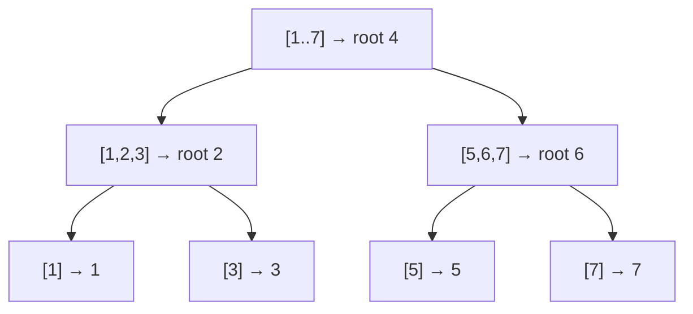

# Constructing a Binary Search Tree

## Why It Exists

[Insertion](/cortex/data-structures-and-algorithms/trees-binary-search-tree-insertion-in-binary-search-trees) builds a BST one key at a time, and we saw the trap: feeding it *sorted* data produces a height-`n` chain. But if you already hold the data **sorted**, you can build a **perfectly balanced** BST in a single `O(n)` pass — no rotations, no luck.

The idea is divide-and-conquer. Pick the **middle** element as the root; then everything left of it (smaller) becomes the left subtree and everything right (larger) the right subtree — and they have nearly equal sizes, so the tree comes out balanced. Recurse the same way on each half. Choosing the midpoint as root is exactly what forces `height = ⌊log₂ n⌋`, the optimal shape. This is both how you *bulk-load* a BST from sorted input and how you *fix* a tree that's gone degenerate (flatten it to a sorted array, rebuild balanced).

## See It Work

Turn the sorted array `[1..7]` into a balanced BST. Inserting it one-by-one would give a height-6 chain; the middle-as-root build gives height 2. Run it, then **Visualise** the balanced shape.

> ▶ Run it, then click **Visualise** — `4` (the middle) becomes the root, `[1,2,3]` and `[5,6,7]` recurse into balanced subtrees.

```python run viz=binary-tree viz-root=root
class TreeNode:
    def __init__(self, val):
        self.val = val
        self.left = None
        self.right = None

def sorted_array_to_bst(arr):
    if not arr:
        return None
    mid = len(arr) // 2                      # middle as root → equal-ish halves
    root = TreeNode(arr[mid])
    root.left = sorted_array_to_bst(arr[:mid])      # smaller half → left subtree
    root.right = sorted_array_to_bst(arr[mid + 1:]) # larger half → right subtree
    return root

def height(n):
    return -1 if n is None else 1 + max(height(n.left), height(n.right))

def inorder(n):
    return inorder(n.left) + [n.val] + inorder(n.right) if n else []

root = sorted_array_to_bst([1, 2, 3, 4, 5, 6, 7])
print(inorder(root), "height", height(root))   # [1..7] sorted, height 2 (not 6!)
```

## How It Works

Recursion on the sorted array `arr`:

1. **Empty → `None`** (base case).
2. **Middle is the root** — `mid = len(arr) // 2`; the element there has roughly equal counts on each side.
3. **Recurse** — `arr[:mid]` (all smaller) builds the left subtree, `arr[mid+1:]` (all larger) builds the right.

Because the array is sorted, "smaller half left, larger half right" automatically satisfies the BST invariant, and "middle as root" keeps the two sides within one element of each other at every level.



<p align="center"><strong>middle-as-root recursion: each call roots at its midpoint and splits the rest into two balanced halves, exactly like binary search's halving.</strong></p>

Each element is visited once to become a node, so construction is **`O(n)` time** (`O(log n)` recursion depth, or `O(n)` if you count the array slices — use index bounds instead of slicing to keep it tight). The height is **`⌊log₂ n⌋`** — the minimum possible — because every split is balanced. It's the *offline* counterpart to balancing: instead of maintaining balance incrementally on each insert (AVL/red-black rotations), you build it balanced once from sorted data.

### Key Takeaway

From sorted data, build a balanced BST by making the middle element the root and recursing on the halves — `O(n)`, guaranteed height `⌊log₂ n⌋`. It's how you bulk-load a BST and how you rebalance a degenerate one (flatten to sorted, rebuild). Middle-as-root is what forces balance, exactly like binary search's midpoint.

## Trace It

Building from `[1, 2, 3, 4, 5, 6, 7]` (`mid = 3` → value `4`):

| array slice | mid | root | recurses into |
|---|---|---|---|
| `[1,2,3,4,5,6,7]` | `4` | `4` | `[1,2,3]` and `[5,6,7]` |
| `[1,2,3]` | `2` | `2` | `[1]` and `[3]` |
| `[5,6,7]` | `6` | `6` | `[5]` and `[7]` |
| `[1]`,`[3]`,`[5]`,`[7]` | — | leaves | — |

Height 2 for 7 nodes — optimal.

Before you read on: inserting `[1..7]` one at a time gives a height-6 chain, but this build gives height 2 from the *same sorted data*. Both process the same values in the same order — so why does "middle as root" produce a balanced tree while "insert left-to-right" produces a chain?

Because of **which element becomes the root, and when the structure is decided**. Left-to-right insertion commits to a root (the first element, `1`) before it has seen the rest, and every subsequent key is larger, so they all chain rightward — the structure is hostage to arrival order with no global view. The middle-as-root build, by contrast, sees the *whole* sorted array up front and deliberately roots at the median, so each subtree gets half the remaining keys — a balanced split guaranteed at every level, the same reason merge sort's midpoint split is always even. The difference isn't the data; it's *information*: incremental insertion decides locally with no lookahead, while construction decides globally knowing all `n` keys. That's the general distinction between **online** algorithms (must act on each item as it arrives — AVL/red-black maintain balance via rotations) and **offline** ones (have all the data and can choose the optimal layout). When you have the data sorted in advance, offline construction is simpler and gives a tighter tree than any sequence of inserts.

## Your Turn

The reusable balanced builder:

```python run viz=binary-tree viz-root=root
class TreeNode:
    def __init__(self, val):
        self.val = val
        self.left = None
        self.right = None

def sorted_array_to_bst(arr):
    if not arr:
        return None
    mid = len(arr) // 2
    root = TreeNode(arr[mid])
    root.left = sorted_array_to_bst(arr[:mid])
    root.right = sorted_array_to_bst(arr[mid + 1:])
    return root

def height(n):
    return -1 if n is None else 1 + max(height(n.left), height(n.right))

for n in (7, 15, 31):
    h = height(sorted_array_to_bst(list(range(n))))
    print(n, "elements →  height", h)   # 7→2, 15→3, 31→4 (⌊log2 n⌋)
```

```java run viz=binary-tree viz-root=root
public class Main {
  static class TreeNode { int val; TreeNode left, right; TreeNode(int v){ val = v; } }

  static TreeNode build(int[] a, int lo, int hi) {     // index bounds, no slicing
    if (lo > hi) return null;
    int mid = lo + (hi - lo) / 2;
    TreeNode root = new TreeNode(a[mid]);
    root.left = build(a, lo, mid - 1);
    root.right = build(a, mid + 1, hi);
    return root;
  }
  static int height(TreeNode n) { return n == null ? -1 : 1 + Math.max(height(n.left), height(n.right)); }

  public static void main(String[] args) {
    int[] a = {1, 2, 3, 4, 5, 6, 7};
    TreeNode root = build(a, 0, a.length - 1);
    System.out.println("height " + height(root));   // 2
  }
}
```

This is a structural lesson — balanced construction is the offline counterpart to the self-balancing trees later in the section.

## Reflect & Connect

Construction is "you have the data — lay it out optimally":

- **Bulk-load and rebalance** — building from sorted input gives an optimal tree for free; and a degenerate BST can be globally rebalanced in `O(n)` by in-order-traversing to a sorted array and rebuilding (some structures, like scapegoat trees, do exactly this partial-rebuild on demand).
- **Middle-as-root = balance** — the same midpoint instinct as binary search and merge sort. Picking the median root makes the two halves equal, which is the *definition* of a balanced split; do it recursively and you get optimal height.
- **Online vs offline balancing** — [AVL](/cortex/data-structures-and-algorithms/trees-avl-tree-introduction-to-avl-trees) and [red-black](/cortex/data-structures-and-algorithms/trees-red-black-tree-introduction-to-red-black-trees) trees maintain balance *incrementally* (rotations per insert/delete) because data arrives over time; construction balances *all at once* because the data is already in hand. Use the offline build when you can; use the online trees when you can't.

**Prerequisites:** [Height and Balance in BSTs](/cortex/data-structures-and-algorithms/trees-binary-search-tree-height-and-balance-in-binary-search-trees).
**What's next:** find where two nodes' paths converge — [Lowest Common Ancestor in BSTs](/cortex/data-structures-and-algorithms/trees-binary-search-tree-lowest-common-ancestor-in-binary-search-trees).

## Recall

> **Mnemonic:** *Sorted data → middle is the root, recurse on the halves. `O(n)`, height `⌊log₂ n⌋`. Middle-as-root = balanced split. Offline build beats any insert sequence.*

| | |
|---|---|
| Input | a sorted array |
| Root | the middle element (`mid = len // 2`) |
| Recurse | left half → left subtree, right half → right subtree |
| Cost / height | `O(n)` time, height `⌊log₂ n⌋` (optimal) |
| Uses | bulk-load; rebalance a degenerate tree (flatten → rebuild) |

<details>
<summary><strong>Q:</strong> How do you build a balanced BST from sorted data?</summary>

**A:** Make the middle element the root and recursively build the left/right subtrees from the smaller/larger halves.

</details>
<details>
<summary><strong>Q:</strong> Why does middle-as-root guarantee balance?</summary>

**A:** It splits the remaining keys into two equal-sized halves at every level, so height is `⌊log₂ n⌋`.

</details>
<details>
<summary><strong>Q:</strong> How do you rebalance a degenerate BST?</summary>

**A:** In-order traverse it to a sorted array, then rebuild balanced with this construction — `O(n)`.

</details>
<details>
<summary><strong>Q:</strong> Online vs offline balancing?</summary>

**A:** Construction balances all at once (data in hand); AVL/red-black balance incrementally via rotations (data arrives over time).

</details>

## Sources & Verify

- **CLRS**, *Introduction to Algorithms*, 4th ed., §12 — BST structure; optimal-height balanced trees.
- **Sedgewick & Wayne**, *Algorithms*, 4th ed., §3.2–3.3 — balanced construction and the online/offline distinction.
- "Convert sorted array to balanced BST" (middle-as-root) is the standard construction; both runnable blocks are verified by running (`[1..7] ⇒ height 2`; `7/15/31 ⇒ heights 2/3/4 = ⌊log₂ n⌋`).
