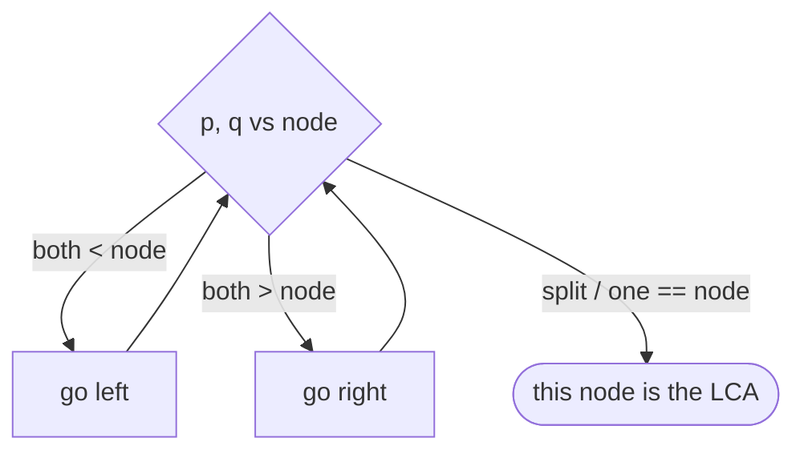

# Lowest Common Ancestor in Binary Search Trees

## Why It Exists

The **lowest common ancestor** of two nodes is the deepest node that has *both* as descendants — the point where their root-to-node paths last coincide. It answers "what's the shared ancestor?" and underpins "distance between two nodes."

In a *general* binary tree, finding the LCA needs a full traversal (you don't know where either node is). But a **BST's ordering makes it nearly free**: search for both keys at once and watch where they **diverge**. Walk down from the root comparing both values to the current node — as long as both are smaller you go left together, both larger you go right together. The first node where they *split* (one would go left, the other right — or one *is* this node) is exactly the LCA. No recursion stack, no auxiliary search: `O(h)` time, `O(1)` space.

## See It Work

In the BST below, the LCA of `1` and `9` is the root `5` (they split immediately); the LCA of `1` and `4` is `3`. Run it.

```python run viz=binary-tree viz-root=root
import json
from collections import deque

class TreeNode:
    def __init__(self, val, left=None, right=None):
        self.val = val
        self.left = left
        self.right = right

def build_tree(values):              # [1, 2, 3, null, 4] level-order → root
    if not values:
        return None
    root = TreeNode(values[0])
    queue = deque([root])
    i = 1
    while queue and i < len(values):
        node = queue.popleft()
        if i < len(values):
            v = values[i]; i += 1
            if v is not None:
                node.left = TreeNode(v); queue.append(node.left)
        if i < len(values):
            v = values[i]; i += 1
            if v is not None:
                node.right = TreeNode(v); queue.append(node.right)
    return root

def lca(root, p, q):
    node = root
    while node:
        if p < node.val and q < node.val:
            node = node.left              # both smaller → descend left together
        elif p > node.val and q > node.val:
            node = node.right             # both larger → descend right together
        else:
            return node.val               # paths split here (or one == node) → LCA
    return None

root = build_tree(json.loads(input()))
p = int(input())
q = int(input())
print(lca(root, p, q))
```

```java run viz=binary-tree viz-root=root
import java.util.*;

public class Main {
  static class TreeNode {
    int val; TreeNode left, right;
    TreeNode(int val) { this.val = val; }
  }

  static Integer lca(TreeNode node, int p, int q) {
    while (node != null) {
      if (p < node.val && q < node.val) node = node.left;
      else if (p > node.val && q > node.val) node = node.right;
      else return node.val;
    }
    return null;
  }

  public static void main(String[] args) {
    Scanner sc = new Scanner(System.in);
    TreeNode root = buildTree(parseIntegerArray(sc.nextLine()));
    int p = Integer.parseInt(sc.nextLine().trim());
    int q = Integer.parseInt(sc.nextLine().trim());
    System.out.println(lca(root, p, q));
  }

  static TreeNode buildTree(Integer[] values) {
    if (values.length == 0 || values[0] == null) return null;
    TreeNode root = new TreeNode(values[0]);
    Deque<TreeNode> queue = new ArrayDeque<>();
    queue.add(root);
    int i = 1;
    while (!queue.isEmpty() && i < values.length) {
      TreeNode node = queue.poll();
      if (i < values.length) {
        Integer v = values[i++];
        if (v != null) { node.left = new TreeNode(v); queue.add(node.left); }
      }
      if (i < values.length) {
        Integer v = values[i++];
        if (v != null) { node.right = new TreeNode(v); queue.add(node.right); }
      }
    }
    return root;
  }

  static Integer[] parseIntegerArray(String line) {
    String inner = line.replaceAll("[\\[\\]\\s]", "");
    if (inner.isEmpty()) return new Integer[0];
    String[] parts = inner.split(",");
    Integer[] out = new Integer[parts.length];
    for (int i = 0; i < parts.length; i++)
      out[i] = parts[i].equals("null") ? null : Integer.parseInt(parts[i]);
    return out;
  }
}
```

```testcases
{
  "args": [
    { "id": "root", "label": "BST (level-order)", "type": "tree", "placeholder": "[5, 3, 8, 1, 4, 7, 9]" },
    { "id": "p", "label": "p", "type": "int", "placeholder": "1" },
    { "id": "q", "label": "q", "type": "int", "placeholder": "9" }
  ],
  "cases": [
    { "args": { "root": "[5, 3, 8, 1, 4, 7, 9]", "p": "1", "q": "9" }, "expected": "5" },
    { "args": { "root": "[5, 3, 8, 1, 4, 7, 9]", "p": "1", "q": "4" }, "expected": "3" },
    { "args": { "root": "[5, 3, 8, 1, 4, 7, 9]", "p": "7", "q": "9" }, "expected": "8" },
    { "args": { "root": "[5, 3, 8, 1, 4, 7, 9]", "p": "3", "q": "4" }, "expected": "3" },
    { "args": { "root": "[5, 3, 8, 1, 4, 7, 9]", "p": "4", "q": "7" }, "expected": "5" },
    { "args": { "root": "[5, 3, 8, 1, 4, 7, 9]", "p": "3", "q": "7" }, "expected": "5" },
    { "args": { "root": "[5, 3, 8, 1, 4, 7, 9]", "p": "8", "q": "9" }, "expected": "8" },
    { "args": { "root": "[5]", "p": "5", "q": "5" }, "expected": "5" }
  ]
}
```

## How It Works

Start at the root and, at each node, compare *both* targets `p` and `q` to `node.val`:

- **Both `< node.val`** → both keys live in the left subtree → move left.
- **Both `> node.val`** → both live in the right subtree → move right.
- **Otherwise** → the keys *straddle* this node (one `≤ node ≤` other), or one of them *equals* this node. Either way, this is the deepest node whose subtree contains both — the **LCA**. Return it.



<p align="center"><strong>descend while both keys agree on direction; the first node where they disagree (or one matches) is the LCA.</strong></p>

It's a single comparison-guided descent — **`O(h)` time, `O(1)` space** (iterative). Why is the split point guaranteed to be the LCA? Below the split node, the two keys are in *different* subtrees, so no deeper node can contain both; above it, both keys were on the same side, so every ancestor also contains both but is *higher*. The split node is therefore the deepest common ancestor — by the BST invariant alone, with no searching for the nodes themselves.

### Key Takeaway

In a BST, the LCA of two keys is the split point of their search paths: descend while both are smaller (left) or both larger (right); the first node they straddle (or that equals one of them) is the LCA. `O(h)` time, `O(1)` space — the ordering does the work.

## Trace It

`lca(root, 1, 9)` then `lca(root, 1, 4)` (root `5`):

| target pair | at node | `1,9` vs node | move |
|---|---|---|---|
| `(1, 9)` | `5` | `1 < 5 < 9` → straddle | **LCA = 5** |
| `(1, 4)` | `5` | both `< 5` | left → `3` |
| `(1, 4)` | `3` | `1 < 3 < 4` → straddle | **LCA = 3** |

Before you read on: in a *general* binary tree (no ordering), finding the LCA requires recursively searching both subtrees — `O(n)` and `O(h)` stack. Here it's a single `O(h)` walk with `O(1)` space. What specific property of the BST collapses the work, and what would break if the tree weren't ordered?

The collapse comes from the **ordering letting one comparison decide direction for *both* keys at once**. In a BST, `p < node` *guarantees* `p` is in the left subtree (and `p > node` the right) — so by comparing both keys to the node you learn, in `O(1)`, whether they're together-left, together-right, or split — without ever locating either node. A general binary tree has no such guarantee: a smaller value could be anywhere, so you can't infer a key's location from a comparison; you must actually *search both subtrees* and bubble up where the two targets are found, which is the recursive `O(n)` LCA. The BST's "value tells you position" is exactly what turns a two-subtree search into a single deterministic descent — the same property that makes BST *search* `O(h)`. Remove the ordering and you lose the shortcut entirely.

## Your Turn

The reusable BST LCA:

```python run viz=binary-tree viz-root=root
import json
from collections import deque

class TreeNode:
    def __init__(self, val, left=None, right=None):
        self.val = val
        self.left = left
        self.right = right

def build_tree(values):              # [1, 2, 3, null, 4] level-order → root
    if not values:
        return None
    root = TreeNode(values[0])
    queue = deque([root])
    i = 1
    while queue and i < len(values):
        node = queue.popleft()
        if i < len(values):
            v = values[i]; i += 1
            if v is not None:
                node.left = TreeNode(v); queue.append(node.left)
        if i < len(values):
            v = values[i]; i += 1
            if v is not None:
                node.right = TreeNode(v); queue.append(node.right)
    return root

def lca(root, p, q):
    node = root
    while node:
        if p < node.val and q < node.val:
            node = node.left
        elif p > node.val and q > node.val:
            node = node.right
        else:
            return node.val
    return None

root = build_tree(json.loads(input()))
p = int(input())
q = int(input())
print(lca(root, p, q))
```

```java run viz=binary-tree viz-root=root
import java.util.*;

public class Main {
  static class TreeNode { int val; TreeNode left, right; TreeNode(int v){ val = v; } }

  static Integer lca(TreeNode node, int p, int q) {
    while (node != null) {
      if (p < node.val && q < node.val) node = node.left;
      else if (p > node.val && q > node.val) node = node.right;
      else return node.val;
    }
    return null;
  }

  public static void main(String[] args) {
    Scanner sc = new Scanner(System.in);
    TreeNode root = buildTree(parseIntegerArray(sc.nextLine()));
    int p = Integer.parseInt(sc.nextLine().trim());
    int q = Integer.parseInt(sc.nextLine().trim());
    System.out.println(lca(root, p, q));
  }

  static TreeNode buildTree(Integer[] values) {
    if (values.length == 0 || values[0] == null) return null;
    TreeNode root = new TreeNode(values[0]);
    Deque<TreeNode> queue = new ArrayDeque<>();
    queue.add(root);
    int i = 1;
    while (!queue.isEmpty() && i < values.length) {
      TreeNode node = queue.poll();
      if (i < values.length) {
        Integer v = values[i++];
        if (v != null) { node.left = new TreeNode(v); queue.add(node.left); }
      }
      if (i < values.length) {
        Integer v = values[i++];
        if (v != null) { node.right = new TreeNode(v); queue.add(node.right); }
      }
    }
    return root;
  }

  static Integer[] parseIntegerArray(String line) {
    String inner = line.replaceAll("[\\[\\]\\s]", "");
    if (inner.isEmpty()) return new Integer[0];
    String[] parts = inner.split(",");
    Integer[] out = new Integer[parts.length];
    for (int i = 0; i < parts.length; i++)
      out[i] = parts[i].equals("null") ? null : Integer.parseInt(parts[i]);
    return out;
  }
}
```

```testcases
{
  "args": [
    { "id": "root", "label": "BST (level-order)", "type": "tree", "placeholder": "[5, 3, 8, 1, 4, 7, 9]" },
    { "id": "p", "label": "p", "type": "int", "placeholder": "7" },
    { "id": "q", "label": "q", "type": "int", "placeholder": "9" }
  ],
  "cases": [
    { "args": { "root": "[5, 3, 8, 1, 4, 7, 9]", "p": "7", "q": "9" }, "expected": "8" },
    { "args": { "root": "[5, 3, 8, 1, 4, 7, 9]", "p": "3", "q": "4" }, "expected": "3" },
    { "args": { "root": "[5, 3, 8, 1, 4, 7, 9]", "p": "4", "q": "7" }, "expected": "5" },
    { "args": { "root": "[5, 3, 8, 1, 4, 7, 9]", "p": "1", "q": "9" }, "expected": "5" },
    { "args": { "root": "[6, 2, 8, 0, 4, 7, 9, null, null, 3, 5]", "p": "2", "q": "4" }, "expected": "2" },
    { "args": { "root": "[6, 2, 8, 0, 4, 7, 9, null, null, 3, 5]", "p": "2", "q": "8" }, "expected": "6" }
  ]
}
```

This is a structural lesson — LCA powers node-distance and shared-path queries on BSTs.

## Reflect & Connect

LCA is a clean example of the BST ordering paying off:

- **BST vs general-tree LCA** — the BST version is an `O(h)`, `O(1)`-space descent; the [general binary-tree LCA](/cortex/data-structures-and-algorithms/trees/binary-tree/pattern-lowest-common-ancestor/pattern) needs an `O(n)` recursive search because there's no ordering to exploit. Always check whether the tree is a BST before reaching for the heavier algorithm.
- **It builds on search** — LCA is just *two searches walked in lockstep until they diverge*. The same comparison-guided descent underlies search, insert, and floor/ceiling.
- **Distance falls out of it** — the distance between two nodes is `depth(p) + depth(q) − 2·depth(LCA)`: walk to the LCA, then count the remaining steps down to each. Many "shortest path in a tree" questions reduce to "find the LCA, then measure."

**Prerequisites:** [Recursive Searching in BSTs](/cortex/data-structures-and-algorithms/trees/binary-search-tree/recursive-searching-in-binary-search-trees).
**What's next:** walk a BST's keys in sorted order, one `next()` at a time — [Iterators in BSTs](/cortex/data-structures-and-algorithms/trees/binary-search-tree/iterators-in-binary-search-trees).

## Recall

> **Mnemonic:** *LCA = the split point. Descend: both smaller → left, both larger → right, else this node is the LCA. `O(h)` time, `O(1)` space — ordering decides direction for both keys at once.*

| | |
|---|---|
| LCA is | the deepest node with both keys as descendants = where their paths diverge |
| Both `< node` | go left |
| Both `> node` | go right |
| Straddle / one `== node` | return this node (the LCA) |
| Cost | `O(h)` time, `O(1)` space (iterative) |

<details>
<summary><strong>Q:</strong> What is the LCA, and where is it in a BST?</summary>

**A:** The deepest node with both keys as descendants — the split point where the two keys' search paths diverge.

</details>
<details>
<summary><strong>Q:</strong> How do you find it?</summary>

**A:** Descend from the root: both smaller → left, both larger → right; the first node they straddle (or that equals one) is the LCA.

</details>
<details>
<summary><strong>Q:</strong> Why is the BST LCA `O(h)`/`O(1)` while the general-tree LCA is `O(n)`?</summary>

**A:** In a BST a comparison reveals each key's subtree, so one descent suffices; a general tree has no such positional info, forcing a two-subtree search.

</details>
<details>
<summary><strong>Q:</strong> How does LCA give node distance?</summary>

**A:** `distance(p, q) = depth(p) + depth(q) − 2·depth(LCA)`.

</details>

## Sources & Verify

- **CLRS**, *Introduction to Algorithms*, 4th ed., §12 — BST structure and ordered queries; LCA via the split property.
- **Sedgewick & Wayne**, *Algorithms*, 4th ed., §3.2 — ordered operations on BSTs.
- The split-point BST LCA is the standard `O(h)` solution; both runnable blocks are verified by running (`lca(1,9)=5`, `lca(1,4)=3`, `lca(7,9)=8`, `lca(3,4)=3`, `lca(4,7)=5`).
