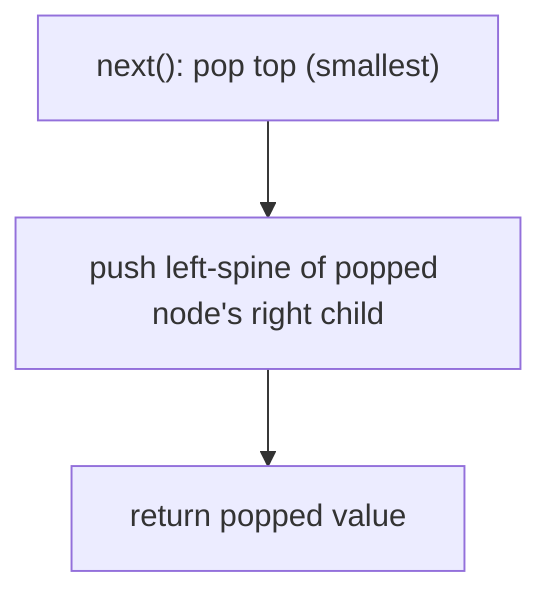

# Iterators in Binary Search Trees

## Why It Exists

A recursive in-order traversal prints a BST's keys in sorted order — but all at once, in one uninterruptible call. Often you want them **one at a time, on demand**: `has_next()` / `next()`. That's what lets you merge two BSTs lazily, run "two-sum on a BST" with a front and back iterator, or pull the k-th smallest without materializing the rest.

The naive iterator flattens the whole tree into a sorted list up front — `O(n)` space, and `O(n)` work before the first `next()`. The better design **simulates the recursion's call stack explicitly**: keep a stack holding only the nodes on the current *left spine*. The top is always the next-smallest key. That's `O(h)` space (one root-to-leaf path), `O(1)` *amortized* per `next()`, and the first key is ready immediately. An iterator is just an in-order traversal you can pause and resume.

## See It Work

Iterate the BST and pull keys one at a time — they come out sorted. Run it.

```python run viz=binary-tree viz-root=root
class TreeNode:
    def __init__(self, val):
        self.val = val
        self.left = None
        self.right = None

def insert(root, val):
    if root is None: return TreeNode(val)
    if val < root.val: root.left = insert(root.left, val)
    elif val > root.val: root.right = insert(root.right, val)
    return root

class BSTIterator:
    def __init__(self, root):
        self.stack = []
        self._push_left(root)              # seed with the leftmost spine

    def _push_left(self, node):
        while node:                        # remember the path down to the minimum
            self.stack.append(node)
            node = node.left

    def has_next(self):
        return len(self.stack) > 0

    def next(self):
        node = self.stack.pop()            # top = smallest unvisited key
        self._push_left(node.right)        # then descend its right subtree's left spine
        return node.val

root = None
for v in [5, 3, 8, 1, 4, 7, 9]:
    root = insert(root, v)

it = BSTIterator(root)
out = []
while it.has_next():
    out.append(it.next())
print(out)                                 # [1, 3, 4, 5, 7, 8, 9] — sorted, on demand
```

## How It Works

The stack always holds the ancestors-yet-to-visit on the path to the current smallest key:

1. **Init / `_push_left`** — from a node, push it and keep going left. After seeding from the root, the stack's top is the global minimum.
2. **`next()`** — pop the top (the smallest unvisited key, since everything left of it is already consumed). Before returning it, push the **left spine of its right child** — those are the keys that come *just after* it in sorted order.
3. **`has_next()`** — true while the stack is non-empty.



<p align="center"><strong>the stack mirrors a paused in-order recursion: pop the next-smallest, then push the left spine of its right subtree to queue up its successors.</strong></p>

Why `O(1)` *amortized* when `next()` sometimes pushes several nodes? Because **each node is pushed exactly once and popped exactly once** over the iterator's entire life. A single `next()` might push a whole spine, but those pushes are "paid for" by future pops — across `n` calls there are `n` pushes and `n` pops total, so the average per `next()` is `O(1)`. Space is `O(h)`: the stack never holds more than one root-to-leaf path. (An alternative, **Morris traversal**, achieves `O(1)` space by temporarily threading the tree, at the cost of mutating it during iteration.)

### Key Takeaway

A BST iterator simulates a paused in-order recursion with an explicit stack of the current left-spine: `next()` pops the smallest and pushes its right child's left-spine. `O(1)` amortized per call, `O(h)` space, sorted output on demand — far better than flattening to an `O(n)` list.

## Trace It

First two `next()` calls on the tree (init pushes the left spine `5 → 3 → 1`, so stack = `[5, 3, 1]`, top `1`):

| call | pop | push left-spine of `pop.right` | stack after | returned |
|---|---|---|---|---|
| `next()` | `1` | `1.right` is None → push nothing | `[5, 3]` | `1` |
| `next()` | `3` | `3.right = 4` → push `4` | `[5, 4]` | `3` |
| `next()` | `4` | `4.right` None | `[5]` | `4` |
| `next()` | `5` | `5.right = 8` → push `8, 7` | `[8, 7]` | `5` |

Before you read on: one `next()` call (popping `5`) pushed *two* nodes (`8`, `7`), while another (popping `1`) pushed *zero*. So an individual `next()` is clearly not `O(1)` worst-case. Why is it still correct to call the iterator `O(1)` *amortized* — and what's the total work over a full iteration?

Because the cost is bounded *across the whole sequence*, not per call. Every node enters the stack **once** (when some `next()` pushes it as part of a left-spine) and leaves **once** (when a later `next()` pops it to return it). So over a complete iteration of `n` keys, there are exactly `n` pushes and `n` pops — `2n` stack operations total, regardless of how they cluster. Dividing total work by the `n` calls gives `O(1)` *average*, i.e. amortized. The occasional expensive `next()` (pushing a long spine) is balanced by the many cheap ones that just pop and push nothing — the same accounting that made the array two-pointer and monotonic-stack patterns amortized-linear. "A few calls do a lot, but each unit of work happens exactly once" is the signature of an amortized bound, and it's why you analyze the *sequence*, not the worst single operation.

## Your Turn

The reusable BST iterator:

```python run viz=binary-tree viz-root=root
class TreeNode:
    def __init__(self, val):
        self.val = val
        self.left = None
        self.right = None

def insert(root, val):
    if root is None: return TreeNode(val)
    if val < root.val: root.left = insert(root.left, val)
    elif val > root.val: root.right = insert(root.right, val)
    return root

class BSTIterator:
    def __init__(self, root):
        self.stack = []
        self._push_left(root)
    def _push_left(self, node):
        while node:
            self.stack.append(node)
            node = node.left
    def has_next(self):
        return bool(self.stack)
    def next(self):
        node = self.stack.pop()
        self._push_left(node.right)
        return node.val

root = None
for v in [5, 3, 8, 1, 4, 7, 9]:
    root = insert(root, v)
it = BSTIterator(root)
print([it.next() for _ in range(3)], it.has_next())   # [1, 3, 4] True
```

```java run viz=binary-tree viz-root=root
import java.util.*;

public class Main {
  static class TreeNode { int val; TreeNode left, right; TreeNode(int v){ val = v; } }
  static TreeNode insert(TreeNode r, int v) {
    if (r == null) return new TreeNode(v);
    if (v < r.val) r.left = insert(r.left, v);
    else if (v > r.val) r.right = insert(r.right, v);
    return r;
  }
  static class BSTIterator {
    Deque<TreeNode> stack = new ArrayDeque<>();
    BSTIterator(TreeNode root) { pushLeft(root); }
    void pushLeft(TreeNode n) { while (n != null) { stack.push(n); n = n.left; } }
    boolean hasNext() { return !stack.isEmpty(); }
    int next() { TreeNode n = stack.pop(); pushLeft(n.right); return n.val; }
  }
  public static void main(String[] args) {
    TreeNode root = null;
    for (int v : new int[]{5, 3, 8, 1, 4, 7, 9}) root = insert(root, v);
    BSTIterator it = new BSTIterator(root);
    List<Integer> out = new ArrayList<>();
    while (it.hasNext()) out.add(it.next());
    System.out.println(out);   // [1, 3, 4, 5, 7, 8, 9]
  }
}
```

This is a structural lesson — completing the BST's structural operations; the BST pattern lessons build on ordered iteration.

## Reflect & Connect

The BST iterator is "recursion made resumable," and the technique transfers widely:

- **Explicit stack = pausable recursion** — the iterator is exactly the [iterative in-order traversal](/cortex/data-structures-and-algorithms/trees/binary-tree/iterative-traversals-in-binary-trees) you saw on binary trees, frozen between steps. Any recursion can be made step-by-step by managing its stack yourself; iterators do this to yield values lazily.
- **It unlocks two-iterator tricks** — "is there a pair summing to `k` in this BST?" becomes the [array two-pointer](/cortex/data-structures-and-algorithms/linear-structures/arrays/pattern-two-pointers/pattern) with a forward iterator (ascending) and a reverse one (descending) — `O(n)` time, `O(h)` space, no flattening. Merging `k` BSTs in sorted order uses `k` iterators in a heap.
- **Amortized `O(1)`, `O(h)` space is the win** — better than flatten-to-list (`O(n)` space, eager) whenever you might stop early or interleave with other work. Morris traversal trades to `O(1)` space but mutates the tree mid-walk — usually not worth it.

**Prerequisites:** [Iterative Traversals in Binary Trees](/cortex/data-structures-and-algorithms/trees/binary-tree/iterative-traversals-in-binary-trees).
**What's next:** the BST pattern layer begins — exploit in-order = sorted in [Sorted Traversal](/cortex/data-structures-and-algorithms/trees/binary-search-tree/pattern-sorted-traversal/pattern).

## Recall

> **Mnemonic:** *Stack = current left-spine; top is the next-smallest. `next()`: pop it, push its right child's left-spine. `O(1)` amortized, `O(h)` space. Pausable in-order traversal.*

| | |
|---|---|
| State | a stack of the current left-spine nodes |
| Init | push the leftmost path from the root |
| `next()` | pop the top (smallest), push left-spine of its right child |
| Cost | `O(1)` amortized per call (each node pushed/popped once), `O(h)` space |
| vs flatten | `O(h)` lazy vs `O(n)` eager list; better if you stop early |

<details>
<summary><strong>Q:</strong> What does the iterator's stack hold?</summary>

**A:** The current left-spine — the unvisited ancestors on the path to the next-smallest key; the top is that key.

</details>
<details>
<summary><strong>Q:</strong> What does `next()` do?</summary>

**A:** Pops the smallest unvisited node and pushes the left-spine of its right child (its in-order successors).

</details>
<details>
<summary><strong>Q:</strong> Why is `next()` `O(1)` amortized despite sometimes pushing many nodes?</summary>

**A:** Each node is pushed and popped exactly once over the whole iteration — `2n` ops across `n` calls.

</details>
<details>
<summary><strong>Q:</strong> Iterator vs flattening to a sorted list?</summary>

**A:** The iterator is `O(h)` space and lazy (first key ready immediately, can stop early); flattening is `O(n)` space and eager.

</details>

## Sources & Verify

- **CLRS**, *Introduction to Algorithms*, 4th ed., §12.2 — in-order traversal and successor; the explicit-stack iterative form.
- **Sedgewick & Wayne**, *Algorithms*, 4th ed., §3.2 — ordered iteration over BSTs.
- The stack-based BST iterator with `O(1)`-amortized `next()` is the standard design (LeetCode "BST Iterator"); both runnable blocks are verified by running (full iteration `⇒ [1,3,4,5,7,8,9]`; first three `⇒ [1,3,4]`).
