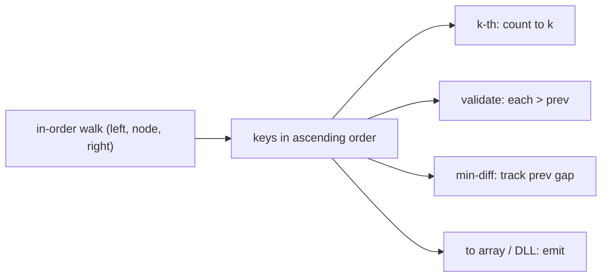

# Pattern: Sorted Traversal

## Why It Exists

The single most exploited fact about a BST: an **in-order traversal** (left → node → right) visits the keys in **ascending sorted order**. That one property turns a cluster of problems into the same one-line walk:

- *k-th smallest* → the k-th key visited.
- *validate a BST* → the in-order sequence must be strictly increasing.
- *minimum difference between any two values* → it's between **adjacent** keys in sorted order.
- *convert to a sorted array / doubly-linked list* → just emit the in-order sequence.

The recognition trigger is anything phrased "in sorted order," "k-th smallest/largest," "closest pair," or "is this a valid BST." And the efficient move is to **process each key as it's visited** — tracking only the previous value, or counting to `k` and stopping — rather than materializing a full sorted list.

## See It Work

Find the **k-th smallest** key with a lazy in-order walk that stops as soon as it reaches `k`. Run it.

```python run viz=binary-tree viz-root=root
class TreeNode:
    def __init__(self, val):
        self.val = val
        self.left = None
        self.right = None

def insert(root, val):
    if root is None: return TreeNode(val)
    if val < root.val: root.left = insert(root.left, val)
    elif val > root.val: root.right = insert(root.right, val)
    return root

def kth_smallest(root, k):
    stack, node = [], root
    while stack or node:
        while node:                        # descend the left spine
            stack.append(node)
            node = node.left
        node = stack.pop()                 # next key in sorted order
        k -= 1
        if k == 0:                         # reached the k-th → stop early
            return node.val
        node = node.right
    return None

root = None
for v in [5, 3, 8, 1, 4, 7, 9]:
    root = insert(root, v)
print(kth_smallest(root, 1), kth_smallest(root, 4), kth_smallest(root, 7))   # 1 5 9
```

## How It Works

Every member of the family is an in-order traversal with a small piece of per-visit logic:

| problem | per-visit logic |
|---|---|
| k-th smallest | count visits; return the key when the count hits `k` (stop early) |
| validate BST | check each key is **strictly greater** than the previous; track `prev` |
| min adjacent difference | track `min(gap)` between consecutive keys; track `prev` |
| to sorted array / DLL | append / link each key as visited |



<p align="center"><strong>in-order yields ascending keys; hang the problem's logic on each visit (count, compare-to-prev, or emit) instead of building a list.</strong></p>

The traversal is `O(n)` (or `O(k + h)` with early-exit for k-th), `O(h)` space with an explicit stack — no `O(n)` sorted list needed, because most of these only ever look at the **current and previous** keys. That "track `prev`, process on the fly" habit is the efficient core: validate and min-difference need *one* extra variable, not a materialized array.

### Key Takeaway

In-order traversal of a BST gives sorted keys, so k-th smallest, validate, min-adjacent-difference, and to-sorted-array all reduce to one in-order walk with per-visit logic. Process keys as visited (count, or track `prev`) — `O(n)` time, `O(h)` space, no full list required.

## Trace It

`kth_smallest(root, 4)` over `[5,3,8,1,4,7,9]` — in-order yields `1, 3, 4, 5, …`:

| visit # | key | `k` after decrement | action |
|---|---|---|---|
| 1 | `1` | 3 | continue |
| 2 | `3` | 2 | continue |
| 3 | `4` | 1 | continue |
| 4 | `5` | 0 | **return 5** |

Before you read on: this stopped after visiting 4 of the 7 nodes — it never touched `7`, `8`, `9`. For *validate-BST* and *min-difference*, though, you keep only a single `prev` variable instead of the whole sorted list. Why is "remember just the previous key" enough for those, when sorting normally needs to see everything at once?

Because in-order *delivers* the keys already sorted, so the only comparisons those problems need are between **consecutive** elements — and consecutive means "this key and the one just before it." Validating a BST is exactly "is the sorted sequence strictly increasing?", which is a pairwise check of each element against its predecessor; the minimum difference between *any* two keys in a sorted sequence is always between *adjacent* ones (a non-adjacent pair is at least as far apart). So a single `prev` captures everything the current step could need — you never have to look back further. The in-order walk has done the "see everything in order" work *implicitly*; your per-visit logic just rides the stream with `O(1)` memory. Recognizing that "sorted ⇒ adjacent-only comparisons" is what collapses these from "collect then process" to "process on the fly."

## Your Turn

k-th smallest plus validate-BST, both on one in-order walk:

```python run viz=binary-tree viz-root=root
class TreeNode:
    def __init__(self, val, left=None, right=None):
        self.val = val; self.left = left; self.right = right

def kth_smallest(root, k):
    stack, node = [], root
    while stack or node:
        while node:
            stack.append(node); node = node.left
        node = stack.pop()
        k -= 1
        if k == 0: return node.val
        node = node.right
    return None

def is_valid_bst(root):
    prev = None
    stack, node = [], root
    while stack or node:
        while node:
            stack.append(node); node = node.left
        node = stack.pop()
        if prev is not None and node.val <= prev:   # not strictly increasing → invalid
            return False
        prev = node.val
        node = node.right
    return True

good = TreeNode(5, TreeNode(3, TreeNode(1), TreeNode(4)), TreeNode(8))
bad  = TreeNode(5, TreeNode(3, TreeNode(1), TreeNode(6)), TreeNode(8))   # 6 > 5 on the left
print(kth_smallest(good, 2), is_valid_bst(good), is_valid_bst(bad))   # 3 True False
```

```java run viz=binary-tree viz-root=root
import java.util.*;

public class Main {
  static class TreeNode { int val; TreeNode left, right; TreeNode(int v){ val = v; } TreeNode(int v, TreeNode l, TreeNode r){ val=v; left=l; right=r; } }

  static boolean isValidBST(TreeNode root) {
    Deque<TreeNode> stack = new ArrayDeque<>();
    TreeNode node = root; Integer prev = null;
    while (!stack.isEmpty() || node != null) {
      while (node != null) { stack.push(node); node = node.left; }
      node = stack.pop();
      if (prev != null && node.val <= prev) return false;   // must strictly increase
      prev = node.val;
      node = node.right;
    }
    return true;
  }
  public static void main(String[] args) {
    TreeNode good = new TreeNode(5, new TreeNode(3, new TreeNode(1), new TreeNode(4)), new TreeNode(8));
    TreeNode bad  = new TreeNode(5, new TreeNode(3, new TreeNode(1), new TreeNode(6)), new TreeNode(8));
    System.out.println(isValidBST(good) + " " + isValidBST(bad));   // true false
  }
}
```

Drill the family in **Practice** — [Lowest Absolute Variance](/cortex/data-structures-and-algorithms/trees-binary-search-tree-pattern-sorted-traversal-problems-lowest-absolute-variance), [BST Validator](/cortex/data-structures-and-algorithms/trees-binary-search-tree-pattern-sorted-traversal-problems-bst-validator), [BST to Sorted Array](/cortex/data-structures-and-algorithms/trees-binary-search-tree-pattern-sorted-traversal-problems-bst-to-sorted-array), and [BST to DLL](/cortex/data-structures-and-algorithms/trees-binary-search-tree-pattern-sorted-traversal-problems-bst-to-dll).

## Reflect & Connect

Sorted traversal is the BST's defining superpower made into a pattern:

- **The family** — k-th smallest, validate, min adjacent difference, closest value, BST↔sorted-array, BST→doubly-linked-list (an in-order walk relinking nodes). All are "in-order + per-visit logic."
- **Process on the fly** — track `prev` (validate, min-diff) or a counter (k-th), and you avoid the `O(n)` list. The early-exit for k-th makes it `O(k + h)`. This is the same "stream, don't store" instinct as the linked-list and array one-pass patterns.
- **Two natural extensions** — a *reversed* in-order (right, node, left) yields **descending** order for "k-th largest" (the [next pattern](/cortex/data-structures-and-algorithms/trees-binary-search-tree-pattern-reversed-sorted-traversal-pattern)); and pairing an ascending [iterator](/cortex/data-structures-and-algorithms/trees-binary-search-tree-iterators-in-binary-search-trees) with a descending one solves "two-sum on a BST" by the array two-pointer method.

**Prerequisites:** [Introduction to Binary Search Trees](/cortex/data-structures-and-algorithms/trees-binary-search-tree-introduction-to-binary-search-trees).
**What's next:** the mirror walk for descending order — [Reversed Sorted Traversal](/cortex/data-structures-and-algorithms/trees-binary-search-tree-pattern-reversed-sorted-traversal-pattern).

## Recall

> **Mnemonic:** *In-order = sorted. Hang the logic on each visit: count to k · each > prev (validate) · track prev gap (min-diff) · emit (to array/DLL). Track prev, don't store the list.*

| | |
|---|---|
| Engine | in-order traversal (left, node, right) → ascending keys |
| k-th smallest | count visits, stop at `k` → `O(k + h)` |
| Validate BST | each key strictly `> prev` |
| Min adjacent diff | min gap between consecutive keys |
| Cost | `O(n)` (or `O(k+h)` early-exit), `O(h)` space — no full list |

<details>
<summary><strong>Q:</strong> What order does a BST's in-order traversal produce, and why does it matter?</summary>

**A:** Ascending sorted order — so sorted-order problems become one in-order walk.

</details>
<details>
<summary><strong>Q:</strong> How do you find the k-th smallest?</summary>

**A:** In-order traversal counting visits; return the key when the count reaches `k` (stop early).

</details>
<details>
<summary><strong>Q:</strong> Why is a single `prev` variable enough to validate a BST or find the min difference?</summary>

**A:** In-order is already sorted, so the only needed comparisons are between consecutive keys — current vs previous.

</details>
<details>
<summary><strong>Q:</strong> How do you get descending order?</summary>

**A:** Reverse the in-order walk (right, node, left) — the next pattern.

</details>

## Sources & Verify

- **CLRS**, *Introduction to Algorithms*, 4th ed., §12.1–12.2 — in-order traversal and the sorted-order property.
- **Sedgewick & Wayne**, *Algorithms*, 4th ed., §3.2 — ordered operations and BST iteration.
- The in-order-is-sorted family (k-th smallest, validate, min-diff) is standard; both runnable blocks are verified by running (`kth ⇒ 1, 5, 9`; `kth(good,2)=3`, validate `good=True, bad=False`).
