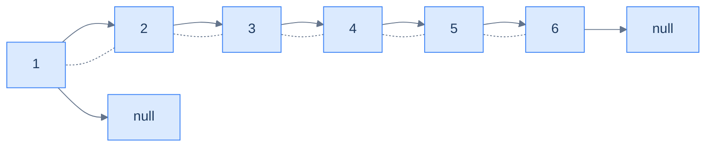

# BST to DLL

## Problem Statement

Given the **root** of a binary search tree, convert it **in place** into a sorted doubly-linked list. The DLL should reuse the BST's nodes — `left` becomes `prev`, `right` becomes `next` — and be ordered by ascending value. Return the **head** of the DLL.

### Example 1

> - **Input:** `root = [4, 2, 5, 1, 3, null, 6]`
> - **Output:** `[1, 2, 3, 4, 5, 6]` (as a DLL)

### Example 2

> - **Input:** `root = [9, 5, 10, 4, null, null, 11]`
> - **Output:** `[4, 5, 9, 10, 11]` (as a DLL)

<details>
<summary><h2>The Strategy</h2></summary>


The in-order walk visits nodes in ascending order, which is exactly the order of a sorted DLL. So during the walk we simply *thread* each node onto the back of a growing list:

- Carry two pointers in the enclosing scope: `head` (the first node ever processed) and `tail` (the most recently processed node).
- For each visited node:
  - If `tail` is `null`, this is the first node — set `head = node`, `node.left = null`.
  - Else link `tail.right = node` and `node.left = tail`.
  - Set `tail = node`.
- After the walk, set `tail.right = null` to terminate the list.

The BST's `left`/`right` pointers are *reused* as the DLL's `prev`/`next` — no extra allocation.



<p align="center"><strong>The result of running the in-order walk over <code>[4, 2, 5, 1, 3, null, 6]</code>: <code>1 ↔ 2 ↔ 3 ↔ 4 ↔ 5 ↔ 6</code>. The original BST nodes have been re-wired in place.</strong></p>

</details>
<details>
<summary><h2>The Solution</h2></summary>


```python run viz=binary-tree viz-root=root
from typing import Optional, List


class TreeNode:
    def __init__(self, val=0, left=None, right=None):
        self.val = val
        self.left = left
        self.right = right


def from_level_order(values):
    """Build tree from list like [1, 2, 3, None, 4]. None means missing child."""
    if not values:
        return None
    root = TreeNode(values[0])
    queue = [root]
    i = 1
    while queue and i < len(values):
        node = queue.pop(0)
        if i < len(values) and values[i] is not None:
            node.left = TreeNode(values[i])
            queue.append(node.left)
        i += 1
        if i < len(values) and values[i] is not None:
            node.right = TreeNode(values[i])
            queue.append(node.right)
        i += 1
    return root


def dll_to_list(head):
    out = []
    while head:
        out.append(head.val)
        head = head.right
    return out


class Solution:
    def __init__(self):

        # Pointer to keep track of the head of the doubly linked list
        self.head: Optional[TreeNode] = None

        # Pointer to keep track of the tail of the doubly linked list
        self.tail: Optional[TreeNode] = None

    def inorder(self, root: Optional[TreeNode]) -> None:

        # Base case: If the node is None, return
        if root is None:
            return

        # Recursively traverse the left subtree
        self.inorder(root.left)

        # If there is a tail, link it with the current root
        if self.tail is not None:

            # Link the right (next) pointer of the tail to the current
            # root
            self.tail.right = root

            # Link the left (previous) pointer of the current root to the
            # tail
            root.left = self.tail
        else:

            # Set the head to the current root
            self.head = root

            # Set the left (previous) pointer of the head to None
            root.left = None

        # Update the tail to the current root
        self.tail = root

        # Recursively traverse the right subtree
        self.inorder(root.right)

    def bst_to_sorted_dll(
        self, root: Optional[TreeNode]
    ) -> Optional[TreeNode]:

        # If the tree is empty, return None
        if root is None:
            return None

        # Call the helper function to perform inorder traversal
        self.inorder(root)

        # Ensure the right (next) pointer of the tail is None
        if self.tail is not None:
            self.tail.right = None

        # Return the head of the doubly linked list
        return self.head


# Example 1
head1 = Solution().bst_to_sorted_dll(
    from_level_order([4, 2, 5, 1, 3, None, 6]))
print(dll_to_list(head1))   # [1, 2, 3, 4, 5, 6]

# Example 2
head2 = Solution().bst_to_sorted_dll(
    from_level_order([9, 5, 10, 4, None, None, 11]))
print(dll_to_list(head2))   # [4, 5, 9, 10, 11]

# Edge cases
print(Solution().bst_to_sorted_dll(None))          # None

head3 = Solution().bst_to_sorted_dll(from_level_order([5]))
print(dll_to_list(head3))   # [5]

# Two-node tree
head4 = Solution().bst_to_sorted_dll(from_level_order([3, 1]))
print(dll_to_list(head4))   # [1, 3]

# Right-skew BST
head5 = Solution().bst_to_sorted_dll(
    from_level_order([1, None, 2, None, 3]))
print(dll_to_list(head5))   # [1, 2, 3]
```

```java run viz=binary-tree viz-root=root
public class Main {
    static class TreeNode { int val; TreeNode left, right; TreeNode(int v){val=v;} }

    static class Solution {
        private TreeNode head = null, tail = null;

        private void inorder(TreeNode root) {
            if (root == null) return;
            inorder(root.left);
            if (tail != null) {
                tail.right = root;
                root.left = tail;
            } else {
                head = root;
                root.left = null;
            }
            tail = root;
            inorder(root.right);
        }

        public TreeNode bstToSortedDll(TreeNode root) {
            if (root == null) return null;
            inorder(root);
            if (tail != null) tail.right = null;
            return head;
        }
    }

    public static void main(String[] args) {
        TreeNode root = new TreeNode(4);
        root.left  = new TreeNode(2); root.right = new TreeNode(5);
        root.left.left  = new TreeNode(1); root.left.right = new TreeNode(3);
        root.right.right = new TreeNode(6);
        TreeNode head = new Solution().bstToSortedDll(root);
        StringBuilder sb = new StringBuilder();
        for (TreeNode c = head; c != null; c = c.right) {
            if (sb.length() > 0) sb.append(' ');
            sb.append(c.val);
        }
        System.out.println(sb);  // 1 2 3 4 5 6
    }
}
```

</details>
<details>
<summary><strong>Trace — root = [4, 2, 5, 1, 3, null, 6]</strong></summary>

```
in-order visit sequence: 1, 2, 3, 4, 5, 6

After visiting 1 │ head = 1, tail = 1, list = [1]
After visiting 2 │ tail.right = 2; 2.left = tail; tail = 2; list = [1 ↔ 2]
After visiting 3 │ tail.right = 3; 3.left = tail; tail = 3; list = [1 ↔ 2 ↔ 3]
After visiting 4 │ tail.right = 4; 4.left = tail; tail = 4; list = [1 ↔ 2 ↔ 3 ↔ 4]
After visiting 5 │ tail.right = 5; 5.left = tail; tail = 5; list = [1 ↔ 2 ↔ 3 ↔ 4 ↔ 5]
After visiting 6 │ tail.right = 6; 6.left = tail; tail = 6; list = [1 ↔ 2 ↔ 3 ↔ 4 ↔ 5 ↔ 6]
Finalisation     │ tail.right = null
Return head = 1 ✓
```

</details>
<details>
<summary><h2>Key Takeaway</h2></summary>


The Sorted Traversal pattern collapses an entire family of BST problems to *"do something to a sorted sequence"*. The algorithm is always the same: walk in-order, carry one or two pieces of state, fold each visit into the running answer. Validation, k-th smallest, ranges, gaps, conversions to other ordered structures — all of these are sorted-sequence problems hiding under tree dressing.

Two patterns to keep:

1. **"Carry the previous in-order node"** — the swiss-army idiom for any pairwise comparison along the sorted sequence. We used it in `lowest absolute variance` and `BST validator`. It's also the core of "is the BST nearly sorted?", "find any duplicates", "find swapped nodes" (recover-tree problems).
2. **"In-place re-wire during the walk"** — the same in-order skeleton can mutate the structure as it visits, turning a BST into a DLL or rebalancing into a vine. This is the foundation of the **threaded-tree** and **Morris traversal** ideas, and a stepping-stone to in-place tree manipulations in compilers and editors.

The next lesson mirrors this one with a *reverse* in-order traversal, opening up the descending-order analogues — k-th largest, sum of values greater than X, "max-greater BST" rewriting.

</details>
