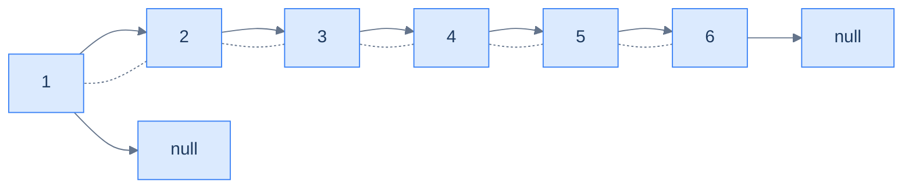

# BST to DLL

## Problem Statement

Given the **root** of a binary search tree, convert it **in place** into a sorted doubly-linked list. The DLL should reuse the BST's nodes — `left` becomes `prev`, `right` becomes `next` — and be ordered by ascending value. Return the **head** of the DLL.

## Examples

**Example 1:**
```
Input:  root = [4, 2, 5, 1, 3, null, 6]
Output: [1, 2, 3, 4, 5, 6]
```

**Example 2:**
```
Input:  root = [9, 5, 10, 4, null, null, 11]
Output: [4, 5, 9, 10, 11]
```

## Constraints

- `0 ≤ number of nodes ≤ 10⁴`
- `-10⁴ ≤ node.val ≤ 10⁴`
- The tree is a valid BST.
- Mutate the existing nodes in place — no new node allocation.

```python run viz=binary-tree viz-root=root
import json
from collections import deque

class TreeNode:
    def __init__(self, val, left=None, right=None):
        self.val = val
        self.left = left
        self.right = right

class Solution:
    def bst_to_sorted_dll(self, root):
        # Your code goes here — in-order walk; carry head and tail pointers;
        # link each visited node onto the tail (tail.right = node, node.left = tail);
        # set head on the first visit. After the walk, set tail.right = None.
        # Return head.
        return root

def build_tree(values):              # [1, 2, 3, null, 4] level-order → root
    if not values:
        return None
    root = TreeNode(values[0])
    queue = deque([root])
    i = 1
    while queue and i < len(values):
        node = queue.popleft()
        if i < len(values):
            v = values[i]; i += 1
            if v is not None:
                node.left = TreeNode(v); queue.append(node.left)
        if i < len(values):
            v = values[i]; i += 1
            if v is not None:
                node.right = TreeNode(v); queue.append(node.right)
    return root

def print_dll(head):                 # walk via .right and collect vals → list
    out = []
    while head:
        out.append(head.val)
        head = head.right
    print(out)

root = build_tree(json.loads(input()))   # the test case's level-order values
print_dll(Solution().bst_to_sorted_dll(root))
```

```java run viz=binary-tree viz-root=root
import java.util.*;

public class Main {
    static class TreeNode {
        int val; TreeNode left, right;
        TreeNode(int val) { this.val = val; }
    }

    static class Solution {
        public TreeNode bstToSortedDll(TreeNode root) {
            // Your code goes here — in-order walk; carry head and tail;
            // link via tail.right = node, node.left = tail;
            // terminate with tail.right = null. Return head.
            return root;
        }
    }

    public static void main(String[] args) {
        Scanner sc = new Scanner(System.in);
        TreeNode root = buildTree(parseIntegerArray(sc.nextLine()));
        List<Integer> out = new ArrayList<>();
        for (TreeNode c = new Solution().bstToSortedDll(root); c != null; c = c.right)
            out.add(c.val);
        System.out.println(out);
    }

    static TreeNode buildTree(Integer[] values) {   // [1, 2, 3, null, 4] level-order → root
        if (values.length == 0 || values[0] == null) return null;
        TreeNode root = new TreeNode(values[0]);
        Deque<TreeNode> queue = new ArrayDeque<>();
        queue.add(root);
        int i = 1;
        while (!queue.isEmpty() && i < values.length) {
            TreeNode node = queue.poll();
            if (i < values.length) {
                Integer v = values[i++];
                if (v != null) { node.left = new TreeNode(v); queue.add(node.left); }
            }
            if (i < values.length) {
                Integer v = values[i++];
                if (v != null) { node.right = new TreeNode(v); queue.add(node.right); }
            }
        }
        return root;
    }

    // "[1, 2, null, 4]" → {1, 2, null, 4} — reads the test case's level-order values
    static Integer[] parseIntegerArray(String line) {
        String inner = line.replaceAll("[\\[\\]\\s]", "");
        if (inner.isEmpty()) return new Integer[0];
        String[] parts = inner.split(",");
        Integer[] out = new Integer[parts.length];
        for (int i = 0; i < parts.length; i++)
            out[i] = parts[i].equals("null") ? null : Integer.parseInt(parts[i]);
        return out;
    }
}
```

```testcases
{
  "args": [
    { "id": "root", "label": "root", "type": "tree", "placeholder": "[4, 2, 5, 1, 3, null, 6]" }
  ],
  "cases": [
    { "args": { "root": "[4, 2, 5, 1, 3, null, 6]" }, "expected": "[1, 2, 3, 4, 5, 6]" },
    { "args": { "root": "[9, 5, 10, 4, null, null, 11]" }, "expected": "[4, 5, 9, 10, 11]" },
    { "args": { "root": "[5]" }, "expected": "[5]" },
    { "args": { "root": "[3, 1]" }, "expected": "[1, 3]" },
    { "args": { "root": "[1, null, 2, null, 3]" }, "expected": "[1, 2, 3]" },
    { "args": { "root": "[5, 3, 7, 2, 4, 6, 8]" }, "expected": "[2, 3, 4, 5, 6, 7, 8]" }
  ]
}
```

<details>
<summary><h2>The Strategy</h2></summary>

The in-order walk visits nodes in ascending order, which is exactly the order of a sorted DLL. So during the walk we simply *thread* each node onto the back of a growing list:

- Carry two pointers in the enclosing scope: `head` (the first node ever processed) and `tail` (the most recently processed node).
- For each visited node:
  - If `tail` is `null`, this is the first node — set `head = node`, `node.left = null`.
  - Else link `tail.right = node` and `node.left = tail`.
  - Set `tail = node`.
- After the walk, set `tail.right = null` to terminate the list.

The BST's `left`/`right` pointers are *reused* as the DLL's `prev`/`next` — no extra allocation.



<p align="center"><strong>The result of running the in-order walk over <code>[4, 2, 5, 1, 3, null, 6]</code>: <code>1 ↔ 2 ↔ 3 ↔ 4 ↔ 5 ↔ 6</code>. The original BST nodes have been re-wired in place.</strong></p>

</details>
<details>
<summary><h2>Solution</h2></summary>

We use an iterative in-order walk, carrying `head` and `tail` across visits. On the first visit we record `head`; on every subsequent visit we link the new node to `tail`. After the walk we terminate with `tail.right = null` and return `head`.

```python solution time=O(n) space=O(h)
import json
from collections import deque

class TreeNode:
    def __init__(self, val, left=None, right=None):
        self.val = val
        self.left = left
        self.right = right

class Solution:
    def bst_to_sorted_dll(self, root):
        if root is None:
            return None
        head = tail = None
        stack, node = [], root
        while stack or node:
            while node:
                stack.append(node); node = node.left
            node = stack.pop()
            if tail is not None:
                tail.right = node
                node.left = tail
            else:
                head = node
                node.left = None
            tail = node
            node = node.right
        if tail is not None:
            tail.right = None
        return head

def build_tree(values):              # [1, 2, 3, null, 4] level-order → root
    if not values:
        return None
    root = TreeNode(values[0])
    queue = deque([root])
    i = 1
    while queue and i < len(values):
        node = queue.popleft()
        if i < len(values):
            v = values[i]; i += 1
            if v is not None:
                node.left = TreeNode(v); queue.append(node.left)
        if i < len(values):
            v = values[i]; i += 1
            if v is not None:
                node.right = TreeNode(v); queue.append(node.right)
    return root

def print_dll(head):                 # walk via .right and collect vals → list
    out = []
    while head:
        out.append(head.val)
        head = head.right
    print(out)

root = build_tree(json.loads(input()))   # the test case's level-order values
print_dll(Solution().bst_to_sorted_dll(root))
```

```java solution
import java.util.*;

public class Main {
    static class TreeNode {
        int val; TreeNode left, right;
        TreeNode(int val) { this.val = val; }
    }

    static class Solution {
        public TreeNode bstToSortedDll(TreeNode root) {
            if (root == null) return null;
            TreeNode head = null, tail = null;
            Deque<TreeNode> stack = new ArrayDeque<>();
            TreeNode node = root;
            while (!stack.isEmpty() || node != null) {
                while (node != null) { stack.push(node); node = node.left; }
                node = stack.pop();
                if (tail != null) {
                    tail.right = node;
                    node.left = tail;
                } else {
                    head = node;
                    node.left = null;
                }
                tail = node;
                node = node.right;
            }
            if (tail != null) tail.right = null;
            return head;
        }
    }

    public static void main(String[] args) {
        Scanner sc = new Scanner(System.in);
        TreeNode root = buildTree(parseIntegerArray(sc.nextLine()));
        List<Integer> out = new ArrayList<>();
        for (TreeNode c = new Solution().bstToSortedDll(root); c != null; c = c.right)
            out.add(c.val);
        System.out.println(out);
    }

    static TreeNode buildTree(Integer[] values) {   // [1, 2, 3, null, 4] level-order → root
        if (values.length == 0 || values[0] == null) return null;
        TreeNode root = new TreeNode(values[0]);
        Deque<TreeNode> queue = new ArrayDeque<>();
        queue.add(root);
        int i = 1;
        while (!queue.isEmpty() && i < values.length) {
            TreeNode node = queue.poll();
            if (i < values.length) {
                Integer v = values[i++];
                if (v != null) { node.left = new TreeNode(v); queue.add(node.left); }
            }
            if (i < values.length) {
                Integer v = values[i++];
                if (v != null) { node.right = new TreeNode(v); queue.add(node.right); }
            }
        }
        return root;
    }

    // "[1, 2, null, 4]" → {1, 2, null, 4} — reads the test case's level-order values
    static Integer[] parseIntegerArray(String line) {
        String inner = line.replaceAll("[\\[\\]\\s]", "");
        if (inner.isEmpty()) return new Integer[0];
        String[] parts = inner.split(",");
        Integer[] out = new Integer[parts.length];
        for (int i = 0; i < parts.length; i++)
            out[i] = parts[i].equals("null") ? null : Integer.parseInt(parts[i]);
        return out;
    }
}
```

</details>
<details>
<summary><strong>Trace — root = [4, 2, 5, 1, 3, null, 6]</strong></summary>

```
in-order visit sequence: 1, 2, 3, 4, 5, 6

After visiting 1 │ head = 1, tail = 1, list = [1]
After visiting 2 │ tail.right = 2; 2.left = tail; tail = 2; list = [1 ↔ 2]
After visiting 3 │ tail.right = 3; 3.left = tail; tail = 3; list = [1 ↔ 2 ↔ 3]
After visiting 4 │ tail.right = 4; 4.left = tail; tail = 4; list = [1 ↔ 2 ↔ 3 ↔ 4]
After visiting 5 │ tail.right = 5; 5.left = tail; tail = 5; list = [1 ↔ 2 ↔ 3 ↔ 4 ↔ 5]
After visiting 6 │ tail.right = 6; 6.left = tail; tail = 6; list = [1 ↔ 2 ↔ 3 ↔ 4 ↔ 5 ↔ 6]
Finalisation     │ tail.right = null
Return head = 1 ✓
```

</details>
<details>
<summary><h2>Key Takeaway</h2></summary>

The Sorted Traversal pattern collapses an entire family of BST problems to *"do something to a sorted sequence"*. The algorithm is always the same: walk in-order, carry one or two pieces of state, fold each visit into the running answer. Validation, k-th smallest, ranges, gaps, conversions to other ordered structures — all of these are sorted-sequence problems hiding under tree dressing.

Two patterns to keep:

1. **"Carry the previous in-order node"** — the swiss-army idiom for any pairwise comparison along the sorted sequence. We used it in `lowest absolute variance` and `BST validator`. It's also the core of "is the BST nearly sorted?", "find any duplicates", "find swapped nodes" (recover-tree problems).
2. **"In-place re-wire during the walk"** — the same in-order skeleton can mutate the structure as it visits, turning a BST into a DLL or rebalancing into a vine. This is the foundation of the **threaded-tree** and **Morris traversal** ideas, and a stepping-stone to in-place tree manipulations in compilers and editors.

The next lesson mirrors this one with a *reverse* in-order traversal, opening up the descending-order analogues — k-th largest, sum of values greater than X, "max-greater BST" rewriting.

</details>
