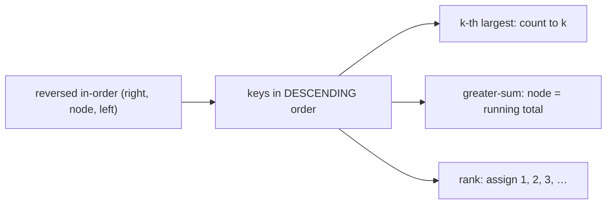

# Pattern: Reversed Sorted Traversal

## Why It Exists

[Sorted traversal](/cortex/data-structures-and-algorithms/trees/binary-search-tree/pattern-sorted-traversal/pattern) walked the BST in-order (left → node → right) for *ascending* keys. Flip the two recursive directions — **right → node → left** — and you visit the keys in *descending* order instead. That mirror is the natural fit for "**k-th largest**", "assign **ranks** (largest = rank 1)", and a class of **running-accumulator** problems.

The accumulator insight is what makes this pattern more than "sorted traversal backwards." Walking descending means that by the time you reach any node, you've **already visited every key larger than it**. So a single running total, updated as you go, lets you set each node to "the sum of all keys ≥ it" (the *greater-sum tree*) or "its rank among all keys" — in one `O(n)` pass, no second traversal.

## See It Work

Find the **k-th largest** key with a reversed in-order walk that stops at `k`. Run it.

```python run viz=binary-tree viz-root=root
class TreeNode:
    def __init__(self, val):
        self.val = val
        self.left = None
        self.right = None

def insert(root, val):
    if root is None: return TreeNode(val)
    if val < root.val: root.left = insert(root.left, val)
    elif val > root.val: root.right = insert(root.right, val)
    return root

def kth_largest(root, k):
    stack, node = [], root
    while stack or node:
        while node:                        # descend the RIGHT spine (largest first)
            stack.append(node)
            node = node.right
        node = stack.pop()                 # next key in DESCENDING order
        k -= 1
        if k == 0:
            return node.val
        node = node.left

root = None
for v in [5, 3, 8, 1, 4, 7, 9]:
    root = insert(root, v)
print(kth_largest(root, 1), kth_largest(root, 3), kth_largest(root, 7))   # 9 7 1
```

## How It Works

It's the in-order walk with left and right swapped:

- **Reversed in-order** = right → node → left. The right subtree (larger keys) is visited first, so keys emerge largest-to-smallest.
- **k-th largest** — count visits, stop at `k` (early-exit → `O(k + h)`).
- **Running accumulator** — keep a `total`; at each node do `total += node.val` (everything larger is already in `total`), then set `node.val = total` for the *greater-sum tree*, or assign an incrementing rank.



<p align="center"><strong>reversed in-order (right first) yields descending keys; a running total accumulates "everything larger so far," enabling greater-sum / rank in one pass.</strong></p>

Same cost profile as sorted traversal — `O(n)` (or `O(k + h)` with early-exit), `O(h)` space. The only change is the *direction*, and the payoff is that "descending order" makes "sum/count of everything larger" an `O(1)` per-node update.

### Key Takeaway

Reversed in-order (right → node → left) visits BST keys largest-first. It gives k-th largest by counting, and — because descending means all larger keys are seen first — a running total turns "sum of everything greater" (greater-sum tree) or "rank" into a one-pass `O(n)` computation.

## Trace It

`kth_largest(root, 3)` over `[5,3,8,1,4,7,9]` — reversed in-order yields `9, 8, 7, …`:

| visit # | key | `k` after | action |
|---|---|---|---|
| 1 | `9` | 2 | continue |
| 2 | `8` | 1 | continue |
| 3 | `7` | 0 | **return 7** |

Before you read on: the *greater-sum tree* replaces each key with the sum of all keys **≥** it, in one pass — node `9` becomes `9`, `8` becomes `17` (`8+9`), `7` becomes `24` (`7+8+9`). Why does walking in *descending* order make this a single `O(1)`-per-node update, when computing "sum of everything larger" naively sounds like it needs a separate scan for each node?

Because descending order visits keys in exactly the sequence "largest, then next-largest, …" — so when you arrive at a node, **every key larger than it has already been visited**, and if you've been adding each visited key into a running `total`, that `total` *is* the sum of everything ≥ the current node. One addition (`total += node.val`) maintains the invariant; one assignment (`node.val = total`) records the answer. The naive approach recomputes "sum of larger keys" from scratch per node — `O(n)` each, `O(n²)` total. The reversed walk turns it into `O(n)` because the *order of visitation* pre-aggregates the larger keys for free. This "process in an order that makes the running aggregate exactly what you need" is the same instinct behind prefix sums and the sweep line — and here the BST's reverse-sorted walk supplies that order.

## Your Turn

k-th largest plus the greater-sum tree, both on one reversed in-order walk:

```python run viz=binary-tree viz-root=root
class TreeNode:
    def __init__(self, val):
        self.val = val; self.left = None; self.right = None

def insert(root, val):
    if root is None: return TreeNode(val)
    if val < root.val: root.left = insert(root.left, val)
    elif val > root.val: root.right = insert(root.right, val)
    return root

def kth_largest(root, k):
    stack, node = [], root
    while stack or node:
        while node:
            stack.append(node); node = node.right
        node = stack.pop(); k -= 1
        if k == 0: return node.val
        node = node.left

def greater_sum_tree(root):
    total = 0
    stack, node = [], root
    while stack or node:
        while node:
            stack.append(node); node = node.right    # descending
        node = stack.pop()
        total += node.val                            # all larger keys already added
        node.val = total
        node = node.left
    return root

def inorder(n): return inorder(n.left) + [n.val] + inorder(n.right) if n else []

root = None
for v in [5, 3, 8, 1, 4, 7, 9]:
    root = insert(root, v)
print(kth_largest(root, 2))                          # 8
print(inorder(greater_sum_tree(root)))               # [37, 36, 33, 29, 24, 17, 9]
```

```java run viz=binary-tree viz-root=root
import java.util.*;

public class Main {
  static class TreeNode { int val; TreeNode left, right; TreeNode(int v){ val = v; } }
  static TreeNode insert(TreeNode r, int v) {
    if (r == null) return new TreeNode(v);
    if (v < r.val) r.left = insert(r.left, v);
    else if (v > r.val) r.right = insert(r.right, v);
    return r;
  }
  static Integer kthLargest(TreeNode root, int k) {
    Deque<TreeNode> stack = new ArrayDeque<>();
    TreeNode node = root;
    while (!stack.isEmpty() || node != null) {
      while (node != null) { stack.push(node); node = node.right; }
      node = stack.pop();
      if (--k == 0) return node.val;
      node = node.left;
    }
    return null;
  }
  public static void main(String[] args) {
    TreeNode root = null;
    for (int v : new int[]{5, 3, 8, 1, 4, 7, 9}) root = insert(root, v);
    System.out.println(kthLargest(root, 1) + " " + kthLargest(root, 3));   // 9 7
  }
}
```

Drill the family in **Practice** — [Rank Nodes](/cortex/data-structures-and-algorithms/trees/binary-search-tree/pattern-reversed-sorted-traversal/problems/rank-nodes), [Kth Largest Element](/cortex/data-structures-and-algorithms/trees/binary-search-tree/pattern-reversed-sorted-traversal/problems/kth-largest-element), [Enriched Sum Tree](/cortex/data-structures-and-algorithms/trees/binary-search-tree/pattern-reversed-sorted-traversal/problems/enriched-sum-tree), and [Multiple Replacement](/cortex/data-structures-and-algorithms/trees/binary-search-tree/pattern-reversed-sorted-traversal/problems/multiple-replacement).

## Reflect & Connect

Reversed traversal is sorted traversal's mirror, plus the accumulator twist:

- **The family** — k-th largest, rank assignment (largest = 1), **greater-sum / enriched-sum tree** (each node += sum of all greater keys), replace-with-next-greater. All are reversed in-order + per-visit logic.
- **The accumulator is the differentiator** — descending order means "everything larger is already processed," so a running sum/count gives greater-than aggregates in one pass. (Symmetrically, ascending in-order with a running total gives *smaller-than* aggregates.) Same "visit in an order that makes the running aggregate exactly what you need" idea as prefix sums and the sweep line.
- **Direction is the only knob** — sorted traversal and reversed traversal share one template; left-first vs right-first is the whole difference. Pick by whether the problem is about smaller-than or larger-than.

**Prerequisites:** [Sorted Traversal](/cortex/data-structures-and-algorithms/trees/binary-search-tree/pattern-sorted-traversal/pattern).
**What's next:** prune whole subtrees out of range during traversal — [Range Postorder](/cortex/data-structures-and-algorithms/trees/binary-search-tree/pattern-range-postorder/pattern).

## Recall

> **Mnemonic:** *Reverse in-order (right, node, left) = descending. k-th largest: count to k. Greater-sum/rank: keep a running total — descending means all larger keys already seen.*

| | |
|---|---|
| Engine | reversed in-order (right → node → left) → descending keys |
| k-th largest | count visits, stop at `k` → `O(k + h)` |
| Greater-sum tree | `total += node.val; node.val = total` per visit |
| Why one pass | descending ⇒ all larger keys already accumulated |
| Cost | `O(n)` (or `O(k+h)`), `O(h)` space |

<details>
<summary><strong>Q:</strong> How do you visit a BST's keys in descending order?</summary>

**A:** Reversed in-order — right subtree, then node, then left subtree.

</details>
<details>
<summary><strong>Q:</strong> How do you find the k-th largest?</summary>

**A:** Reversed in-order counting visits, returning the key at count `k` (early-exit).

</details>
<details>
<summary><strong>Q:</strong> Why does descending order make the greater-sum tree a one-pass `O(n)` computation?</summary>

**A:** When you visit a node, every larger key is already in the running total, so one addition maintains "sum of everything ≥ this node."

</details>
<details>
<summary><strong>Q:</strong> What's the only difference from sorted traversal?</summary>

**A:** Direction — right-first (descending) instead of left-first (ascending); same template.

</details>

## Sources & Verify

- **CLRS**, *Introduction to Algorithms*, 4th ed., §12.1 — in-order traversal (and its reverse).
- **Sedgewick & Wayne**, *Algorithms*, 4th ed., §3.2 — ordered operations; rank queries.
- Reversed in-order for k-th largest and the greater-sum-tree accumulator are standard (LeetCode "Convert BST to Greater Tree"); both runnable blocks are verified by running (`kth_largest ⇒ 9, 7, 1`; greater-sum `⇒ [37,36,33,29,24,17,9]`).
