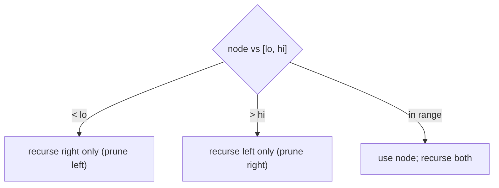

# Pattern: Range Postorder

## Why It Exists

Many BST queries are bounded: "sum the keys in `[low, high]`", "trim the tree to `[low, high]`", "count/collect the in-range keys." A naive traversal visits all `n` nodes and filters — but that throws away the BST's ordering.

The ordering lets you **prune entire subtrees**. If a node's value is `< low`, then everything in its **left** subtree is also `< low` (all smaller) — none of it can be in range, so you don't even recurse there; only the right subtree might contain in-range keys. Symmetrically, a node `> high` lets you skip its right subtree. Only nodes whose subtrees *overlap* the range are ever touched. The **postorder** shape (handle the children, then decide about the node) is what lets the trimming variant rebuild the pruned tree bottom-up.

## See It Work

Sum the keys of the BST that lie in `[3, 7]`. The subtrees holding `1` and `8, 9` are pruned, not visited. Run it.

```python run viz=binary-tree viz-root=root
class TreeNode:
    def __init__(self, val):
        self.val = val
        self.left = None
        self.right = None

def insert(root, val):
    if root is None: return TreeNode(val)
    if val < root.val: root.left = insert(root.left, val)
    elif val > root.val: root.right = insert(root.right, val)
    return root

def range_sum(root, lo, hi):
    if root is None:
        return 0
    if root.val < lo:                       # node (and its whole LEFT subtree) too small
        return range_sum(root.right, lo, hi)    # → only the right can be in range
    if root.val > hi:                       # node (and its whole RIGHT subtree) too big
        return range_sum(root.left, lo, hi)     # → only the left can be in range
    return root.val + range_sum(root.left, lo, hi) + range_sum(root.right, lo, hi)

root = None
for v in [5, 3, 8, 1, 4, 7, 9]:
    root = insert(root, v)
print(range_sum(root, 3, 7))                # 19  (3 + 4 + 5 + 7)
```

## How It Works

At each node, three cases — the first two **prune**:

- **`node.val < low`** → the node and its entire left subtree are below the range → recurse *only* right.
- **`node.val > high`** → the node and its entire right subtree are above the range → recurse *only* left.
- **otherwise** (`low ≤ node.val ≤ high`) → the node is in range; include it and recurse *both* sides.



<p align="center"><strong>by comparing the node to the bounds, lop off the half that can't contain in-range keys; only overlapping subtrees are explored.</strong></p>

For **trimming** the tree to `[low, high]`, it's the same pruning in **postorder** form: a node `< low` is dropped along with its left subtree (return its trimmed *right* child up to the parent); a node `> high` returns its trimmed *left* child; an in-range node sets its children to their trimmed versions and returns itself. Fixing children *before* returning the node is the postorder discipline — it lets a dropped node be replaced by its surviving subtree seamlessly.

Cost: only nodes whose subtrees overlap `[low, high]` are visited — `O(visited)`, which for a narrow range and balanced tree is far less than `O(n)` (the pruned branches are never entered). Worst case (range spans everything) it's `O(n)`.

### Key Takeaway

The BST property lets a bounded traversal prune whole subtrees: a node `< low` has no in-range keys to its left (recurse right only), a node `> high` none to its right. Range-sum/count/collect skip irrelevant branches; trim does it in postorder so dropped nodes are replaced by their surviving subtree.

## Trace It

`range_sum(root, 3, 7)` over `[5,3,8,1,4,7,9]` (root `5`):

| node | vs `[3,7]` | action |
|---|---|---|
| `5` | in range | add `5`, recurse both |
| `3` (left of 5) | in range | add `3`, recurse both |
| `1` (left of 3) | `< 3` | recurse right only — `1.right` is None → **prune, return 0** |
| `4` (right of 3) | in range | add `4` |
| `8` (right of 5) | `> 7` | recurse left only (prune the `9` subtree) |
| `7` (left of 8) | in range | add `7` |

Sum = `5 + 3 + 4 + 7 = 19`. The subtree rooted at `9` was never visited.

Before you read on: when the walk hit node `8` (which is `> 7`), it recursed into `8`'s *left* child only and skipped `8`'s right subtree entirely — the node `9` was never examined. How does the BST property *guarantee* that skipping `9` is safe, and what would you have to do without that guarantee?

Because in a BST, **everything in `8`'s right subtree is `> 8`**, hence `> 7 = high` — so none of it can possibly be in `[3, 7]`. The single comparison `8 > 7` certifies an entire subtree as out-of-range without looking at any of it; that's the pruning. Without the ordering (an unordered binary tree), a small in-range value could hide anywhere — under a large node, in either subtree — so you'd have **no choice but to visit every node** and filter, `O(n)` regardless of the range. The BST's "value bounds the whole subtree" is exactly what converts a full scan into a pruned one, the same property that makes search and LCA `O(h)`. Recognizing that one comparison can eliminate a subtree is the whole pattern — and it's why range queries are a BST strength and a hash table weakness.

## Your Turn

Range-sum plus trim-to-range (postorder):

```python run viz=binary-tree viz-root=root
class TreeNode:
    def __init__(self, val):
        self.val = val; self.left = None; self.right = None

def insert(root, val):
    if root is None: return TreeNode(val)
    if val < root.val: root.left = insert(root.left, val)
    elif val > root.val: root.right = insert(root.right, val)
    return root

def range_sum(root, lo, hi):
    if root is None: return 0
    if root.val < lo: return range_sum(root.right, lo, hi)
    if root.val > hi: return range_sum(root.left, lo, hi)
    return root.val + range_sum(root.left, lo, hi) + range_sum(root.right, lo, hi)

def trim(root, lo, hi):                      # postorder: fix children, then return node
    if root is None: return None
    if root.val < lo: return trim(root.right, lo, hi)   # drop node + left, keep right
    if root.val > hi: return trim(root.left, lo, hi)    # drop node + right, keep left
    root.left = trim(root.left, lo, hi)
    root.right = trim(root.right, lo, hi)
    return root

def inorder(n): return inorder(n.left) + [n.val] + inorder(n.right) if n else []

root = None
for v in [5, 3, 8, 1, 4, 7, 9]:
    root = insert(root, v)
print(range_sum(root, 3, 7))                 # 19
print(inorder(trim(root, 3, 7)))             # [3, 4, 5, 7]
```

```java run viz=binary-tree viz-root=root
public class Main {
  static class TreeNode { int val; TreeNode left, right; TreeNode(int v){ val = v; } }
  static TreeNode insert(TreeNode r, int v) {
    if (r == null) return new TreeNode(v);
    if (v < r.val) r.left = insert(r.left, v);
    else if (v > r.val) r.right = insert(r.right, v);
    return r;
  }
  static int rangeSum(TreeNode root, int lo, int hi) {
    if (root == null) return 0;
    if (root.val < lo) return rangeSum(root.right, lo, hi);
    if (root.val > hi) return rangeSum(root.left, lo, hi);
    return root.val + rangeSum(root.left, lo, hi) + rangeSum(root.right, lo, hi);
  }
  public static void main(String[] args) {
    TreeNode root = null;
    for (int v : new int[]{5, 3, 8, 1, 4, 7, 9}) root = insert(root, v);
    System.out.println(rangeSum(root, 3, 7));   // 19
  }
}
```

Drill the family in **Practice** — [Range Summation](/cortex/data-structures-and-algorithms/trees/binary-search-tree/pattern-range-postorder/problems/range-summation), [Range Diameter](/cortex/data-structures-and-algorithms/trees/binary-search-tree/pattern-range-postorder/problems/range-diameter), [Range Leaves](/cortex/data-structures-and-algorithms/trees/binary-search-tree/pattern-range-postorder/problems/range-leaves), and [Range Exclusive Trim](/cortex/data-structures-and-algorithms/trees/binary-search-tree/pattern-range-postorder/problems/range-exclusive-trim).

## Reflect & Connect

Range-postorder is "let the ordering prune your traversal":

- **The family** — range sum/count/collect, trim-to-range, range-restricted aggregates (diameter, leaf count within bounds). All compare the node to the bounds and skip the half that can't qualify.
- **Pruning is the win** — the BST property certifies an entire subtree as out-of-range with one comparison, turning an `O(n)` filter into `O(visited)`. Contrast [sorted traversal](/cortex/data-structures-and-algorithms/trees/binary-search-tree/pattern-sorted-traversal/pattern), which visits *every* key in order — here we deliberately *avoid* visiting the irrelevant ones.
- **Postorder enables structural edits** — trimming returns the rebuilt subtree from each call, so a parent wires in the trimmed child; fixing children before the parent (postorder) is the discipline behind any "rebuild the tree as you go" operation, and it recurs in the general binary-tree bottom-up patterns.

**Prerequisites:** [Introduction to Binary Search Trees](/cortex/data-structures-and-algorithms/trees/binary-search-tree/introduction-to-binary-search-trees).
**What's next:** two values from both ends of the sorted order — [Two-Pointer on a BST](/cortex/data-structures-and-algorithms/trees/binary-search-tree/pattern-two-pointer/pattern).

## Recall

> **Mnemonic:** *Node `< lo` → recurse right only; `> hi` → left only; in range → both. The BST property prunes a whole subtree per comparison. Trim does it in postorder (fix children, return node).*

| | |
|---|---|
| Node `< low` | recurse right only (left subtree all too small) |
| Node `> high` | recurse left only (right subtree all too big) |
| In range | use node, recurse both |
| Trim | postorder: set children to trimmed, return node (or surviving child) |
| Cost | `O(visited)` — pruned subtrees never entered; `O(n)` worst |

<details>
<summary><strong>Q:</strong> How does the pattern prune?</summary>

**A:** A node `< low` makes its whole left subtree out of range (recurse right only); a node `> high` skips its right subtree.

</details>
<details>
<summary><strong>Q:</strong> Why is skipping a subtree safe?</summary>

**A:** The BST property guarantees the entire subtree is on one side of a bound, so a single comparison certifies it out of range without visiting it.

</details>
<details>
<summary><strong>Q:</strong> Why is trim done in postorder?</summary>

**A:** It fixes (trims) the children first, then returns the node (or its surviving child) so the parent can wire in the rebuilt subtree.

</details>
<details>
<summary><strong>Q:</strong> When is this much faster than a full scan?</summary>

**A:** For a narrow range on a balanced tree — only overlapping subtrees are visited (`O(visited)`), versus `O(n)` for an unordered tree.

</details>

## Sources & Verify

- **CLRS**, *Introduction to Algorithms*, 4th ed., §12 — BST ordering; range queries via the search property.
- **Sedgewick & Wayne**, *Algorithms*, 4th ed., §3.2 — range search / range count on BSTs.
- Range pruning and postorder trim (LeetCode "Range Sum of BST", "Trim a BST") are standard; both runnable blocks are verified by running (`range_sum[3,7] = 19`; `trim[3,7] ⇒ [3,4,5,7]`).
