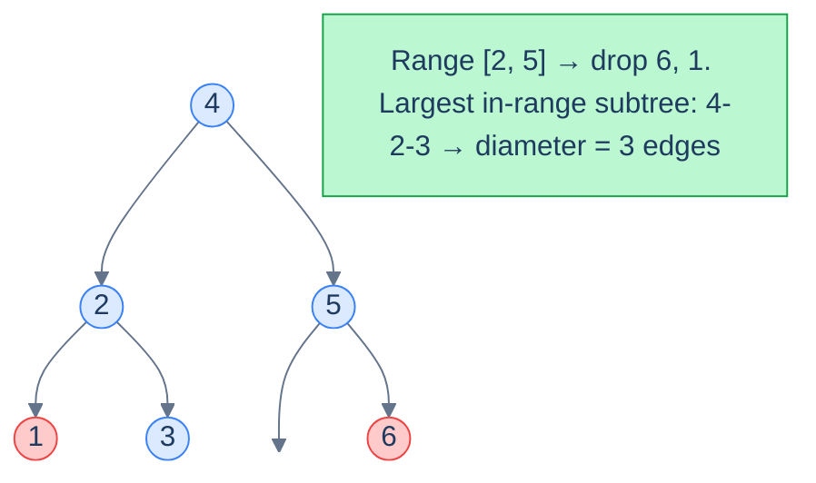

# Range diameter

## Problem Statement

Given the **root** of a BST and a range `[low, high]`, return the **diameter** of the largest subtree in which every node's value lies in `[low, high]`. The diameter of a tree is the longest path (counted in edges) between any two of its nodes.

### Example 1

> - **Input:** `root = [4, 2, 5, 1, 3, null, 6]`, `low = 2`, `high = 5`
> - **Output:** `3`

### Example 2

> - **Input:** `root = [5, 1, 8, null, null, 6, 9]`, `low = 6`, `high = 9`
> - **Output:** `2`

<details>
<summary><h2>The Strategy</h2></summary>


Standard "diameter of a binary tree" algorithm: at every node, recursively compute the *height* of each subtree, and update a global `diameter` candidate as `leftHeight + rightHeight`. Return `max(leftHeight, rightHeight) + 1` to the parent.

The only addition for this problem: **prune out-of-range nodes** the same way we did for sums. A subtree rooted outside the range contributes height `0` and is invisible to the diameter calculation.



<p align="center"><strong>Range <code>[2, 5]</code> excludes <code>1</code> and <code>6</code>. The longest path through in-range nodes is <code>3 → 2 → 4 → 5</code>, diameter <code>3</code>.</strong></p>

</details>
<details>
<summary><h2>The Solution</h2></summary>


```python run viz=binary-tree viz-root=root
from typing import Optional


class TreeNode:
    def __init__(self, val=0, left=None, right=None):
        self.val = val
        self.left = left
        self.right = right


def from_level_order(values):
    """Build tree from list like [1, 2, 3, None, 4]. None means missing child."""
    if not values:
        return None
    root = TreeNode(values[0])
    queue = [root]
    i = 1
    while queue and i < len(values):
        node = queue.pop(0)
        if i < len(values) and values[i] is not None:
            node.left = TreeNode(values[i])
            queue.append(node.left)
        i += 1
        if i < len(values) and values[i] is not None:
            node.right = TreeNode(values[i])
            queue.append(node.right)
        i += 1
    return root


class Solution:
    def __init__(self):

        # Global variable to calculate the diameter of the tree
        self.diameter: int = 0

    def range_diameter_helper(
        self, root: Optional[TreeNode], low: int, high: int
    ) -> int:

        # Base Case : if root is null return null
        if root is None:
            return 0

        # If the node's value is less than the lower bound,
        # discard the left subtree and move to the right subtree
        if root.val < low:
            return self.range_diameter_helper(root.right, low, high)

        # If the node's value is greater than the upper bound,
        # discard the right subtree and move to the left subtree
        if root.val > high:
            return self.range_diameter_helper(root.left, low, high)

        # Calculate the height of the left and right subtrees
        # recursively
        left_height: int = self.range_diameter_helper(
            root.left, low, high
        )
        right_height: int = self.range_diameter_helper(
            root.right, low, high
        )

        # Update the diameter if the sum of the left and right subtree
        # heights is greater
        self.diameter = max(self.diameter, left_height + right_height)

        # Return the height of the current subtree
        # (maximum height of left or right subtree + 1)
        return max(left_height, right_height) + 1

    def range_diameter(
        self, root: Optional[TreeNode], low: int, high: int
    ) -> int:

        # Call the helper function to calculate the height of the tree
        # in the range [low, high] and update the diameter
        self.range_diameter_helper(root, low, high)

        return self.diameter


# Example 1: [4, 2, 5, 1, 3, null, 6], low=2, high=5 → 3
print(Solution().range_diameter(
    from_level_order([4, 2, 5, 1, 3, None, 6]), 2, 5))   # 3

# Example 2: [5, 1, 8, null, null, 6, 9], low=6, high=9 → 2
print(Solution().range_diameter(
    from_level_order([5, 1, 8, None, None, 6, 9]), 6, 9))  # 2

# Edge cases
print(Solution().range_diameter(None, 1, 5))              # 0  (empty tree)

# Single node in range
print(Solution().range_diameter(from_level_order([5]), 1, 10))  # 0

# Range excludes all nodes
print(Solution().range_diameter(
    from_level_order([4, 2, 5, 1, 3, None, 6]), 7, 10))  # 0

# Balanced BST, full range
print(Solution().range_diameter(
    from_level_order([4, 2, 6, 1, 3, 5, 7]), 1, 7))      # 4
```

```java run viz=binary-tree viz-root=root
import java.util.*;

public class Main {
    static class TreeNode {
        int val;
        TreeNode left;
        TreeNode right;
        TreeNode() {}
        TreeNode(int val) { this.val = val; }
    }

    static TreeNode fromLevelOrder(Integer... values) {
        if (values.length == 0 || values[0] == null) return null;
        TreeNode root = new TreeNode(values[0]);
        java.util.Deque<TreeNode> queue = new java.util.ArrayDeque<>();
        queue.add(root);
        int i = 1;
        while (!queue.isEmpty() && i < values.length) {
            TreeNode node = queue.poll();
            if (i < values.length && values[i] != null) {
                node.left = new TreeNode(values[i]);
                queue.add(node.left);
            }
            i++;
            if (i < values.length && values[i] != null) {
                node.right = new TreeNode(values[i]);
                queue.add(node.right);
            }
            i++;
        }
        return root;
    }

    static class Solution {

        // Global variable to calculate the diameter of the tree
        private int diameter = 0;

        private int rangeDiameterHelper(TreeNode root, int low, int high) {

            // Base Case : if root is null return null
            if (root == null) {
                return 0;
            }

            // If the node's value is less than the lower bound,
            // discard the left subtree and move to the right subtree
            if (root.val < low) {
                return rangeDiameterHelper(root.right, low, high);
            }

            // If the node's value is greater than the upper bound,
            // discard the right subtree and move to the left subtree
            if (root.val > high) {
                return rangeDiameterHelper(root.left, low, high);
            }

            // Calculate the height of the left and right subtrees
            // recursively
            int leftHeight = rangeDiameterHelper(root.left, low, high);
            int rightHeight = rangeDiameterHelper(root.right, low, high);

            // Update the diameter if the sum of the left and right subtree
            // heights is greater
            diameter = Math.max(diameter, leftHeight + rightHeight);

            // Return the height of the current subtree
            // (maximum height of left or right subtree + 1)
            return Math.max(leftHeight, rightHeight) + 1;
        }

        public int rangeDiameter(TreeNode root, int low, int high) {

            // Call the helper function to calculate the height of the tree
            // in the range [low, high] and update the diameter
            rangeDiameterHelper(root, low, high);

            return diameter;
        }
    }

    public static void main(String[] args) {
        // Example 1
        System.out.println(new Solution().rangeDiameter(
            fromLevelOrder(4, 2, 5, 1, 3, null, 6), 2, 5));   // 3

        // Example 2
        System.out.println(new Solution().rangeDiameter(
            fromLevelOrder(5, 1, 8, null, null, 6, 9), 6, 9));  // 2

        // Edge cases
        System.out.println(new Solution().rangeDiameter(null, 1, 5));   // 0

        // Single node in range
        System.out.println(new Solution().rangeDiameter(
            fromLevelOrder(5), 1, 10));                         // 0

        // Range excludes all nodes
        System.out.println(new Solution().rangeDiameter(
            fromLevelOrder(4, 2, 5, 1, 3, null, 6), 7, 10));   // 0

        // Balanced BST, full range
        System.out.println(new Solution().rangeDiameter(
            fromLevelOrder(4, 2, 6, 1, 3, 5, 7), 1, 7));       // 4
    }
}
```

</details>
