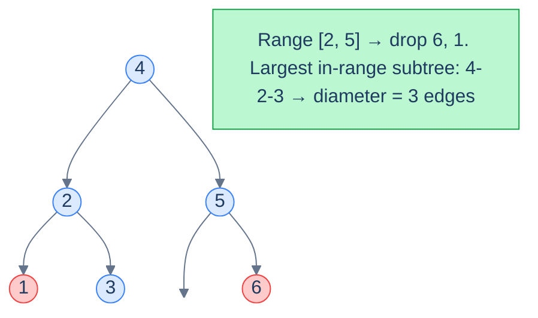

# Range diameter

## Problem Statement

Given the **root** of a BST and a range `[low, high]`, return the **diameter** of the largest subtree in which every node's value lies in `[low, high]`. The diameter of a tree is the longest path (counted in edges) between any two of its nodes.

## Examples

**Example 1:**
```
Input:  root = [4, 2, 5, 1, 3, null, 6], low = 2, high = 5
Output: 3
```

**Example 2:**
```
Input:  root = [5, 1, 8, null, null, 6, 9], low = 6, high = 9
Output: 2
```



<p align="center"><strong>Range <code>[2, 5]</code> excludes <code>1</code> and <code>6</code>. The longest path through in-range nodes is <code>3 → 2 → 4 → 5</code>, diameter <code>3</code>.</strong></p>

## Constraints

- `0 ≤ number of nodes ≤ 10⁴`
- `-10⁴ ≤ node.val ≤ 10⁴`
- `low ≤ high`
- All node values are unique

```python run viz=binary-tree viz-root=root
import json
from collections import deque

class TreeNode:
    def __init__(self, val, left=None, right=None):
        self.val = val
        self.left = left
        self.right = right

class Solution:
    def __init__(self):
        self.diameter = 0

    def range_diameter_helper(self, root, low, high):
        # Your code goes here
        return 0

    def range_diameter(self, root, low, high):
        self.range_diameter_helper(root, low, high)
        return self.diameter

def build_tree(values):              # [1, 2, 3, null, 4] level-order → root
    if not values:
        return None
    root = TreeNode(values[0])
    queue = deque([root])
    i = 1
    while queue and i < len(values):
        node = queue.popleft()
        if i < len(values):
            v = values[i]; i += 1
            if v is not None:
                node.left = TreeNode(v); queue.append(node.left)
        if i < len(values):
            v = values[i]; i += 1
            if v is not None:
                node.right = TreeNode(v); queue.append(node.right)
    return root

root = build_tree(json.loads(input()))   # the test case's level-order values
low = int(input())
high = int(input())
print(Solution().range_diameter(root, low, high))
```

```java run viz=binary-tree viz-root=root
import java.util.*;

public class Main {
    static class TreeNode {
        int val; TreeNode left, right;
        TreeNode(int val) { this.val = val; }
    }

    static class Solution {
        private int diameter = 0;

        private int rangeDiameterHelper(TreeNode root, int low, int high) {
            // Your code goes here
            return 0;
        }

        int rangeDiameter(TreeNode root, int low, int high) {
            rangeDiameterHelper(root, low, high);
            return diameter;
        }
    }

    public static void main(String[] args) {
        Scanner sc = new Scanner(System.in);
        TreeNode root = buildTree(parseIntegerArray(sc.nextLine()));
        int low = Integer.parseInt(sc.nextLine().trim());
        int high = Integer.parseInt(sc.nextLine().trim());
        System.out.println(new Solution().rangeDiameter(root, low, high));
    }

    static TreeNode buildTree(Integer[] values) {
        if (values.length == 0 || values[0] == null) return null;
        TreeNode root = new TreeNode(values[0]);
        Deque<TreeNode> queue = new ArrayDeque<>();
        queue.add(root);
        int i = 1;
        while (!queue.isEmpty() && i < values.length) {
            TreeNode node = queue.poll();
            if (i < values.length) {
                Integer v = values[i++];
                if (v != null) { node.left = new TreeNode(v); queue.add(node.left); }
            }
            if (i < values.length) {
                Integer v = values[i++];
                if (v != null) { node.right = new TreeNode(v); queue.add(node.right); }
            }
        }
        return root;
    }

    static Integer[] parseIntegerArray(String line) {
        String inner = line.replaceAll("[\\[\\]\\s]", "");
        if (inner.isEmpty()) return new Integer[0];
        String[] parts = inner.split(",");
        Integer[] out = new Integer[parts.length];
        for (int i = 0; i < parts.length; i++)
            out[i] = parts[i].equals("null") ? null : Integer.parseInt(parts[i]);
        return out;
    }
}
```

```testcases
{
  "args": [
    { "id": "root", "label": "root", "type": "tree", "placeholder": "[4, 2, 5, 1, 3, null, 6]" },
    { "id": "low", "label": "low", "type": "int", "placeholder": "2" },
    { "id": "high", "label": "high", "type": "int", "placeholder": "5" }
  ],
  "cases": [
    { "args": { "root": "[4, 2, 5, 1, 3, null, 6]", "low": "2", "high": "5" }, "expected": "3" },
    { "args": { "root": "[5, 1, 8, null, null, 6, 9]", "low": "6", "high": "9" }, "expected": "2" },
    { "args": { "root": "[5]", "low": "1", "high": "10" }, "expected": "0" },
    { "args": { "root": "[4, 2, 5, 1, 3, null, 6]", "low": "7", "high": "10" }, "expected": "0" },
    { "args": { "root": "[4, 2, 6, 1, 3, 5, 7]", "low": "1", "high": "7" }, "expected": "4" }
  ]
}
```

<details>
<summary><h2>The Strategy</h2></summary>

Standard "diameter of a binary tree" algorithm: at every node, recursively compute the *height* of each subtree, and update a global `diameter` candidate as `leftHeight + rightHeight`. Return `max(leftHeight, rightHeight) + 1` to the parent.

The only addition for this problem: **prune out-of-range nodes** the same way we did for sums. A subtree rooted outside the range contributes height `0` and is invisible to the diameter calculation.

</details>
<details>
<summary><h2>Solution</h2></summary>

The helper computes the height of the in-range subtree rooted at each node, while tracking the global diameter. Out-of-range nodes prune exactly as in range-sum: `< low` → recurse right only (returning 0 for height contribution); `> high` → recurse left only. For in-range nodes, both heights are computed; the diameter candidate is `leftHeight + rightHeight`; the return value is `max(lh, rh) + 1`. The global `diameter` accumulates the maximum seen across all nodes.

```python solution time=O(n) space=O(h)
import json
from collections import deque

class TreeNode:
    def __init__(self, val, left=None, right=None):
        self.val = val
        self.left = left
        self.right = right

class Solution:
    def __init__(self):
        self.diameter = 0

    def range_diameter_helper(self, root, low, high):
        if root is None:
            return 0
        if root.val < low:
            return self.range_diameter_helper(root.right, low, high)
        if root.val > high:
            return self.range_diameter_helper(root.left, low, high)
        left_height = self.range_diameter_helper(root.left, low, high)
        right_height = self.range_diameter_helper(root.right, low, high)
        self.diameter = max(self.diameter, left_height + right_height)
        return max(left_height, right_height) + 1

    def range_diameter(self, root, low, high):
        self.range_diameter_helper(root, low, high)
        return self.diameter

def build_tree(values):              # [1, 2, 3, null, 4] level-order → root
    if not values:
        return None
    root = TreeNode(values[0])
    queue = deque([root])
    i = 1
    while queue and i < len(values):
        node = queue.popleft()
        if i < len(values):
            v = values[i]; i += 1
            if v is not None:
                node.left = TreeNode(v); queue.append(node.left)
        if i < len(values):
            v = values[i]; i += 1
            if v is not None:
                node.right = TreeNode(v); queue.append(node.right)
    return root

root = build_tree(json.loads(input()))   # the test case's level-order values
low = int(input())
high = int(input())
print(Solution().range_diameter(root, low, high))
```

```java solution
import java.util.*;

public class Main {
    static class TreeNode {
        int val; TreeNode left, right;
        TreeNode(int val) { this.val = val; }
    }

    static class Solution {
        private int diameter = 0;

        private int rangeDiameterHelper(TreeNode root, int low, int high) {
            if (root == null) return 0;
            if (root.val < low) return rangeDiameterHelper(root.right, low, high);
            if (root.val > high) return rangeDiameterHelper(root.left, low, high);
            int leftHeight = rangeDiameterHelper(root.left, low, high);
            int rightHeight = rangeDiameterHelper(root.right, low, high);
            diameter = Math.max(diameter, leftHeight + rightHeight);
            return Math.max(leftHeight, rightHeight) + 1;
        }

        int rangeDiameter(TreeNode root, int low, int high) {
            rangeDiameterHelper(root, low, high);
            return diameter;
        }
    }

    public static void main(String[] args) {
        Scanner sc = new Scanner(System.in);
        TreeNode root = buildTree(parseIntegerArray(sc.nextLine()));
        int low = Integer.parseInt(sc.nextLine().trim());
        int high = Integer.parseInt(sc.nextLine().trim());
        System.out.println(new Solution().rangeDiameter(root, low, high));
    }

    static TreeNode buildTree(Integer[] values) {
        if (values.length == 0 || values[0] == null) return null;
        TreeNode root = new TreeNode(values[0]);
        Deque<TreeNode> queue = new ArrayDeque<>();
        queue.add(root);
        int i = 1;
        while (!queue.isEmpty() && i < values.length) {
            TreeNode node = queue.poll();
            if (i < values.length) {
                Integer v = values[i++];
                if (v != null) { node.left = new TreeNode(v); queue.add(node.left); }
            }
            if (i < values.length) {
                Integer v = values[i++];
                if (v != null) { node.right = new TreeNode(v); queue.add(node.right); }
            }
        }
        return root;
    }

    static Integer[] parseIntegerArray(String line) {
        String inner = line.replaceAll("[\\[\\]\\s]", "");
        if (inner.isEmpty()) return new Integer[0];
        String[] parts = inner.split(",");
        Integer[] out = new Integer[parts.length];
        for (int i = 0; i < parts.length; i++)
            out[i] = parts[i].equals("null") ? null : Integer.parseInt(parts[i]);
        return out;
    }
}
```

</details>
