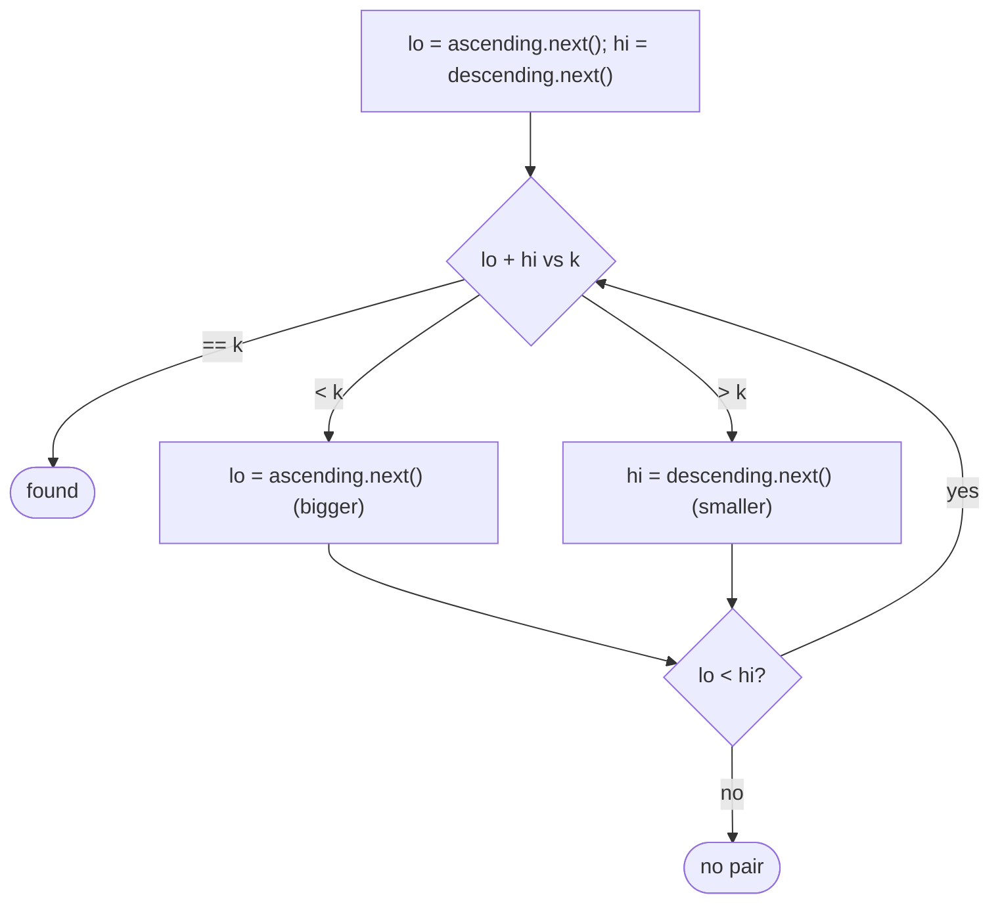

# Pattern: Two-Pointer on a BST

## Why It Exists

"Is there a pair of keys summing to `k`?" On a sorted *array* this is the classic [converging two-pointer](/cortex/data-structures-and-algorithms/linear-structures/arrays/pattern-two-pointers/pattern): a left pointer at the smallest, a right at the largest, move inward by comparing the sum to the target. A BST's in-order is sorted, so the *same* logic applies — but a BST isn't an array; you can't index "left" and "right" ends directly.

The trick is to run **two [BST iterators](/cortex/data-structures-and-algorithms/trees/binary-search-tree/iterators-in-binary-search-trees) at once**: an **ascending** one (smallest key first, walking the left spine) and a **descending** one (largest key first, walking the right spine). They play the roles of the array's `lo` and `hi` pointers. Converge them — too small a sum, advance the ascending iterator; too big, advance the descending one. `O(n)` time, `O(h)` space — and crucially, you never flatten the tree into an `O(n)` array.

## See It Work

Is there a pair in the BST summing to `9`? (`1 + 8` or `4 + 5`.) Two iterators converge from both ends. Run it.

```python run viz=binary-tree viz-root=root
class TreeNode:
    def __init__(self, val):
        self.val = val
        self.left = None
        self.right = None

def insert(root, val):
    if root is None: return TreeNode(val)
    if val < root.val: root.left = insert(root.left, val)
    elif val > root.val: root.right = insert(root.right, val)
    return root

def find_target(root, k):
    asc, desc = [], []
    n = root
    while n: asc.append(n); n = n.left        # ascending iterator: seed left spine
    n = root
    while n: desc.append(n); n = n.right       # descending iterator: seed right spine
    def next_asc():                            # smallest unvisited
        node = asc.pop(); x = node.right
        while x: asc.append(x); x = x.left
        return node.val
    def next_desc():                           # largest unvisited
        node = desc.pop(); x = node.left
        while x: desc.append(x); x = x.right
        return node.val
    lo, hi = next_asc(), next_desc()
    while lo < hi:                             # converge from both ends
        s = lo + hi
        if s == k: return True
        elif s < k: lo = next_asc()            # too small → bigger low end
        else: hi = next_desc()                 # too big → smaller high end
    return False

root = None
for v in [5, 3, 8, 1, 4, 7, 9]:
    root = insert(root, v)
print(find_target(root, 9))    # True  (4 + 5, or 1 + 8)
print(find_target(root, 28))   # False
```

## How It Works

Two iterators, each an explicit-stack BST walk (from the [iterators lesson](/cortex/data-structures-and-algorithms/trees/binary-search-tree/iterators-in-binary-search-trees)):

- **Ascending** — stack seeded with the left spine; `next_asc()` pops the smallest and pushes the left spine of its right child.
- **Descending** — the mirror: stack seeded with the right spine; `next_desc()` pops the largest and pushes the right spine of its left child.

Then the array two-pointer logic, unchanged: with `lo` from the ascending iterator and `hi` from the descending one,

- `lo + hi == k` → found.
- `lo + hi < k` → the sum is too small; advance the **ascending** iterator for a larger `lo`.
- `lo + hi > k` → too big; advance the **descending** iterator for a smaller `hi`.

Stop when `lo ≥ hi` (the iterators have crossed).



<p align="center"><strong>two iterators play the array's lo/hi pointers; compare the sum to the target and advance the appropriate one until they meet.</strong></p>

Each key is produced by the iterators at most once, so the converge is **`O(n)` time**; the two stacks hold at most a root-to-leaf path each, so **`O(h)` space**. The alternative — in-order traverse into a sorted list, then array two-pointer — is also `O(n)` time but `O(n)` space; the dual-iterator version keeps it to `O(h)` by generating keys on demand from both ends.

### Key Takeaway

BST two-sum = the array two-pointer driven by two BST iterators (one ascending, one descending). Compare the sum to `k` and advance the ascending iterator (too small) or descending one (too big) until they cross. `O(n)` time, `O(h)` space — no `O(n)` flattening.

## Trace It

`find_target(root, 9)` — ascending starts at `1`, descending at `9`:

| `lo` | `hi` | `lo + hi` | vs 9 | advance |
|---|---|---|---|---|
| `1` | `9` | 10 | `>` | descending → `hi = 8` |
| `1` | `8` | 9 | `=` | **found** |

Before you read on: this reuses the *array* two-pointer's exact decision logic (sum too small → move low up; too big → move high down) on a *tree*. The array version relies on `O(1)` indexed access to both ends and moving a pointer inward. A BST has neither indices nor a "move inward" operation. What lets the same algorithm work unchanged here — and what does the iterator abstraction buy you?

The iterators **abstract away the structure**: an ascending BST iterator delivers keys in the same order an array's left pointer would (smallest, next-smallest, …), and a descending one matches the right pointer (largest, next-largest, …). The two-pointer algorithm never cared *how* "next smaller/larger" was produced — only that it could get the next value from each end and that each advance is cheap. The array supplies that via indexing; the BST supplies it via two iterators whose `next()` is `O(1)` amortized. So the *algorithm* is identical; only the *iteration mechanism* differs. That's the power of an iterator: it lets a sequential algorithm run over any ordered structure — array, BST, even a merge of several — as long as the structure can yield "next in order." Recognizing that two-pointer needs only "next from each end," not random access, is what ports it from arrays to trees (at `O(h)` space instead of `O(n)`).

## Your Turn

The reusable BST two-sum:

```python run viz=binary-tree viz-root=root
class TreeNode:
    def __init__(self, val):
        self.val = val; self.left = None; self.right = None

def insert(root, val):
    if root is None: return TreeNode(val)
    if val < root.val: root.left = insert(root.left, val)
    elif val > root.val: root.right = insert(root.right, val)
    return root

def find_target(root, k):
    asc, desc = [], []
    n = root
    while n: asc.append(n); n = n.left
    n = root
    while n: desc.append(n); n = n.right
    def nxt(stack, left):
        node = stack.pop()
        x = node.right if left else node.left
        while x:
            stack.append(x)
            x = x.left if left else x.right
        return node.val
    lo, hi = nxt(asc, True), nxt(desc, False)
    while lo < hi:
        s = lo + hi
        if s == k: return True
        elif s < k: lo = nxt(asc, True)
        else: hi = nxt(desc, False)
    return False

root = None
for v in [5, 3, 8, 1, 4, 7, 9]:
    root = insert(root, v)
print(find_target(root, 12), find_target(root, 100))   # True False
```

```java run viz=binary-tree viz-root=root
import java.util.*;

public class Main {
  static class TreeNode { int val; TreeNode left, right; TreeNode(int v){ val = v; } }
  static TreeNode insert(TreeNode r, int v) {
    if (r == null) return new TreeNode(v);
    if (v < r.val) r.left = insert(r.left, v);
    else if (v > r.val) r.right = insert(r.right, v);
    return r;
  }
  static void seed(Deque<TreeNode> s, TreeNode n, boolean left) {
    while (n != null) { s.push(n); n = left ? n.left : n.right; }
  }
  static int next(Deque<TreeNode> s, boolean left) {
    TreeNode node = s.pop();
    seed(s, left ? node.right : node.left, left);
    return node.val;
  }
  static boolean findTarget(TreeNode root, int k) {
    Deque<TreeNode> asc = new ArrayDeque<>(), desc = new ArrayDeque<>();
    seed(asc, root, true); seed(desc, root, false);
    int lo = next(asc, true), hi = next(desc, false);
    while (lo < hi) {
      int s = lo + hi;
      if (s == k) return true;
      else if (s < k) lo = next(asc, true);
      else hi = next(desc, false);
    }
    return false;
  }
  public static void main(String[] args) {
    TreeNode root = null;
    for (int v : new int[]{5, 3, 8, 1, 4, 7, 9}) root = insert(root, v);
    System.out.println(findTarget(root, 9) + " " + findTarget(root, 28));   // true false
  }
}
```

Drill the family in **Practice** — [Two Sum on BST](/cortex/data-structures-and-algorithms/trees/binary-search-tree/pattern-two-pointer/problems/two-sum-on-bst), [Multiple Tree](/cortex/data-structures-and-algorithms/trees/binary-search-tree/pattern-two-pointer/problems/multiple-tree), [Median in BST](/cortex/data-structures-and-algorithms/trees/binary-search-tree/pattern-two-pointer/problems/median-in-bst), and [BST Pair Sum](/cortex/data-structures-and-algorithms/trees/binary-search-tree/pattern-two-pointer/problems/bst-pair-sum).

## Reflect & Connect

Two-pointer-on-a-BST is a clean example of composing patterns:

- **It's array two-pointer + BST iterators** — the [converging two-pointer](/cortex/data-structures-and-algorithms/linear-structures/arrays/pattern-two-pointers/pattern) supplies the logic; two [iterators](/cortex/data-structures-and-algorithms/trees/binary-search-tree/iterators-in-binary-search-trees) (ascending + descending) supply the "next from each end." Two patterns you already know combine into a new one.
- **`O(h)` space is the payoff** — flattening to a sorted array and two-pointering it is `O(n)` space; generating keys on demand from both ends keeps it to the iterator stacks' `O(h)`. Choose this when the tree is large and you can't afford the array.
- **The family extends** — three-sum on a BST (fix one key, two-pointer the rest), pair-with-given-difference, and "closest pair to a target." All are the array two-pointer ported to a BST via iterators. This **completes the BST pattern layer** — sorted/reversed traversal, range pruning, and now dual-iterator queries.

**Prerequisites:** [Iterators in BSTs](/cortex/data-structures-and-algorithms/trees/binary-search-tree/iterators-in-binary-search-trees).
**What's next:** the binary-tree pattern layer — traversal templates that carry no state — starting with [Preorder Traversal (Stateless)](/cortex/data-structures-and-algorithms/trees/binary-tree/pattern-preorder-traversal-stateless/pattern).

## Recall

> **Mnemonic:** *Two iterators — ascending (left end) + descending (right end). Sum too small → next ascending; too big → next descending; equal → found. `O(n)` time, `O(h)` space, no flattening.*

| | |
|---|---|
| `lo` source | ascending iterator (smallest-first, left spine) |
| `hi` source | descending iterator (largest-first, right spine) |
| Sum `< k` | advance ascending (bigger `lo`) |
| Sum `> k` | advance descending (smaller `hi`) |
| Cost | `O(n)` time, `O(h)` space (vs `O(n)` for flatten + array two-pointer) |

<details>
<summary><strong>Q:</strong> How is BST two-sum solved with two pointers?</summary>

**A:** Run an ascending and a descending iterator as `lo`/`hi`; compare their sum to `k` and advance the appropriate one until they cross.

</details>
<details>
<summary><strong>Q:</strong> Why does the array two-pointer algorithm work unchanged on a BST?</summary>

**A:** It only needs "next from each end," which two BST iterators provide — no random access required.

</details>
<details>
<summary><strong>Q:</strong> What's the space advantage over flattening?</summary>

**A:** Generating keys on demand keeps it to the iterators' `O(h)` stacks, versus `O(n)` for a materialized sorted array.

</details>
<details>
<summary><strong>Q:</strong> Which two patterns does this compose?</summary>

**A:** The array converging two-pointer and BST iterators (one ascending, one descending).

</details>

## Sources & Verify

- **CLRS**, *Introduction to Algorithms*, 4th ed., §12.2 — in-order successor/predecessor (the iterator mechanics).
- **Sedgewick & Wayne**, *Algorithms*, 4th ed., §3.2 — ordered iteration; the two-pointer idea on ordered data.
- BST two-sum via dual iterators (LeetCode "Two Sum IV — Input is a BST") is standard; both runnable blocks are verified by running (`find_target ⇒ 9:True, 12:True, 28:False, 100:False`).
